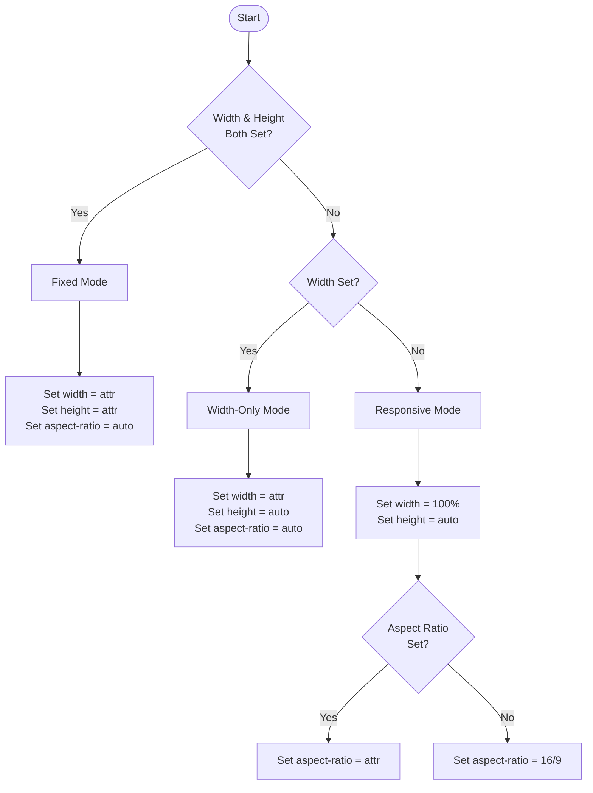

Standard YouTube embeds are notoriously heavy. A single iframe can download over 1MB of JavaScript and block the main thread, significantly hurting the Largest Contentful Paint (LCP). Furthermore, if dimensions are not strictly reserved, the embed causes Cumulative Layout Shift (CLS) as it loads.

This post documents the process of building a production-grade embed component that solves these issues using Web Components and React.

## The core problems

Developers must address three primary issues with the standard YouTube embed:

Cumulative Layout Shift (CLS)
: When an iframe loads, it often starts with zero height and then "pops" open to its full size, pushing content down.
: * Legacy solution: The "Padding Hack" (using `padding-bottom: 56.25%` on a wrapper).
: * Modern solution: The CSS `aspect-ratio` property.

Page weight (LCP and TBT)
: Loading the YouTube player API immediately, even if the user never plays the video—wastes bandwidth and CPU resources.
: * Solution: The Facade Pattern. The application loads a lightweight static image (the video thumbnail) and a fake play button. The heavy iframe is only injected into the DOM when the user clicks.

Audio chaos
: If a user plays one video, then scrolls down and plays another, both audio streams will play simultaneously.
: * Solution: Singleton State. When a component activates, it broadcasts a message to all other components to pause or reset their state.

## The strategy: "Lite mode" (facade pattern)

Instead of rendering an iframe immediately, the component renders this lightweight HTML structure:

```html
<div class="container">
  
  <button class="play-btn" aria-label="Play video"></button>
</div>
```

On click, the component replaces the inner HTML with the iframe, appending `?autoplay=1` to the source URL so the video starts immediately.

### Handling dimensions and aspect ratio

This implementation uses a priority system to handle both responsive and fixed layouts without introducing layout shifts. Based on the HTML attributes or React props provided, the component calculates and applies specific CSS properties (width, height, and aspect-ratio) to its outer container.

| Scenario | Attributes Provided | Width | Height | Aspect Ratio |
| --- | --- | --- | --- | --- |
| Responsive | None (default) | 100% | auto | 16 / 9 |
| Fixed | width="500" height="300" | 500px | 300px | auto |
| Custom Ratio | aspect-ratio="4/3" | 100% | auto | 4 / 3 |
| Aspect Ratio | aspect-ratio="16/9" | 100% | auto | 16 / 9 |
| Responsive | None (default) | 100% | auto | 16 / 9 |
| Fixed | width="500" height="300" | 500px | 300px | auto |

### Logic flow



The following components implement the lite embed pattern. They accept a videoId and a title for accessibility.

### React


```tsx
import React, { useState } from 'react';

interface LiteYouTubeProps {
  videoId: string;
  title: string;
}

export const LiteYouTube: React.FC<LiteYouTubeProps> = ({ videoId, title }) => {
  const [isLoaded, setIsLoaded] = useState(false);

  const posterUrl = `https://i.ytimg.com/vi/${videoId}/hqdefault.jpg`;
  const iframeUrl = `https://www.youtube.com/embed/${videoId}?autoplay=1`;

  return (
    <div
      className="lite-youtube-container"
      style={{ position: 'relative', paddingBottom: '56.25%', height: 0, overflow: 'hidden' }}
    >
      {!isLoaded ? (
        <button
          onClick={() => setIsLoaded(true)}
          aria-label={`Play video: ${title}`}
          style={{
            position: 'absolute',
            top: 0,
            left: 0,
            width: '100%',
            height: '100%',
            border: 'none',
            background: `url(${posterUrl}) center/cover no-repeat`,
            cursor: 'pointer',
            display: 'flex',
            alignItems: 'center',
            justifyContent: 'center'
          }}
        >
          <div
            className="play-button"
            style={{
              width: '68px',
              height: '48px',
              backgroundColor: 'rgba(33, 33, 33, 0.8)',
              borderRadius: '10px',
              display: 'flex',
              alignItems: 'center',
              justifyContent: 'center'
            }}
          >
            <svg width="24" height="24" viewBox="0 0 24 24" fill="white">
              <path d="M8 5v14l11-7z" />
            </svg>
          </div>
        </button>
      ) : (
        <iframe
          src={iframeUrl}
          title={title}
          allow="accelerometer; autoplay; clipboard-write; encrypted-media; gyroscope; picture-in-picture"
          allowFullScreen
          style={{
            position: 'absolute',
            top: 0,
            left: 0,
            width: '100%',
            height: '100%',
            border: 'none'
          }}
        />
      )}
    </div>
  );
};
```


### Web Component

For projects that do not use React, a native Web Component provides a framework-agnostic solution. This implementation uses the Shadow DOM to encapsulate styles and structural markup, preventing conflicts with global CSS.

After defining this custom element in the application's JavaScript, developers can use it in any HTML file like a standard tag:

```html
<lite-youtube video-id="dQw4w9WgXcQ" video-title="Rick Astley - Never Gonna Give You Up"></lite-youtube>
```

```ts
class LiteYouTube extends HTMLElement {
  private videoId: string;
  private videoTitle: string;
  private isLoaded: boolean = false;

  constructor() {
    super();
    this.attachShadow({ mode: 'open' });
    this.videoId = this.getAttribute('video-id') || '';
    this.videoTitle = this.getAttribute('video-title') || 'YouTube Video';
  }

  connectedCallback(): void {
    this.render();
  }

  private render(): void {
    if (!this.shadowRoot) return;

    if (!this.isLoaded) {
      const posterUrl = `https://i.ytimg.com/vi/${this.videoId}/hqdefault.jpg`;

      this.shadowRoot.innerHTML = `
        <style>
          :host {
            display: block;
            position: relative;
            padding-bottom: 56.25%;
            height: 0;
            overflow: hidden;
          }
          button {
            position: absolute;
            top: 0;
            left: 0;
            width: 100%;
            height: 100%;
            border: none;
            background: url('${posterUrl}') center/cover no-repeat;
            cursor: pointer;
            display: flex;
            align-items: center;
            justify-content: center;
          }
          .play-button {
            width: 68px;
            height: 48px;
            background-color: rgba(33, 33, 33, 0.8);
            border-radius: 10px;
            display: flex;
            align-items: center;
            justify-content: center;
          }
          svg {
            fill: white;
            width: 24px;
            height: 24px;
          }
        </style>
        <button aria-label="Play video: ${this.videoTitle}">
          <div class="play-button">
            <svg viewBox="0 0 24 24">
              <path d="M8 5v14l11-7z" />
            </svg>
          </div>
        </button>
      `;

      const button = this.shadowRoot.querySelector('button');
      button?.addEventListener('click', () => {
        this.isLoaded = true;
        this.render();
      });
    } else {
      const iframeUrl = `https://www.youtube.com/embed/${this.videoId}?autoplay=1`;

      this.shadowRoot.innerHTML = `
        <style>
          :host {
            display: block;
            position: relative;
            padding-bottom: 56.25%;
            height: 0;
            overflow: hidden;
          }
          iframe {
            position: absolute;
            top: 0;
            left: 0;
            width: 100%;
            height: 100%;
            border: none;
          }
        </style>
        <iframe
          src="${iframeUrl}"
          title="${this.videoTitle}"
          allow="accelerometer; autoplay; clipboard-write; encrypted-media; gyroscope; picture-in-picture"
          allowfullscreen
        ></iframe>
      `;
    }
  }
}

if (!customElements.get('lite-youtube')) {
  customElements.define('lite-youtube', LiteYouTube);
}
```

## Accessibility considerations

Replacing a standard `<iframe>` with a facade requires careful attention to accessibility to ensure all users can interact with the component:

* **Descriptive labeling**: The `<button>` element must include an `aria-label` that clearly describes the action, such as `Play video: [Video Title]`.
* **Keyboard navigation**: Because the facade uses a native `<button>` element, it automatically receives keyboard focus and responds to both the Enter and Space keys, matching the expected behavior of a standard media player.

Both the React and Web Component implementations address these requirements natively to provide an inclusive experience:

* **In the React implementation**: The aria-label dynamically populates using the title prop (aria-label={`Play video: ${title}`}), ensuring screen readers announce the specific video context. Utilizing a standard HTML `<button>` rather than a `<div>` with an `onClick` handler guarantees native keyboard focus management.
* **In the Web Component implementation**: The component interpolates the video-title attribute directly into the button's markup (`<button aria-label="Play video: ${this.videoTitle}">`). By encapsulating standard interactive elements within the Shadow DOM, the component preserves native tab-targeting and keystroke execution without requiring custom keyboard event listeners.
