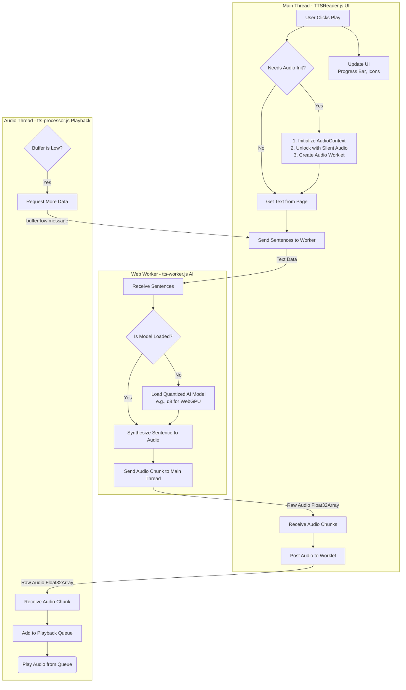

When I first conceived the idea of creating a custom element for text to speech (TTS), I envisioned a simple web component that could leverage existing web technologies and AI, packaged as a web component so it could be easily integrated into any web page.

The result was interesting, to say the least, and ended as something completely different from my initial idea.

This post will walk through the process of building the custom element, the challenges faced, and the lessons learned in the process.

## The Initial Idea

The goal was to create a component that could speak the text content of a specific section of a webpage aloud using a Transformers.js-based approach.

The advantage of using Transformers.js is that it allows running AI models directly in the browser, eliminating the need for server-side processing and reducing latency.

It also works across browsers and devices, making it a versatile solution for TTS.

The final advantage is that, after the initial download of the model, it works offline, which is a significant benefit for users with limited or no internet connectivity.

## Leverage What The Browser Offers

The first change I made to the original design is to add the browser's built-in [Web Speech API](https://developer.mozilla.org/en-US/docs/Web/API/Web_Speech_API) (`window.speechSynthesis`) as an alternative speech synthesis method.

This native solution is the foundation of the "System Voice" option of the web component.

The advantage is that the Web Speech API provides instant playback with no downloads, zero dependencies, and access to high-quality voices already installed on the user's operating system.

The biggest disadvantage is that voice quality is inconsistent across browsers and operating systems. Even in the same browser, the quality of available voices can vary significantly depending on the operating system.

The Web Speech API also has limited language support, with some languages and dialects not being available on all platforms.

To address voice quality, I added a voice selector to the UI, allowing users to choose from the available voices on their system.

## The AI Voice Rabbit Hole

A second mode, more resource-intensive but with the potential for a more consistent and higher-quality voice, would use an AI model running directly in the browser via the [Transformers.js](https://huggingface.co/docs/transformers.js/en/index) library.

The "AI Voice" mode downloads a pre-trained model and runs it locally.

Building the "AI Voice" mode opened up a series of challenges not typically found when working with standard web APIs.

### Challenge 1: Finding a Browser-Friendly Model

The first challenge is selecting a suitable TTS model to use with Transformers.js in the browser

Simply finding a model on the Hugging Face Hub tagged for transformers.js is not enough. Not all models available to use with Transformers.js work in the browser, leading to download errors (401 Unauthorized, 404 Not Found) or architectural incompatibilities (Unsupported model type).

I cycled through several TTS models that listed compatibility with Transformers.js. This trial-and-error process revealed that the models converted and maintained by Xenova were the most reliable, with [Xenova/speecht5_tts](https://huggingface.co/Xenova/speecht5_tts) being the most stable choice for this project.

#### Model File Size

The model file size is a critical factor when choosing a TTS model for browser use. Larger models can provide higher quality audio but come with significant drawbacks:

* **Longer Load Times**: Larger models take more time to download, which can lead to a poor user experience, especially for users with slow internet connections.
* **Increased Memory Usage**: Running large models in the browser can consume significant memory, potentially leading to crashes or slow performance on devices with limited resources.

### Resource Management

Using Transformers.js for TTS immediately revealed a resource management issue.. This is a separate issue from model size, as even small models can be resource-intensive during inference.

Running the AI model on an entire article at once resulted in two critical failures:

* An unacceptably long initial loading time while the audio was synthesized
* Browser crashes due to excessive memory consumption.

Rather than trying to process the entire article at once, we decided to break the article into paragraphs first, then sentences.

### Challenge 2: Processing Text Without Crashing the Browser

With a model selected, the next issue was resource management. Running the AI on an entire article at once resulted in critical failures and browser crashes.

While chunking the content solved the memory overload, it introduced noticeable gaps... This led to a crucial lesson: the main thread is not a viable option for heavy processing.

The initial attempt to pre-buffer the next audio chunk failed. The heavy AI processing that was happening on the main UI thread froze the user interface and ultimately crashed the page.

Lesson: **the main thread is not a viable option**.

## Should We Use Google's TTS APIs?

One consideration was to offload the AI processing to a server-side solution like Google's [Text-to-Speech APIs](https://cloud.google.com/text-to-speech). The idea of using these server-side APIs was quickly abandoned for several reasons.

### Rate Limiting and Latency

Server-side APIs introduce network latency. There is a full round trip involved in sending the text to the server, processing it, and receiving the audio back.

The user must wait for the text to be sent to the server and for the audio to be sent back, which can interrupt the flow of playback. Depending on the network conditions, the length of the text, the server's load, and the user's device, this delay can be significant.

### Costs

The primary reason to abandon Google's TTS API was the cost. Using a paid API introduces variable costs that can become significant with high usage and the voices you use, and it requires secure management of API keys, adding complexity to the project.

The cost will also depend on the technology you use, with more natural-sounding voices typically being more expensive. This can limit the choice of voices available for use in the application.

Chirp HD voices are significantly more expensive than WaveNet voices, but both are considered premium options above the standard voices. The primary difference is the technology used to generate the voices, which impacts both cost and audio quality.

Cost comparison per 1 million characters, after the free tier:

| Voice Technology | Cost after free tier | Free tier (monthly) |
| :---: | :---: | --- |
| Chirp HD | $30 | 1 million characters |
| WaveNet/Neural2 | $16 | 4 million characters |
| Standard | $4 | 4 million characters |

Feature differences

| Feature | Chirp HD | WaveNet |
| :---: | --- | --- |
| Technology | The newest, highest-quality model from Google. | A high-quality model trained on raw audio for more natural intonation and emphasis than standard voices. |
| Audio Quality | Superior. Provides the most natural and expressive speech available from Google TTS. Often described as having an HD or studio-quality sound. | High. Generates human-like speech with better emphasis and intonation than standard voices, but is not as advanced as Chirp. |
| Best For | Use cases where the most lifelike and premium audio quality is essential, such as high-end voice applications, professional narrations, or virtual assistants. | Applications that require natural-sounding speech, but where cost is a more significant factor. It offers a strong balance of quality and price. |

### Which one should you choose?

Your choice should be based on your budget and the audio quality requirements of your project.

* **Choose Chirp HD**: if your application's primary need is the most natural, human-like voice available and you have the budget for a higher price point.
* **Choose WaveNet**: if you need a high-quality, natural-sounding voice but need to be more cost-effective. WaveNet provides an excellent user experience at a lower cost than Chirp HD.

In the end, the combination of cost and latency made using Google's TTS APIs unfeasible for this project.

## Using Web Workers

To avoid crashing the browser, the best solution is to use a [Web Worker](https://developer.mozilla.org/en-US/docs/Web/API/Web_Workers_API/Using_web_workers) to move the AI synthesis to a separate background thread. This ensures the main UI thread remains responsive at all times.

### Communication between the main thread and the worker

Be careful when working with Web Workers; simply moving the work to a background thread may not be enough.

You have to be careful about how you communicate between the main thread and the worker and you need to ensure that you're passing the right payloads back and forth.

### Digging Deeper Into The Buffering And Fragmentation Rabbit Holes

After you've figured out the communication between the main thread and the worker, you need to decide how to handle audio buffering and playback.

The first iteration of the web component, read the full text of the article and sent it to the worker to be processed in one go. The worker would then send back the full audio buffer to the main thread for playback.

This didn't work. The browser would freeze while the worker was processing the text, and the user interface would become unresponsive since the audio processing work was done in the main thread.

The next idea was to break the text into paragraphs. This worked better, but there were still noticeable gaps between paragraphs as the worker processed each one sequentially, especially if we were jumping from a header into a paragraph of text... headers are usually too short to give the browser time to complete the paragraph synthesis.

The final step was to further break down the text into individual sentences. This provides a more granular approach to audio synthesis, allowing the worker to process and send back smaller chunks of audio more frequently. This reduces, but doesn't eliminate, the gaps between audio playback.

### Pre-buffering

We've also implemented a pre-buffering mechanism where the worker buffers multiple audio chunks (sentences) while the first chunk is playing. This helps to ensure that there is always audio data ready to be played, minimizing gaps.

## Adding an Audio Worklet

Just like we did with the web worker, we can further improve audio playback by using an [Audio Worklet](https://developer.mozilla.org/en-US/docs/Web/API/AudioWorklet) to handle audio processing and playback in a separate thread.

An Audio Worklet allows for more advanced audio processing in the browser. By offloading audio processing to a separate thread, we can achieve lower latency and better performance, especially for real-time applications like our TTS system.

Think of it this way: the Web Worker is the factory that builds the audio from text. The Audio Worklet is the specialized delivery service that ensures the audio gets to the speakers smoothly and on time, without interrupting anything else.

## Adding WebGPU Support

WebGPU is a modern graphics API that provides high-performance access to the GPU for both graphics and compute tasks. By leveraging WebGPU, we can significantly speed up the AI model's inference time, making the TTS experience smoother and more responsive.

The Transformers.js library supports WebGPU, allowing us to run AI models on the GPU directly from the browser. This can lead to significant performance improvements, especially for resource-intensive tasks like TTS.

However, WebGPU is not yet universally supported across all browsers. As of now, it is primarily available in Chromium-based browsers like Chrome and Edge. Therefore, we need to implement a fallback mechanism to ensure that our TTS system works across all browsers.

### Quantization As A Performance Booster

To further optimize performance, we can use quantized models. Quantization is a technique that reduces the precision of the model's weights, leading to smaller model sizes and faster inference times. It is important to note that not all models support all quantization levels.

This is another tradeoff since quantized models may have slightly lower audio quality compared to their full-precision counterparts. The tradeoff is that the file will be smaller and the inference will be faster

## The Final Architecture

The following diagram illustrates the final architecture of the TTS custom element's Transformers.js-based AI voice mode.

