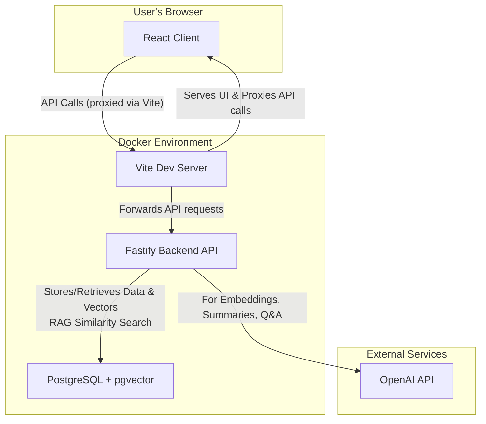
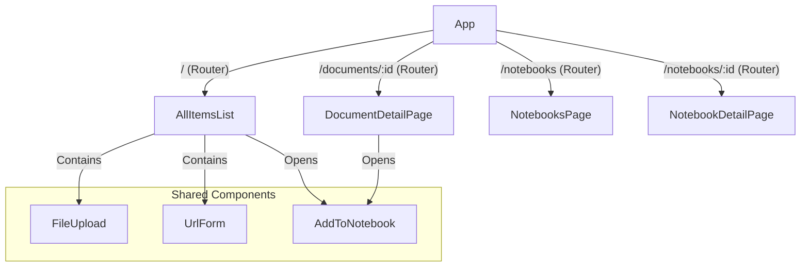
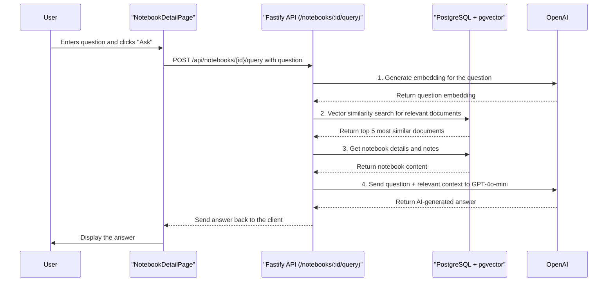
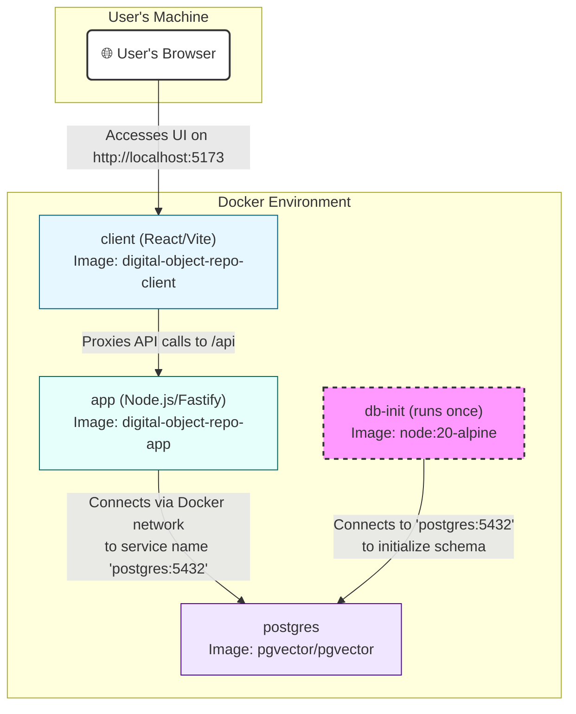

Like many developers, I hoard digital content—articles, papers, code snippets, and videos. Over time, organization became a significant friction point. My solution was to build a Digital Object Repository: a centralized system to store, organize, and interact with this data.

Rather than building a static archive, I leveraged the OpenAI API to enhance the repository with active features: content summarization, semantic search, and an interactive Q&A system.

This post details the architectural decisions, technical constraints, and implementation strategies used to build this full-stack application.

## Phase 1: Project Scaffolding & Core Backend

The project required a containerized, multi-service architecture to manage the complexity of vector storage and application logic. The initial focus was establishing a robust backend for content ingestion and retrieval.

### High-Level Architecture

I designed the system using Docker Compose to orchestrate three distinct services: a React frontend, a Fastify backend, and a PostgreSQL database equipped with pgvector.

### Key Steps & Technologies

* **Containerization Strategy**: The docker-compose.yml defines the core stack:
  * postgres: Uses the pgvector/pgvector image. Standard Postgres cannot efficiently perform vector similarity searches; pgvector adds the necessary indexing and distance operators (like cosine similarity).
  * app: A Node.js backend running Fastify for high-throughput API handling.
  * client: A Vite-based React development server.
* **Handling Startup Race Conditions**: Multi-container setups often suffer from race conditions where the API attempts to connect before the database is ready. I implemented a dedicated db-init service in Docker. It runs src/init-db.js to define schemas (documents, api_usage_logs) only after the postgres service reports a healthy status.
* **Content Ingestion & Vectorization**:
  * **Ingestion**: The backend exposes endpoints for file uploads (via @fastify/multipart) and URL scraping (via axios and cheerio).
  * **Text-to-Vector**: Upon ingestion, text is cleaned and sent to the OpenAI API (text-embedding-ada-002). This converts the semantic meaning of the text into a high-dimensional vector.
  * **Storage**: The metadata, raw text, and the vector array are stored atomically in the documents table.

## Phase 2: Frontend Implementation & UI

With the data layer operational, I shifted to the frontend. The UI needed to be clean but capable of handling complex interactions like file uploads and notebook management.

### Component Architecture

The application state is managed via React Router, splitting the view logic into distinct Pages and shared Components.

### Implementation Highlights

`Main View (`AllItemsList.jsx`)`: Acts as the dashboard. It fetches items from `/api/documents` and renders a grid layout. It integrates the FileUpload and UrlForm components directly to reduce friction when adding content.

**Detail View (`DocumentDetailPage.jsx`)**: A focused view for consuming content. I used react-markdown to safely render the extracted text content, preserving formatting without exposing the application to XSS vulnerabilities common with raw HTML injection.

**Styling**: I utilized a hybrid approach—global CSS for layout primitives and module-scoped CSS for component-specific styling to prevent style leakage.

## Phase 3: The Notebook Feature (RAG Implementation)

The "Notebooks" feature transforms the app from a storage bucket into a research tool. It allows users to group documents and perform RAG (Retrieval-Augmented Generation) queries against that specific collection.

### Backend Implementation

1. **Schema Relationships**: I introduced notebooks and a join table notebook_documents to handle the many-to-many relationship between notebooks and source materials.
2. **The RAG Pipeline (`/api/notebooks/:id/query`)**: When a user asks a question, the system does not simply send the question to ChatGPT. It follows a RAG workflow to ground the answer in the user's data:
   1. **Embedding**: The user's question is converted into a vector.
   2. **Similarity Search**: We query PostgreSQL using pgvector's cosine similarity operator (<=>) to find the 5 text chunks most mathematically similar to the question vector.
   3. **Context Assembly**: The system concatenates the user's manual notes with the content of those 5 relevant chunks.
   4. **Generation**: This assembled context + the specific question is sent to GPT-4o-mini. This ensures the AI answers based only on the provided data, significantly reducing hallucinations.

### Interaction Flow

This sequence diagram illustrates the round-trip from the React UI through the embedding engine and back.

### Frontend Implementation

The `AddToNotebook.jsx` component required careful state management. I initially built it as a simple `div` overlay but refactored it to use the native HTML `<dialog>` element. This provides built-in accessibility features and better focus management than a custom React implementation.

## Phase 4: Engineering Challenges & Debugging

Building a full-stack AI application revealed several specific challenges. Here is how I approached debugging and refinement.

### Diagnosis Strategy

My primary feedback loops were User-Reported Bugs (visual/functional mismatches) and Console Errors (runtime failures).

The React Developer Tools extension was indispensable for diagnosing state issues. For example, when the AddToNotebook modal failed to appear, inspecting the component tree revealed that the parent's state change wasn't propagating to the isOpen prop, allowing me to pinpoint the break in the prop chain.

### Resolution Patterns

**Controlled vs. Uncontrolled Components**: A recurring issue with the modal visibility was solved by refactoring `AddToNotebook` into a strictly controlled component. By lifting the state up and ensuring the visibility was dictated solely by props (`isOpen`, `onClose`), I eliminated synchronization bugs.

**Library Deprecations**: I encountered an Uncaught Assertion in react-markdown. A check of the changelog revealed that the `className` prop was deprecated in the version I installed. The fix involved wrapping the component in a styled container rather than passing the class directly.

### Architectural Decision: Why Docker?

Using Docker was not just for deployment convenience; it was a development necessity to handle the complexity of the stack.

* **Environment Parity**: It eliminates "It Works On My Machine." The Dockerfile serves as the source of truth for the OS, Node version, and system libraries.
* **Orchestration**: Manually spinning up Postgres, installing the vector extension, and starting the API in the correct order is error-prone. Docker Compose automates the entire dependency graph with depends_on.
* **Networking**: Docker handles internal service discovery. The backend connects to postgres:5432 by service name, avoiding brittle IP address configurations.

