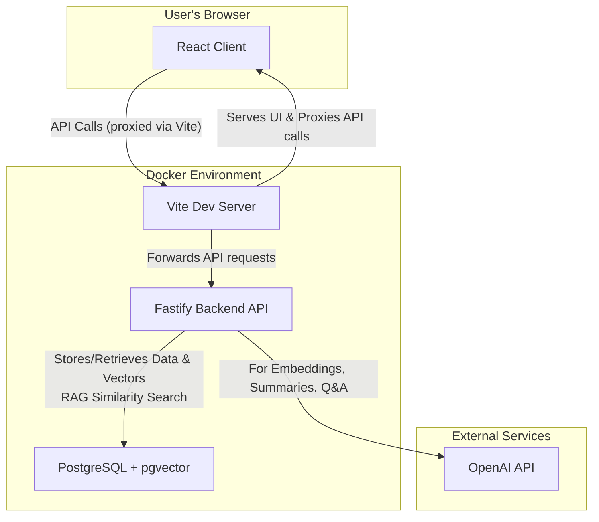
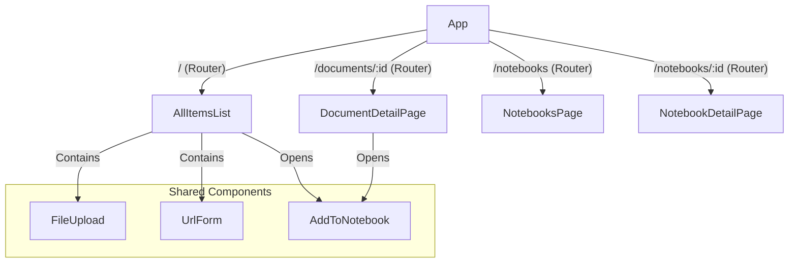
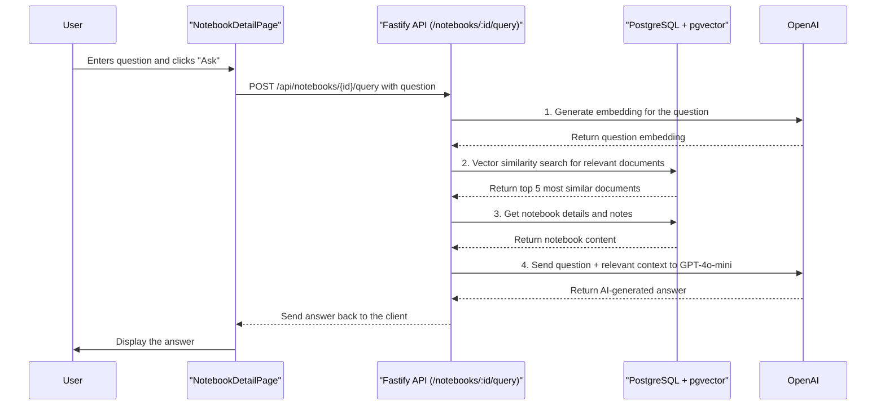
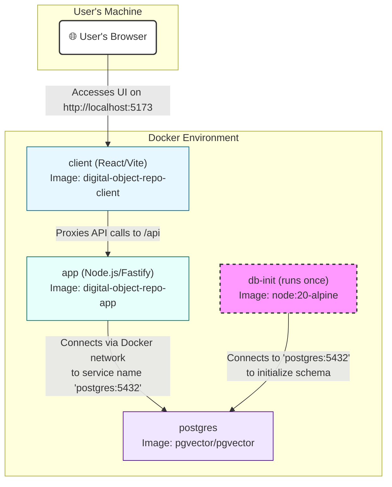

I collect a lot of digital content &mdash; articles, papers, code snippets, videos &mdash; from various sources online. Over time, I found it increasingly difficult to organize this information. To solve this problem, I decided to build a Digital Object Repository. A place where I can store, organize and interact with my digital content.

As AI became more capable, I chose to leverage it to enhance functionality. Using OpenAI APIs, I implemented features like content summarization, semantic search, and an interactive Q&A system that allows me to ask questions about my stored content.

This post outlines the Digital Object Repository development process. It details the major phases of development, architectural decisions, and the implementation of key features.

## Phase 1: Project Scaffolding & Core Backend

The project began with the goal of creating a containerized, multi-service application. The initial focus was on establishing a robust backend capable of ingesting content, processing it, and storing it for retrieval.

### High-Level Architecture

The architecture was designed to be modular, with separate services for the frontend, backend, and database, all orchestrated by Docker Compose.

### Key Steps & Technologies

1. **Containerization**: `docker-compose.yml` was set up to define three main services:
    * `postgres`: A PostgreSQL database using the `pgvector/pgvector` image to enable vector similarity searches.
    * `app`: The Node.js backend running on Fastify.
    * `client`: The React frontend served by Vite's development server.

2. **Backend Foundation (Node.js/Fastify)**:
    * A Fastify server was created to handle API requests.
    * Database connection logic was implemented using the `pg` library.
    * A critical `db-init` service was added to the Docker Compose setup. This service runs `src/init-db.js` to create the necessary database tables (`documents`, `api_usage_logs`, etc.) only after the `postgres` service is healthy, solving a common race condition during startup.

3. **Content Ingestion & Processing**:
    * **File Uploads**: An endpoint (`/api/documents/upload`) was created using `@fastify/multipart` to handle file uploads. The original files are stored in the `./uploads` directory.
    * **URL Scraping**: An endpoint (`/api/urls`) was built to accept a URL. It uses `axios` to fetch the HTML and `cheerio` to parse it. The extracted text content is then cleaned.
    * **Text-to-Vector**: For every new file or URL, the extracted text is sent to the OpenAI API to generate vector embeddings using the `text-embedding-ada-002` model.
    * **Storage**: The document's metadata (title, source), extracted content, and vector embedding are all stored in the `documents` table in the PostgreSQL database.

## Phase 2: Frontend Implementation & UI

With the backend capable of handling data, the focus shifted to building a user-friendly interface with React.

### Frontend Component Architecture

The UI is structured around pages and reusable components, managed by React Router for navigation.

### Frontend Key Steps & Technologies

1. **Setup**: The frontend was initialized as a React project using Vite, providing a fast development experience with Hot Module Replacement (HMR).
2. **Main View (`AllItemsList.jsx`)**: This component fetches all items from the `/api/documents` endpoint and displays them in a grid. It also includes the `FileUpload` and `UrlForm` components for adding new content.
3. **Detail View (`DocumentDetailPage.jsx`)**: Clicking an item navigates the user to its dedicated page. This component fetches detailed information for a single document, including its extracted content, which is rendered as Markdown using `react-markdown`.
4. **Styling**: A combination of global CSS and component-specific stylesheets (`.css` files) were used to style the application, focusing on a clean and responsive layout.

## Phase 3: The Notebook Feature (A Feature Deep-Dive)

The "Notebooks" feature was the most significant addition, allowing users to group items and perform AI-powered Q&A on the collective content.

### Backend Implementation

1. **Database Schema**: Two new tables were created:
    * `notebooks`: Stores the ID, title, and user-created notes for each notebook.
    * `notebook_documents`: A join table to manage the many-to-many relationship between notebooks and documents.
2. **API Endpoints (`src/routes/notebooks.js`)**: A full suite of CRUD endpoints was created for managing notebooks and their contents.
    * `GET /api/notebooks`: List all notebooks.
    * `POST /api/notebooks`: Create a new notebook.
    * `POST /api/notebooks/:id/documents`: Add a document to a notebook.
    * `POST /api/notebooks/:id/query`: The core Q&A endpoint using Retrieval-Augmented Generation (RAG).

### Notebook Q&A with RAG (Retrieval-Augmented Generation)

The Q&A feature uses RAG to efficiently answer questions about notebook content:

1. **Question Embedding**: When a user asks a question, the system generates a vector embedding for the question using OpenAI's `text-embedding-ada-002` model.
2. **Vector Similarity Search**: Using pgvector's cosine similarity operator, the system queries the vector database to find the top 5 most relevant documents from the notebook based on semantic similarity to the question.
3. **Context Assembly**: The system combines the notebook's user-written notes with the content of the most relevant documents.
4. **LLM Answer Generation**: Only the filtered, relevant context is sent to GPT-4o-mini along with the question, ensuring efficient token usage and high-quality answers.

This approach scales well with large notebooks and provides more accurate answers by focusing on the most pertinent information.

This diagram illustrates how a user's question is processed using Retrieval-Augmented Generation (RAG) to provide accurate answers based on the notebook's content.

### Frontend Implementation

1. **New Pages**: `NotebooksPage.jsx` to list all notebooks and `NotebookDetailPage.jsx` to view a single notebook, its items, and the Q&A interface.
2. **`AddToNotebook.jsx` Component**: A reusable modal component was created to allow users to add an item to an existing notebook or create a new one on the fly. This component was initially built as a simple `div` and later refactored to use the semantic HTML `<dialog>` element for better accessibility and browser-native behavior.

## Phase 4: Debugging Methodology & Iterative Refinement

This section outlines the systematic approach to identifying, diagnosing, and resolving issues throughout the development lifecycle. The process was iterative and relied on a combination of browser-based tools, code analysis, and targeted refactoring.

### 1. Issue Identification (The "What")

The first step was always to clearly define the problem. Issues were primarily identified through two channels:

* **User-Reported Bugs**: Direct feedback from the user was the most common trigger for UI/UX bug fixes. Examples include "the button is unstyled," "the modal doesn't open," or "the button is missing." This feedback loop was critical for ensuring the application met user expectations.
* **Browser Console Errors**: Actively monitoring the browser's developer console for runtime errors provided immediate, actionable insights. A key example was the `Uncaught Assertion: Unexpected className prop` error from the `react-markdown` library, which included a stack trace that pointed directly to the component and prop causing the issue.

### 2. Diagnosis (The "Why")

Once an issue was identified, the next step was to understand its root cause.

* **Component & State Inspection**: Using the React Developer Tools browser extension was essential. For state-related bugs, like the modal not opening, inspecting the component tree allowed for real-time analysis of props (`isOpen`) and state (`isModalOpen`) to see if they were being updated correctly. This quickly revealed when state changes in a parent component weren't properly propagating to a child.
* **Code Archeology & Diffing**: When a new bug appeared after a code change, reviewing recent commits or diffs was the fastest way to correlate the bug with a specific modification. This technique was used to discover that an unstyled "Cancel" button was inadvertently caused by an experimental refactor using `<form method="dialog">`.
* **Reading Documentation**: For library-specific errors, the first course of action was to consult the official documentation. The `react-markdown` error was resolved by reading the library's changelog, which explicitly stated that the `className` prop had been deprecated in favor of wrapping the component in a styled `div`.

### 3. Resolution (The "How")

With a clear diagnosis, a targeted solution was implemented.

* **Targeted Refactoring**: Rather than applying temporary patches, the focus was on addressing the root cause in a way that improved code quality. For the recurring modal visibility issues, the `AddToNotebook` component was refactored from a self-managed (uncontrolled) component into a fully **controlled component**. This meant its visibility was explicitly managed by `isOpen` and `onClose` props passed from its parent, creating a more predictable and standard React pattern.
* **Incremental & Verified Changes**: Changes were applied one at a time and immediately verified in the browser. This was particularly important for CSS and styling bugs, where a change to JSX structure would be made, then verified, followed by a change to the corresponding CSS file, and verified again.
* **Reverting Faulty Logic**: When a change introduced a regression, the immediate action was to revert that specific change to restore functionality before attempting a different, more informed solution. This prevented compounding issues and kept the application in a stable state.

## Architectural Decision: Why Docker?

The decision to build this application within a containerized environment using Docker and Docker Compose was a foundational architectural choice, not an afterthought. It was made to address several key challenges inherent in modern web development, particularly for a multi-service application like this one.

### 1. Eliminating "It Works On My Machine" Syndrome

* **Consistency**: Docker ensures that the application runs in the exact same environment, from development to production. The `Dockerfile` for the backend and frontend, along with the `docker-compose.yml`, codify the operating system, system dependencies, Node.js version, and application setup. This eliminates the entire class of bugs that arise from subtle differences in developer machines or deployment servers.

### 2. Simplifying Complex Setups

* **One-Command Startup**: The project consists of at least three distinct services (backend, frontend, database) that must work together. Without Docker, a developer would need to manually install and configure PostgreSQL, install the `pgvector` extension, manage Node.js versions (potentially with `nvm`), and run separate commands to start each service in the correct order.
* **Orchestration**: Docker Compose automates this entire process. A single `docker-compose up` command is all that's needed to build the images, create the network, provision the database volume, and start all services in the correct dependency order (`depends_on`).

### 3. Managing Service Dependencies Gracefully

* **Service Discovery**: Services within a Docker Compose network can communicate with each other using their service names (e.g., the backend can connect to the database at `postgres:5432`). This is simpler and more robust than hardcoding IP addresses.
* **Healthchecks & Startup Order**: A critical issue in multi-service apps is race conditions, where one service tries to connect to another before it's ready. This was solved by using `depends_on` with a `condition: service_healthy` check in the `docker-compose.yml` file and implementing a dedicated `db-init` service. This ensures the backend application only starts after the database is fully initialized and ready to accept connections.

### 4. Portability and Scalability

* **Portable Artifacts**: Docker images are self-contained, portable artifacts. The same image that runs on a developer's laptop can be pushed to a container registry and deployed to any cloud provider (AWS, Google Cloud, Azure) or on-premise server running Docker, with no changes.
* **Scalability**: While not implemented for this project's scale, Docker Compose provides a clear path to scaling. For example, one could run multiple instances of the `app` service behind a load balancer to handle increased traffic.

### Docker Service Interaction Diagram

This diagram shows how the different containers, built from their respective images, interact within the Docker environment orchestrated by Docker Compose.

