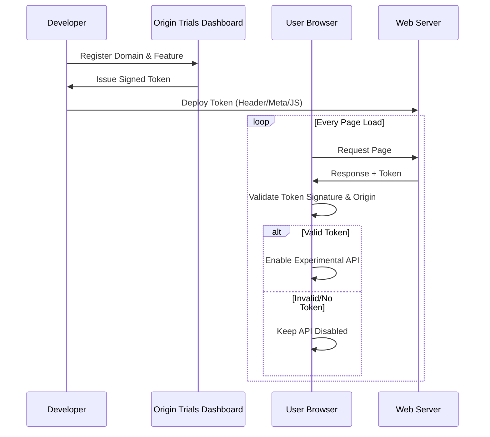

Origin Trials allow you to test and provide feedback on new or experimental web APIs before they become a permanent part of the web platform. Chromium-based browsers—such as Chrome, Edge, and Opera—use this program to test features in production environments without committing to a permanent implementation.

This post explores how Origin Trials function, their built-in safety mechanisms, and best practices for implementing them in your projects.

## Preventing "Burn-in"

In the early days of the web, browsers used vendor prefixes (such as `-webkit-` or `-moz-`) to test new CSS properties. This created a "burn-in" effect: developers built millions of production sites using these experimental prefixes. When standards changed or engineers improved a feature's implementation, they could not remove the prefixed version without breaking existing websites.

Origin Trials resolve this issue by making experimental features temporary and opt-in.

## The Origin Trial Workflow

The workflow follows these four steps:

* **Registration**: Register your domain (origin) at the [Chrome Origin Trials dashboard](https://developer.chrome.com/origintrials/#/trials/active).
* **Token Generation**: Google provides a cryptographically signed token unique to your domain and the specific feature.
* **Deployment**: Provide this token to the browser using an HTML `<meta>` tag, an Origin-Trial HTTP header, or programmatically using JavaScript.
* **Validation**: When a user visits your site, the browser verifies the token and unlocks the experimental API for that specific session.



## Safety Mechanisms

Origin Trials include three "failsafes" to ensure experiments remain temporary and do not become de facto standards.

The 0.5% Global Usage Cap
: Chromium tracks how often an experimental feature appears across the internet.
: * **The Rule**: If a feature's usage exceeds 0.5% of all Chrome page loads, the trial automatically disables for all users.
: * **The Impact**: This prevents massive platforms from enabling an experiment for their entire user base, requiring them to test on smaller groups instead.

User Subset Exclusions (Finch)
: Even with a valid token, Chromium randomly disables the API for a small percentage of your users (typically 1–3%).
: * **The Purpose**: This forces you to write robust feature detection. If you assume the API is always available and fail to provide a fallback, your site will break for these excluded users.

Forced Expiration and "Dark Periods"
: Trials have strict expiration dates. Occasionally, Google introduces a "dark period", intentionally disabling the trial for a short time shortly before the final launch. This confirms that no site has become dangerously dependent on the experimental code before it reaches the stable track.

## Implementation and Feature Detection

Implement the Origin Trial token as early as possible in your application lifecycle. Import this initialization file at the very top of your entry point (e.g., main.ts or index.js) to ensure the token is active before your application logic runs.

**TypeScript Implementation**

```ts
/**
 * src/init-trials.ts
 * Place this at the top of your entry point.
 */

export function initializeOriginTrial(token: string, featureName: string): void {
  // 1. Add the Origin Trial token to the document head
  const otMeta: HTMLMetaElement = document.createElement('meta');
  otMeta.httpEquiv = 'origin-trial';
  otMeta.content = token;
  document.head.append(otMeta);

  // 2. Perform Robust Feature Detection
  if (featureName in window || featureName in navigator) {
    console.log(`Origin Trial for ${featureName} is active.`);
  } else {
    console.warn(`${featureName} is not available. Using fallback logic.`);
  }
}
```

### CSS feature detection

Origin Trials are not limited strictly to JavaScript APIs. They also apply to experimental CSS properties, selectors, HTML elements, and HTTP headers. When developers provide a valid Origin Trial token, the browser's rendering engine unlocks the experimental CSS features for that specific page load.

Just as developers use if ('feature' in navigator) to guard JavaScript execution, they should use the CSS @supports rule to handle styling gracefully. Because CSS naturally ignores properties it does not understand, providing a fallback above the experimental property often works, but @supports provides a safer mechanism when applying entire blocks of experimental rules.

```css
/* Fallback for users where the Origin Trial is inactive */
.my-element {
  display: flex;
}

/* Enhanced styling applied only if the Origin Trial token unlocks the feature */
@supports (display: masonry) {
  .my-element {
    display: masonry;
  }
}
```

To detect experimental CSS features programmatically, use the CSS.supports() API. This allows developers to conditionally load polyfills or adjust application logic based on the trial's status.

**TypeScript**

```ts
export function checkCssOriginTrial(property: string, value: string): void {
  // NOTE: This function assumes the browser has already received and
  // processed a valid Origin Trial token via a <meta> tag or HTTP header.

  // Verify the CSS API exists before checking support
  if (typeof CSS !== 'undefined' && CSS.supports(property, value)) {
    console.log(`Origin Trial for CSS ${property}:${value} is active.`);
    document.body.classList.add(`supports-${property}`);
  } else {
    console.warn(`CSS ${property}:${value} is not available. Using fallback.`);
    document.body.classList.add(`no-supports-${property}`);
  }
}
```

**JavaScript**

```js
export function checkCssOriginTrial(property, value) {
  // NOTE: This function assumes the browser has already received and
  // processed a valid Origin Trial token via a <meta> tag or HTTP header.

  // Verify the CSS API exists before checking support
  if (typeof CSS !== 'undefined' && CSS.supports(property, value)) {
    console.log(`Origin Trial for CSS ${property}:${value} is active.`);
    document.body.classList.add(`supports-${property}`);
  } else {
    console.warn(`CSS ${property}:${value} is not available. Using fallback.`);
    document.body.classList.add(`no-supports-${property}`);
  }
}
```

## Best practices

* **Use feature detection**: Never assume an Origin Trial is active. Always use if ('feature' in navigator) or CSS.supports() to guard the code.
* **Limit scope**: Only enable tokens on the specific origins and pages that actually require the experimental feature.
* **Monitor expiration**: Track the expiration dates of active trials in project management tools to avoid sudden feature loss in production.
