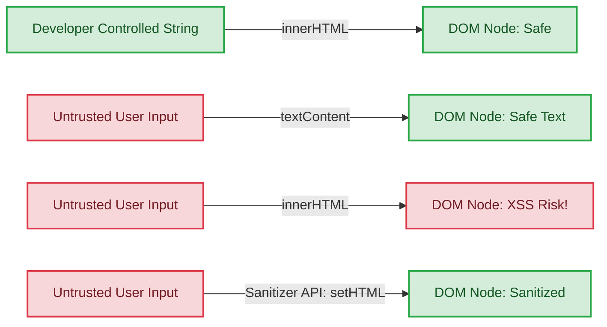

Web applications frequently need to render HTML strings dynamically. Whether you build a client-side templating system, display user-generated content, or render rich text, safely converting raw strings into DOM elements is a persistent challenge. Historically, developers relied on `innerHTML`, a convenient but notoriously insecure property that opens the door to cross-site scripting (XSS) attacks.

To address this, the Web Platform Incubator Community Group (WICG) proposed the HTML Sanitizer API.

This guide explores how the Sanitizer API works, why the web platform needs a native solution, how it compares to established third-party libraries, and what existing web patterns it supersedes.

## Implementation status

Before going deeper, it helps to be explicit about the current state of the feature: the Sanitizer API is not yet fully implemented in a stable, interoperable way across browsers.

As of 2026, parts of the API are available for experimentation in some browser builds, but support is still uneven. Method availability, configuration introspection, and behavior details can vary between engines and even between builds of the same engine. That means this article should be read as a guide to the API's design and practical experimentation, not as a guarantee of identical production behavior everywhere.

In practice, you should still rely on feature detection, verify behavior in the browsers you target, and be cautious about wording such as "fully supported" or "fully standardized" when discussing the API today.

## Why the Sanitizer API is necessary

When you assign a string of untrusted markup to an element's innerHTML, the browser blindly parses and executes it. If that string contains `<script>` tags or inline event handlers (such as `onerror` or `onload`), malicious JavaScript can execute within the context of your application.

Mitigating DOM-based XSS requires parsing the untrusted HTML and stripping out dangerous elements and attributes before they attach to the active document. Doing this safely requires a deep understanding of how the browser's HTML parser works—a parser that contains numerous edge cases and historical quirks. The Sanitizer API matters because it aims to move more of this security boundary into the platform itself, providing a browser-native model for safer rendering of untrusted HTML.

### When is HTML actually unsafe?

HTML is not inherently unsafe. If you maintain absolute control over your markup—such as writing static HTML files or hardcoding HTML strings directly into your JavaScript—your site is safe. You do not need the Sanitizer API for content you author completely.

The danger arises strictly when you introduce third-party, untrusted content into the DOM using methods like `innerHTML`.

Here is a breakdown of when HTML is safe versus when it becomes dangerous:

* **Completely safe (no sanitizer needed)**: Writing static HTML files, or injecting text using `element.textContent = userInput`. The `textContent` property safely treats all input as a raw string. If a user inputs `<script>alert(1)</script>`, the browser renders it as visible text on the screen rather than executing it.
* **Completely safe (no sanitizer needed)**: Hardcoding HTML strings in your JavaScript (for example, `element.innerHTML = '<div>My static UI</div>'`). Because you completely control the string and no external variables concatenate into it, there is no risk of an injection attack.
* **Dangerous (requires sanitization)**: Taking data from outside your direct control and rendering it as HTML. For example: `element.innerHTML = '<div>' + userComment + '</div>'`.

Here is a visual representation of these data flows and their security implications:



Methods such as `innerHTML` and `insertAdjacentHTML()` are dangerous because they implicitly trust all input. The browser's parser cannot distinguish between a `<script>` tag that you wrote and a `<script>` tag that a malicious user submitted in a forum post, a URL parameter, or a third-party API payload. The Sanitizer API exists specifically to bridge this gap, allowing you to safely render rich, formatted HTML strictly from untrusted, third-party sources.

## How it differs from third-party libraries

For years, developers have relied on user-space libraries like [DOMPurify](https://github.com/cure53/DOMPurify) to sanitize HTML. While these libraries are robust, a native API offers several potential advantages:

* **Perfect parser alignment**: Third-party libraries must reverse-engineer or simulate how a browser might parse a given string. Because browsers constantly evolve, a discrepancy between how a library parses HTML and how the browser renders it can lead to mutated XSS (mXSS) vulnerabilities. The native Sanitizer API uses the browser's own parser, eliminating this mismatch.
* **Zero dependency footprint**: Shipping a dedicated sanitization library adds to your JavaScript bundle size. A native API reduces payload size and improves initial load performance.
* **Potentially closer to platform changes**: When browsers introduce new elements, attributes, or platform-level features, third-party libraries require updates. A native API can, in principle, track the browser's own parsing and security model more closely, though that benefit depends on the maturity of the implementation.

## Elements and patterns the API supersedes

The Sanitizer API is intended to replace several legacy DOM insertion techniques that are inherently insecure:

`Element.innerHTML`
: The `setHTML()` method is intended as the secure replacement for assigning strings to `innerHTML`. While `innerHTML` requires you to clean the string before assignment, `setHTML()` is designed to parse and clean the tree in one step.

`Element.insertAdjacentHTML()`
: Similar to `innerHTML`, `insertAdjacentHTML()` processes raw strings without filtering. To achieve the same precise placement safely, developers should parse strings into a `DocumentFragment` using the `Document.parseHTMLUnsafe()` method.

`document.write()`
: Though largely deprecated in modern web development, `document.write()` remains one of the most dangerous ways to evaluate markup. The Sanitizer API standardizes safe DOM construction, further eliminating any remaining valid use cases for dynamic document modification via `document.write()`.

### How the Sanitizer API works

The API revolves around the `Sanitizer` interface and a set of new DOM methods that apply it. When you pass a configuration to the `Sanitizer` constructor, you create a set of rules defining exactly which elements and attributes the browser permits.

The core methods operate directly on `Element`, `ShadowRoot`, and `Document` nodes. The API splits parsing into two distinct flavors:

* **Safe methods (`setHTML`)**: These are the "Gatekeepers." They inherently block script execution and strip dangerous markup by default, providing a safe-by-default environment for untrusted input.
* **Unsafe methods (`setHTMLUnsafe`, `parseHTMLUnsafe`)**: These are designed for **full-fidelity parsing**. They bypass default safety restrictions and provide an exact representation of the input string—including potentially malicious tags—delegating the security decision to the developer.

Because `parseHTMLUnsafe()` (and its counterpart `setHTMLUnsafe()`) performs no sanitization, it serves as the modern, high-performance replacement for methods like `range.createContextualFragment()`. When using these methods, the responsibility for sanitization remains with the developer, typically by passing the resulting fragment through a `Sanitizer` before final insertion.

### Default sanitization behavior

You do not need to provide a custom configuration to use `setHTML()` in browsers that implement the API's current safe behavior. If you call `container.setHTML(untrustedInput)` without passing a `Sanitizer` instance, the browser is intended to apply its built-in safe defaults.

In current implementations, this automatic process is meant to strip out executing scripts, dangerous elements (like `<object>` or `<embed>`), and inline event handlers, while preserving standard, safe HTML elements like paragraphs, headings, and basic formatting.

### Inspecting the configuration

The behavior across browsers regarding configuration visibility is currently inconsistent. In many 2026 implementations, the browser treats the Sanitizer configuration as **write-only**.

While the specification defines a `config` property, multiple browser vendors (including Chromium and Firefox) currently return `undefined` for `config` even when you provide a custom configuration object during instantiation. This is a security and performance trade-off: the browser consumes your configuration to build an internal per-instance security policy and then discards the JavaScript-accessible representation to prevent state-leaking or accidental modification.

Consequently, if you need to track your configuration for your own logic, you should maintain your own reference to the configuration object rather than relying on the `Sanitizer` instance to provide it back to you.

The following example uses a practical migration pattern you can run directly in the browser:

* Read raw HTML from `#user-content` (the untrusted source node).
* Sanitize that HTML into `#target-container`.
* Remove `#user-content` once sanitization succeeds, so the untrusted source is no longer in the DOM.

This pattern is useful when modernizing older pages that still render user HTML inline. Instead of mutating the original node in place, you create a clear trust boundary: source node in, sanitized node out.

#### JavaScript implementation

> **Note**: As of 2026, ensure your browser has the "Experimental Web Platform Features" flag enabled. In many current builds, the `config` property is not yet fully implemented as a getter, meaning the API effectively acts as a "black box" once instantiated.

```js
// 1. Check for browser support
if (typeof Sanitizer !== 'undefined') {
  // 2. Find source and target nodes
  const source = document.getElementById('user-content');
  const target = document.getElementById('target-container');

  if (!source || !target) {
    console.warn('Missing #user-content or #target-container in the DOM.');
  } else {
    // 3. Create a sanitizer policy
    const sanitizer = new Sanitizer({
      elements: ['div', 'h2', 'p', 'b', 'i', 'a'],
      attributes: ['href', 'title', 'class']
    });

    // 4. Sanitize and render in #target-container
    target.setHTML(source.innerHTML, { sanitizer });

    // 5. Remove the original untrusted source node
    source.remove();

    console.log('Sanitized content moved to #target-container and #user-content removed.');
  }
} else {
  console.warn('The Sanitizer API is not supported in this browser.');
}
```

In this flow, calling `source.remove()` is intentionally the final step. Keep it after `target.setHTML(...)` so you only remove the original node after sanitized content has been written successfully.

### Configuration options

When you do need a custom setup, the `SanitizerConfig` object gives developers granular control over the sanitization process. You can define arrays of allowed or blocked elements and attributes.

**Note**: If you pass an `elements` array into the `Sanitizer` constructor, it overwrites the default allow-list entirely. In practice, that means the array becomes an explicit allow-list: only the element names you include are allowed through, and elements you do not list are excluded from the output.

* **elements**: An allow-list of specific elements.
* **removeElements**: A block-list of elements to remove entirely (including their text content).
* **replaceWithChildrenElements**: Elements to unwrap (removing the tag itself but keeping its inner content).
* **attributes**: An allow-list of safe attributes.
* **removeAttributes**: A block-list of attributes to strip.
* **comments**: Whether to allow HTML comments (default is `false`).
* **dataAttributes**: Whether to allow `data-*` attributes (default is `false`).

### Order of operations matters

Sanitization is most effective when it is the final security boundary before insertion into the DOM. If you sanitize first and then run the result through other HTML-mutating libraries, you can accidentally reintroduce unsafe markup.

Safe pipeline
: Transform content first, sanitize once at the end, then render.

```js
const raw = getUserHtml();
const transformed = runMarkdownOrFormatting(raw);
const sanitizer = new Sanitizer();

target.setHTML(transformed, { sanitizer });
```

Bad pipeline
: Sanitizing too early, then re-mutating or reinserting through unsafe paths.

```js
const raw = getUserHtml();
const sanitizer = new Sanitizer();

// Sanitized first
target.setHTML(raw, { sanitizer });

// Later mutation can undo guarantees
target.innerHTML = someLibraryRewrite(target.innerHTML);
```

If a post-processing step is unavoidable after sanitization, run the output through sanitization again before final DOM insertion.

## Step-by-step breakdown of functionality

When you build applications that accept rich text from users—like a comment section or a forum post—you often receive HTML strings that contain a mix of safe formatting and potentially malicious code.

To demonstrate how the API handles this, we can process a sample string containing several common XSS vectors.

The untrusted input
: Consider the following string of HTML provided by a user. It contains safe structural elements (`<div>`, `<h2>`, `<p>`), but also includes three distinct threats:
: * A direct `<script>` injection.
: * An `<a>` tag utilizing a javascript: URI to execute code when clicked.
: * A `<b>` tag with an inline onmouseover event handler.

```html
<div id="user-content">
  <h2>User Profile</h2>
  <p>Welcome back! <script>alert('XSS Attack!');</script></p>
  <a href="javascript:stealCookies()">Click for a prize</a>
  <b onmouseover="runMalware()">Hover me</b>
</div>
```

Configuring the sanitizer
: By default, the safe methods of the Sanitizer API (like `setHTML`) strip out scripts and known dangerous attributes. However, you can strictly define exactly what the browser allows to pass through the filter by passing a configuration object to the Sanitizer constructor.
:In this scenario, you want to allow basic text formatting but strictly control the output:
: * **elements**: By specifying [`'div'`, `'h2'`, `'p'`, `'b'`], you create an exclusive allow-list. The API entirely removes any element not on this list, including its text content. This means it strips out the `<script>` tag and the `<a>` tag.
: * **removeAttributes**: While you allow the `<b>` tag, you want to ensure it cannot carry inline event handlers. By explicitly removing [`'onmouseover'`] (or relying on the API's secure defaults, which strip event handlers automatically), you neutralize the inline execution threat.

### JavaScript implementation

Because the Sanitizer API is a browser-native feature, you can run these examples directly in your browser's console or within a script tag on 2026-compliant browsers.

```js
// 1. Define the untrusted user input
const untrustedInput = `
  <div id="user-content">
    <h2>User Profile</h2>
    <p>Welcome back! <script>alert('XSS Attack!');</script></p>
    <a href="javascript:stealCookies()">Click for a prize</a>
    <b onmouseover="runMalware()">Hover me</b>
  </div>
`;

// 2. Check for browser support
if (typeof Sanitizer !== 'undefined') {
  // 3. Instantiate the Sanitizer with your strict rules
  const mySanitizer = new Sanitizer({
    elements: ['div', 'h2', 'p', 'b'],
    removeAttributes: ['id', 'onmouseover']
  });

  // 4. Select the target container
  const container = document.getElementById('target-container');

  if (container) {
    // 5. Inject the content safely
    container.setHTML(untrustedInput, { sanitizer: mySanitizer });
    console.log('Sanitization complete!');
  }
} else {
  console.error('This browser does not support the Sanitizer API.');
}
```

### The resulting output

Once `setHTML()` executes, the browser constructs the final DOM elements and attaches them to `#target-container`. If you inspect the container's inner HTML afterward, it looks like this:

```html
<div>
  <h2>User Profile</h2>
  <p>Welcome back! </p>
  <b>Hover me</b>
</div>
```

What happened during the process?

* The API entirely removed the `<script>` element and its contents because it is not in the elements allowlist (and the API blocks it by default).
* The API removed the `<a>` element and its text content ("Click for a prize") because `<a>` was omitted from the elements array.
* The API removed the `id="user-content"` attribute on the `<div>` because we added `id` to the `removeAttributes` list.
* The API kept the `<b>` element, but it stripped the `onmouseover` attribute, leaving only the safe text node inside.

## Advanced configuration

### Extending the defaults for custom elements

Because passing an elements array to the constructor overwrites the defaults, you would normally have to manually re-declare standard elements like `div`, `p`, and `span` just to add a single custom element.

To avoid this, the Sanitizer API provides modifier methods that allow you to append rules to the existing safe defaults. This is the cleanest approach when you need to render web components safely, as you must explicitly allowlist both the custom element tag and any specific attributes it requires.

### Interaction with the shadow DOM

The Sanitizer API acts as an insertion gatekeeper, not an active page scanner. Its behavior with web components and the shadow DOM depends entirely on how you inject the content:

* **Declarative shadow DOM**: If an untrusted string contains a declarative shadow root (for example, `<template shadowrootmode="open">`), the Sanitizer API parses and cleans the internal contents of that `<template>` before the browser converts it into a live shadow root.
* **Injecting directly into a shadow root**: The API provides the exact same methods on the `ShadowRoot` interface. To safely inject user input directly into a component's internal structure, you can call `this.shadowRoot.setHTML(untrustedInput)`.
* **Pre-existing components**: If you call `container.setHTML(untrustedInput)`, the API only sanitizes the newly injected string. It does not traverse downward into the encapsulated shadow DOM of web components already attached to the page.

This behavior highlights exactly why the Sanitizer API blocks all custom elements by default. The API cannot analyze a custom element's underlying JavaScript class to guarantee it is safely constructed. If a developer wrote unsafe code inside that class (like `this.shadowRoot.innerHTML = maliciousData`), the Sanitizer API cannot stop it once the element is inserted. Therefore, the API operates under a "zero trust" policy for custom tags unless you explicitly allowlist them.

### JavaScript implementation

```js
const webComponentInput = `
  <div>
    <p>Standard text</p>
    <my-custom-widget data-theme="dark" onactivate="runExploit()">
      Widget Content
    </my-custom-widget>
    <script>alert('Blocked!')</script>
  </div>
`;

// 1. Instantiate the default Sanitizer if available
if (typeof Sanitizer !== 'undefined') {
  const wcSanitizer = new Sanitizer();

  // 2. Append custom rules to the instance
  wcSanitizer.allowElement('my-custom-widget');
  wcSanitizer.allowAttribute('data-theme');
  wcSanitizer.removeElement('img');

  const container = document.getElementById('app-root');

  if (container) {
    container.setHTML(webComponentInput, { sanitizer: wcSanitizer });
  }
}
```

## Integration with Trusted Types

At this point, the important distinction is straightforward: `setHTML()` is the right tool when you are sanitizing untrusted input, while the unsafe variants fall outside that trust model. Once you cross into sinks that may execute markup, Trusted Types becomes the next layer of defense.

Trusted Types provide a defense-in-depth mechanism against DOM-based XSS by restricting the assignment of standard strings to dangerous sinks like innerHTML. The Sanitizer API integrates smoothly with Trusted Types, but the behavior depends heavily on which method you use.

See [Order of operations matters](#order-of-operations-matters) before implementing this flow, because post-sanitization rewrites can still reintroduce risk.

Assuming your application serves the HTTP header `Content-Security-Policy: require-trusted-types-for 'script'`, here is how the two methods differ.

### Using `setHTML()` (The safe sink)

Why use it? You want to render untrusted user input safely without the overhead of creating and managing custom Trusted Type policies.

Because `setHTML()` is intended to strip executing scripts and malicious markup natively, it acts as a safe sink in implementations that follow the current model. It accepts standard strings. In browsers where this behavior is wired into Trusted Types correctly, `setHTML()` should not trigger a violation.

#### JavaScript implementation

```js
// CSP: require-trusted-types-for 'script';
const rawUserInput = "<b>User Text</b><script>alert('Blocked')</script>";
const container = document.getElementById('target-container');

if (container && typeof container.setHTML === 'function') {
  // setHTML accepts standard strings securely even under Trusted Types.
  container.setHTML(rawUserInput);
}
```

### Using `setHTMLUnsafe()` (The dangerous sink)

Why use it? You intend to render markup that includes scripts or complex elements normally stripped by the sanitizer. However, to satisfy your Trusted Types CSP, you must mathematically prove to the browser that this dangerous markup originated from a verified, secure source (like an internal templating system), rather than an attacker.

Because `setHTMLUnsafe()` bypasses default safety restrictions, it acts as a dangerous sink. If your CSP enforces Trusted Types, passing a standard string to `setHTMLUnsafe()` throws a TypeError. You must pass a TrustedHTML object.

#### JavaScript implementation

```js
// CSP: require-trusted-types-for 'script';
const templateString = "<div>System Status: <script>initWidget()</script></div>";
const container = document.getElementById('target-container');

if (typeof window.trustedTypes !== 'undefined') {
  // 1. Create a policy
  const templatePolicy = window.trustedTypes.createPolicy('template-policy', {
    createHTML: (string) => {
      // Verification logic belongs here
      return string;
    }
  });

  // 2. Convert the string into a TrustedHTML object
  const trustedHtml = templatePolicy.createHTML(templateString);

  if (container) {
    // setHTMLUnsafe accepts the TrustedHTML object and renders the script
    container.setHTMLUnsafe(trustedHtml);
  }
}
```

## Security architecture and the rule of two

When discussing browser security APIs, it helps to understand how they fit into the broader security architecture of the browser itself, such as Chromium's "Rule of Two."

Chromium's Rule of Two dictates that any specific piece of code can possess no more than two of the following three characteristics:

* Processes untrusted inputs.
* Is written in an unsafe language (like C or C++).
* Runs with high privileges (without a sandbox).

The Sanitizer API is specifically designed to take untrusted input (HTML strings provided by users). Under the hood, the browser's HTML parser (such as Blink in Chromium) processes this string, and that parser is written in C++ (an unsafe language).

Because it meets those first two conditions, the Rule of Two dictates that the parser cannot safely run with high privileges. Consequently, the HTML parsing and sanitization is expected to happen within the browser's heavily sandboxed Renderer process. If a malicious HTML string somehow triggers a memory corruption vulnerability in the C++ parser while evaluating the Sanitizer API's input, the sandbox is meant to limit the blast radius rather than allow direct operating system compromise.

## The conceptual shift for developers

For web developers writing JavaScript, the literal Rule of Two does not apply directly because JavaScript is a memory-safe language. However, the Sanitizer API brings the philosophy of the Rule of Two, defense in depth and privilege reduction, to DOM security.

Before the Sanitizer API, developers had to parse untrusted HTML using user-space JavaScript libraries and then inject it into the DOM. The DOM is essentially an unsafe environment when it comes to XSS because it readily executes scripts and event handlers.

By using the Sanitizer API (especially in conjunction with Trusted Types), you enforce a strict boundary:

* **Untrusted input**: You receive raw user data.
* **Unsafe execution context**: The DOM executes `<script>` tags if given the chance.
* **Mitigation**: The native Sanitizer API is designed to scrub execution vectors before the input touches the active DOM.

## Closing thoughts

The Sanitizer API does not eliminate the need to think carefully about trust boundaries, but it does point the platform in a healthier direction by moving one of the web's most error-prone security tasks closer to the browser itself. That shift matters. Instead of expecting every application team to become experts in parser edge cases, browsers can offer a safer baseline where implementations are available and mature enough to trust.

For most real-world use cases, the practical guidance is simple: use `setHTML()` when rendering untrusted markup, define a custom configuration only when you need tighter control over the output, and treat the unsafe variants as outside the normal sanitization workflow. If you pair that model with Trusted Types and a clear separation between trusted and untrusted content, you end up with a much stronger foundation than `innerHTML` ever provided.

That is the real value of the Sanitizer API. It is not just a new DOM convenience method. Even in its still-evolving state, it represents an important change in how the platform encourages developers to think about rendering, trust, and security.
