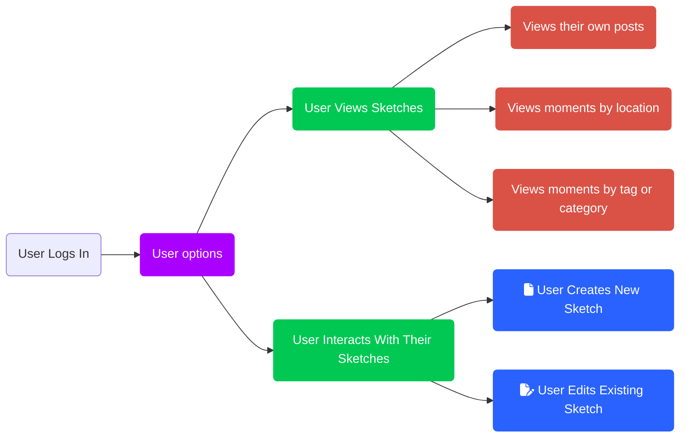

One of my current projects is to create a journaling system similar to [Hi](https://hitotoki.org/) did.

The idea is described in [Full stack writing (and publishing): Welcome to Hi](https://hitotoki.org/moments/q4oi5i68).

## The Idea

The idea of this application is as follows:

* Mobile first application
* Users log into the platform and have the option to read what other people have written or create their content.
* Log in
  * Use Google and Facebook login
* Capture initial data
  * Capture a summary or sketch of the post
  * Capture the location where the post originated using the Geolocation API
    * Use a Geocoding service to get the location and display it as a human-readable string in any of these formats:
      * City
      * City/State
      * City/Country
      * City/State/Country
  * Provide a longer space to write more about the sketch. This is optional
  * Provide space to upload a header image when creating the summary or later when you
  * Provide space for categories/tags
* Store content in a database
  * Either PostgreSQL or MongoDB
* Read what you or other users have written
  * You can prod people to complete their stories with a "tell me more" type of comment, either auto-generated or manually written by the reader
  * You can thank people for their posts (whether just a sketch or a fully-fledged post)
* Posts are shown in different views
  * By Location (all posts by all users in a location)
  * By Tag/category (all posts by all users with a matching tag)
  * By User (all posts by the user)

### Technical ideas

* Node-based with an express backend
* Nunjucks Templates + CSS  front-end
* Geocoding and maps (explore different sources)
* Image capabilities to upload and display header and body images
* One URL per post throughout the entire process

The process looks like this:

## Why mobile first?

Mobile is ubiquitous and lets me create sketches where they happen. To me, this adds another dimension to the writing.

A Mobile-first approach also makes the application easier to adopt. There is no marketplace and no barrier to updates and improvements.

It also enabled offline access and capabilities via service workers. It also opens possibilities for exploration as the component technologies evolve.

## Inspiration and Ideas

* [Full stack writing (and publishing): Welcome to Hi](https://hitotoki.org/moments/q4oi5i68)
* [Hi: Narrative mapping the world](https://medium.com/hi-narrative-mapping-1/hi-narrative-mapping-the-world-4c78e6883ec0)
