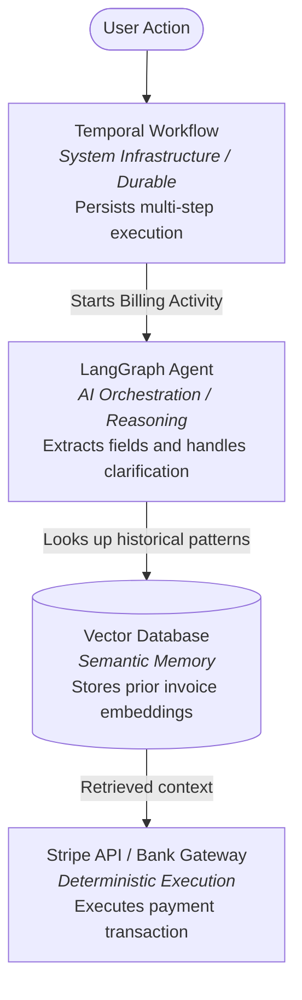

A growing claim says that AI tools will make coding skills obsolete. As tools such as GitHub Copilot, Gemini, and agentic systems improve, some people conclude that traditional programming knowledge is becoming optional.

I am less worried about AI replacing programmers than I am about confusing code generation with software engineering. The key question is not whether AI can produce code. The question is whether we still need humans who can reason about correctness, safety, and architecture in an AI-heavy workflow.

This post explores whether coding skills remain relevant or if we are moving toward a future of purely natural-language development.

## Stating the Problem

The debate often centers on a recurring question:

> Will the rise of AI make understanding programming languages obsolete, similar to how we no longer need to understand machine code?

To answer that, we need to separate abstraction from accountability:

1. Abstraction levels: We have always added abstractions, from assembly to high-level languages. AI is another layer. But there is a key difference. Compilers transform formal input into formal output under strict rules. Prompting starts with ambiguous natural language and asks a probabilistic model to produce precise artifacts. That abstraction is powerful, but it is also leaky.
2. The oversight requirement: Because prompting is lossy, generated code still needs a verifier. AI can draft implementation quickly, but developers must validate requirements, integration behavior, security, and failure modes. The role shifts from typing syntax to supervising system quality.

## How AI Works in Programming (Good Prompts Matter)

AI-assisted programming quality depends heavily on prompt specificity. Vague prompts usually produce vague, unstable results.

**Vague prompt**: "Create an application that converts two colors in any format supported by the color.js library and output the result."

**Issue**: This prompt does not specify language, runtime target (web or CLI), framework, or error-handling expectations. The model must guess, which increases the chance of unusable output.

A more focused prompt sets clearer constraints:

> Create a web application using React and TypeScript with Vite as the build tool. Use the color.js library to convert colors between supported color spaces. Include input fields for color entry, a dropdown for output format selection, and a visual swatch of the converted result along with the string that represents the converted color.

This works better because terms such as React, TypeScript, and Vite reduce ambiguity and anchor the model to a narrower implementation pattern. Better constraints do not guarantee correctness, but they reduce avoidable drift.

## Why Programming Knowledge Is Still Important

Even with detailed prompts, models can produce plausible but incorrect code.

### Correctness Is Not Guaranteed

AI tools do not guarantee functional correctness. They can invent methods, misuse APIs, or introduce subtle logic bugs that look reasonable.

In practice, this appears as:

* Incorrect predictions: using deprecated or nonexistent APIs. For example, a model might suggest `color.toHex()` when the library expects `color.toString({ format: "hex" })`.
* Misclassification in review suggestions: flagging valid logic as suspicious or missing real defects.
* Security regressions: generating code that works functionally but skips essential controls, such as parameterized queries, authorization checks, or input validation.

Models learn patterns from public code, which includes both good and bad practices. Without informed review, weak patterns can pass into production.

### Testing and Debugging

A common misconception is: if AI writes the code, AI should also write all the tests. That can fail when the same misunderstanding is copied into both implementation and tests.

#### Debugging the Tests Themselves

AI-generated tests are still code, so they can contain the same flaws as the app. You must review whether each test verifies a real requirement.

Common failure modes:

* Tautological tests: tests that pass because they mirror flawed implementation logic instead of checking an external expectation.
* Brittle mocking: excessive mocking that produces green unit tests while real interfaces fail in integration.

#### The "Golden Test" Strategy

A practical approach is hybrid:

* Let AI generate routine tests for straightforward utilities.
* Write high-value tests manually for core business behavior and critical edge cases.
* Treat these human-authored tests as acceptance constraints for AI-generated implementation.

Here is a hand-written golden test suite for a color converter. The goal is to define invariants before generation:

```ts
import { convertColor } from './colorConverter';

describe('Color Conversion Invariants', () => {
  it('converts RGB white to hex', () => {
    const input = { r: 255, g: 255, b: 255 };
    const expected = '#ffffff';
    const result = convertColor(input, 'hex');
    expect(result).toBe(expected);
  });

  it('rejects malformed RGB input', () => {
    const badInput = { r: 300, g: -10, b: 255 };

    expect(() => {
      convertColor(badInput, 'hex');
    }).toThrow('Invalid color coordinates');
  });
});
```

Use tests as constraints, not just as after-the-fact checks. Supplying the test file as context to your coding assistant often improves first-pass output quality, but you still need review and debugging.

#### The Debugging Loop

When bugs appear, AI is most effective when you provide concrete runtime context. Without programming knowledge, it is hard to interpret stack traces and profiler output.

If a React component enters an infinite render loop, "My page is frozen, fix it" usually yields guesswork. A better workflow is to isolate the fault first, then prompt with specific evidence: the relevant effect, its dependency behavior, the observed state transitions, and expected behavior. Specific context turns broad guesses into targeted fixes.

## Managing Non-Determinism: The Infrastructure of Intelligence

LLMs are probabilistic systems. The same prompt can produce different outputs across runs, especially across model versions, providers, or infrastructure conditions. For prototypes, this variability may be acceptable. For production software, it must be bounded by deterministic controls.

### The Temperature = 0 Myth

Temperature set to 0 can increase repeatability, but it does not guarantee full determinism in all serving environments.

Contributors to variance can include:

1. Numeric sensitivity in large parallel computations: tiny floating-point differences can occasionally affect close token rankings.
2. Dynamic routing in some model architectures: request batching and routing decisions can alter execution paths.
3. Serving-layer variability: infrastructure changes, model revisions, and deployment differences can change outputs over time.

The exact mechanisms depend on the provider, but the engineering consequence is consistent: application-level guardrails are still required.

### Why Guardrails Are Mandatory

In production systems, "usually correct" is not enough. Billing, healthcare, and compliance-sensitive workflows require predictable behavior.

Three practical guardrail categories (these are examples, not a required stack):

1. Predictability (constraint engines): tools such as [AgentMap](https://github.com/alokranjan-agp/AgentMap) and [DSPy](https://dspy.ai/) can enforce structured decision paths instead of unconstrained free-form responses.
2. Resilience (durable execution): systems such as [Temporal](https://temporal.io/) persist workflow state so retries and restarts do not corrupt long-running processes.
3. Connectivity (controlled integrations): platforms such as [n8n](https://n8n.io/) provide governed connectors and explicit interfaces so models act through approved boundaries.

## Infrastructure vs. Orchestration: The LangChain Ecosystem

Production AI systems benefit from distinguishing orchestration from infrastructure.

* LangChain and LangGraph (orchestration): these tools coordinate reasoning steps, tool calls, and conversational state.
* LangSmith (observability): this tooling helps inspect traces, diagnose prompt failures, and analyze chain behavior.

### Why Specialized Tools Still Matter

Orchestration alone does not replace execution infrastructure.

1. Execution guarantees: orchestration frameworks manage decision flow; workflow engines manage retries, persistence, and idempotent execution patterns.
2. Integration depth: connector ecosystems can provide robust operational adapters for enterprise systems.
3. Separation of concerns: combining probabilistic reasoning with deterministic execution layers reduces operational risk.

### A Real-World Architecture Scenario: Automated Invoicing Agent

Consider a system that reviews invoices and processes payments:



In this model, LangGraph handles ambiguous reasoning tasks, such as parsing inconsistent invoice layouts and requesting clarification. Deterministic application logic validates fields, while deterministic systems handle transaction execution, retries, and recovery semantics. That separation is often what turns a useful demo into a production-capable system.

## Conclusion

AI is changing programming, but it is not removing the need for programming knowledge. The role is shifting from manual code entry toward specification, verification, and architecture. Prompting helps you move faster. Engineering discipline keeps the system correct, secure, and reliable.
