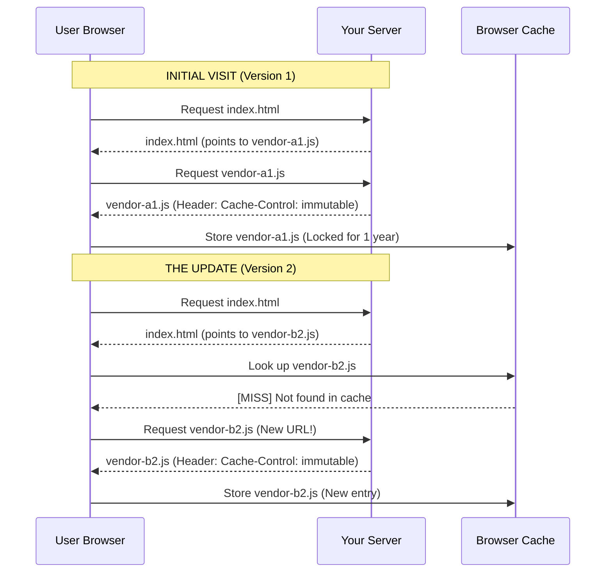

For nearly a decade, one of the most persistent "best practices" in web development was the use of shared public Content Delivery Networks (CDNs). If you used a popular library like jQuery, React, or Lodash, the advice was clear: **"Load it from Google’s Hosted Libraries or cdnjs."**

The logic seemed airtight. If thousands of sites used the same URL for a library, the user likely already had that file in their cache from a previous visit to a different site. Loading it would be "instant."

Today, that advice is technically incorrect. Modern browsers have fundamentally changed how they store data to protect user privacy, effectively killing the "shared cache" benefit.

## **The Shift: From Single-Keyed to Double-Keyed Caching**

To understand why the old advice failed, we must look at how browsers identify files in their storage. This mechanism is called the **Cache Key**.

### **How it Used to Work (Single-Keyed)**

In the past, the cache key was simply the **Resource URL**. If you visited Site A and it requested a script, the browser checked its internal database for that URL.

* **Key:** <https://cdn.com/react.js>
* **Value:** [React Source Code]

If you then visited Site B, which requested the exact same URL, the browser found a match and served the file from the local disk. This created a global, shared pool of resources across the entire internet.

### **How it Works Now (Double-Keyed/Partitioned)**

Modern browsers (Chrome, Safari, Firefox, and Edge) have implemented **HTTP Cache Partitioning**, also known as **Double-Keyed Caching**. Now, the cache key is a combination of the **Top-level Site (the origin you are visiting)** and the **Resource URL**.

Now, the browser sees things like this:

* **Key:** (example.com, <https://cdn.com/react.js>) -> [File Data]
* **Key:** (yourdomain.org, <https://cdn.com/react.js>) -> [File Data]

Even though the library URL is identical, the "Owner" of the cache entry is different. Because the keys don't match, yourdomain.org cannot access the file that example.com downloaded. Every site must now download its own unique copy of every dependency.

## **Why the Change? Privacy vs. Performance**

This change wasn't an accident; it was a deliberate security choice to prevent **Cache Timing Attacks**.

### **The Privacy Risk: How Information Leaked**

Before partitioning, a malicious website could "fingerprint" your browsing history with high accuracy. This attack relied on a simple principle: resources in the cache load significantly faster than resources from the network.

**The Mechanics of the Attack:**

1. A malicious site (Attacker.com) wants to know if you use a specific bank.
2. The attacker knows the exact URL of a unique image used by that bank (e.g., <https://my-bank.com/assets/logo.png>).
3. Attacker.com attempts to load that resource in the background using JavaScript and measures the time it takes.
   * **Result A (2ms):** Cache Hit. The attacker knows you have visited that bank's site recently.
   * **Result B (200ms):** Cache Miss. The attacker knows you likely haven't visited that site.

By moving to double-keyed caching, browsers ensure that your interaction with Site A remains completely invisible to Site B.

## **The Modern Solution: Fingerprinting & Immutable Caching**

Since you no longer get a "shared" benefit from CDNs, the fastest way to load resources is to host them yourself and use **Fingerprinting** (adding a content hash to the filename).

### **The Immutable Strategy**

When you add a hash to your filename (e.g., app-a1b2c3.js), the URL becomes unique to that specific version of the code. This allows you to use the most aggressive caching header possible:

Cache-Control: public, max-age=31536000, immutable

The immutable directive tells the browser that this file will **never** change. The browser won't even send a "revalidation" request to the server when the user refreshes the page; it simply pulls the file from the local disk instantly.

### **Visual Update Flow**



## **Caching Content Assets (Images & Non-Code)**

Fingerprinting works perfectly for code bundled by tools like Vite, but it is often cumbersome for content assets (like images in a blog post or CMS). If you don't want to deal with hashed filenames for every image, use a **Revalidation Strategy**.

### **Caching Fixed Filenames with no-cache**

For assets with fixed names (e.g., /public/images/hero.png), use the following header:

```apacheconf
Cache-Control: no-cache
```

**How it works:**

Despite the name, no-cache allows the browser to store the file locally. However, it forces the browser to check with the server before using it.

1. **The Request:** The browser asks for hero.png and sends an ETag (a unique ID for the version it already has).
2. **The Server Check:**

	* If the file hasn't changed, the server sends a **304 Not Modified**. The browser loads the image from its cache instantly.
	* If you've uploaded a new version, the server sends the new file with a **200 OK**.

This gives you the flexibility to update images whenever you want without changing any code or filenames, while still saving bandwidth for returning users.

## Implementing with Vite & Server Config

While Vite handles the filename hashing, you must configure your **web server** to send the correct headers. Vite does not set these headers for you in production.

### **Vite Config (Hashed Assets)**

Ensure your build produces unique, fingerprinted filenames.

**TypeScript / JavaScript:**

```ts
import { defineConfig } from 'vite';

export default defineConfig({
  build: {
    rollupOptions: {
      output: {
        entryFileNames: 'assets/[name]-[hash].js',
        chunkFileNames: 'assets/[name]-[hash].js',
        assetFileNames: 'assets/[name]-[hash].[ext]'
      }
    }
  }
});
```

### Server Configuration (The Headers)

You apply headers at the server level. The strategy differs depending on whether the file is "immutable" (hashed) or "mutable" (fixed name).

#### Nginx Configuration

Nginx uses location blocks to apply different headers to different file paths.

```nginx
# Hashed assets: Vite generates these in /assets/ with unique hashes.
# These can be cached forever because the name changes when the content changes.
location /assets/ {
  add_header Cache-Control "public, max-age=31536000, immutable";
}

# Fixed-name images: Files in your public folder (e.g., logo.png).
# We use no-cache so the browser checks the ETag before using the cached file.
location /images/ {
  add_header Cache-Control "no-cache";
}

# HTML Entry Points: Ensure browsers always check for updates.
# Apply this to ALL HTML files (index.html, about.html, etc.).
location \~\* \\.html$ {
  add_header Cache-Control "no-cache";
}
```

#### **Why explicitly use "no-cache" vs. nothing at all?**

If you provide no Cache-Control header, browsers use **Heuristic Caching**. The browser "guesses" how long to cache the file based on the Last-Modified header. This leads to inconsistent behavior where some users see updates and others are stuck with old versions for hours or days.

Using no-cache creates a deterministic "Always Check" contract between the browser and your server.

#### **Does this apply to all HTML files?**

**Yes.** You should apply no-cache to every HTML file in your project.

* **Why:** In a modern SPA or multi-page site, the HTML files are your "routing maps." They contain the <script> and <link> tags that point to your hashed assets. If a browser caches about.html for 24 hours and you deploy an update 5 minutes later, that user will still try to load the old hashes referenced in their cached version of about.html, which may no longer exist on your server.

#### Apache Configuration (.htaccess)

For Apache servers, use the Header set command paired with FilesMatch.

```apacheconf
# Cache hashed assets for 1 year
<FilesMatch "\\.(js|css|woff2|png|jpg)$">
  Header set Cache-Control "max-age=31536000, public, immutable"
</FilesMatch>

# Ensure all HTML files always revalidate
<FilesMatch "\\.html$">
  Header set Cache-Control "no-cache"
</FilesMatch>
```

#### Cloud Providers (Vercel / Netlify)

Most modern cloud platforms allow you to define these headers in a configuration file within your project root.

**Vercel (vercel.json):**

```json
{
  "headers": [
    {
      "source": "/assets/(.*)",
      "headers": [
        { "key": "Cache-Control", "value": "public, max-age=31536000, immutable" }
      ]
    },
    {
      "source": "/(.*).html",
      "headers": [
        { "key": "Cache-Control", "value": "no-cache" }
      ]
    }
  ]
}
```

**Netlify (netlify.toml):**

```toml
# Cache hashed assets for 1 year
[[headers]]
  for = "/assets/*"
  [headers.values]
    Cache-Control = "public, max-age=31536000, immutable"

# Ensure all HTML files always revalidate
[[headers]]
  for = "/*.html"
  [headers.values]
    Cache-Control = "no-cache"

# Optional: Default for images if not using hashes
[[headers]]
  for = "/images/*"
  [headers.values]
    Cache-Control = "no-cache"
```

## **Conclusion**

The era of the "Global Shared Cache" is over. Because modern browsers partition their caches for privacy, you gain no performance advantage by using a public CDN for shared libraries. Instead, host your own assets. Use **Fingerprinting and Immutable headers** for your code bundles to get "instant" loads, and use **no-cache revalidation** for static content assets to maintain flexibility without sacrificing too much speed.
