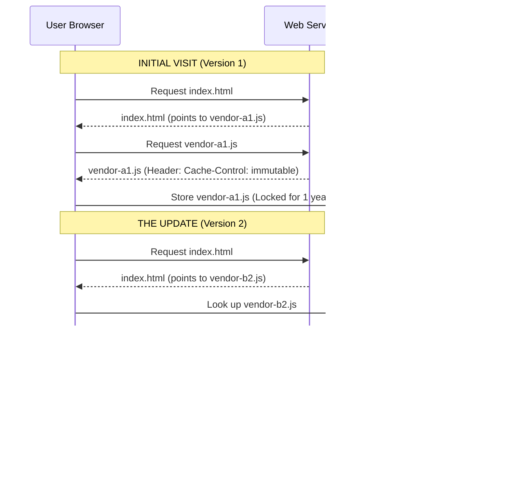

For nearly a decade, one of the most persistent best practices in web development was the use of shared public Content Delivery Networks (CDNs). If developers used a popular library like jQuery, React, or Lodash, the advice was clear: Load it from Google's Hosted Libraries or cdnjs.

The logic seemed airtight. If thousands of sites used the same URL for a library, the user likely already had that file in their cache from a previous visit to a different site. Loading it would be instant.

Today, that advice is technically obsolete. Modern browsers have fundamentally changed how they store data to protect user privacy, effectively killing the "shared cache" benefit.

This post explains the shift from single-keyed to double-keyed caching, why it happened, and how developers can adapt their caching strategies for optimal performance in this new era.

## The shift: From single-keyed to double-keyed caching

To understand why the old advice failed, developers must look at how browsers identify files in their storage. This mechanism is called the cache key.

### How it used to work (single-keyed)

In the past, the cache key was simply the resource URL. If a user visited Site A and it requested a script, the browser checked its internal database for that exact URL.

* **Key**: <https://cdn.example.com/react.js>
* **Value**: [React Source Code]

If the user then visited Site B, which requested the exact same URL, the browser found a match and served the file from the local disk. This created a global, shared pool of resources across the entire internet.

### How it works now (double-keyed/partitioned)

Modern browsers (Chrome, Safari, Firefox, and Edge) have implemented HTTP cache partitioning, also known as double-keyed caching. Now, the cache key is a combination of the top-level site (the origin the user is visiting) and the resource URL.

Now, the browser registers cache entries like this:

* **Key**: (example.com, <https://cdn.example.com/react.js>) -> [File Data]
* **Key**: (yourdomain.org, <https://cdn.example.com/react.js>) -> [File Data]

Even though the library URL is identical, the "owner" of the cache entry differs. Because the keys do not match, yourdomain.org cannot access the file that example.com downloaded. Every site must now download its own unique copy of every dependency.

## Why the change? Privacy versus performance

This change was a deliberate security choice to prevent cache timing attacks.

### The privacy risk: How information leaked

Before partitioning, a malicious website could "fingerprint" a user's browsing history with high accuracy. This attack relied on a simple principle: resources in the cache load significantly faster than resources from the network.

The mechanics of the attack:

* A malicious site (attacker.com) wants to know if a user visits a specific bank.
* The attacker knows the exact URL of a unique image used exclusively by that bank (e.g., <https://my-bank.example.com/assets/logo.png>).
* attacker.com attempts to load that resource in the background using JavaScript and measures the time it takes.
  * **Result A (2ms)**: Cache hit. The attacker knows the user has visited that bank's site recently.
  * **Result B (200ms)**: Cache miss. The attacker knows the user likely has not visited that site.

By moving to double-keyed caching, browsers ensure that a user's interaction with Site A remains completely invisible to Site B.

## The modern solution: Fingerprinting and immutable caching

Since applications no longer receive a "shared" benefit from CDNs, the fastest way to load resources is to self-host them and use fingerprinting (adding a content hash to the filename).

### The immutable strategy

When developers add a hash to a filename (e.g., `app-a1b2c3.js`), the URL becomes unique to that specific version of the code. This allows the server to use the most aggressive caching header possible:

```http
Cache-Control: public, max-age=31536000, immutable
```

The `immutable` directive tells the browser that this file will `never` change. The browser will not even send a "revalidation" request to the server when the user refreshes the page; it simply pulls the file from the local disk instantly.

### Visual update flow


```mermaid
sequenceDiagram
  participant B as User Browser
  participant S as Web Server
  participant C as Browser Cache

  Note over B, S: INITIAL VISIT (Version 1)
  B->>S: Request index.html
  S-->>B: index.html (points to vendor-a1.js)
  B->>S: Request vendor-a1.js
  S-->>B: vendor-a1.js (Header: Cache-Control: immutable)
  B->>C: Store vendor-a1.js (Locked for 1 year)

  Note over B, S: THE UPDATE (Version 2)
  B->>S: Request index.html
  S-->>B: index.html (points to vendor-b2.js)

  B->>C: Look up vendor-b2.js
  C-->>B: [MISS] Not found in cache

  B->>S: Request vendor-b2.js (New URL!)
  S-->>B: vendor-b2.js (Header: Cache-Control: immutable)
  B->>C: Store vendor-b2.js (New entry)
```

### Caching content assets (images and non-code)

Fingerprinting works perfectly for code bundled by tools like Vite, but it is often cumbersome for content assets (like images in a blog post or CMS). To avoid managing hashed filenames for every image, developers should use a revalidation strategy.

Caching fixed filenames with no-cache

For assets with fixed names (`/public/images/hero.png`), use the following header:

```http
Cache-Control: no-cache
```

### How it works

Despite the name, no-cache allows the browser to store the file locally. However, it forces the browser to check with the server before using it.

* **The Request**: The browser asks for hero.png and sends an [ETag](https://developer.mozilla.org/en-US/docs/Web/HTTP/Reference/Headers/ETag) response header.
* **The Server Check**:
  * If the file has not changed, the server sends a **304 Not Modified** response. The browser loads the image from its cache instantly.
  * If the file was updated, the server sends the new file with a **200 OK** response.

This provides the flexibility to update images whenever necessary without changing any code or filenames, while still saving bandwidth for returning users.

## Implementing with Vite and server configurations

While Vite handles the filename hashing, developers must configure the web server to send the correct headers. Vite does not set these headers automatically in production.

### Vite configuration (hashed assets)

Ensure the build produces unique, fingerprinted filenames.

**TypeScript (vite.config.ts)**

```ts
import { defineConfig } from 'vite';

export default defineConfig({
  build: {
    rollupOptions: {
      output: {
        entryFileNames: 'assets/[name]-[hash].js',
        chunkFileNames: 'assets/[name]-[hash].js',
        assetFileNames: 'assets/[name]-[hash].[ext]'
      }
    }
  }
});
```

**JavaScript (vite.config.js)**

```ts
import { defineConfig } from 'vite';

export default defineConfig({
  build: {
    rollupOptions: {
      output: {
        entryFileNames: 'assets/[name]-[hash].js',
        chunkFileNames: 'assets/[name]-[hash].js',
        assetFileNames: 'assets/[name]-[hash].[ext]'
      }
    }
  }
});
```

### Server configuration (the headers)

Apply headers at the server level. The strategy differs depending on whether the file is "immutable" (hashed) or "mutable" (fixed name).

#### Nginx configuration

Nginx uses location blocks to apply different headers to different file paths.

```nginx
# Hashed assets: Vite generates these in /assets/ with unique hashes.
# These can be cached forever because the name changes when the content changes.
location /assets/ {
  add_header Cache-Control "public, max-age=31536000, immutable";
}

# Fixed-name images: Files in the public folder (e.g., logo.png).
# Use no-cache so the browser checks the ETag before using the cached file.
location /images/ {
  add_header Cache-Control "no-cache";
}

# HTML Entry Points: Ensure browsers always check for updates.
# Apply this to ALL HTML files (index.html, about.html, etc.).
location ~* \.html$ {
  add_header Cache-Control "no-cache";
}
```

### Why explicitly use no-cache instead of omitting the header?

If a server provides no Cache-Control header, browsers default to heuristic caching. The browser "guesses" how long to cache the file based on the Last-Modified header. This leads to inconsistent behavior where some users see updates immediately while others remain stuck with stale versions for hours or days.

Using no-cache creates a deterministic "always check" contract between the browser and the server.

### Does this apply to all HTML files?

Yes. Developers should apply no-cache to every HTML file in the project.

In a modern Single-Page Application (SPA) or multi-page site, HTML files serve as the routing maps. They contain the `<script>` and `<link>` tags that point to the hashed assets. If a browser caches `about.html` for 24 hours and the team deploys an update 5 minutes later, that user will still try to load the old hashes referenced in their cached version of about.html, which likely no longer exist on the server.

#### Apache configuration (.htaccess)

For Apache servers, use the Header set command paired with FilesMatch.

```apache
# Cache hashed assets for 1 year
<FilesMatch "\.(js|css|woff2|png|jpg)$">
  Header set Cache-Control "max-age=31536000, public, immutable"
</FilesMatch>

# Ensure all HTML files always revalidate
<FilesMatch "\.html$">
  Header set Cache-Control "no-cache"
</FilesMatch>
```

#### Cloud providers (Vercel and Netlify)

Most modern cloud platforms allow developers to define these headers in a configuration file within the project root.

**Vercel (vercel.json)**

```json
{
  "headers": [
    {
      "source": "/assets/(.*)",
      "headers": [
        { "key": "Cache-Control", "value": "public, max-age=31536000, immutable" }
      ]
    },
    {
      "source": "/(.*).html",
      "headers": [
        { "key": "Cache-Control", "value": "no-cache" }
      ]
    }
  ]
}
```

**Netlify (netlify.toml)**

```toml
# Cache hashed assets for 1 year
[[headers]]
  for = "/assets/*"
  [headers.values]
    Cache-Control = "public, max-age=31536000, immutable"

# Ensure all HTML files always revalidate
[[headers]]
  for = "/*.html"
  [headers.values]
    Cache-Control = "no-cache"

# Optional: Default for images if not using hashes
[[headers]]
  for = "/images/*"
  [headers.values]
    Cache-Control = "no-cache"
```

## Conclusion

The era of the global shared cache is over. Because modern browsers partition their caches to protect user privacy, applications gain no performance advantage by utilizing public CDNs for shared libraries. Instead, engineering teams should host their own assets. Use fingerprinting and immutable headers for code bundles to achieve instant loads, and use no-cache revalidation for static content assets to maintain flexibility without sacrificing performance.
