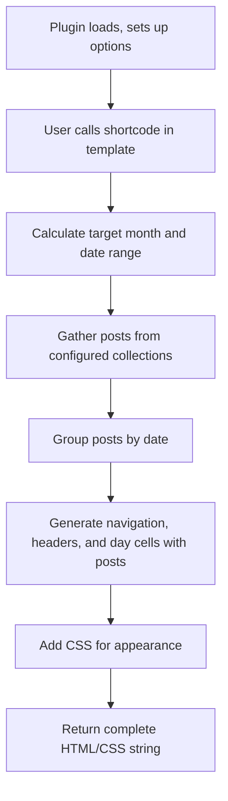

When working with publishing content in the future, the hardest thing is to keep track of when things are scheduled to go live. The Eleventy Publishing Calendar Plugin provides a visual calendar interface to help content creators and editors see their publishing schedule at a glance.

This post provides an explainer of the Eleventy Publishing Calendar Plugin, breaking down the code into its key components and explaining the process step by step.

## Overview

The plugin creates a graphical calendar view for Eleventy's publishing schedule. It gathers post metadata, groups posts by date, and generates an HTML grid calendar with navigation controls. The calendar displays post titles as links, along with the source markdown file names, and supports customization through options.

## Code Structure

### 1. Module Setup and Dependencies

The plugin starts by importing the Temporal API and defining default options.

```js
import { Temporal } from '@js-temporal/polyfill';

export default function(eleventyConfig, options = {}) {
  const defaultOptions = {
    collections: ['posts'],
    calendarClass: 'publishing-calendar',
    dayClass: 'calendar-day',
    postClass: 'calendar-post',
    navClass: 'calendar-nav',
    colors: {
      header: '#f0f0f0',
      today: '#e0f7fa',
      past: '#f5f5f5',
      future: '#fff'
    },
    layout: 'grid'
  };

  const opts = { ...defaultOptions, ...options };
```

This section:

- Imports Temporal for date handling (uses polyfill for compatibility)
- Defines default configuration options for styling and behavior
- Merges user-provided options with defaults

### Temporal API Note

While the Temporal API is at stage 3 in the TC39 process (meaning it's a candidate for inclusion in the ECMAScript standard), browser support is not yet ready for production use without a polyfill. This plugin uses the `@js-temporal/polyfill` package to ensure compatibility across different Node.js versions and future browser environments. As browser support improves, the polyfill dependency can be removed.

### 2. Shortcode Registration

The plugin registers a shortcode with Eleventy that generates the calendar HTML.

```javascript
eleventyConfig.addShortcode('publishingCalendar', function(month, year) {
  // ... implementation
});
```

The shortcode accepts optional `month` and `year` parameters to display a specific month.

### 3. Date Calculation

The shortcode calculates the target month and determines the date range for the calendar grid.

```javascript
const currentDate = Temporal.Now.plainDateISO();
const targetMonth = month ? Temporal.PlainYearMonth.from({ year: parseInt(year), month: parseInt(month) }) : Temporal.PlainYearMonth.from(currentDate);
const startOfMonth = targetMonth.toPlainDate({ day: 1 });
const endOfMonth = targetMonth.toPlainDate({ day: targetMonth.daysInMonth });
const startOfWeek = startOfMonth.subtract({ days: startOfMonth.dayOfWeek - 1 }); // Monday start
const endOfWeek = endOfMonth.add({ days: 7 - endOfMonth.dayOfWeek });
```

This code:

- Gets the current date using Temporal
- Determines the target month (current or specified)
- Calculates the start and end dates of the month
- Extends the range to include full weeks for a complete grid

### 4. Post Collection

The plugin collects posts from specified Eleventy collections.

```javascript
// Collect posts
const allPosts = [];
opts.collections.forEach(collectionName => {
  if (this.ctx.collections[collectionName]) {
    allPosts.push(...this.ctx.collections[collectionName]);
  }
});
```

This loops through the configured collections and gathers all posts into a single array.

### 5. Post Grouping

Posts are grouped by their publication date.

```javascript
// Group posts by date
const postsByDate = {};
allPosts.forEach(post => {
  if (post.date) {
    const postDate = Temporal.PlainDate.from(post.date);
    const dateKey = postDate.toString();
    if (!postsByDate[dateKey]) postsByDate[dateKey] = [];
    postsByDate[dateKey].push(post);
  }
});
```

This creates an object where keys are ISO date strings and values are arrays of posts for that date.

### 6. HTML Generation - Navigation

The plugin generates the calendar HTML, starting with navigation controls.

```javascript
let html = `<div class="${opts.calendarClass}">`;
html += `<div class="${opts.navClass}">`;
const prevMonth = targetMonth.subtract({ months: 1 });
const nextMonth = targetMonth.add({ months: 1 });
html += `<a href="?month=${prevMonth.month}&year=${prevMonth.year}">Previous</a>`;
html += `<h2>${targetMonth.toLocaleString('en', { month: 'long', year: 'numeric' })}</h2>`;
html += `<a href="?month=${nextMonth.month}&year=${nextMonth.year}">Next</a>`;
html += `</div>`;
```

This creates a navigation bar with Previous/Next links and the current month/year title.

### 7. HTML Generation - Grid Header

The calendar grid starts with day-of-week headers.

```javascript
html += `<div class="calendar-grid">`;
const daysOfWeek = ['Mon', 'Tue', 'Wed', 'Thu', 'Fri', 'Sat', 'Sun'];
daysOfWeek.forEach(day => {
  html += `<div class="calendar-header">${day}</div>`;
});
```

This adds headers for each day of the week, starting with Monday.

### 8. HTML Generation - Day Cells

The main calendar grid is generated by iterating through each day.

```javascript
let date = startOfWeek;
while (Temporal.PlainDate.compare(date, endOfWeek) <= 0) {
  const dateKey = date.toString();
  const isCurrentMonth = date.month === targetMonth.month;
  const isToday = Temporal.PlainDate.compare(date, currentDate) === 0;
  const isPast = Temporal.PlainDate.compare(date, currentDate) < 0;
  let dayClass = opts.dayClass;
  if (!isCurrentMonth) dayClass += ' other-month';
  if (isToday) dayClass += ' today';
  if (isPast) dayClass += ' past';
  else dayClass += ' future';

  html += `<div class="${dayClass}" style="background-color: ${isToday ? opts.colors.today : isPast ? opts.colors.past : opts.colors.future};">`;
  html += `<div class="day-number">${date.day}</div>`;
  if (postsByDate[dateKey]) {
    postsByDate[dateKey].forEach(post => {
      const fileName = post.inputPath.split('/').pop();
      const contentType = post.data?.contentType || 'post';
      html += `<div class="${opts.postClass} ${contentType}">`;
      html += `<a href="${post.url}">${post.data.title}</a>`;
      html += `<span class="filename">(${fileName})</span>`;
      html += `</div>`;
    });
  }
  html += `</div>`;
  date = date.add({ days: 1 });
}
```

For each day:

- Determines CSS classes based on whether it's in the current month, today, past, or future
- Sets background color accordingly
- Displays the day number
- Lists any posts for that day with links and file names
- Adds content type as an additional CSS class

## Styling

Basic CSS is included inline for the calendar appearance.

```javascript
const css = `
  <style>
    .${opts.calendarClass} {
      font-family: Arial, sans-serif;
    }
    .calendar-grid {
      display: grid;
      grid-template-columns: repeat(7, 1fr);
      gap: 1px;
    }
    .calendar-header {
      background-color: ${opts.colors.header};
      padding: 10px;
      text-align: center;
      font-weight: bold;
    }
    .${opts.dayClass} {
      min-height: 100px;
      padding: 5px;
      border: 1px solid #ccc;
    }
    .other-month {
      opacity: 0.5;
    }
    .${opts.postClass} {
      margin: 2px 0;
      font-size: 0.8em;
    }
    .filename {
      font-size: 0.7em;
      color: #666;
    }
    .${opts.navClass} {
      display: flex;
      justify-content: space-between;
      align-items: center;
      margin-bottom: 10px;
    }
  </style>
`;

return css + html;
```

This code provides basic styling for the calendar layout, colors, and typography.

## Performance Considerations

The code for the plugin collects all posts from the specified collections into a single array using the spread operator. This may have performance implications depending on the size of the collections.

### Post Collection Impact

Collecting all posts into a single array in the plugin has the following performance implications:

- **Memory Usage**: Creates a new array with references to all posts from specified collections. Eleventy already holds collections in memory, so this duplicates references. For small sites (<1000 posts), memory impact is negligible; for larger sites, it could increase consumption.
- **Build Time Overhead**: The spread operator and array operations add minor computational cost. However, this enables efficient single-pass processing for grouping and rendering.
- **Scalability Concerns**: Sites with 10,000+ posts might experience slower builds or higher memory usage. Consider incremental processing or date-based filtering for very large sites.

This approach favors simplicity over optimization, suitable for most Eleventy projects. Performance is typically acceptable unless dealing with exceptionally large content volumes.

## Process Flow

1. **Initialization**: Plugin loads, sets up options
2. **Shortcode Call**: User calls `` in template
3. **Date Setup**: Calculate target month and date range
4. **Data Collection**: Gather posts from configured collections
5. **Data Processing**: Group posts by date
6. **HTML Building**: Generate navigation, headers, and day cells with posts
7. **Styling**: Add CSS for appearance
8. **Output**: Return complete HTML/CSS string

The process flow can be visualized as follows:



## Customization

Users can customize appearance and behavior through the options object passed to `addPlugin()`. This allows changing colors, CSS classes, collections to include, and more.

For advanced customization, modify the plugin code or extend with additional shortcodes.
