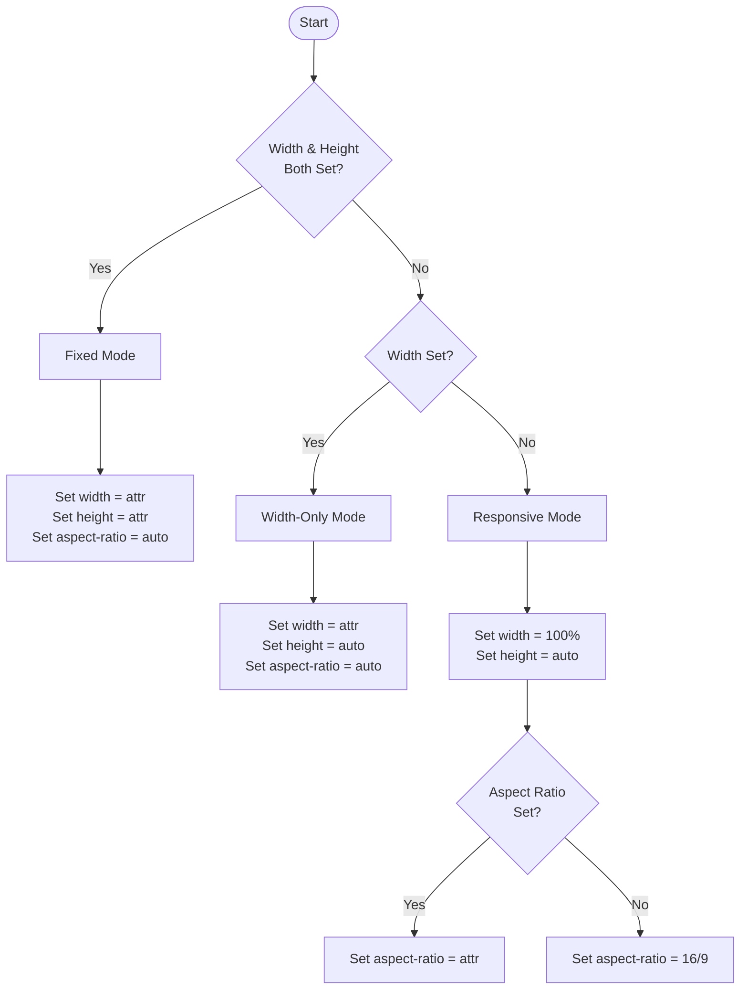
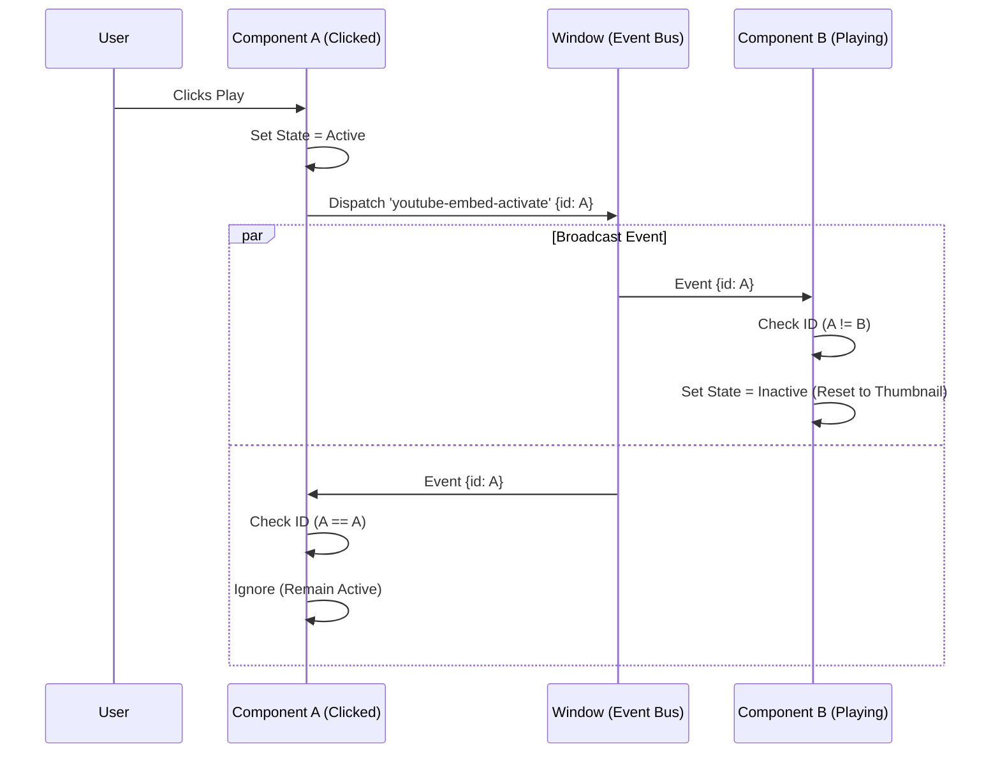

Standard YouTube embeds are notoriously heavy. A single `<iframe>` can download over 1MB of JavaScript and block the main thread, significantly hurting your **Largest Contentful Paint (LCP)**. Furthermore, if dimensions aren't strictly reserved, the embed causes **Cumulative Layout Shift (CLS)** as it loads.

This post documents the process of building a production-grade embed component that solves these issues using **Web Components** and **React**.

## **The Core Problems**

There are three issues with the standard YouTube embed that we need to solve:

Cumulative Layout Shift (CLS)
: When an iframe loads, it often starts with zero height and then "pops" open to its full size, pushing content down.
: * **Old Solution:** The "Padding Hack" (using padding-bottom: 56.25% on a wrapper).
: * **Modern Solution:** CSS aspect-ratio.


Page Weight (LCP & TBT)
: Loading the YouTube player API immediately—even if the user never plays the video—wastes bandwidth and CPU.
: * **Solution:** The **Facade Pattern**. We load a lightweight static image (thumbnail) and a fake play button. The heavy iframe is only injected when the user clicks.

Audio Chaos
: If a user plays one video, then scrolls down and plays another, both audio streams will play simultaneously.
: * **Solution:** **Singleton State**. When a component is activated, it broadcasts a message to all other components to pause or reset.

## The Strategy: "Lite Mode" (Facade Pattern)

Instead of rendering an `<iframe>` immediately, we render this lightweight HTML structure:

```html
<div class="container">
  <!-- 15KB image instead of 1MB JS -->
  
  <button class="play-btn" aria-label="Play Video"></button>
</div>
```

On click, we replace the inner HTML with the iframe, appending ?autoplay=1 so the video starts immediately.

## Handling Dimensions & Aspect Ratio

We implemented a priority system to handle both responsive and fixed layouts without layout shifts.

| Scenario | Attributes | Result |
| :----: | :---- | :---- |
| **Responsive** | &lt;embed<br>video-id="..."> | Width: 100%<br>Aspect Ratio: 16/9 |
| **Fixed** | &lt;embed<br>width="500"<br>height="300"> | Width: 500px<br>Height: 300px<br><br>Ratio ignored |
| **Custom Ratio** | &lt;embed<br>aspect-ratio="4/3"> | Width: 100%<br>Aspect Ratio: 4/3 |

### **Logic Flow**



### **Logic Description**

1. **If Width & Height exist:** Force fixed dimensions; set aspect-ratio: auto.
2. **If only Width exists:** Set width; reset height to auto.
3. **Default:** Set width to 100%; use provided aspect-ratio (default 16/9).

## The "Singleton" Pattern (Audio Management)

To prevent multiple videos playing at once, we use the window event bus.

1. **Listen:** Every component listens for a custom event (youtube-embed-activate).
2. **Dispatch:** When a user clicks a video, that component dispatches the event with its own unique ID.
3. **React:** If a component receives the event and the ID *doesn't* match its own, it resets its state to active: false (removing the iframe and showing the thumbnail again).

### **Event Bus Visualization**



## Web component implementation

Drop this into any project (Vanilla JS, Vue, Angular, Svelte) to use `<youtube-embed>`.

```ts
class YouTubeEmbed extends HTMLElement {
  private videoId = '';
  private boundResetHandler: (e: Event) => void;

  constructor() {
    super();
    this.attachShadow({ mode: 'open' });
    this.boundResetHandler = this.handleExternalActivation.bind(this);
  }

  connectedCallback() {
    this.videoId = this.getAttribute('video-id') || '';
    if (!this.videoId) return;

    // Dimension Logic
    const widthAttr = this.getAttribute('width');
    const heightAttr = this.getAttribute('height');
    const ratioAttr = this.getAttribute('aspect-ratio');

    let width = '100%';
    let height = 'auto';
    let ratio = '16 / 9';

    if (widthAttr && heightAttr) {
      width = this.formatDim(widthAttr);
      height = this.formatDim(heightAttr);
      ratio = 'auto';
    } else if (widthAttr && !heightAttr) {
      width = this.formatDim(widthAttr);
      height = 'auto';
      ratio = 'auto';
    } else {
      if (ratioAttr) ratio = ratioAttr;
      if (widthAttr) width = this.formatDim(widthAttr);
    }

    this.style.setProperty('--w', width);
    this.style.setProperty('--h', height);
    this.style.setProperty('--r', ratio);

    window.addEventListener('youtube-embed-activate', this.boundResetHandler);
    this.renderThumbnail();
  }

  disconnectedCallback() {
    window.removeEventListener('youtube-embed-activate', this.boundResetHandler);
  }

  formatDim(val: string) { return /^\d+$/.test(val) ? `${val}px` : val; }

  handleExternalActivation(e: Event) {
    if ((e as CustomEvent).detail.activeElement !== this) {
      this.renderThumbnail();
    }
  }

  renderThumbnail() {
    if (!this.shadowRoot) return;
    this.shadowRoot.innerHTML = `
      <style>
        :host { display: block; width: var(--w); height: var(--h); aspect-ratio: var(--r); background: #000; position: relative; cursor: pointer; overflow: hidden; }
        img { width: 100%; height: 100%; object-fit: cover; }
        .btn { position: absolute; top: 50%; left: 50%; transform: translate(-50%, -50%); width: 68px; height: 48px; background: rgba(33,33,33,0.8); border-radius: 12px; display: flex; align-items: center; justify-content: center; }
        :host(:hover) .btn { background: #f00; }
        .btn::before { content: ''; border: 10px solid transparent; border-left: 18px solid #fff; margin-left: 4px; }

        /* Reduced Motion */
        @media (prefers-reduced-motion: no-preference) {
          img { transition: opacity 0.3s ease; }
          .btn { transition: background 0.2s; }
        }
      </style>
      
      <div class="btn"></div>
    `;
    this.addEventListener('click', this.activate, { once: true });

    // Accessibility
    this.setAttribute('tabindex', '0');
    this.setAttribute('role', 'button');
    this.setAttribute('aria-label', `Play video`);
  }

  activate = () => {
    window.dispatchEvent(new CustomEvent('youtube-embed-activate', { detail: { activeElement: this } }));
    const autoplay = this.hasAttribute('autoplay') ? '?autoplay=1' : '';
    this.shadowRoot!.innerHTML = `
      <style>:host{display:block;width:var(--w);height:var(--h);aspect-ratio:var(--r);background:#000}iframe{width:100%;height:100%;border:none}</style>
      <iframe src="[https://www.youtube.com/embed/$](https://www.youtube.com/embed/$){this.videoId}${autoplay}" allow="autoplay; encrypted-media; picture-in-picture" allowfullscreen></iframe>
    `;
    // Focus Management
    this.shadowRoot!.querySelector('iframe')?.focus();
  }
}
customElements.define('youtube-embed', YouTubeEmbed);
```

### Web Component Usage

Web Components must have a closing tag. They cannot be self-closed.

```html
<!-- 1. Standard Responsive (16:9) -->
<youtube-embed video-id="dQw4w9WgXcQ" title="Rick Roll"></youtube-embed>

<!-- 2. Fixed Size (500x300) -->
<youtube-embed video-id="dQw4w9WgXcQ" width="500" height="300"></youtube-embed>

<!-- 3. Custom Aspect Ratio (Vertical Video) -->
<youtube-embed video-id="dQw4w9WgXcQ" aspect-ratio="9/16" width="300"></youtube-embed>

<!-- 4. Autoplay (Once clicked) -->
<youtube-embed video-id="dQw4w9WgXcQ" autoplay></youtube-embed>
```

## React component implementation

This component mirrors the logic of the Web Component but uses React hooks (useState, useEffect, useRef) for state management. It uses inline styles to avoid external CSS dependencies.

```jsx
import React, { useState, useEffect, useRef, CSSProperties } from 'react';

interface YouTubeEmbedProps {
  videoId: string;
  title?: string;
  width?: string;
  height?: string;
  aspectRatio?: string;
  autoplay?: boolean;
  className?: string;
  style?: CSSProperties;
}

export const YouTubeEmbed: React.FC<YouTubeEmbedProps> = ({
  videoId,
  title = 'YouTube Video',
  width,
  height,
  aspectRatio,
  autoplay = false,
  className,
  style,
}) => {
  const [isActive, setIsActive] = useState(false);
  const [isHovered, setIsHovered] = useState(false);
  const [reduceMotion, setReduceMotion] = useState(false);

  const uniqueId = useRef(Math.random().toString(36).substring(2, 9)).current;
  const iframeRef = useRef<HTMLIFrameElement>(null);

  // --- Dimension Logic ---
  const formatDim = (val?: string) => (val && /^\d+$/.test(val) ? `${val}px` : val);

  let finalWidth = '100%';
  let finalHeight = 'auto';
  let finalRatio = '16 / 9';

  if (width && height) {
    finalWidth = formatDim(width)!;
    finalHeight = formatDim(height)!;
    finalRatio = 'auto';
  } else if (width && !height) {
    finalWidth = formatDim(width)!;
    finalHeight = 'auto';
    finalRatio = 'auto';
  } else {
    if (aspectRatio) finalRatio = aspectRatio;
    if (width) finalWidth = formatDim(width)!;
  }

  // --- Singleton & Accessibility Logic ---
  useEffect(() => {
    // Live Reduced Motion Detection
    const mediaQuery = window.matchMedia('(prefers-reduced-motion: reduce)');
    setReduceMotion(mediaQuery.matches);

    const handleMotionChange = (e: MediaQueryListEvent) => {
      setReduceMotion(e.matches);
    };

    mediaQuery.addEventListener('change', handleMotionChange);

    // Singleton Logic (Interoperable with Web Component)
    const handleActivation = (e: Event) => {
      const customEvent = e as CustomEvent<{ activeElement?: any, id?: string }>;
      const senderId = customEvent.detail.id;
      if (senderId && senderId !== uniqueId) {
        setIsActive(false);
      }
    };

    window.addEventListener('youtube-embed-activate', handleActivation);

    return () => {
      mediaQuery.removeEventListener('change', handleMotionChange);
      window.removeEventListener('youtube-embed-activate', handleActivation);
    };
  }, [uniqueId]);

  // --- Focus Management ---
  useEffect(() => {
    if (isActive && iframeRef.current) {
      iframeRef.current.focus();
    }
  }, [isActive]);

  // --- Handlers ---
  const activatePlayer = () => {
    setIsActive(true);
    window.dispatchEvent(
      new CustomEvent('youtube-embed-activate', {
        detail: { id: uniqueId },
      })
    );
  };

  const handleKeyDown = (e: React.KeyboardEvent) => {
    if (e.key === 'Enter' || e.key === ' ') {
      e.preventDefault();
      activatePlayer();
    }
  };

  const containerStyle: CSSProperties = {
    display: 'block',
    position: 'relative',
    width: finalWidth,
    height: finalHeight,
    aspectRatio: finalRatio,
    backgroundColor: '#000',
    overflow: 'hidden',
    cursor: isActive ? 'auto' : 'pointer',
    ...style,
  };

  const playBtnStyle: CSSProperties = {
    position: 'absolute',
    top: '50%',
    left: '50%',
    transform: 'translate(-50%, -50%)',
    width: '68px',
    height: '48px',
    backgroundColor: isHovered ? '#f00' : 'rgba(33, 33, 33, 0.8)',
    borderRadius: '12px',
    transition: reduceMotion ? 'none' : 'background-color 0.2s',
    display: 'flex',
    alignItems: 'center',
    justifyContent: 'center',
    zIndex: 1,
  };

  const imgStyle: CSSProperties = {
    width: '100%',
    height: '100%',
    objectFit: 'cover',
    transition: reduceMotion ? 'none' : 'opacity 0.3s ease',
  };

  const iframeStyle: CSSProperties = {
    width: '100%',
    height: '100%',
    border: 'none',
  };

  return (
    <div
      className={className}
      style={containerStyle}
      role={!isActive ? 'button' : undefined}
      tabIndex={!isActive ? 0 : undefined}
      aria-label={!isActive ? `Play video: ${title}` : undefined}
      onClick={!isActive ? activatePlayer : undefined}
      onKeyDown={!isActive ? handleKeyDown : undefined}
      onMouseEnter={() => setIsHovered(true)}
      onMouseLeave={() => setIsHovered(false)}
    >
      {!isActive ? (
        <>
          
          <div style={playBtnStyle}>
            <svg viewBox="0 0 24 24" width="24" height="24" fill="#fff">
              <path d="M8 5v14l11-7z" />
            </svg>
          </div>
        </>
      ) : (
        <iframe
          ref={iframeRef}
          src={`https://www.youtube.com/embed/${videoId}${autoplay ? '?autoplay=1' : ''}`}
          title={title}
          allow="accelerometer; autoplay; clipboard-write; encrypted-media; gyroscope; picture-in-picture"
          allowFullScreen
          style={iframeStyle}
        />
      )}
    </div>
  );
};
```

### React usage

```jsx
// Standard Responsive (16:9)
<YouTubeEmbed videoId="dQw4w9WgXcQ" title="Rick Roll" />

// Fixed Size (500x300)
<YouTubeEmbed videoId="dQw4w9WgXcQ" width="500" height="300" />

// Custom Aspect Ratio (Vertical Video)
<YouTubeEmbed videoId="dQw4w9WgXcQ" aspectRatio="9 / 16" width="300" />

// Autoplay (Once clicked)
<YouTubeEmbed videoId="dQw4w9WgXcQ" autoplay />
```

## React 19 Integration Details

### Tag Syntax & Structure

While React conventions favor self-closing tags (e.g., `<YouTubeEmbed />`), JSX fully supports explicit closing tags (e.g., `<YouTubeEmbed></YouTubeEmbed>`). Using the explicit closing syntax allows you to maintain a consistent HTML structure across both Web Component and React implementations.

### React 19 Data Handling

As of version 19, React uses a runtime heuristic to determine if it should pass data to Custom Elements as properties or attributes. If a property is already defined on the element instance, it will use properties; otherwise, it will fallback to attributes.

* **Web Component Implementation**: The YouTubeEmbed custom element in this guide relies strictly on getAttribute() and does not define property setters. Therefore, React 19 will fallback to attributes. You must use kebab-case (e.g., video-id) when using the custom element in JSX.
* **React Component Implementation**: The standard React component requires camelCase props (e.g., videoId) as defined in its interface.

### React 19 Event Handling

React 19 registers an event listener on any custom element when binding a function to a property starting with on. This supports various casing styles (camelCase, kebab-case, etc.), allowing seamless integration of custom events like `onYoutubeEmbedActivate` if you chose to expose them as properties, though the standard `window.addEventListener` pattern used here works universally.
