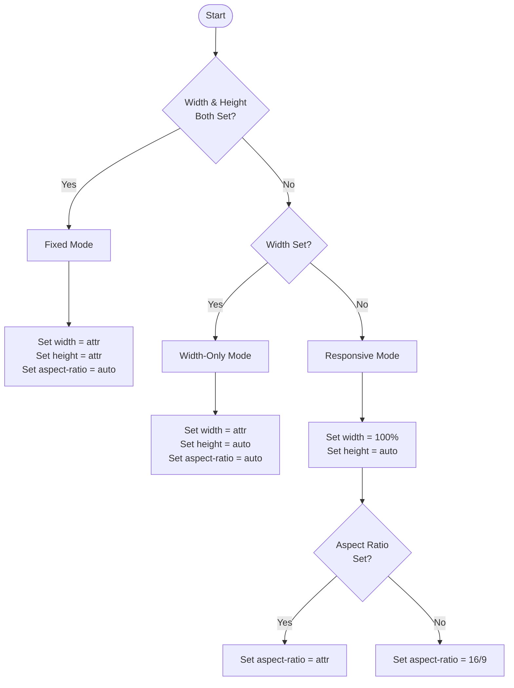
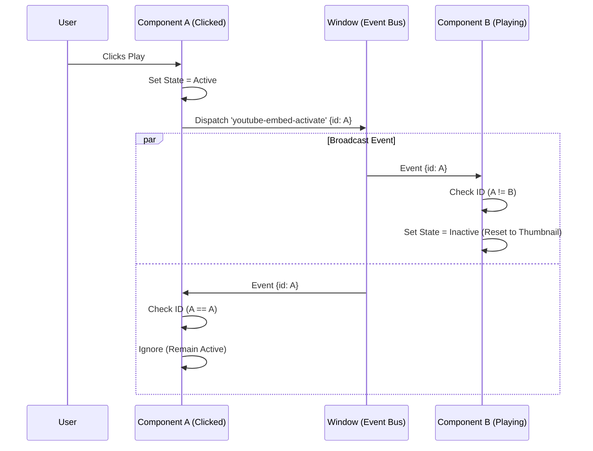

Standard YouTube embeds are notoriously heavy. A single `<iframe>` can download over 1MB of JavaScript and block the main thread, significantly hurting the Largest Contentful Paint (LCP). Furthermore, if dimensions are not strictly reserved, the embed causes Cumulative Layout Shift (CLS) as it loads.

This post documents the process of building a production-grade embed component that solves these issues using Web Components and React.

The core problems

Developers must address three primary issues with the standard YouTube embed:

Cumulative Layout Shift (CLS)
: When an iframe loads, it often starts with zero height and then "pops" open to its full size, pushing content down.
: * **Legacy solution**: The "Padding Hack" (using `padding-bottom: 56.25%` on a wrapper).
: * **Modern solution**: The CSS `aspect-ratio` property.

Page weight (LCP and TBT)
: Loading the YouTube player API immediately—even if the user never plays the video—wastes bandwidth and CPU resources.
: * **Solution**: The **Facade Pattern**. The application loads a lightweight static image (the video thumbnail) and a fake play button. The heavy iframe is only injected into the DOM when the user clicks.

Audio chaos
: If a user plays one video, then scrolls down and plays another, both audio streams will play simultaneously.
: * Solution: Singleton State. When a component activates, it broadcasts a message to all other components to pause or reset their state.

## The strategy: "Lite mode" (facade pattern)

Instead of rendering an `<iframe>` immediately, the component renders this lightweight HTML structure:

**HTML**

```html
<div class="container">
  <!-- 15KB image instead of 1MB of JavaScript -->
  
  <button class="play-btn" aria-label="Play Video"></button>
</div>
```

On click, the component replaces the inner HTML with the iframe, appending `?autoplay=1` to the source URL so the video starts immediately.

Handling dimensions and aspect ratio

This implementation uses a priority system to handle both responsive and fixed layouts without introducing layout shifts. Based on the HTML attributes or React props provided, the component calculates and applies specific CSS properties (width, height, and aspect-ratio) to its outer container.

| Scenario | Attributes Provided | Width | Height | Aspect Ratio |
| --- | --- | --- | --- | --- |
| Responsive | None (default) | 100% | auto | 16 / 9 |
| Fixed | width="500" height="300" | 500px | 300px | auto |
| Custom Ratio | aspect-ratio="4/3" | 100% | auto | 4 / 3 |

### Logic flow


```mermaid
flowchart TD
    Start([Start]) --> CheckFixed{Width & Height<br/>Both Set?}

    CheckFixed -- Yes --> FixedMode[Fixed Mode]
    FixedMode --> ApplyFixed["Set width = attr<br/>Set height = attr<br/>Set aspect-ratio = auto"]

    CheckFixed -- No --> CheckWidth{Width Set?}

    CheckWidth -- Yes --> WidthMode[Width-Only Mode]
    WidthMode --> ApplyWidth["Set width = attr<br/>Set height = auto<br/>Set aspect-ratio = auto"]

    CheckWidth -- No --> ResponsiveMode[Responsive Mode]
    ResponsiveMode --> SetDefaults["Set width = 100%<br/>Set height = auto"]
    SetDefaults --> CheckRatio{Aspect Ratio<br/>Set?}

    CheckRatio -- Yes --> ApplyCustomRatio[Set aspect-ratio = attr]
    CheckRatio -- No --> ApplyDefaultRatio[Set aspect-ratio = 16/9]
```

Logic description

* **If width and height exist**: Force fixed dimensions; set aspect-ratio: auto.
* **If only width exists**: Set width; reset height to auto.
* **Default**: Set width to 100%; use the provided aspect-ratio (defaults to 16/9).

## The singleton pattern (audio management)

To prevent multiple videos from playing at once, the architecture utilizes the global window event bus.

* **Listen**: Every component listens for a custom event (`youtube-embed-activate`).
* **Dispatch**: When a user clicks a video, that specific component dispatches the event with its own unique ID.
* **React**: If a component receives the event and the ID does not match its own, it resets its state to active: false (removing the iframe and displaying the thumbnail again).

### Event bus visualization


```mermaid
sequenceDiagram
    participant User
    participant CompA as Component A (Clicked)
    participant Window as Window (Event Bus)
    participant CompB as Component B (Playing)

    User->>CompA: Clicks Play
    CompA->>CompA: Set State = Active
    CompA->>Window: Dispatch 'youtube-embed-activate' {id: A}

    par Broadcast Event
        Window->>CompB: Event {id: A}
        CompB->>CompB: Check ID (A != B)
        CompB->>CompB: Set State = Inactive (Reset to Thumbnail)
    and
        Window->>CompA: Event {id: A}
        CompA->>CompA: Check ID (A == A)
        CompA->>CompA: Ignore (Remain Active)
    end
```

## Web Component implementation

Developers can drop this standalone component into any project (Vanilla JavaScript, Vue, Angular, Svelte) to use the <youtube-embed> tag natively.

### TypeScript

```ts
class YouTubeEmbed extends HTMLElement {
  private videoId = '';
  private boundResetHandler: (e: Event) => void;

  constructor() {
    super();
    this.attachShadow({ mode: 'open' });
    this.boundResetHandler = this.handleExternalActivation.bind(this);
  }

  connectedCallback(): void {
    this.videoId = this.getAttribute('video-id') || '';
    if (!this.videoId) return;

    // Dimension Logic
    const widthAttr = this.getAttribute('width');
    const heightAttr = this.getAttribute('height');
    const ratioAttr = this.getAttribute('aspect-ratio');

    let width = '100%';
    let height = 'auto';
    let ratio = '16 / 9';

    if (widthAttr && heightAttr) {
      width = this.formatDim(widthAttr);
      height = this.formatDim(heightAttr);
      ratio = 'auto';
    } else if (widthAttr && !heightAttr) {
      width = this.formatDim(widthAttr);
      height = 'auto';
      ratio = 'auto';
    } else {
      if (ratioAttr) ratio = ratioAttr;
      if (widthAttr) width = this.formatDim(widthAttr);
    }

    this.style.setProperty('--w', width);
    this.style.setProperty('--h', height);
    this.style.setProperty('--r', ratio);

    window.addEventListener('youtube-embed-activate', this.boundResetHandler);
    this.renderThumbnail();
  }

  disconnectedCallback(): void {
    window.removeEventListener('youtube-embed-activate', this.boundResetHandler);
  }

  formatDim(val: string): string {
    return /^\d+$/.test(val) ? `${val}px` : val;
  }

  handleExternalActivation(e: Event): void {
    if ((e as CustomEvent).detail.activeElement !== this) {
      this.renderThumbnail();
    }
  }

  renderThumbnail(): void {
    if (!this.shadowRoot) return;
    this.shadowRoot.innerHTML = `
      <style>
        :host { display: block; width: var(--w); height: var(--h); aspect-ratio: var(--r); background: #000; position: relative; cursor: pointer; overflow: hidden; }
        img { width: 100%; height: 100%; object-fit: cover; }
        .btn { position: absolute; top: 50%; left: 50%; transform: translate(-50%, -50%); width: 68px; height: 48px; background: rgba(33,33,33,0.8); border-radius: 12px; display: flex; align-items: center; justify-content: center; }
        :host(:hover) .btn { background: #f00; }
        .btn::before { content: ''; border: 10px solid transparent; border-left: 18px solid #fff; margin-left: 4px; }

        /* Reduced Motion */
        @media (prefers-reduced-motion: no-preference) {
          img { transition: opacity 0.3s ease; }
          .btn { transition: background 0.2s; }
        }
      </style>
      
      <div class="btn"></div>
    `;
    this.addEventListener('click', this.activate, { once: true });

    // Accessibility
    this.setAttribute('tabindex', '0');
    this.setAttribute('role', 'button');
    this.setAttribute('aria-label', `Play video`);
  }

  activate = (): void => {
    window.dispatchEvent(new CustomEvent('youtube-embed-activate', { detail: { activeElement: this } }));
    const autoplay = this.hasAttribute('autoplay') ? '?autoplay=1' : '';
    this.shadowRoot!.innerHTML = `
      <style>:host{display:block;width:var(--w);height:var(--h);aspect-ratio:var(--r);background:#000}iframe{width:100%;height:100%;border:none}</style>
      <iframe src="[https://www.youtube.com/embed/$](https://www.youtube.com/embed/$){this.videoId}${autoplay}" allow="autoplay; encrypted-media; picture-in-picture" allowfullscreen></iframe>
    `;
    // Focus Management
    this.shadowRoot!.querySelector('iframe')?.focus();
  }
}

customElements.define('youtube-embed', YouTubeEmbed);
```

### JavaScript

```js
class YouTubeEmbed extends HTMLElement {
  constructor() {
    super();
    this.videoId = '';
    this.attachShadow({ mode: 'open' });
    this.boundResetHandler = this.handleExternalActivation.bind(this);
  }

  connectedCallback() {
    this.videoId = this.getAttribute('video-id') || '';
    if (!this.videoId) return;

    // Dimension Logic
    const widthAttr = this.getAttribute('width');
    const heightAttr = this.getAttribute('height');
    const ratioAttr = this.getAttribute('aspect-ratio');

    let width = '100%';
    let height = 'auto';
    let ratio = '16 / 9';

    if (widthAttr && heightAttr) {
      width = this.formatDim(widthAttr);
      height = this.formatDim(heightAttr);
      ratio = 'auto';
    } else if (widthAttr && !heightAttr) {
      width = this.formatDim(widthAttr);
      height = 'auto';
      ratio = 'auto';
    } else {
      if (ratioAttr) ratio = ratioAttr;
      if (widthAttr) width = this.formatDim(widthAttr);
    }

    this.style.setProperty('--w', width);
    this.style.setProperty('--h', height);
    this.style.setProperty('--r', ratio);

    window.addEventListener('youtube-embed-activate', this.boundResetHandler);
    this.renderThumbnail();
  }

  disconnectedCallback() {
    window.removeEventListener('youtube-embed-activate', this.boundResetHandler);
  }

  formatDim(val) {
    return /^\d+$/.test(val) ? `${val}px` : val;
  }

  handleExternalActivation(e) {
    if (e.detail.activeElement !== this) {
      this.renderThumbnail();
    }
  }

  renderThumbnail() {
    if (!this.shadowRoot) return;
    this.shadowRoot.innerHTML = `
      <style>
        :host { display: block; width: var(--w); height: var(--h); aspect-ratio: var(--r); background: #000; position: relative; cursor: pointer; overflow: hidden; }
        img { width: 100%; height: 100%; object-fit: cover; }
        .btn { position: absolute; top: 50%; left: 50%; transform: translate(-50%, -50%); width: 68px; height: 48px; background: rgba(33,33,33,0.8); border-radius: 12px; display: flex; align-items: center; justify-content: center; }
        :host(:hover) .btn { background: #f00; }
        .btn::before { content: ''; border: 10px solid transparent; border-left: 18px solid #fff; margin-left: 4px; }

        /* Reduced Motion */
        @media (prefers-reduced-motion: no-preference) {
          img { transition: opacity 0.3s ease; }
          .btn { transition: background 0.2s; }
        }
      </style>
      
      <div class="btn"></div>
    `;
    this.addEventListener('click', this.activate, { once: true });

    // Accessibility
    this.setAttribute('tabindex', '0');
    this.setAttribute('role', 'button');
    this.setAttribute('aria-label', `Play video`);
  }

  activate = () => {
    window.dispatchEvent(new CustomEvent('youtube-embed-activate', { detail: { activeElement: this } }));
    const autoplay = this.hasAttribute('autoplay') ? '?autoplay=1' : '';
    this.shadowRoot.innerHTML = `
      <style>:host{display:block;width:var(--w);height:var(--h);aspect-ratio:var(--r);background:#000}iframe{width:100%;height:100%;border:none}</style>
      <iframe src="[https://www.youtube.com/embed/$](https://www.youtube.com/embed/$){this.videoId}${autoplay}" allow="autoplay; encrypted-media; picture-in-picture" allowfullscreen></iframe>
    `;
    // Focus Management
    const iframe = this.shadowRoot.querySelector('iframe');
    if (iframe) iframe.focus();
  }
}

customElements.define('youtube-embed', YouTubeEmbed);
```

### Web Component usage

Web Components must have a closing tag. They cannot be self-closed.

**HTML**

```html
<!-- 1. Standard Responsive (16:9) -->
<youtube-embed video-id="dQw4w9WgXcQ" title="Rick Roll"></youtube-embed>

<!-- 2. Fixed Size (500x300) -->
<youtube-embed video-id="dQw4w9WgXcQ" width="500" height="300"></youtube-embed>

<!-- 3. Custom Aspect Ratio (Vertical Video) -->
<youtube-embed video-id="dQw4w9WgXcQ" aspect-ratio="9/16" width="300"></youtube-embed>

<!-- 4. Autoplay (Once clicked) -->
<youtube-embed video-id="dQw4w9WgXcQ" autoplay></youtube-embed>
```

## React Component implementation

This component mirrors the logic of the Web Component but uses React hooks (useState, useEffect, useRef) for state management. It uses inline styles to avoid external CSS dependencies.

**TypeScript (YouTubeEmbed.tsx)**

```ts
import React, { useState, useEffect, useRef, CSSProperties } from 'react';

interface YouTubeEmbedProps {
  videoId: string;
  title?: string;
  width?: string;
  height?: string;
  aspectRatio?: string;
  autoplay?: boolean;
  className?: string;
  style?: CSSProperties;
}

export const YouTubeEmbed: React.FC<YouTubeEmbedProps> = ({
  videoId,
  title = 'YouTube Video',
  width,
  height,
  aspectRatio,
  autoplay = false,
  className,
  style,
}) => {
  const [isActive, setIsActive] = useState(false);
  const [isHovered, setIsHovered] = useState(false);
  const [reduceMotion, setReduceMotion] = useState(false);

  const uniqueId = useRef(Math.random().toString(36).substring(2, 9)).current;
  const iframeRef = useRef<HTMLIFrameElement>(null);

  // --- Dimension Logic ---
  const formatDim = (val?: string) => (val && /^\d+$/.test(val) ? `${val}px` : val);

  let finalWidth = '100%';
  let finalHeight = 'auto';
  let finalRatio = '16 / 9';

  if (width && height) {
    finalWidth = formatDim(width)!;
    finalHeight = formatDim(height)!;
    finalRatio = 'auto';
  } else if (width && !height) {
    finalWidth = formatDim(width)!;
    finalHeight = 'auto';
    finalRatio = 'auto';
  } else {
    if (aspectRatio) finalRatio = aspectRatio;
    if (width) finalWidth = formatDim(width)!;
  }

  // --- Singleton & Accessibility Logic ---
  useEffect(() => {
    // Live Reduced Motion Detection
    const mediaQuery = window.matchMedia('(prefers-reduced-motion: reduce)');
    setReduceMotion(mediaQuery.matches);

    const handleMotionChange = (e: MediaQueryListEvent) => {
      setReduceMotion(e.matches);
    };

    mediaQuery.addEventListener('change', handleMotionChange);

    // Singleton Logic (Interoperable with Web Component)
    const handleActivation = (e: Event) => {
      const customEvent = e as CustomEvent<{ activeElement?: any, id?: string }>;
      const senderId = customEvent.detail.id;
      if (senderId && senderId !== uniqueId) {
        setIsActive(false);
      }
    };

    window.addEventListener('youtube-embed-activate', handleActivation);

    return () => {
      mediaQuery.removeEventListener('change', handleMotionChange);
      window.removeEventListener('youtube-embed-activate', handleActivation);
    };
  }, [uniqueId]);

  // --- Focus Management ---
  useEffect(() => {
    if (isActive && iframeRef.current) {
      iframeRef.current.focus();
    }
  }, [isActive]);

  // --- Handlers ---
  const activatePlayer = () => {
    setIsActive(true);
    window.dispatchEvent(
      new CustomEvent('youtube-embed-activate', {
        detail: { id: uniqueId },
      })
    );
  };

  const handleKeyDown = (e: React.KeyboardEvent) => {
    if (e.key === 'Enter' || e.key === ' ') {
      e.preventDefault();
      activatePlayer();
    }
  };

  const containerStyle: CSSProperties = {
    display: 'block',
    position: 'relative',
    width: finalWidth,
    height: finalHeight,
    aspectRatio: finalRatio,
    backgroundColor: '#000',
    overflow: 'hidden',
    cursor: isActive ? 'auto' : 'pointer',
    ...style,
  };

  const playBtnStyle: CSSProperties = {
    position: 'absolute',
    top: '50%',
    left: '50%',
    transform: 'translate(-50%, -50%)',
    width: '68px',
    height: '48px',
    backgroundColor: isHovered ? '#f00' : 'rgba(33, 33, 33, 0.8)',
    borderRadius: '12px',
    transition: reduceMotion ? 'none' : 'background-color 0.2s',
    display: 'flex',
    alignItems: 'center',
    justifyContent: 'center',
    zIndex: 1,
  };

  const imgStyle: CSSProperties = {
    width: '100%',
    height: '100%',
    objectFit: 'cover',
    transition: reduceMotion ? 'none' : 'opacity 0.3s ease',
  };

  const iframeStyle: CSSProperties = {
    width: '100%',
    height: '100%',
    border: 'none',
  };

  return (
    <div
      className={className}
      style={containerStyle}
      role={!isActive ? 'button' : undefined}
      tabIndex={!isActive ? 0 : undefined}
      aria-label={!isActive ? `Play video: ${title}` : undefined}
      onClick={!isActive ? activatePlayer : undefined}
      onKeyDown={!isActive ? handleKeyDown : undefined}
      onMouseEnter={() => setIsHovered(true)}
      onMouseLeave={() => setIsHovered(false)}
    >
      {!isActive ? (
        <>
          
          <div style={playBtnStyle}>
            <svg viewBox="0 0 24 24" width="24" height="24" fill="#fff">
              <path d="M8 5v14l11-7z" />
            </svg>
          </div>
        </>
      ) : (
        <iframe
          ref={iframeRef}
          src={`https://www.youtube.com/embed/${videoId}${autoplay ? '?autoplay=1' : ''}`}
          title={title}
          allow="accelerometer; autoplay; clipboard-write; encrypted-media; gyroscope; picture-in-picture"
          allowFullScreen
          style={iframeStyle}
        />
      )}
    </div>
  );
};
```

**JavaScript (YouTubeEmbed.jsx)**

```jsx
import React, { useState, useEffect, useRef } from 'react';

export const YouTubeEmbed = ({
  videoId,
  title = 'YouTube Video',
  width,
  height,
  aspectRatio,
  autoplay = false,
  className,
  style,
}) => {
  const [isActive, setIsActive] = useState(false);
  const [isHovered, setIsHovered] = useState(false);
  const [reduceMotion, setReduceMotion] = useState(false);

  const uniqueId = useRef(Math.random().toString(36).substring(2, 9)).current;
  const iframeRef = useRef(null);

  // --- Dimension Logic ---
  const formatDim = (val) => (val && /^\d+$/.test(val) ? `${val}px` : val);

  let finalWidth = '100%';
  let finalHeight = 'auto';
  let finalRatio = '16 / 9';

  if (width && height) {
    finalWidth = formatDim(width);
    finalHeight = formatDim(height);
    finalRatio = 'auto';
  } else if (width && !height) {
    finalWidth = formatDim(width);
    finalHeight = 'auto';
    finalRatio = 'auto';
  } else {
    if (aspectRatio) finalRatio = aspectRatio;
    if (width) finalWidth = formatDim(width);
  }

  // --- Singleton & Accessibility Logic ---
  useEffect(() => {
    // Live Reduced Motion Detection
    const mediaQuery = window.matchMedia('(prefers-reduced-motion: reduce)');
    setReduceMotion(mediaQuery.matches);

    const handleMotionChange = (e) => {
      setReduceMotion(e.matches);
    };

    mediaQuery.addEventListener('change', handleMotionChange);

    // Singleton Logic (Interoperable with Web Component)
    const handleActivation = (e) => {
      const senderId = e.detail && e.detail.id;
      if (senderId && senderId !== uniqueId) {
        setIsActive(false);
      }
    };

    window.addEventListener('youtube-embed-activate', handleActivation);

    return () => {
      mediaQuery.removeEventListener('change', handleMotionChange);
      window.removeEventListener('youtube-embed-activate', handleActivation);
    };
  }, [uniqueId]);

  // --- Focus Management ---
  useEffect(() => {
    if (isActive && iframeRef.current) {
      iframeRef.current.focus();
    }
  }, [isActive]);

  // --- Handlers ---
  const activatePlayer = () => {
    setIsActive(true);
    window.dispatchEvent(
      new CustomEvent('youtube-embed-activate', {
        detail: { id: uniqueId },
      })
    );
  };

  const handleKeyDown = (e) => {
    if (e.key === 'Enter' || e.key === ' ') {
      e.preventDefault();
      activatePlayer();
    }
  };

  const containerStyle = {
    display: 'block',
    position: 'relative',
    width: finalWidth,
    height: finalHeight,
    aspectRatio: finalRatio,
    backgroundColor: '#000',
    overflow: 'hidden',
    cursor: isActive ? 'auto' : 'pointer',
    ...style,
  };

  const playBtnStyle = {
    position: 'absolute',
    top: '50%',
    left: '50%',
    transform: 'translate(-50%, -50%)',
    width: '68px',
    height: '48px',
    backgroundColor: isHovered ? '#f00' : 'rgba(33, 33, 33, 0.8)',
    borderRadius: '12px',
    transition: reduceMotion ? 'none' : 'background-color 0.2s',
    display: 'flex',
    alignItems: 'center',
    justifyContent: 'center',
    zIndex: 1,
  };

  const imgStyle = {
    width: '100%',
    height: '100%',
    objectFit: 'cover',
    transition: reduceMotion ? 'none' : 'opacity 0.3s ease',
  };

  const iframeStyle = {
    width: '100%',
    height: '100%',
    border: 'none',
  };

  return (
    <div
      className={className}
      style={containerStyle}
      role={!isActive ? 'button' : undefined}
      tabIndex={!isActive ? 0 : undefined}
      aria-label={!isActive ? `Play video: ${title}` : undefined}
      onClick={!isActive ? activatePlayer : undefined}
      onKeyDown={!isActive ? handleKeyDown : undefined}
      onMouseEnter={() => setIsHovered(true)}
      onMouseLeave={() => setIsHovered(false)}
    >
      {!isActive ? (
        <>
          
          <div style={playBtnStyle}>
            <svg viewBox="0 0 24 24" width="24" height="24" fill="#fff">
              <path d="M8 5v14l11-7z" />
            </svg>
          </div>
        </>
      ) : (
        <iframe
          ref={iframeRef}
          src={`https://www.youtube.com/embed/${videoId}${autoplay ? '?autoplay=1' : ''}`}
          title={title}
          allow="accelerometer; autoplay; clipboard-write; encrypted-media; gyroscope; picture-in-picture"
          allowFullScreen
          style={iframeStyle}
        />
      )}
    </div>
  );
};
```

### React usage

**JSX**

```jsx
// Standard Responsive (16:9)
<YouTubeEmbed videoId="dQw4w9WgXcQ" title="Rick Roll" />

// Fixed Size (500x300)
<YouTubeEmbed videoId="dQw4w9WgXcQ" width="500" height="300" />

// Custom Aspect Ratio (Vertical Video)
<YouTubeEmbed videoId="dQw4w9WgXcQ" aspectRatio="9 / 16" width="300" />

// Autoplay (Once clicked)
<YouTubeEmbed videoId="dQw4w9WgXcQ" autoplay />
```

## React 19 integration details

### Tag syntax and structure

While React conventions favor self-closing tags (e.g., `<YouTubeEmbed />`), JSX fully supports explicit closing tags (e.g., `<YouTubeEmbed></YouTubeEmbed>`). Using the explicit closing syntax allows developers to maintain a consistent HTML structure across both Web Component and React implementations.

### React 19 data handling

As of version 19, React uses a runtime heuristic to determine if it should pass data to Custom Elements as properties or attributes. If a property is already defined on the element instance, it utilizes properties; otherwise, it falls back to attributes.

* **Web Component implementation**: The YouTubeEmbed custom element in this guide relies strictly on getAttribute() and does not define property setters. Therefore, React 19 falls back to attributes. Developers must use kebab-case (e.g., video-id) when utilizing the custom element in JSX.
* **React Component implementation**: The standard React component requires camelCase props (e.g., videoId) as defined in its interface.

### React 19 event handling

React 19 registers an event listener on any custom element when binding a function to a property starting with on. This supports various casing styles (camelCase, kebab-case, etc.), allowing seamless integration of custom events like `onYoutubeEmbedActivate` if they are exposed as properties. However, the standard `window.addEventListener` pattern used in this guide functions universally across all versions.
