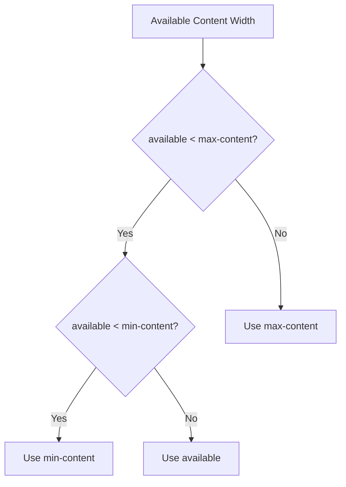

There are two ways to measure content in CSS.

Explicit measurements are what we're most familiar with. These are the pixels, rems and ems.

Intrinsic sizes don't provide exact dimensions but size elements based on their content.

This post will cover these intrinsic, content-based, measurement units

## min-content

The `min-content` value is the intrinsic minimum width, which means that it’s equal to the width of the element’s content longest word.

According to the CSS Working Group:

> The inline size that would fit around its contents if all soft wrap opportunities within the box were taken.

<iframe
  height="511.51220703125" style="width: 100%;" scrolling="no" title="min-content and max-content" src="https://codepen.io/caraya/embed/OJGvjwp?default-tab=result" frameborder="no" loading="lazy" allowtransparency="true" allowfullscreen="true">
  See the Pen <a href="https://codepen.io/caraya/pen/OJGvjwp">
  min-content and max-content</a> by Carlos Araya (<a href="https://codepen.io/caraya">@caraya</a>)
  on <a href="https://codepen.io">CodePen</a>.
</iframe>

## max-content

The max-content value represents the intrinsic preferred width, which means that it’s equal to the width of the content, regardless of how wide the content is.

<iframe
  height="381.57684326171875" style="width: 100%;" scrolling="no" title="max-content" src="https://codepen.io/caraya/embed/ZEZxXXg?default-tab=result" frameborder="no" loading="lazy" allowtransparency="true" allowfullscreen="true">
  See the Pen <a href="https://codepen.io/caraya/pen/ZEZxXXg">
  max-content</a> by Carlos Araya (<a href="https://codepen.io/caraya">@caraya</a>)
  on <a href="https://codepen.io">CodePen</a>.
</iframe>

## fit-content

It’s a combination of using min-content and max-content.

The formula was rather hard for me to understand but it boils down to this:

fit-content uses max-content, unless available < max-content, then it uses available. Unless available < min-content, then it uses min-content.

And in a diagram looks like this:

If I understood it correctly, `fit-content` will not run past the width or inline size of the closest ancestor with a `width` or `inline-size` value.

## Code Examples

The first example that comes to mind when looking at intrinsic sizing is how to make the size of a caption match the size of the image inside the figure.

<iframe
	height="682.2933349609375" style="width: 100%;" scrolling="no" title="Caption matching figure/image width" src="https://codepen.io/caraya/embed/rNbdOEd?default-tab=result" frameborder="no" loading="lazy" allowtransparency="true" allowfullscreen="true">
  See the Pen <a href="https://codepen.io/caraya/pen/rNbdOEd">
  Caption matching figure/image width</a> by Carlos Araya (<a href="https://codepen.io/caraya">@caraya</a>)
  on <a href="https://codepen.io">CodePen</a>.
</iframe>

You can also experiment with the intrinsic sizing of text when working with creative designs or custom components.

## Links And Resources

* [CSS Box Sizing Module Level 3](https://www.w3.org/TR/css-sizing-3/) &mdash; W3C
* [Intrinsic Size Determination](https://www.w3.org/TR/css-sizing-3/) &mdash; W3C
* [Intrinsic Sizing In CSS](https://ishadeed.com/article/intrinsic-sizing-in-css/) &mdash; Ahmad Shadeed
