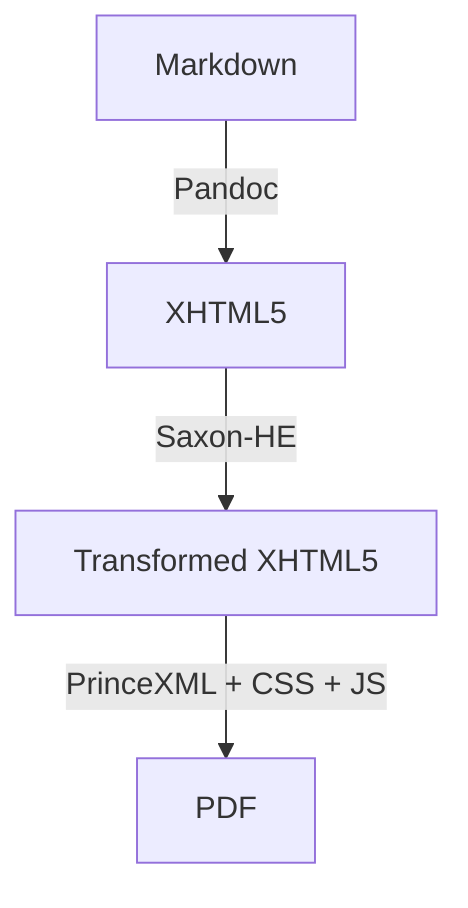

In [From Markdown to PDF: Pandoc](/from-markdown-to-pdf-pandoc/), we explored how to use Pandoc to convert Markdown into PDF. While Pandoc is a powerful tool, it has limitations in terms of styling and layout control; it uses LaTeX under the hood, which can be difficult to customize and often locks dependencies into what's available in the TeX ecosystem.

> **Note:** This post does not cover installation or setup of Pandoc, Saxon-HE, or PrinceXML. Please ensure these tools are installed and available in your environment before proceeding.

Below is a summary diagram of the pipeline stages and file flow:



---

## When to use this pipeline


Use this pipeline if you:

* Need precise control over PDF layout and styling using CSS Paged Media.
* Want to avoid the complexity and limitations of LaTeX-based workflows.
* Require custom markup transformations (e.g., for embeds or advanced code highlighting).
* Are comfortable working with command-line tools and intermediate file management.

This approach is ideal for technical documentation, books, or any Markdown content where professional print quality and customizability are priorities.

This post presents an alternative pipeline that leverages a different set of tools to achieve more precise control over the final PDF output. The pipeline consists of:

1. **[Pandoc](https://pandoc.org/)**: Converts Markdown to a clean XHTML5 format.
2. **[Saxon-HE](https://www.saxonica.com/download/java.xml)**: Applies XSLT 3.0 transformations to clean up the markup and prepare it for PDF generation.
3. **[PrinceXML](https://www.princexml.com/)**: Renders the final PDF using CSS for styling and layout.

The post will not cover the installation and setup of these tools, but will focus on the architecture of the pipeline, the key decisions made, and the source code for each component.

## Pipeline architecture

The pipeline functions as a multi-stage transformation process coordinated by a Bash shell script. It ensures structural integrity, modern syntax highlighting, and precise typographic control.

### Core workflow stages

- **Conversion (Pandoc):** Transforms Markdown into a standalone XHTML5 document.
- **Transformation (Saxon-HE):** Applies an XSLT 3.0 stylesheet to clean the markup, handle specialized components (YouTube, CodePen), and inject a custom JavaScript highlighting bridge.
- **Highlighting ([Highlight.js](https://highlightjs.org/)):** Executes a pure-string highlighting pass within the PrinceXML DOM to apply Solarized themes.
- **Rendering (PrinceXML):** Generates the final PDF using CSS Paged Media standards.

!!!note  **Technical Note**
The pipeline utilizes Saxon-HE 12.9, which provides basic support for XSLT 3.0, XPath 3.1, and XQuery 3.1 features. Advanced features like streaming and JSON processing are not supported, but the pipeline's requirements are fully met by the supported subset.
!!!

## Key architectural decisions

### The "string-bypass" highlighting method


Standard highlight.js execution often causes layout crashes in PrinceXML because the engine's DOM simulator struggles with complex element mutations. To solve this, we implemented a manual bridge:

* **Extraction:** Extract the raw text content from `<code>` blocks using `textContent`.
* **String Processing:** Pass the text to `hljs.highlight()` as a string, avoiding direct DOM manipulation by the library.
* **DOM Purging:** Forcefully clear the original DOM nodes to prevent character duplication (the "4044" bug).
* **Injection:** Inject the resulting highlighted HTML string back into the element.
* **Class Restoration:** Manually append the `.hljs` class. This is critical because bypassing the library's standard element-processor also bypasses the step where it attaches the CSS hooks required for theme backgrounds.

### ES5 transpilation

Modern libraries use ES6+ syntax (classes, arrow functions) which PrinceXML's JavaScript engine (in versions like 16.x) does not support. We utilize a transpiled `highlight.es5.js` version to ensure runtime stability.

## Component source code

### `build-pdf.sh`

The `build-pdf.sh` script is the central orchestrator for the Markdown-to-PDF pipeline. It automates the multi-stage transformation process, ensuring that each tool in the pipeline is invoked in the correct order and that all intermediate files are managed cleanly. The script is designed to be run from the command line, accepting one or more Markdown files as input arguments.

**Key responsibilities:**

* **Input validation:** The script checks that at least one Markdown file is provided and verifies the existence of each input file before processing.
* **Directory management:** It creates (if necessary) dedicated directories for intermediate XHTML files and final PDF outputs, keeping the workspace organized and avoiding accidental overwrites.
* **Stage 1 – Pandoc conversion:** For each Markdown file, Pandoc is invoked to produce a standalone XHTML5 file. Syntax highlighting is handled later in the pipeline. The output is a clean, CSS-free XHTML5 file suitable for further transformation.
* **Stage 2 – XSLT transformation (Saxon-HE):** The script applies an XSLT 3.0 stylesheet using Saxon-HE to post-process the XHTML5. This step cleans up the markup, handles custom components (such as YouTube and CodePen embeds), and prepares the document structure for PDF rendering.
* **Stage 3 – PDF rendering (PrinceXML):** The transformed XHTML5 is passed to PrinceXML, which applies the final CSS for print styling and generates the PDF. The `--baseurl` flag ensures that any local assets (images, stylesheets, etc.) are correctly resolved. JavaScript is enabled to support runtime syntax highlighting and other dynamic features.
* **Logging and error handling:** The script outputs progress messages for each stage and logs PrinceXML debug information to `prince-build.log`. If a source file is missing, it prints a warning and continues processing the remaining files.

This modular approach allows for easy debugging, extension, and customization of the pipeline. By separating concerns into distinct stages and managing all intermediate artifacts, the script ensures reproducibility and clarity in the PDF generation process.

```bash
#!/usr/bin/env bash

set -euo pipefail

if [[ "$#" -eq 0 ]]; then
  echo "Usage: $0 <file1.md> [file2.md ...]"
  exit 1
fi

readonly SAXON_JAR="/usr/local/java/saxon-he-12.9.jar"
readonly XSLT_SCRIPT="./transform.xslt"
readonly CSS_FILE="./print-styles.css"

readonly INTERMEDIATE_DIR="converted-html"
mkdir -p "${INTERMEDIATE_DIR}"

readonly OUTPUT_DIR="pdf-output"
mkdir -p "${OUTPUT_DIR}"

for INPUT_MD in "$@"; do
  if [[ ! -f "$INPUT_MD" ]]; then
    echo "⚠️ Warning: Source file '${INPUT_MD}' not found!"
    continue
  fi

  FILE_NAME=$(basename "${INPUT_MD}")
  BASE_NAME="${FILE_NAME%.md}"

  XHTML_FILE="${INTERMEDIATE_DIR}/${BASE_NAME}.xhtml"
  TRANSFORMED_FILE="${INTERMEDIATE_DIR}/${BASE_NAME}-transformed.xhtml"
  PDF_FILE="${OUTPUT_DIR}/${BASE_NAME}.pdf"

  echo "---------------------------------------------------"
  echo "🚀 Processing: ${INPUT_MD}"

  # 1. Pandoc: Markdown to strict XHTML with CSS link injected
  echo "[1/3] Converting Markdown to XHTML..."
  pandoc "${INPUT_MD}" \
    --from=markdown \
    --to=html5 \
    --standalone \
    -M document-css=false \
    --syntax-highlighting=none \
    -o "${XHTML_FILE}"

  # 2. Saxon: Apply structural XSLT
  echo "[2/3] Applying XSLT 3.0 transformations..."
  java -jar "${SAXON_JAR}" -s:"${XHTML_FILE}" -xsl:"${XSLT_SCRIPT}" -o:"${TRANSFORMED_FILE}"

  # 3. PrinceXML: Generate PDF
  echo "[3/3] Generating PDF with PrinceXML..."
  prince "${TRANSFORMED_FILE}" \
    --baseurl="file://$(pwd)/" \
    --javascript \
    --style="${CSS_FILE}" \
    --debug --log="prince-build.log" \
    -o "${PDF_FILE}"

  echo "✅ Done! Created ${PDF_FILE}"
done
```

### `transform.xslt`

The XSLT stylesheet transforms the XHTML5 output from Pandoc into a plain XHTML5 format that will be used for PDF generation. It includes custom templates to handle specific elements and attributes.

* Removes unnecessary elements like search forms and navigation.
* Replaces YouTube embeds with a static image and link.
* Removes Codepen iframes and replaces them with a link to the original pen.
* Cleans up code blocks to ensure proper syntax highlighting without duplication issues.

This project currently uses Saxon-HE 12.9, which provides basic support for XSLT 3.0, and XPath and XQuery 3.1 features.

Some advanced features like streaming or JSON handling are not supported in the HE version and require Saxon-PE or EE. However, the transformations in this stylesheet are designed to work within the capabilities of Saxon-HE, so you should be able to achieve your goals without needing to upgrade.

### `print-styles.css`

```css
/*
  CSS Print Stylesheet for Blog to Print Project
  Author: Carlos
  Description: Optimized for PrinceXML using Recursive Variable Font
*/

/* 1. Root Styles */
:root {
  /* Defaults */
  --font-family: "Recursive", Verdana, sans-serif;
  --font-family-system: -apple-system, system-ui, sans-serif;
  --font-family-monospace: "Recursive", "Ubuntu Mono", monospace, monospace;

  --color-gray-20: oklch(82.68% 0.015 286.06);
  --color-gray-50: oklch(37.46% 0.025 288.16);
  --color-gray-90: oklch(32.11% 0 0);

  --color-white: oklch(99.72% 0.0028 84.5587270007485);
  --color-black: oklch(24.69% 0.006 314.7);
  --color-blue: oklch(0.31 0.2 265);

  --accent-color: oklch(55.69% 0.2 12.21);
  --code-color: oklch(55.2% 0.228 351.47 / 94%);

  /* Typography */
  --base-font-size: 1.25;
  --base-line-height: 1.5;
  --base-font-weight: 400;
  --h1-size: 3.052;
  --h2-size: 2.441;
  --h3-size: 1.953;
  --h4-size: 1.563;
  --h5-size: 1.25;
  --heading-weight: 700;
  --heading-line-height: 1.3;
  --small-size: 0.8;
}

/* 2. Font Settings */
@font-face {
  font-family: "Recursive";
  src: url("fonts/recursive.woff2") format("woff2");
  font-display: swap;
  font-weight: 300 1000;
}

/* Monospace font */
@font-face {
  font-family: "Ubuntu Mono";
  src: url("fonts/ubuntu-mono.woff2") format("true-type");
  font-display: swap;
}

/* If class is applied, update custom property and
apply modern font-variant-* when supported */
.recursive-sans-linear-light-dnom {
  --recursive-sans-linear-light-dnom: "dnom" on;
}

.recursive-sans-linear-light-frac {
  --recursive-sans-linear-light-frac: "frac" on;
}

@supports (font-variant-numeric: diagonal-fractions) {
  .recursive-sans-linear-light-frac {
    --recursive-sans-linear-light-frac: "____";
    font-variant-numeric: diagonal-fractions;
  }
}

.recursive-sans-linear-light-numr {
  --recursive-sans-linear-light-numr: "numr" on;
}

/* Apply current state of all custom properties
  whenever a class is being applied */
.recursive-sans-linear-light-dnom,
.recursive-sans-linear-light-frac,
.recursive-sans-linear-light-numr {
  font-variation-settings: var(--recursive-sans-linear-light-dnom),
    var(--recursive-sans-linear-light-frac),
    var(--recursive-sans-linear-light-numr);
}


html {
  font-size: calc(var(--base-font-size) * 1rem);
}

body {
  font-family: var(--font-family);
  font-weight: var(--base-font-weight);
  line-height: var(--base-line-height);
  hyphens: auto;
  counter-reset: page 1;
}

/* Apply the named page to the article body */
body[data-type="article"] {
  page: article;
}

/* 3. Page Layout and Structure */

/* Global Base Page */
@page {
  size: 8.5in 11in;
  margin: 0.5in 1in;
  counter-reset: footnote;

  @footnote {
    counter-increment: footnote;
    float: bottom;
    column-span: all;
    height: auto;
  }

  @bottom-center {
    content: counter(page);
    font-style: italic;
    vertical-align: top;
    padding-top: 0.3em;
    border-top: thin solid black;
    margin-top: 0.7em;
    font-family: var(--font-family);
    font-variation-settings: "MONO" 1, "CASL" 0, "wght" 400, "slnt" -15, "CRSV" 0.501;
    font-size: 0.7em;
  }
}

/* Inherits from default @page */
@page {
  @top-right {
    content: string(title);
    font-style: italic;
    vertical-align: bottom;
    padding-bottom: 0.3em;
    border-bottom: thin solid black;
    margin-bottom: 0.7em;
    font-family: var(--font-family);
    font-variation-settings: "MONO" 1, "CASL" 0, "wght" 400, "slnt" -15, "CRSV" 0.501;
    font-size: 0.7em;
  }
}

/* Reset for the first page of a group */
@page :first {
  @top-right { content: none !important; }
}

/* 4. Structural Elements */
h1 {
  margin: 0;
  text-align: center;
  /* string-set allows the title to be used in headers of subsequent pages */
  string-set: title contents;
  font-family: var(--font-family);
}

/* 5. Typography Details */

h1, h2, h3, h4, h5, h6 {
  margin: 3rem 0 1.38rem;
  font-family: var(--font-family);
  font-weight: var(--heading-weight);
  line-height: var(--heading-line-height);
  hyphens: none;
  text-wrap: balance;
}


h1 {
  prince-bookmark-level: 1;
  prince-bookmark-state: closed;
  prince-bookmark-label: content();
}

h2 {
  prince-bookmark-level: 2;
  prince-bookmark-state: closed;
  prince-bookmark-label: content();
}

h3 {
  prince-bookmark-level: 3;
  prince-bookmark-state: closed;
  prince-bookmark-label: content();
}

h4 {
  prince-bookmark-level: 4;
}

h5 {
  prince-bookmark-level: 5;
}

h6 {
  prince-bookmark-level: 6;
}

/* 6. Figures and Images */
figure {
  border: 1px solid var(--color-gray-20);
  break-inside: avoid;
  margin: 2em 0;
  padding: 1em;
}

figure > img {
  max-width: 100%;
}

figure > figcaption {
  margin-top: 1em;
  color: var(--color-gray-50);
  font-size: 0.8em;
}

/* 7. Footnotes and References */
span.footnote {
  float: footnote;
}

::footnote-marker {
  content: counter(footnote) ". ";
}

::footnote-call {
  content: counter(footnote);
  vertical-align: super;
  font-size: 65%;
}

a.xref[href]::after {
  content: " [See page " target-counter(attr(href), page) "]";
}

/* 8. Specific Elements */
.date {
  text-align: center;
}

b, strong {
  font-weight: bold;
  font-variation-settings:
    "MONO" 0,
    "CASL" 0,
    "wght" 700,
    "slnt" 0,
    "CRSV" 0.501;
}

i, em {
  font-style: italic;
  font-variation-settings:
    "MONO" 0,
    "CASL" 0,
    "wght" 400,
    "slnt" -15,
    "CRSV" 0.501;
}

code,
kbd,
tt,
var {
  color: var(--code-color);
  font-family: var(--font-family-monospace);
  font-variation-settings: "MONO" 1, "CASL" 0, "wght" 400, "slnt" 0,
    "CRSV" 0.501;
}

pre {
  font-family: var(--font-family-monospace);
  font-variation-settings: "MONO" 1, "CASL" 0, "wght" 400, "slnt" 0,
    "CRSV" 0.501;
}

  /*
  font-variation-settings: "MONO" 1, "CASL" 0, "wght" 400, "slnt" 0, "CRSV" 0.501;
  */

/* 9. Prism Fixes */
/* Force code blocks to wrap instead of overflowing margins */
pre[class*="language-"] {
  white-space: pre-wrap !important;
  word-wrap: break-word !important;
  word-break: break-all; /* Ensures long strings like URLs also break */
  max-width: 100%;
  padding: 1em;
  margin: 0.5em 0;
  overflow-wrap: break-word;
  font-size: 0.8em;

  /* Prince-specific: prevent splitting a block across pages if possible */
  page-break-inside: avoid;
}

code[class*="language-"] {
  white-space: pre-wrap !important;
  font-size: 0.8em;
}
```

## Conclusion

This is an alternative pipeline for converting Markdown to PDF that provides greater control over the final output compared to traditional Pandoc-based workflows. By leveraging CSS for paged media and using a custom XSLT transformation, you can achieve a more polished and professional PDF output tailored to your specific needs.
