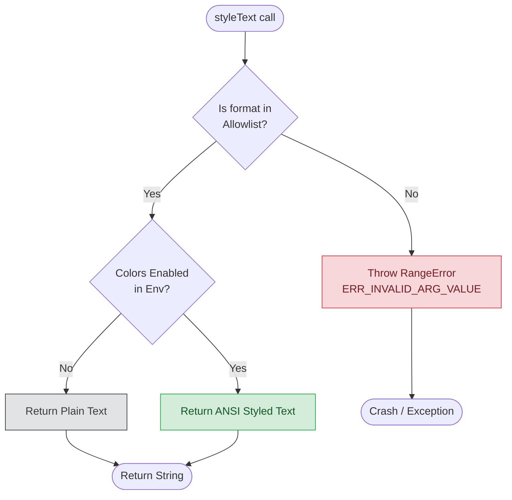

An interesting trend in both JavaScript and CSS is the native implementation of features previously available only through third-party libraries. While some developers view this as unnecessary bloat in the Node.js runtime, these additions standardize and optimize features widely used across the ecosystem.

This post explores this trend by looking at util.styleText, a feature that allows you to style terminal text without relying on external libraries like Chalk.

## Chalk

The Chalk library allows you to style terminal output with colors and text modifiers. These styles provide visual cues, making terminal output more readable.

The following example demonstrates common Chalk usage:

```js
import chalk from 'chalk';

const log = console.log;

// Combine styled and normal strings
log(chalk.blue('Hello') + ' World' + chalk.red('!'));

// Chain styles using Chalk modifiers
log(chalk.blue.bgRed.bold('Hello world!'));

// Pass multiple arguments as a comma-separated list
log(chalk.blue('Hello', 'World!', 'Foo', 'bar', 'biz', 'baz'));

// Nest styles: "Hello" is red, "world" has a blue background
log(chalk.red('Hello', chalk.underline.bgBlue('world') + '!'));

// Nest styles of the same type
log(chalk.green(
  'I am a green line ' +
  chalk.blue.underline.bold('with a blue substring') +
  ' that becomes green again!'
));
```

Chalk also supports template literals for multi-line strings:

```js
log(`
CPU: ${chalk.red('90%')}
RAM: ${chalk.green('40%')}
DISK: ${chalk.yellow('70%')}
`);
```

In compatible terminal emulators, you can use custom RGB and hex colors:

```js
// Use RGB and Hex colors
log(chalk.rgb(123, 45, 67).underline('Underlined reddish color'));
log(chalk.hex('#DEADED').bold('Bold gray!'));
```

## util.styleText

While Chalk is powerful, it adds a dependency for a decorative feature. Node.js introduced util.styleText in version 20.12.0 and declared it stable in version 22.x. It provides a native subset of Chalk's functionality with zero dependencies.

The following table compares Chalk and util.styleText.

Feature

| Chalk (Library) | util.styleText (Native) |
| --- | --- |
| Fluent / Chainable: `chalk.red.bold('Text')` | Functional: `styleText(['red', 'bold'], 'Text')` |
| Yes: supports TrueColor (Hex/RGB) | No: Supports standard ANSI colors only. |
| Smart Nesting: Automatically restores parent styles. | No: Resets to terminal default. |
| Color Downgrading: Converts colors if terminal support is missing. | No: Since it uses only standard colors, no logic is needed. |
| Template Literals: Supports tagged templates. | No: Requires standard interpolation. |
| Dependencies: Yes | None |

### Detailed limitations

If you migrate from Chalk to the native implementation, consider these functional differences.

No Chaining API
: You cannot chain properties to combine styles. Instead, pass an array of strings as the first argument.
: **Chalk**: chalk.red.bold.underline('Text')
: **Native**: styleText(['red', 'bold', 'underline'], 'Text')

No Custom Colors (Hex/RGB)
: util.styleText is limited to the standard ANSI color palette (approximately 8 basic colors, 8 bright variants, and background counterparts).
: **Chalk**: chalk.hex('#DEADED')('Zombie') works.
: **Native**: Throws an error for hex/RGB values. You must use named colors like 'green' or 'red'.

### The nesting "bleed" issue

This is the most significant functional difference. Chalk handles "un-nesting" for you. In native Node.js, the closing tag of an inner style resets the stream to the terminal default, not the parent state.

Example:

```ts
import { styleText } from 'node:util';

console.log(
  styleText('red', `Error: ${styleText('blue', 'File not found')} - check logs.`)
);
```

Output Behavior:

* **"Error: "** prints in red.
* **"File not found"** prints in blue.
* **" - check logs."** prints in the default color because the blue style reset the terminal state.

### Solution: Implementing smart nesting

To achieve Chalk-like nesting with util.styleText, you can create a helper function that re-applies the parent style after a child style closes.

```ts
import { styleText } from 'node:util';

type Format = Parameters<typeof styleText>[0];

/**
 * Wraps util.styleText to support smart nesting.
 * It ensures that if a nested style resets formatting,
 * the parent style is immediately re-applied.
 */
export function smartStyle(format: Format, text: string): string {
  const placeholder = '_________';
  const wrapped = styleText(format, placeholder);
  const [open, close] = wrapped.split(placeholder);

  // Replace the reset code with "Reset + Re-Open" to maintain parent style
  const smartText = text.replaceAll(close, close + open);

  return `${open}${smartText}${close}`;
}
```

Usage:

```ts
// Native: The trailing text loses the red color
console.log(styleText('red', `Parent ${styleText('blue', 'Child')} Parent`));

// smartStyle: The trailing text remains red
console.log(smartStyle('red', `Parent ${smartStyle('blue', 'Child')} Parent`));
```

## Reference: Supported formats

util.styleText supports specific string values. Passing unsupported values (including capitalized variants or hex codes) throws an error.

### Validation Logic

util.styleText follows a strict logic path:

* **Input Check**: Is the format string in the supported list? If not, throw ERR_INVALID_ARG_VALUE.
* **Environment Check**: Are colors enabled? If NO_COLOR is set or stdout is not a TTY, return plain text.
* **Result**: Return the styled string with ANSI codes.



### Supported text colors

| Standard | Bright Variants |
| :---: | :---: |
| black | blackBright |
| red | redBright |
| green | greenBright |
| yellow | yellowBright |
| blue | blueBright |
| magenta | magentaBright |
| cyan | cyanBright |
| white | whiteBright |

### Supported background colors

| Standard | Bright Variants |
| :---: | :---: |
| bgBlack | bgBlackBright |
| bgRed | bgRedBright |
| bgGreen | bgGreenBright |
| bgYellow | bgYellowBright |
| bgBlue | bgBlueBright |
| bgMagenta | bgMagentaBright |
| bgCyan | bgCyanBright |
| bgWhite | bgWhiteBright |

### Supported modifiers

You can combine these with colors in the format array (e.g., ['bold', 'red']).

| Modifier | Description |
| :---: | :---: |
| bold | Bold text |
| italic | Italic text |
| underline | Underlined text |
| strikethrough | Strikethrough text |
| hidden | Hidden text |
| dim | Dim text |
| blink | Blinking text |
| inverse | Inverse colors |
| doubleunderline | Double underlined text |
| framed | Framed text |
| overlined | Overlined text |
| reset | Reset all styles |

## Migration Tool

The Node.js team provides a Codemod migration tool to help you transition from Chalk to util.styleText.

Back up your code before running the codemod. After the migration, you might need to manually adjust edge cases, such as hex colors or complex chaining logic.
