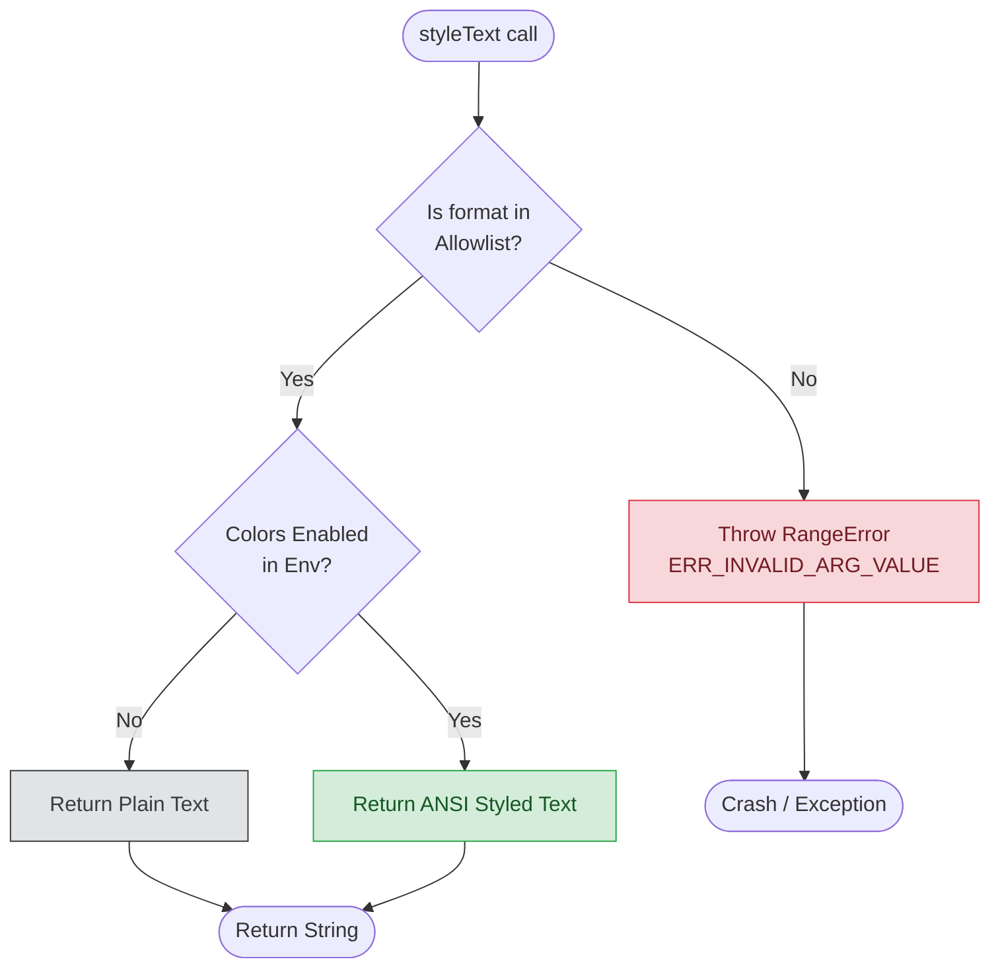

An interesting trend in the JavaScript ecosystem is the native implementation of features previously available only through third-party libraries. While some developers view this as unnecessary bloat in the Node.js runtime, these additions standardize and optimize features widely used across the ecosystem.

This post explores this trend by looking at `util.styleText`, a feature that allows developers to style terminal text natively without relying on external libraries like chalk.

## The chalk library

The chalk library allows developers to style terminal output with colors and text modifiers. These styles provide visual cues, making terminal output significantly more readable.

The following example demonstrates common chalk usage:

**TypeScript / JavaScript**

```ts
import chalk from 'chalk';

const log = console.log;

// Combine styled and normal strings
log(chalk.blue('Hello') + ' World' + chalk.red('!'));

// Chain styles using Chalk modifiers
log(chalk.blue.bgRed.bold('Hello world!'));

// Pass multiple arguments as a comma-separated list
log(chalk.blue('Hello', 'World!', 'Foo', 'bar', 'biz', 'baz'));

// Nest styles: "Hello" is red, "world" has a blue background
log(chalk.red('Hello', chalk.underline.bgBlue('world') + '!'));

// Nest styles of the same type
log(chalk.green(
  'I am a green line ' +
  chalk.blue.underline.bold('with a blue substring') +
  ' that becomes green again!'
));
```

The chalk library also supports template literals for multi-line strings:

**TypeScript / JavaScript**

```ts
log(`
CPU: ${chalk.red('90%')}
RAM: ${chalk.green('40%')}
DISK: ${chalk.yellow('70%')}
`);
```

In compatible terminal emulators, applications can use custom RGB and hex colors:

**TypeScript / JavaScript**

```ts
// Use RGB and Hex colors
console.log(chalk.rgb(123, 45, 67).underline('Underlined reddish color'));
console.log(chalk.hex('#DEADED').bold('Bold gray!'));
```

### util.styleText

While chalk is powerful, it adds a dependency for a purely decorative feature. Node.js introduced util.styleText in version 20.12.0 and declared it stable in version 22.x. It provides a native subset of chalk's functionality with zero dependencies.

The following table compares chalk and util.styleText.

| Feature | chalk (Library) | util.styleText (Native) |
| --- | --- | --- |
| Syntax | Fluent / Chainable: chalk.red.bold('Text') | Functional: styleText(['red', 'bold'], 'Text') |
| Custom Colors | Yes: supports TrueColor (Hex/RGB). | No: Supports standard ANSI colors only. |
| Smart Nesting | Automatically restores parent styles. | No: Resets to terminal default. |
| Color Downgrading | Converts colors if terminal support is missing. | No: Uses only standard colors, so no conversion logic is needed. |
| Template Literals | Supports tagged templates. | No: Requires standard string interpolation. |
| Dependencies | Yes | None |

### Detailed limitations

When migrating from chalk to the native implementation, consider these functional differences.

* **No chaining API**: Developers cannot chain properties to combine styles. Instead, pass an array of strings as the first argument.
  * **Chalk**: `chalk.red.bold.underline('Text')`
  * **Native**: `styleText(['red', 'bold', 'underline'], 'Text')`
* **No custom colors (Hex/RGB)**: `util.styleText` is strictly limited to the standard ANSI color palette (approximately 8 basic colors, 8 bright variants, and background counterparts).
* `Chalk`: `chalk.hex('#DEADED')('Zombie')` executes successfully.
* `Native`: Throws an error for hex/RGB values. Developers must use named colors like 'green' or 'red'.

### The nesting "bleed" issue

This is the most significant functional difference. chalk handles "un-nesting" automatically. In native Node.js, the closing tag of an inner style resets the stream to the terminal default, not the parent state.

**TypeScript / JavaScript**

```ts
import { styleText } from 'node:util';

console.log(
  styleText('red', `Error: ${styleText('blue', 'File not found')} - check logs.`)
);
```

**Output behavior**

* **"Error**: " prints in red.
* **"File not found"**: prints in blue.
* **" - check logs."**: prints in the default terminal color because the blue style reset the terminal state entirely.

### Solution: Implementing smart nesting

To achieve chalk-like nesting with util.styleText, developers can create a helper function that re-applies the parent style after a child style closes.

**TypeScript**

```ts
import { styleText } from 'node:util';

type Format = Parameters<typeof styleText>[0];

/**
 * Wraps util.styleText to support smart nesting.
 * It ensures that if a nested style resets formatting,
 * the parent style is immediately re-applied.
 */
export function smartStyle(format: Format, text: string): string {
  const placeholder = '_________';
  const wrapped = styleText(format, placeholder);
  const [open, close] = wrapped.split(placeholder);

  // Replace the reset code with "Reset + Re-Open" to maintain parent style
  const smartText = text.replaceAll(close, close + open);

  return `${open}${smartText}${close}`;
}

// Native: The trailing text loses the red color
console.log(styleText('red', `Parent ${styleText('blue', 'Child')} Parent`));

// smartStyle: The trailing text remains red
console.log(smartStyle('red', `Parent ${smartStyle('blue', 'Child')} Parent`));
```

**JavaScript**

```js
import { styleText } from 'node:util';

/**
 * Wraps util.styleText to support smart nesting.
 * It ensures that if a nested style resets formatting,
 * the parent style is immediately re-applied.
 */
export function smartStyle(format, text) {
  const placeholder = '_________';
  const wrapped = styleText(format, placeholder);
  const [open, close] = wrapped.split(placeholder);

  // Replace the reset code with "Reset + Re-Open" to maintain parent style
  const smartText = text.replaceAll(close, close + open);

  return `${open}${smartText}${close}`;
}

// Native: The trailing text loses the red color
console.log(styleText('red', `Parent ${styleText('blue', 'Child')} Parent`));

// smartStyle: The trailing text remains red
console.log(smartStyle('red', `Parent ${smartStyle('blue', 'Child')} Parent`));
```

## Reference: Supported formats

`util.styleText` supports specific string values. Passing unsupported values (including capitalized variants or hex codes) throws an error.

### Validation logic

`util.styleText` follows a strict logic path:

* **Input Check**: Is the format string in the supported list? If not, throw a RangeError (ERR_INVALID_ARG_VALUE).
* **Environment Check**: Are colors enabled? If the NO_COLOR environment variable is set, or if stdout is not a TTY (teletypewriter), return plain text.
* **Result**: Return the styled string with ANSI codes applied.


```mermaid
flowchart TD
    Start([styleText call]) --> CheckFormat{Is format in<br>Allowlist?}

    CheckFormat -- No --> Error[Throw RangeError<br>ERR_INVALID_ARG_VALUE]

    CheckFormat -- Yes --> CheckEnv{Colors Enabled<br>in Env?}

    CheckEnv -- No --> Plain[Return Plain Text]
    CheckEnv -- Yes --> ANSI[Return ANSI Styled Text]

    Error --> Crash([Crash / Exception])
    Plain --> Return([Return String])
    ANSI --> Return

    style Error fill:#f8d7da,stroke:#dc3545,color:#721c24
    style Plain fill:#e2e3e5,stroke:#383d41,color:#383d41
    style ANSI fill:#d4edda,stroke:#28a745,color:#155724
```

### Supported text colors

| Standard | Bright Variants |
| --- | --- |
| black | blackBright |
| red | redBright |
| green | greenBright |
| yellow | yellowBright |
| blue | blueBright |
| magenta | magentaBright |
| cyan | cyanBright |
| white | whiteBright |


### Supported background colors

| Standard | Bright Variants |
| --- | --- |
| bgBlack | bgBlackBright |
| bgRed | bgRedBright |
| bgGreen | bgGreenBright |
| bgYellow | bgYellowBright |
| bgBlue | bgBlueBright |
| bgMagenta | bgMagentaBright |
| bgCyan | bgCyanBright |
| bgWhite | bgWhiteBright |

### Supported modifiers

Developers can combine these with colors in the format array (e.g., ['bold', 'red']).

| Modifier | Description |
| --- | --- |
| bold | Bold text |
| italic | Italic text |
| underline | Underlined text |
| strikethrough | Strikethrough text |
| hidden | Hidden text |
| dim | Dim text |
| blink | Blinking text |
| inverse | Inverse colors |
| doubleunderline | Double underlined text |
| framed | Framed text |
| overlined | Overlined text |
| reset | Reset all styles |

## Migration tool

The Node.js team provides a [Codemod migration tool](https://app.codemod.com/registry/@nodejs/chalk-to-util-styletext) to help transition codebases from chalk to util.styleText.

It is highly recommended to back up code before running the codemod. After the automated migration completes, developers must manually adjust edge cases, such as hex colors or complex chaining logic that the tool cannot reliably translate.
