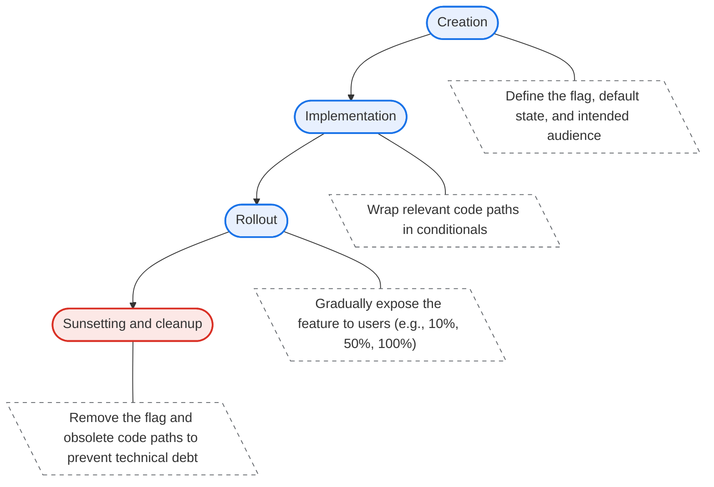

Feature flags, also known as feature toggles, are a software engineering technique that lets you turn specific functionality on or off during runtime without deploying new code. They decouple feature release from code deployment, which gives teams granular control over how and when users interact with new changes.

## How feature flags work

At their core, feature flags are conditional control points strategically placed inside your codebase. When the application runs, it evaluates the condition (the flag) to determine which execution path to take.

Instead of hardcoding these conditions, the application retrieves the flag's state from an external source. Because the application evaluates the flag at runtime, you can instantly change the behavior of the software for all users, or a specific subset of users, by updating the flag's state in the management system.

### Runtime evaluation and synchronization

To prevent performance bottlenecks, applications rarely query the feature flag database every time a flag is evaluated in the code. If an app checked the database for every single conditional statement, it would severely degrade performance and overload the database.

Instead, feature flag systems rely on a combination of local caching and background synchronization. When building a manual system, you are responsible for implementing these mechanisms:

* **Initial load**: When the application starts or a user session begins, the application fetches the current state of all relevant flags from the external source and caches them locally (for example, in React state or a module-level variable). By default, this means the user must refresh the page to see any updated flags.
* **Local evaluation**: When the code execution reaches a feature flag condition, it evaluates the flag against the local cache. This in-memory check takes microseconds and ensures the application runs smoothly without network latency.
* **Background synchronization**: To keep the local cache up to date without requiring the user to refresh the page, you must add a synchronization method:
  * **Polling**: The application periodically queries the external JSON file on a set timer (for example, every 5 minutes) to check for changes and update the local state.
  * **Streaming**: Advanced third-party tools maintain a persistent connection, such as Server-Sent Events (SSE) or WebSockets. When you toggle a flag in the management dashboard, the server instantly pushes the update to the connected clients.

### Types of feature flags

Engineers typically categorize feature flags into five distinct groups based on their lifespan and purpose:

* **Release toggles**: These allow teams to ship incomplete or untested features to production in an "off" state. Once the feature is ready, you turn the toggle "on." They usually have a short lifespan (days to weeks).
* **Experiment toggles**: Teams use these for A/B testing or multivariate testing. The system serves different flag states to different user segments to measure the impact of a change. They last as long as the experiment runs.
* **Ops toggles**: These act as circuit breakers for operational control. If a new microservice causes performance degradation, engineers can quickly flip an ops toggle to route traffic back to the legacy service. They often have a long or indefinite lifespan.
* **Permission toggles**: These manage features restricted to specific users, such as premium subscribers, beta testers, or internal administrators. They generally remain in the codebase permanently.
* **Macro toggles**: These group multiple related features under a single flag. This approach is useful for enabling or disabling an entire suite of features at once (such as experimental developer tools), though it trades granular control for convenience.

### The feature flag lifecycle

Managing feature flags effectively requires strict adherence to their lifecycle to avoid accumulating technical debt:

* **Creation**: Define the flag, its default state, and its intended audience.
* **Implementation**: Wrap the relevant code paths in conditionals that check the flag's state.
* **Rollout**: Gradually expose the feature to users (e.g., 10%, then 50%, then 100%).
* **Sunsetting and cleanup**: Once a release toggle reaches 100% rollout and stability, you must remove the flag and the obsolete code paths from the codebase. Failing to do this results in complex, unmaintainable "flag debt."



## Build a manual JSON-based feature flag system

To build a manual feature flag system, you can use a static JSON file to store your configuration. This approach is highly effective for simple applications, early-stage development, or environments where you cannot use a third-party service.

### Define the feature flags

Create a file named features.json and place it in your static assets directory (like the public folder in many web frameworks) or serve it via a simple API endpoint.

```json
{
  "newDashboard": true,
  "betaCheckout": false,
  "experimentalFeatures": false,
  "theme": "dark"
}
```

### Fetch the JSON file

Your application fetches this JSON file at runtime to determine the available features. Wrap this logic in a utility function. To support background polling later, include a forceRefresh parameter that bypasses the local cache.

```ts
export interface FeatureFlags {
  newDashboard: boolean;
  betaCheckout: boolean;
  experimentalFeatures: boolean;
  theme: string;
}

let cachedFlags: FeatureFlags | null = null;

export async function getFeatureFlags(forceRefresh = false): Promise<FeatureFlags> {
  // Return cached flags if they exist and we aren't forcing a refresh
  if (cachedFlags && !forceRefresh) {
    return cachedFlags;
  }

  try {
    const response = await fetch('/features.json');

    if (!response.ok) {
      throw new Error(`HTTP error! status: ${response.status}`);
    }

    const flags: FeatureFlags = await response.json();
    cachedFlags = flags;
    return flags;
  } catch (error) {
    console.error('Failed to load feature flags, falling back to defaults:', error);
    return {
      newDashboard: false,
      betaCheckout: false,
      experimentalFeatures: false,
      theme: 'light'
    };
  }
}
```

### Consume flags in vanilla TypeScript

In a framework-agnostic vanilla TypeScript application, you can use a centralized class to manage the flags. This manager acts as a single source of truth, fetching the data, managing polling, and notifying different parts of your application when flags update.

#### Create a Feature Flag Manager

Create a FeatureFlagManager class that handles the initial load and provides a pub/sub pattern so different UI components can subscribe to flag updates.

```ts
import { getFeatureFlags, type FeatureFlags } from './flags';

export class FeatureFlagManager {
  private flags: FeatureFlags | null = null;
  private listeners: Array<(flags: FeatureFlags) => void> = [];
  private pollingIntervalId: number | null = null;

  // Fetch the flags for the first time
  async init(): Promise<void> {
    this.flags = await getFeatureFlags();
    this.notifyListeners();
  }

  // Subscribe to flag updates
  subscribe(callback: (flags: FeatureFlags) => void): void {
    this.listeners.push(callback);

    // If flags are already loaded, trigger the callback immediately
    if (this.flags) {
      callback(this.flags);
    }
  }

  // Set up background polling
  startPolling(intervalMs: number = 300000): void { // Default 5 minutes
    if (this.pollingIntervalId) {
      window.clearInterval(this.pollingIntervalId);
    }

    this.pollingIntervalId = window.setInterval(async () => {
      // Pass 'true' to bypass the fetch cache
      this.flags = await getFeatureFlags(true);
      this.notifyListeners();
    }, intervalMs);
  }

  stopPolling(): void {
    if (this.pollingIntervalId) {
      window.clearInterval(this.pollingIntervalId);
      this.pollingIntervalId = null;
    }
  }

  private notifyListeners(): void {
    if (this.flags) {
      for (const listener of this.listeners) {
        listener(this.flags);
      }
    }
  }
}

// Export a singleton instance for the app to share
export const featureFlagManager = new FeatureFlagManager();
```

#### Update the UI based on flags

In your feature-specific code, subscribe to the `featureFlagManager`. Whenever the flags load or update (via polling), the callback executes, letting you manipulate the DOM accordingly.

```ts
import { featureFlagManager } from './FeatureFlagManager';

const dashboardBtn = document.getElementById('dashboard-btn');

// Subscribe to flag changes to update the UI
featureFlagManager.subscribe((flags) => {
  if (!dashboardBtn) return;

  if (flags.newDashboard) {
    dashboardBtn.textContent = 'Try the New Dashboard!';
    dashboardBtn.className = 'btn-new';
  } else {
    dashboardBtn.textContent = 'Go to Dashboard';
    dashboardBtn.className = 'btn-old';
  }
});
```

### Initialize the application

In your application's main entry point, initialize the manager. If you want background synchronization, start the polling sequence. Because the UI components subscribe to the manager, they will automatically update whenever the JSON file changes and a poll occurs, without requiring a full page reload.

```ts
import { featureFlagManager } from './FeatureFlagManager';
import './dashboardUI'; // File containing the subscription logic above

// Initialize the flags and start polling every 5 minutes
async function bootstrapApp() {
  await featureFlagManager.init();
  featureFlagManager.startPolling(5 * 60 * 1000);
}

bootstrapApp();
```

## Consume flags in React

If your application uses a component-based framework like React, you can wrap the FeatureFlagManager in a Context Provider. This prevents passing flags manually down the component tree (prop drilling) while ensuring UI components react immediately to polling updates.

```tsx
import React, { useEffect, useState, type ReactNode } from 'react';
import { FeatureFlagContext } from './FeatureFlagContext';
import { featureFlagManager } from './FeatureFlagManager';
import { type FeatureFlags } from './flags';

interface ProviderProps {
  children: ReactNode;
}

export const FeatureFlagProvider: React.FC<ProviderProps> = ({ children }) => {
  const [flags, setFlags] = useState<FeatureFlags | null>(null);

  useEffect(() => {
    featureFlagManager.subscribe((newFlags) => {
      setFlags(newFlags);
    });

    featureFlagManager.init().then(() => {
      featureFlagManager.startPolling(5 * 60 * 1000);
    });

    return () => {
      featureFlagManager.stopPolling();
    };
  }, []);

  if (!flags) {
    return <div>Loading features...</div>;
  }

  return (
    <FeatureFlagContext.Provider value={flags}>
      {children}
    </FeatureFlagContext.Provider>
  );
};
```

## Advanced usage: macro flags

You can group multiple features under a single "macro flag" or "bulk toggle," similar to Chromium's `enable-web-platform-features` flag. In your code, you evaluate the exact same flag across multiple distinct components or logic paths.

While this approach is excellent for enabling a suite of related features for testing all at once, keep in mind that it reduces granularity. If a single feature in the bundle causes a critical bug, toggling the flag off disables the entire suite.

The following examples demonstrate how to implement a macro flag by creating a container component that evaluates your manually created experimentalFeatures flag.


```tsx
// React example
import React from 'react';
import { useFeatureFlags } from './FeatureFlagProvider';
import { NewDashboard } from './NewDashboard';
import { BetaCheckout } from './BetaCheckout';
import { AdvancedSearch } from './AdvancedSearch';

export const ExperimentalFeaturesContainer: React.FC = () => {
  const { experimentalFeatures } = useFeatureFlags();

  if (!experimentalFeatures) {
    return <div className="standard-view">Standard features active.</div>;
  }

  return (
    <div className="experimental-suite">
      <h2>Experimental Web Platform Features</h2>
      <NewDashboard />
      <BetaCheckout />
      <AdvancedSearch />
    </div>
  );
};
```

## Relationship to #ifdef in C/C++

Feature flags and preprocessor directives like `#ifdef` share a similar conceptual goal—allowing multiple execution paths or feature sets to exist within the same codebase—but they operate at fundamentally different stages of the software lifecycle.

* **`#ifdef` (compile-time)**: Preprocessor directives in C/C++ (or equivalent build-time flags in languages like Rust or Go) evaluate before the code compiles. If an `#ifdef` condition is false, the compiler strips that code block entirely. The resulting binary does not contain the disabled feature. To enable the feature, you must recompile the source code and deploy a new binary.
* **Feature flags (run-time)**: Feature flags evaluate while the application is actively running. The code for both the "on" and "off" states compiles into the deployment artifact and lives in the production environment. This lets you toggle features dynamically without any compilation or deployment steps.

## Relationship to Chromium origin trials

An origin trial is essentially a specialized, decentralized feature flag mechanism used by browser vendors.

When you use a standard feature flag in your application, you control the flag's state on your server or through a third-party service. You decide which users receive the new feature.

Chromium's origin trials invert this control for web platform features. Instead of Google turning on an experimental browser API (like WebGPU or a new Bluetooth API) for a random percentage of global Chrome users, they put the API behind an internal feature flag. They then hand the "toggle" to web developers in the form of an origin trial token.

When a web developer requests a token and serves it on their domain (via an HTTP header or a `<meta>` tag), the browser reads that token. If the token is valid, the browser evaluates its internal feature flag as true for that specific origin, exposing the experimental API to anyone visiting that site. This lets developers test new browser features safely with their actual users without the browser vendor risking widespread breakages across the entire web.

## Relationship to Chromium Finch trials

Finch is Google's internal experiment and feature rollout framework built specifically for the Chrome browser. Essentially, Finch serves as Chrome's proprietary feature flag management system.

Here is how Finch relates to the broader feature flag ecosystem:

* **Management system**: Just as you might use a custom JSON file or a third-party service to control features for a web application, the Chromium team uses Finch to manage features for the Chrome browser itself.
* **Finch trials versus origin trials**: Origin trials empower the web developer, allowing them to opt their specific website into an experimental browser API. Finch trials, conversely, are controlled entirely by Google. Google uses Finch to randomly assign Chrome users to different experimental cohorts (A/B testing) to evaluate new browser UI changes, network performance tweaks, or battery-saving features.
* **Finch kill switches**: A Finch kill switch is a specialized, high-priority operational toggle (ops toggle). If a newly shipped browser feature causes severe crashes, breaks widespread web functionality, or introduces critical security vulnerabilities, the Chromium team uses a Finch kill switch. This action instantly disables the buggy feature across the global Chrome user base without requiring users to wait for or download a new browser update.
* **Technical execution**: When Chrome starts, it downloads a configuration file from the Finch servers, often referred to as a "seed." This file contains the states for thousands of internal feature flags. Chrome then evaluates these flags locally to determine which experimental features or rendering paths to execute for that specific user.

## Relationship to A/B testing

The relationship here is foundational: feature flags are the underlying engine that powers A/B testing.

Feature flags are the routing mechanism. They are the conditional statements in your code that physically serve different experiences to different users.

A/B testing is the experimental methodology layered on top of that mechanism. It involves segmenting your audience, serving them different flag variations (Variant A versus Variant B), and then attaching analytics to measure which variation performs better against a specific business goal (like conversion rate or time on page).

While all A/B tests rely on feature flags (specifically experiment toggles), not all feature flags are A/B tests. For example, if you use a feature flag as a circuit breaker to disable a failing microservice (an ops toggle), or to restrict a premium dashboard to paying customers (a permission toggle), you are not running an A/B test. You are simply using the flag for operational control or entitlement management.

## Third-party tools

While a custom JSON and Context API setup works well for basic needs, it lacks advanced capabilities like real-time updates without page refreshes, audience targeting (e.g., enabling a feature only for users in specific regions), or analytics tracking.

When your application requires these features, consider migrating to a dedicated platform:

* [LaunchDarkly](https://launchdarkly.com/pa/runtime/): A highly scalable, enterprise-grade platform known for real-time updates and complex targeting rules.
* [Unleash](https://www.getunleash.io/): An open-source, privacy-first option that you can self-host or use via their managed service.
* [Split.io](https://www.split.io/): Focuses heavily on pairing feature flags with data analytics to measure the exact impact of new features on application performance and user behavior.
