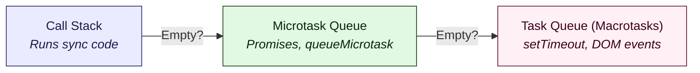

A Promise is an object representing the eventual completion (or failure) of an asynchronous operation and its resulting value. It acts as a proxy for a value not necessarily known when the promise is created.

They are not always intuitive to reason through, especially for developers new to asynchronous programming. This post covers the core concepts, lifecycle, and best practices for using promises effectively in both JavaScript and TypeScript.

## Core concepts and lifecycle

Every Promise exists in one of three mutually exclusive states:

* **Pending**: The initial state; the operation has not yet completed.
* **Fulfilled**: The operation completed successfully. The promise holds a permanent value.
* **Rejected**: The operation failed. The promise holds a permanent reason (typically an Error object).

Once a promise either fulfills or rejects, it settles. You cannot change a settled promise's state or value.

### Immutability and reusing settled promises

A settled promise is completely immutable. This has a major functional implication for promise reusability: reusing an already-settled promise will never re-trigger the original asynchronous operation.

When you attach a new `.then()`, `.catch()`, or `await` statement to a promise that has already settled, the promise immediately resolves or rejects with its cached result.

```ts
// The executor function runs instantly upon instantiation
const randomNumberPromise = new Promise<number>((resolve) => {
  console.log("1. Executor executed!");
  resolve(Math.random());
});

// First consumption
randomNumberPromise.then((val: number) => {
  console.log("2. First consumer received:", val);
});

// Second consumption (even after a delay)
setTimeout(() => {
  randomNumberPromise.then((val: number) => {
    // The executor DOES NOT run again. It immediately receives the cached number.
    console.log("3. Second consumer received cached value:", val);
  });
}, 1000);
```

### When is this behavior useful?

**State sharing and caching**: You can share a single promise (such as a database initialization or a configuration fetch) across multiple files or components. Every consumer that awaits it receives the identical resolved state without executing redundant queries.

### When can this cause issues?

**Stale data**: If you need to fetch fresh data on every call, you cannot reuse the same promise instance. You must call a function that instantiates and returns a new promise each time.

## Creating and triggering promises

You can obtain or trigger a promise in JavaScript in three primary ways:

### Wrapping non-Promise asynchronous code (the constructor)

Use the Promise constructor to convert a callback-based API or a manual delay into a promise. It takes an "executor" function that runs immediately and receives two callbacks: resolve and reject.

```ts
const delayedMessage = new Promise<string>((resolve, reject) => {
  const success = true;

  // setTimeout is a classic 'source' of a promise
  setTimeout(() => {
    if (success) {
      resolve("Operation successful");
    } else {
      reject(new Error("Operation failed"));
    }
  }, 1000);
});
```

### Consuming asynchronous Web APIs

Most modern Web and Node.js APIs are Promise-native, returning a promise automatically. Common sources include:

* Network requests: `fetch("https://api.example.com")` returns a `Promise<Response>`.
* Web streams: `readableStream.getReader().read()` returns a `Promise<ReadableStreamReadResult<T>>` representing chunked data delivery.
* Origin Private File System (OPFS): `navigator.storage.getDirectory()` returns a `Promise<FileSystemDirectoryHandle>`, acting as the entry point to a highly optimized, sandboxed private directory.
* File System Access API (Browser): `window.showOpenFilePicker()` returns a `Promise<FileSystemFileHandle[]>` representing local, user-selected file handles.
* File system (Node.js): `fs.promises.readFile("config.json")` returns a `Promise<Buffer>`.
* Media devices: `navigator.mediaDevices.getUserMedia()` returns a `Promise<MediaStream>`.

### Wrapping synchronous code

You can wrap synchronous code in a promise using `Promise.resolve()` or the constructor. Remember, however, that the executor function runs synchronously.

```ts
const syncPromise = new Promise<string>((resolve) => {
  // This loop still blocks the main thread!
  for (let i = 0; i < 1e9; i++) {}
  resolve("Done");
});
```

#### Why wrap synchronous code?

* **API consistency**: If a function sometimes returns a cached value and sometimes fetches data, returning a promise for both allows the caller to use a consistent await pattern.
* **Error normalization**: Promises automatically catch synchronous throw statements and convert them into rejections.

## Consuming promises: Chaining

Before the introduction of async/await, developers interacted with promises primarily through instance methods. These methods always return a new promise, which enables chaining.

* `.then(onFulfilled, onRejected)`: Appends fulfillment and rejection handlers.
* `.catch(onRejected)`: A shorthand for `.then(null, onRejected)`.
* `.finally(onFinally)`: Runs a callback regardless of the outcome; use this for cleanup tasks.

### The mechanics of chaining

The `.then()` method returns a new promise. If the handler returns a value, the new promise resolves with that value. If the handler returns another promise, the new promise "follows" that promise.

### Handler optionality and error bubbling

The `.then()` method does not require both handlers. If you omit a handler, the state passes through to the next link in the chain:

If `onFulfilled` is missing, the fulfillment value passes to the next `.then()`.

If `onRejected` is missing, the rejection reason passes down to the next `.catch()`.

This behavior allows a single `.catch()` at the end of a chain to intercept an error from any preceding step.

```ts
fetchUser(id)
  .then((user: User) => {
    return fetchPermissions(user.role);
  })
  .then((permissions: string[]) => {
    console.log("Permissions received:", permissions);
  })
  .catch((error: Error) => {
    console.error("Chain failed:", error);
  });
```

### The dual-handler execution trap: .then(onFulfilled, onRejected)

Passing both arguments to a single `.then()` introduces a subtle flow control trap. The rejection handler (`onRejected`) cannot catch errors thrown inside its companion fulfillment handler (`onFulfilled`). It only handles failures coming from operations preceding this `.then()` step.

```ts
fetchUser(id)
  .then(
    // 1. Success Handler
    (user: User) => {
      if (!user.isActive) {
        // If we throw here, the error BYPASSES the rejection handler below!
        throw new Error("User is inactive");
      }
      return fetchPermissions(user.role);
    },
    // 2. Sibling Error Handler (Only catches upstream errors)
    (error: Error) => {
      console.warn("Failed to fetch user:", error);
      // Recover and return a fallback user object
      return { role: "guest", isActive: true } as User;
    }
  )
  .then((permissions: string[]) => {
    console.log("Permissions processed:", permissions);
  })
  .catch((error: Error) => {
    // 3. Catches the "User is inactive" error from Step 1
    console.error("Global fallback handler caught:", error);
  });
```

### The preferred local recovery pattern

To handle both network failures and validation errors thrown during the processing of a single step, chain a separate `.catch()` immediately after that step:

```ts
fetchUser(id)
  .then((user: User) => {
    if (!user.isActive) {
      throw new Error("User is inactive");
    }
    return fetchPermissions(user.role);
  })
  // Catch block attached to the chain
  // Catches both fetch failures AND the "User is inactive" error
  .catch((error: Error) => {
    console.warn("Step 1 failed (fetch or validation):", error);
    return ["read:public"]; // Safe fallback permissions
  })
  .then((permissions: string[]) => {
    console.log("Permissions processed:", permissions);
  })
  .catch((error: Error) => {
    console.error("Global fallback handler caught:", error);
  });
```

## Static Promise methods

Modern JavaScript provides static methods to manage promise creation and concurrency.

### Utility methods

* `Promise.resolve(value)`: Returns a Promise object resolved with the given value.
* `Promise.reject(reason)`: Returns a Promise object rejected with the given reason.

### Concurrency methods

* `Promise.all(iterable)`: Fulfills when all promises fulfill. Rejects immediately if any reject (fail-fast).
* `Promise.allSettled(iterable)`: Waits until all promises settle. Returns an array of state objects: `{ status: 'fulfilled', value: T }` or `{ status: 'rejected', reason: any }`.
* `Promise.race(iterable)`: Settles as soon as the first promise settles (either fulfills or rejects).
* `Promise.any(iterable)`: Fulfills as soon as the first promise fulfills. Rejects only if all reject.

### Deep dive: Promise.all vs. Promise.allSettled

Choosing between Promise.all and Promise.allSettled depends on whether your system requires all-or-nothing transactional integrity or graceful tolerance of partial failures.

| Dimension | Promise.all | Promise.allSettled |
| --- | --- | --- |
| **Primary philosophy** | "All or nothing" (Transactional) | "Let's see what succeeded" (Auditing) |
| **Resolution behavior** | Fulfills when all input promises fulfill. | Fulfills when all input promises settle (either fulfill or reject). |
| **Failure behavior** | Rejects immediately (fail-fast) if any input promise rejects. | Never rejects. It collects error details for the caller to parse. |
| **Returned value** | Promise<T[]> (Array of raw values). | Promise<PromiseSettledResult<T>[]> (Array of descriptor objects). |

#### Case 1: When to use `Promise.all`

Use `Promise.all` when your tasks are structurally dependent on each other. If one task fails, the entire operation is useless, and continuing is a waste of resources.

**Scenario**: Fetching critical initial state for a dashboard. If you cannot get the user's profile information or their permission set, you cannot render the dashboard safely.

```ts
interface DashboardData {
  profile: Profile;
  config: Configuration;
}

async function loadDashboard(userId: string): Promise<DashboardData> {
  try {
    // If either API call fails, we fail fast and show a generic error screen
    const [profile, config] = await Promise.all([
      fetchProfile(userId),
      fetchAppConfig()
    ]);

    return { profile, config };
  } catch (error) {
    console.error("Required dashboard dependencies failed to load:", error);
    throw new Error("Unable to load application dashboard.");
  }
}
```

#### Case 2: When to use `Promise.allSettled`

Use `Promise.allSettled` when tasks are independent. A single failure should not prevent you from processing the successful results of the other tasks.

**Scenario**: A bulk action interface, such as sending a batch of emails or uploading multiple files. If email #2 fails because of an invalid address, you still want emails #1, #3, and #4 to send, and you need to report the exact outcome to the user.

```ts
interface BulkEmailResult {
  successful: string[];
  failed: Array<{ email: string; error: Error }>;
}

async function sendBulkEmails(emails: string[]): Promise<BulkEmailResult> {
  const emailPromises = emails.map(email => sendEmail(email));

  // Await the completion of all attempts, successful or not
  const results = await Promise.allSettled(emailPromises);

  const report: BulkEmailResult = {
    successful: [],
    failed: []
  };

  results.forEach((result, index) => {
    const targetEmail = emails[index];
    if (result.status === "fulfilled") {
      report.successful.push(targetEmail);
    } else {
      report.failed.push({
        email: targetEmail,
        error: result.reason as Error
      });
    }
  });

  return report;
}
```

### Processing `Promise.allSettled` results

Because `Promise.allSettled` always resolves to an array of metadata objects, you must manually iterate, filter, or unpack the results to act on them. Two main patterns exist for handling these results cleanly:

#### Pattern A: Filtering and unwrapping with TypeScript type guards

This pattern allows you to separate successes from failures cleanly while maintaining strict type safety for the unpacked values.

```ts
// Define reusable TypeScript type guards
const isFulfilled = <T>(
  result: PromiseSettledResult<T>
): result is PromiseFulfilledResult<T> => result.status === "fulfilled";

const isRejected = (
  result: PromiseSettledResult<unknown>
): result is PromiseRejectedResult => result.status === "rejected";

async function processUploads(files: string[]): Promise<void> {
  const uploadPromises = files.map(file => uploadFile(file));
  const results = await Promise.allSettled(uploadPromises);

  // Unpack only successful results with full type safety
  const successfulPayloads = results
    .filter(isFulfilled)
    .map(result => result.value); // Typed as the raw T[] array

  successfulPayloads.forEach(payload => {
    updateUiWithSuccess(payload);
  });

  // Handle rejections separately
  results
    .filter(isRejected)
    .forEach((result, index) => {
      console.warn(`File ${files[index]} failed to upload:`, result.reason);
    });
}
```

#### Pattern B: Direct branching loop

Use this pattern if you need to run distinct, immediate side effects for both successes and failures within a single pass.

```ts
async function notifyUsers(userIds: string[]): Promise<void> {
  const promises = userIds.map(id => sendNotification(id));
  const results = await Promise.allSettled(promises);

  results.forEach((result, index) => {
    const userId = userIds[index];

    if (result.status === "fulfilled") {
      console.log(`Notification sent to ${userId}. ID: ${result.value}`);
    } else {
      console.error(`Failed to notify ${userId}:`, result.reason);
      logFailureToAnalytics(userId, result.reason);
    }
  });
}
```

## The async/await abstraction

Introduced in ES2017, async/await is syntactic sugar built directly on top of promises. It does not replace promises; instead, it provides a cleaner syntax to manage sequential asynchronous operations, removing nested handlers and making asynchronous code look and behave like synchronous code.

### The async keyword

When you declare a function with the `async` keyword, you modify its behavior in two fundamental ways:

* **Guaranteed Promise return**: The function automatically returns a promise.
* **Implicit wrapping**: If the function returns a non-Promise value, the engine implicitly wraps it in `Promise.resolve()`. If the function throws an error, the engine wraps the error in `Promise.reject()`.

```ts
// Implicit return: Automatically returns Promise<string>
async function getGreetingImplicit(): Promise<string> {
  return "Hello World";
}

// Equivalent compilation under the hood:
function getGreetingExplicit(): Promise<string> {
  return Promise.resolve("Hello World");
}
```

### The await operator

The `await` keyword pauses execution inside an async function until a promise settles.

**The return value**: If the promise fulfills, await unwraps the value and returns it. If the promise rejects, await throws the rejection reason as an exception.

**Non-blocking pause**: This pause is non-blocking. The engine suspends the execution context of the async function, preserves local variables in scope, and yields control back to the event loop. The main thread continues executing other tasks.

```ts
async function processWorkflow(): Promise<void> {
  console.log("1. Starting workflow");

  // Suspends processWorkflow, yielding control back to the main thread
  const user = await fetchUser("usr_123");

  // Resumes here once fetchUser fulfills
  console.log("2. Resuming workflow for:", user.name);
}
```

### Under the hood: Generators and coroutines

The runtime implements async/await by combining Promises with Generator Functions (`function*` and `yield`). You can think of async/await as an automated generator runner.

When you compile async/await to older ES targets, the compiler replaces your code with a state machine utility that looks like this:

```ts
// A simplified example of how compilers translate async/await under the hood
function spawn(generatorFunc: GeneratorFunction) {
  return new Promise((resolve, reject) => {
    const generator = generatorFunc();

    function step(nextF: () => IteratorResult<any>) {
      let next;
      try {
        next = nextF();
      } catch (e) {
        return reject(e);
      }
      if (next.done) {
        return resolve(next.value);
      }
      Promise.resolve(next.value).then(
        val => step(() => generator.next(val)),
        err => step(() => generator.throw(err))
      );
    }

    step(() => generator.next());
  });
}
```

### Synchronous-style error handling

One of the greatest benefits of async/await is that it allows you to handle asynchronous rejections using standard try/catch blocks. The runtime intercepts rejections and transforms them into standard thrown exceptions.

```ts
async function fetchConfigSafe(): Promise<Config | null> {
  try {
    const response = await fetch("https://api.example.com/config");
    return await response.json();
  } catch (error) {
    // Catches network errors, non-JSON responses, or explicit rejections
    console.error("Config fetch failed:", error);
    return null;
  }
}
```

## When promise chaining outperforms async/await

While async/await is the preferred choice for sequential, synchronous-looking control flows, promise chaining is cleaner, more performant, or more readable in several common development scenarios.

### Functional pipelines (point-free style)

When your asynchronous code behaves like a pure functional pipeline—where the output of one step flows directly as the input to the next—promise chaining allows you to write clean, point-free code without introducing intermediate variables.

```ts
// Promise Chain: Clean, point-free pipeline
fetchRawData(id)
  .then(validatePayload)
  .then(transformToDomainModel)
  .then(saveToDatabase)
  .catch(handlePipelineError);

// Async/Await: Requires explicit intermediate variable assignments
async function processData(id: string): Promise<void> {
  try {
    const raw = await fetchRawData(id);
    const validated = await validatePayload(raw);
    const domainModel = await transformToDomainModel(validated);
    await saveToDatabase(domainModel);
  } catch (error) {
    handlePipelineError(error as Error);
  }
}
```

### Localized graceful recovery (avoiding the "try-catch tax")

If you need to query an endpoint but want to quickly fall back to a default value if it fails, async/await requires you to wrap the call in a verbose, multi-line block. Promise chains allow you to recover inline.

```ts
// Promise Chain: Single-line, inline recovery
const config = await fetchUserConfig(userId).catch(() => defaultConfig);

// Async/Await: Highly verbose for a simple fallback
let config: Config;
try {
  config = await fetchUserConfig(userId);
} catch {
  config = defaultConfig;
}
```

### Non-blocking "fire-and-forget" side effects

When triggering an asynchronous side effect (like telemetry tracking) that does not need to block your main function's execution, promise chains let you execute and catch errors safely inline.

```ts
// Promise Chain: Non-blocking execution with a self-contained error boundary
function handleUserLogin(user: User): string {
  trackUserSession(user.id).catch(err => logTelemetryError(err));
  return "Login successful";
}
```

Using async/await here would require you to either omit the await keyword—which triggers compiler warnings like `@typescript-eslint/no-floating-promises`, or extract the handler into a separate helper.

### Direct promise delegation (avoiding microtask overhead)

If a function merely acts as a proxy that calls another asynchronous operation and returns its result, using async/await introduces minor performance and memory overhead. Marking a function async forces the runtime to instantiate a new Promise wrapper and schedule an extra microtask tick. Returning the promise directly avoids this.

```ts
// Preferred: Direct Delegation (Saves a microtask tick and memory allocation)
function getCachedUserProfile(id: string): Promise<Profile> {
  return database.profiles.findUnique({ where: { id } });
}

// Suboptimal: Redundant wrapping
async function getCachedUserProfileVerbose(id: string): Promise<Profile> {
  return await database.profiles.findUnique({ where: { id } });
}
```

### Dynamic sequential reductions

When you need to execute an array of asynchronous tasks strictly in sequence, but the list of tasks is generated dynamically at runtime, reducing them into a single promise chain is often cleaner than managing loop indexes or nested generator functions.

```ts
// Promise Chain: Dynamically builds a sequential execution chain
function runSequentialTasks(tasks: Array<() => Promise<void>>): Promise<void> {
  return tasks.reduce(
    (chain, currentTask) => chain.then(() => currentTask()),
    Promise.resolve()
  );
}
```

## Cancellation with AbortController

Native JavaScript promises are designed to be immutable and run to completion; they lack a built-in `cancel()` method. To address this, modern runtimes use the browser-standard AbortController API to decouple the cancellation logic from the asynchronous task itself.

### The anatomy of cancellation

The mechanism relies on two distinct elements:

* **AbortController**: The controller represents the control switch. You use it to trigger a cancellation.
* **AbortSignal**: The signal is a read-only token attached to the controller (controller.signal). You pass this token to asynchronous operations, allowing them to monitor whether an abort has been requested.

### Standard implementation with fetch

You pass the signal to the options parameter of a fetch request. If you trigger the controller's `.abort()` method while the network request is in-flight, the fetch promise rejects with a specific DOMException named "AbortError".

```ts
const controller = new AbortController();
const { signal } = controller;

async function fetchUserData(userId: string): Promise<User | null> {
  try {
    const response = await fetch(`https://api.example.com/users/${userId}`, { signal });
    return await response.json();
  } catch (err) {
    // You must catch and specifically isolate AbortErrors
    if (err instanceof Error && err.name === "AbortError") {
      console.warn("Fetch operation aborted by the client.");
      return null;
    }
    throw err; // Escalate other network or parsing errors
  }
}

// Cancel the operation (e.g., if the user clicks a "Cancel" button)
controller.abort();
```

### Modern sourced timeouts (`AbortSignal.timeout`)

Historically, developers raced their operations against manual `setTimeout` promises to implement request timeouts. Modern JavaScript introduces `AbortSignal.timeout(ms)`, which returns a pre-configured AbortSignal that triggers automatically after the specified duration.

```ts
async function fetchWithTimeout(url: string, durationMs: number): Promise<any> {
  try {
    // Automatically generates an AbortSignal that aborts after durationMs
    const signal = AbortSignal.timeout(durationMs);
    const response = await fetch(url, { signal });
    return await response.json();
  } catch (err) {
    if (err instanceof Error && err.name === "TimeoutError") {
      console.error(`Request timed out after ${durationMs}ms`);
    } else {
      console.error("Request failed due to other issues:", err);
    }
  }
}
```

### Framework cleanup patterns (React UI integration)

In Single Page Applications, navigating away from a screen while a network request is loading can cause state updates on unmounted components, resulting in memory leaks. You can tie the lifecycle of an AbortController directly to your UI's cleanup phase.

```ts
// React Component Effect Example
useEffect(() => {
  const controller = new AbortController();

  async function loadData() {
    const data = await fetchUserData(userId, controller.signal);
    if (data) setProfile(data);
  }

  loadData();

  // Cleanup function runs when component unmounts or userId changes
  return () => {
    controller.abort();
  };
}, [userId]);
```

### Making custom promises abortable

You can make manual, callback-wrapped promises abortable by querying the signal state inside the executor and attaching an event listener directly to the signal's abort event.

```ts
interface DelayOptions {
  signal?: AbortSignal;
}

function delay(ms: number, options?: DelayOptions): Promise<void> {
  return new Promise((resolve, reject) => {
    const { signal } = options || {};

    // 1. Check if the signal is already aborted before starting
    if (signal?.aborted) {
      return reject(new DOMException("The operation was aborted.", "AbortError"));
    }

    const timer = setTimeout(() => {
      resolve();
      cleanup();
    }, ms);

    const onAbort = () => {
      clearTimeout(timer);
      reject(new DOMException("The operation was aborted.", "AbortError"));
      cleanup();
    };

    const cleanup = () => {
      signal?.removeEventListener("abort", onAbort);
    };

    // 2. Listen for an abort request while the timer is running
    signal?.addEventListener("abort", onAbort);
  });
}
```

## Execution order: The microtask queue

Why understanding execution order matters

In professional development, errors often arise from assuming that asynchronous code executes top-to-bottom. Misunderstanding execution order leads to:

* **Race conditions**: Reading or updating UI state before asynchronous data has arrived.
* **Layout thrashing and stale UI**: Scheduling microtasks that block paint operations or rendering cycles unnecessarily.
* **State sync errors**: Writing sequential statements assuming an await behaves exactly like a synchronous line of code.

### The JavaScript event loop architecture

The JavaScript runtime is single-threaded, operating on an Event Loop that coordinates the execution of code through three sequential stages:



### The Call Stack: Executes synchronous code

* **The Microtask Queue**: High-priority queue executed immediately after the Call Stack empties, before the browser re-renders the UI. This is where Promise reactions (.then, .catch, .finally, and resumed async/await functions) reside.
* **The Task Queue (Macrotask Queue)**: Standard-priority queue containing operations scheduled by the host environment (e.g., setTimeout, network events, rendering updates, and user interactions).

#### Execution flow demonstration

Consider the following block of code. Try to trace the order in which the numbers are logged:

```ts
console.log("1"); // Synchronous

setTimeout(() => {
  console.log("2"); // Macrotask
}, 0);

Promise.resolve().then(() => {
  console.log("3"); // Microtask
});

async function run() {
  console.log("4"); // Synchronous (Inside async, but before first await)
  await Promise.resolve();
  console.log("5"); // Microtask (Scheduled after await completes)
}
run();

console.log("6"); // Synchronous
```

#### Step-by-Step Execution Trace

1. Synchronous Execution:

	* "1" is logged instantly from the global execution context.
	* `setTimeout` is evaluated; its callback is dispatched to the Task Queue (Macrotask).
	* `Promise.resolve().then(...)` is evaluated; its callback is queued in the Microtask Queue.
	* `run()` is invoked. The code before the first await is synchronous, so "4" is logged immediately.
	* `await Promise.resolve()` is encountered. The remainder of `run()` (logging "5") is suspended and scheduled as a reaction in the Microtask Queue.
	* "6" is logged from the remaining global synchronous stack.

2. Microtask Queue Processing:

	* The Call Stack is now empty. The Event Loop prioritizes the Microtask Queue over the Task Queue and processes microtasks sequentially.
	* "3" is dequeued and logged.
	* "5" (the continuation of run()) is dequeued and logged.

3. Task Queue Processing:

	* With both the Call Stack and the Microtask Queue entirely clear, the browser may render a UI paint cycle.
	* Finally, the Event Loop processes the next scheduled Macrotask: "2" is logged.

Output: `1`, `4`, `6`, `3`, `5`, `2`

## JavaScript and TypeScript best practices

Writing maintainable, asynchronous code requires combining standard JavaScript execution patterns with compiler-level TypeScript safety configurations.

### Avoid the Promise constructor anti-pattern (JS & TS)

Do not wrap an existing promise in a second, manual new Promise constructor. It introduces unnecessary call stack frames, bloats memory, and easily leads to forgotten error handles.

```ts
// BAD: Redundant wrapping of a native promise
function getUserData(id: string): Promise<User> {
  return new Promise((resolve, reject) => {
    fetch(`https://api.example.com/users/${id}`)
      .then(res => res.json())
      .then(user => resolve(user))
      .catch(err => reject(err));
  });
}

// GOOD: Return the native promise chain directly
function getUserData(id: string): Promise<User> {
  return fetch(`https://api.example.com/users/${id}`).then(res => res.json());
}
```

### Eliminate asynchronous waterfalls (JS & TS)

Do not use sequential await statements for independent asynchronous operations. It forces operations to execute serially (a waterfall), drastically slowing down application loading times.

```ts
// BAD: App config waits for user profile to resolve, even though they are independent
const user = await fetchUser();
const config = await fetchAppConfig(); // Stalls execution!

// GOOD: Initiate requests in parallel, then await their combined resolution
const [user, config] = await Promise.all([fetchUser(), fetchAppConfig()]);
```

### Enforce strict linting against floating promises

A "floating promise" is a promise that is created but has no associated handler or await expression. If a rejection occurs on a floating promise, it creates an unhandled exception.

**The TypeScript solution**: Compiler and ESLint safety

In TypeScript, configure your ESLint files to enforce promise-checking rules. This utilizes the TypeScript compiler's type system to ensure every asynchronous branch is resolved.

```json
// .eslintrc.json configuration
{
  "rules": {
    "@typescript-eslint/no-floating-promises": "error",
    "@typescript-eslint/no-misused-promises": "error"
  }
}
```

If you intentionally wish to fire a promise in the background without waiting for its completion, explicitly use the void operator to mark it as handled:

```ts
// TypeScript safely acknowledges this is a deliberate "fire-and-forget" task
void trackAnalyticsEvent("page_view");
```

**The JavaScript solution**: Tooling and runtime safeguards

In plain JavaScript, because compile-time types do not exist, use the standard eslint-plugin-promise library to analyze your chains.

```json
// .eslintrc.json for pure JavaScript
{
  "plugins": ["promise"],
  "rules": {
    "promise/catch-or-return": "error",
    "promise/always-return": "error"
  }
}
```

### Runtime global exception tracking

Always configure global event listeners to catch unhandled promise rejections at the runtime level. This serves as your application's absolute last line of defense against unexpected crashes.

```js
// Native JavaScript: Browser environment
window.addEventListener("unhandledrejection", (event) => {
  console.error("Unhandled promise rejection:", event.reason);
  // Dispatch telemetry reports here
  event.preventDefault();
});

// Native JavaScript: Node.js environment
process.on("unhandledRejection", (reason, promise) => {
  console.error("Unhandled Rejection at:", promise, "reason:", reason);
  // Perform graceful shutdown or flush logs
});
```

### Enforce strong typing on Promise wrappers (TS specific)

When creating custom asynchronous wrappers, never return Promise<any>. Explicitly typing your returns stops type errors from leaking downstream into your codebase.

```ts
// BAD: Hides return interface, rendering caller code unsafe
function parseDatabasePayload(rawPayload: unknown): Promise<any> {
  return Promise.resolve(JSON.parse(String(rawPayload)));
}

// GOOD: Explicit generic definitions enforce safety
interface DatabaseUser {
  id: string;
  name: string;
}

function parseDatabasePayload(rawPayload: unknown): Promise<DatabaseUser> {
  const parsed = JSON.parse(String(rawPayload)) as DatabaseUser;
  return Promise.resolve(parsed);
}
```

## Conclusion: Writing resilient asynchronous systems

Mastering asynchronous JavaScript and TypeScript is not merely about memorizing async/await syntax or promise methods. It requires a holistic understanding of how the runtime handles operations behind the scenes.

By understanding the lifecycle states of a promise and the caching behavior of settled instances, you can design highly efficient caching systems and state-sharing frameworks. By grasping the mechanics of microtasks and the event loop, you can proactively prevent UI lag and race conditions. Furthermore, choosing the correct concurrency strategy—such as `Promise.all` for dependent operations or `Promise.allSettled` for resilient batch processing—ensures your application degrades gracefully under failure.

When you combine these runtime insights with modern APIs like `AbortController` for cancellation, local recovery catch blocks, and strict compilation checks, you transform complex asynchronous workflows into clean, predictable, and robust code. Applying these patterns will help you build reliable, highly responsive web systems that handle asynchronous tasks with elegance and ease.
