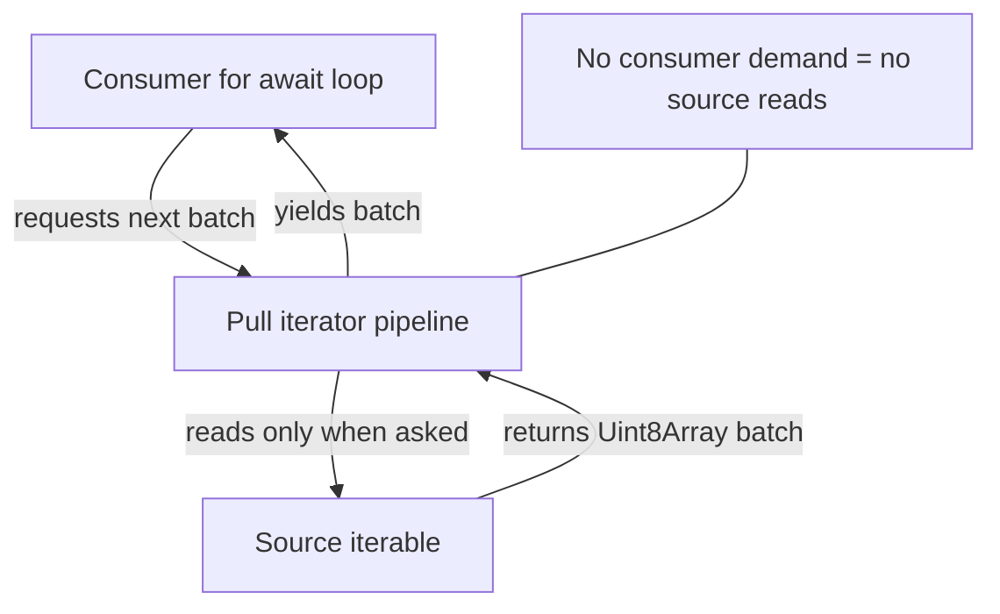
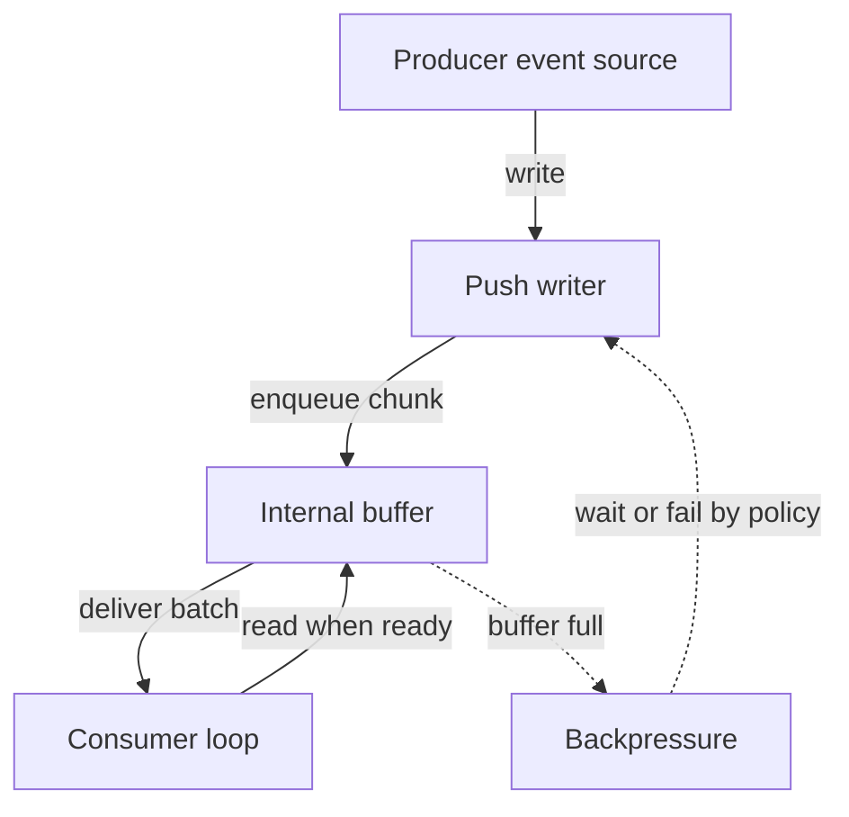

Node 25.9 introduces a new experimental streaming module: [`node:stream/iter`](https://nodejs.org/docs/latest/api/stream_iter.html#iterable-streams). To use it,you must enable it with `--experimental-stream-iter`.

The new API changes the core streams model from class/event-based streams to iterable-based streams.

This post covers:

1. How the new iterable streams model works
2. What it improves over classic Node streams and Web Streams
3. A brief interop boundary with browser streams
4. TypeScript + ESM examples you can adapt today

## Quick Mental Model

With `node:stream/iter`, streams are just iterables of byte batches:

* Async form: `AsyncIterable<Uint8Array[]>`
* Sync form: `Iterable<Uint8Array[]>`

That phrase packs two ideas:

* **Iterable** means you consume data by iterating (`for await...of` for async, `for...of` for sync), not by subscribing to `data` events
* **Byte batches** means each iteration yields an array of byte chunks (`Uint8Array[]`), where each chunk is raw bytes and the outer array groups multiple chunks into one delivery unit

In other words, one loop step gives you a **batch** and then you handle the chunks inside it:

```ts
for await (const batch of source) {
  for (const chunk of batch) {
    // chunk is Uint8Array
  }
}
```

Two things stand out:

1. Everything is bytes (`Uint8Array`)
2. Each iteration yields a batch (`Uint8Array[]`), not a single chunk

The batching is deliberate: it reduces per-chunk async overhead.

## Why this exists

Classic Node streams (`Readable`, `Writable`, `Transform`) are powerful but heavy:

* Event-driven (`'data'`, `'drain'`, `'end'`, `'error'`)
* Class-based extension model
* Easy to accidentally bypass backpressure if you do not wire things carefully

Web Streams are cleaner in many ways, but in Node they still involve a different set of interfaces and adapters.

`node:stream/iter` aims for a simpler composition style:

* Sources are iterables
* Transforms are plain functions or generator-like objects
* Sinks are "writer" objects
* Pipelines are explicit via `pull()` and `pipeTo()`

## Basic Example: pull pipeline



What this shows: pull mode is consumer-driven. The source advances only when the consumer asks for the next batch.

TypeScript + ESM:

```ts
import { from, pull, text } from 'node:stream/iter';

const asciiUpper = (chunks: Uint8Array[] | null): Uint8Array[] | null => {
  if (chunks === null) return null; // flush signal

  return chunks.map((chunk) => {
    const out = new Uint8Array(chunk);
    for (let i = 0; i < out.length; i += 1) {
      if (out[i] >= 97 && out[i] <= 122) out[i] -= 32; // a-z => A-Z
    }
    return out;
  });
};

const stream = pull(from('hello iterable streams'), asciiUpper);
console.log(await text(stream));
```

Run:

```bash
node --experimental-stream-iter --import=tsx ./src/main.ts
```

Use your preferred TypeScript runtime (`tsx`, `ts-node`, or compiled output).

## Basic Example: push pipeline



What this shows: push mode is producer-driven. The producer can outpace the consumer, so backpressure policy controls what happens when the buffer fills.

Push streams fit producer-driven sources, where data arrives as events and is written into a stream.

```ts
import { EventEmitter } from 'node:events';
import { push, text } from 'node:stream/iter';

const emitter = new EventEmitter();
const { writer, readable } = push({ highWaterMark: 8 });

const pendingWrites: Promise<unknown>[] = [];

emitter.on('message', (msg: string) => {
  pendingWrites.push(writer.write(`${msg}\n`));
});

emitter.emit('message', 'alpha');
emitter.emit('message', 'beta');
emitter.emit('message', 'gamma');

try {
  await Promise.all(pendingWrites);
  await writer.end();
} catch (error) {
  writer.fail(error);
  throw error;
}

console.log(await text(readable));
```

The next section covers backpressure as the advanced follow-up: how `push()` behaves when producers outrun consumers.

## What it does better than current Node stream APIs

### 1) Backpressure is explicit and stricter by default

`push()` defaults to `backpressure: 'strict'`, which catches fire-and-forget writes that are easy to miss in large codebases.

"Fire-and-forget writes" means calling `writer.write(...)` without awaiting the returned promise (or otherwise coordinating completion), so writes can pile up faster than consumers drain them.

In strict mode, both buffered slots and pending writes are bounded. If you keep writing without awaiting, the API throws instead of silently growing memory.

```ts
import { push, text } from 'node:stream/iter';

const { writer, readable } = push({ highWaterMark: 4 });

const producing = (async () => {
  for (let i = 0; i < 10; i += 1) {
    await writer.write(`line-${i}\n`); // awaiting preserves backpressure
  }
  await writer.end();
})();

console.log(await text(readable));
await producing;
```

You can still opt into other policies (`'block'`, `'drop-oldest'`, `'drop-newest'`) when your workload needs them.

### 2) Less ceremony for transforms

You can write stateless transforms as plain functions and stateful transforms as async generators. No subclassing required.

```ts
import { from, pull, text } from 'node:stream/iter';

const lines = {
  async *transform(source: AsyncIterable<Uint8Array[] | null>) {
    const decoder = new TextDecoder();
    const encoder = new TextEncoder();
    let partial = '';

    for await (const batch of source) {
      if (batch === null) {
        if (partial) yield [encoder.encode(partial)];
        continue;
      }

      for (const chunk of batch) {
        const data = partial + decoder.decode(chunk, { stream: true });
        const parts = data.split('\n');
        partial = parts.pop() ?? '';

        for (const line of parts) {
          yield [encoder.encode(`${line}\n`)];
        }
      }
    }
  }
};

const out = pull(from('a\nb\nc'), lines);
console.log(await text(out));
```

### 3) Sync fast paths are first-class

Writers can expose sync methods (`writeSync`, `writevSync`, `endSync`) and the pipeline can use a try-fallback pattern for speed-sensitive paths.

This is useful when you are writing adapters around native or low-level sinks.

### Example: sync-first writer with async fallback

In this pattern, we prefer sync writes when available and only pay async overhead when we must.

```ts
import { from, pull } from 'node:stream/iter';

type SinkWriter = {
  writeSync?: (chunk: Uint8Array) => void;
  write?: (chunk: Uint8Array) => Promise<void>;
  endSync?: () => void;
  end?: () => Promise<void>;
};

async function writeBatch(writer: SinkWriter, batch: Uint8Array[]) {
  for (const chunk of batch) {
    if (writer.writeSync) {
      writer.writeSync(chunk);
    } else if (writer.write) {
      await writer.write(chunk);
    } else {
      throw new Error('Writer must implement writeSync() or write()');
    }
  }
}

async function finish(writer: SinkWriter) {
  if (writer.endSync) {
    writer.endSync();
    return;
  }
  await writer.end?.();
}

// Example low-level sink adapter
const out: string[] = [];
const decoder = new TextDecoder();

const writer: SinkWriter = {
  writeSync(chunk) {
    out.push(decoder.decode(chunk));
  },
  endSync() {
    out.push('[done]');
  }
};

const pipeline = pull(from('sync fast path'));
for await (const batch of pipeline) {
  if (!batch) continue;
  await writeBatch(writer, batch);
}
await finish(writer);

console.log(out.join(''));
```

The point is not that everything should be sync. The point is that sync capability is explicit, so you can choose the cheapest path for each sink.

Why prefer sync writes when available:

* They avoid Promise creation and resolution for each chunk
* They avoid microtask scheduling between write steps
* They keep hot loops linear and predictable
* They reduce per-chunk overhead when processing many small chunks

This matters most in CPU-local paths where the destination is immediately available, such as:

* In-memory buffers and ring buffers
* Native bindings that complete writes inline
* Tight transform + emit loops where chunk rates are high

When you should pay async overhead instead:

* The sink is true I/O (network, filesystem, IPC, remote storage)
* The sink can block and must cooperate with event-loop fairness
* Backpressure depends on awaiting readiness signals
* You need cancellation and timeout composition across async boundaries

In those cases, `await writer.write(...)` is not wasted cost; it is the mechanism that keeps memory bounded and throughput stable under load.

A practical decision rule:

* Use sync methods for immediate, non-blocking sinks in performance-sensitive loops
* Use async methods for anything that can stall, queue externally, or requires flow-control signaling

### 4) Multi-consumer patterns are built in

`broadcast()` and `share()` cover common fan-out scenarios directly in the module instead of requiring custom plumbing each time.

They solve different distribution problems:

* `broadcast(source, n)`: clone delivery. Every consumer receives every chunk.
* `share(source, n)`: partitioned delivery. Each chunk goes to one consumer.

Think of it this way:

* `broadcast()` is pub/sub semantics.
* `share()` is worker-pool semantics.

Under the hood, both create multiple derived streams from a single source stream. The key difference is duplication policy:

* In `broadcast()`, each source batch is copied/routed to all outputs before being fully considered consumed.
* In `share()`, each source batch is assigned to one output (implementation-defined scheduling), so total work is distributed.

This difference drives correctness decisions:

* Use `broadcast()` when correctness requires all consumers to see identical data.
* Use `share()` when correctness requires each item to be processed exactly once across the group.

### Example A: `broadcast()` sends every chunk to every consumer

Use this when all subscribers must receive the full stream (for example: metrics + archival + live processing).

```ts
import { from, broadcast, text } from 'node:stream/iter';

const source = from('hello\nworld\n');
const [a, b] = broadcast(source, 2);

const [outA, outB] = await Promise.all([text(a), text(b)]);

console.log('consumer A:', outA); // hello\nworld\n
console.log('consumer B:', outB); // hello\nworld\n
```

How it works:

* A single source is read once.
* Each emitted batch is fanned out to both `a` and `b`.
* If one branch is slower, buffering/backpressure policy determines how the pipeline reacts.

Practical use cases:

* Write the same bytes to storage and to a live websocket feed.
* Send one branch to analytics and another to real-time processing.
* Keep an audit stream while also handling business logic.

Design note: `broadcast()` trades higher fan-out overhead for semantic clarity: every consumer sees the same stream.

### Example B: `share()` splits work across consumers

Use this when each chunk should be handled once total, not duplicated (for example: simple parallel workers).

```ts
import { from, share } from 'node:stream/iter';

const source = from('a\nb\nc\nd\ne\n');
const [w1, w2] = share(source, 2);

const consume = async (name: string, stream: AsyncIterable<Uint8Array[]>) => {
  const decoder = new TextDecoder();
  const seen: string[] = [];

  for await (const batch of stream) {
    if (!batch) continue;
    for (const chunk of batch) {
      seen.push(decoder.decode(chunk));
    }
  }

  return { name, seen: seen.join('') };
};

const results = await Promise.all([
  consume('worker-1', w1),
  consume('worker-2', w2)
]);

console.log(results);
// Combined output across workers is the full source,
// but each worker receives only part of the stream.
```

How it works:

* A single source is read once.
* Each batch is assigned to one worker stream (`w1` or `w2`).
* No duplication means lower total processing cost than `broadcast()` for CPU-bound tasks.

Important behavior:

* Distribution is not guaranteed to be perfectly even.
* Consumer timing affects who receives which batches.
* Ordering is preserved per worker stream, but global ordering across workers is split by assignment.

Practical use cases:

* Parallel parsing, validation, or enrichment workers.
* CPU-heavy transforms where duplicate work would be wasteful.
* Task-queue style processing with one-pass semantics.

If you need to reassemble output in original order after `share()`, include sequence numbers before distributing work and sort/merge on the way out.

Rule of thumb:

* Use `broadcast()` when every consumer needs every byte
* Use `share()` when you want load distribution

## Better than Web Streams?

The answer is workload-dependent.

`node:stream/iter` advantages:

* Byte-first model with normalized `Uint8Array`
* Batch-oriented iteration, which can reduce promise churn
* Backpressure policies with strict detection mode
* Plain iterable transforms that feel close to generator pipelines

Web Streams advantages:

* Standardized across browsers and server runtimes
* Wider ecosystem integration for web platform APIs
* Better fit when your primary execution target is the browser

For Node-heavy data pipelines, `node:stream/iter` can be easier to reason about and optimize. For cross-runtime browser-first libraries, Web Streams often remain the safer default.

## Interop with browser streams

`node:stream/iter` is Node-specific and experimental, so the practical interop boundary is adapters between `ReadableStream<Uint8Array>` and iterable sources.

This interoperability technique applies to both browser Web Streams and Node's WHATWG Web Streams implementation (available via globals and `node:stream/web`). The adapter pattern is the same in both cases.

If you need browser-originated data in a Node iterable-stream pipeline, one adapter is usually enough:

```ts
import { from, text } from 'node:stream/iter';

async function* readableStreamToAsyncIterable(
  rs: ReadableStream<Uint8Array>
): AsyncGenerator<Uint8Array> {
  const reader = rs.getReader();
  try {
    while (true) {
      const { value, done } = await reader.read();
      if (done) return;
      if (value) yield value;
    }
  } finally {
    reader.releaseLock();
  }
}

const browserStyleStream = new ReadableStream<Uint8Array>({
  start(controller) {
    controller.enqueue(new TextEncoder().encode('hello from web stream'));
    controller.close();
  }
});

const source = from(readableStreamToAsyncIterable(browserStyleStream));
console.log(await text(source));
```

For this article, that boundary is enough: keep the core focus on Node's iterable streams model.

## Caveats before adopting

* The API is experimental (`Stability: 1`)
* The API surface may change between releases, so pin your Node version and re-test before upgrades
* The model is byte-oriented; object-mode patterns from classic streams require adaptation
* Ecosystem tooling is still catching up compared to classic Node streams and Web Streams

## Should you use it now?

Because this is an experimental (Stability 1) API, "use it now" should mean **evaluate in controlled contexts**, not "default choice for production-critical paths."

Evaluate it now if you:

* Build Node-only, stream-heavy workloads where you can test behavior under load before rollout
* Want strict backpressure defaults specifically to catch fire-and-forget write bugs early
* Prefer iterable/generator composition and can afford occasional migration work while the API evolves

Wait (or isolate behind an adapter) if you:

* Need stable API guarantees for long-lived production code
* Ship shared libraries where downstream users cannot easily absorb breaking API changes
* Require browser/server parity without a Node-specific integration layer

## Links and resources

* [Node docs: Iterable Streams (`node:stream/iter`)](https://nodejs.org/docs/latest/api/stream_iter.html#iterable-streams)
* [Node docs: `node:zlib/iter`](https://nodejs.org/docs/latest/api/zlib_iter.html)
* [Node docs: Classic streams (`node:stream`)](https://nodejs.org/docs/latest/api/stream.html)
* [MDN: Streams API](https://developer.mozilla.org/en-US/docs/Web/API/Streams_API)
