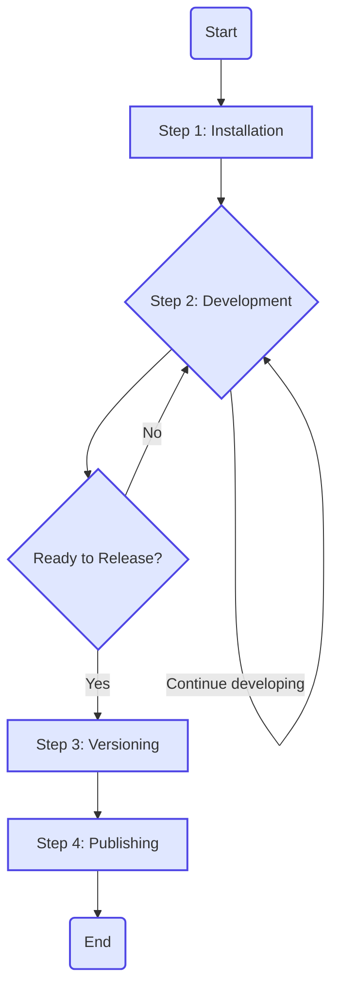

Managing monorepos, a single repository with multiple packages (each with its own package.json and dependencies), can be challenging. This is where NPM workspaces come in.

This post will cover what are NPM workspaces, how to use them, how they compare with Yarn and PNPM workspaces and how they interact with monorepo tools like Lerna and Nx.

## What are workspaces?

NPM workspaces are a feature built into the npm CLI that allows you to manage multiple distinct packages from within a single, top-level root package. It's the native solution for creating a monorepo.

You define a workspace by adding a workspaces array to the root package.json file. This array contains file paths or glob patterns that point to the individual packages.

```json
{
  "name": "my-monorepo",
  "version": "1.0.0",
  "workspaces": [
    "packages/*",
    "apps/my-website"
  ]
}
```

When you run npm install in the root directory, npm does two crucial things:

1. It installs all dependencies from all workspace packages into a single `node_modules` folder at the root level
2. It creates symbolic links (symlinks) from the root `node_modules` folder to your local package folders.

## Why Use NPM Workspaces?

Using workspaces offers several significant advantages, especially as projects grow in complexity.

* **Simplified Dependency Management**: Instead of having a separate `node_modules` folder for each package, most dependencies are "hoisted" to the root. This reduces disk space usage, speeds up installation, and, most importantly, ensures all packages in the monorepo use the same version of a given dependency, preventing version conflicts and subtle bugs.

* **Automatic Local Linking**: This is the killer feature for monorepo development. If one of your packages (e.g., a shared UI library `@my-repo/ui-kit`) is listed as a dependency in another package (e.g., `my-website`), you don't need to publish the UI library to use it. The symlinking process means you can import or require it by name, and your changes to the UI library are instantly reflected in the website during local development. This creates a seamless and efficient workflow.
* **Streamlined Commands**: You can run npm commands across all workspaces simultaneously from the root directory using the --workspaces (or -ws) flag. For example, npm test --workspaces will run the test script in every package that has one. You can also target a specific workspace with the --workspace=<name> flag.

* **Enhanced Code Sharing and Reusability**: Workspaces make it trivial to extract shared logic, components, or utilities into their own packages. This promotes code reuse and consistency across your entire application suite. For instance, a utils package can be used by both your frontend application and your backend API.
* **Enhanced Code Sharing and Reusability**: Workspaces make it trivial to extract shared logic, components, or utilities into their own packages. This promotes code reuse and consistency across your entire application suite. For instance, a utils package can be used by both your frontend application and your backend API.

## Comparison with Yarn and pnpm Workspaces

While NPM provides a native workspace solution, Yarn and pnpm are popular alternatives that offer their own implementations with distinct advantages. The primary differences lie in how they structure the `node_modules` directory and manage dependencies.

| Feature | NPM / Yarn Classic | pnpm |
| ------- | ------------------ | ---- |
| node_modules Structure | Flat (Hoisted) | Symlinked (Non-flat) |
| | All dependencies are hoisted to the root node_modules folder. This can lead to "phantom dependencies," where packages can access dependencies they don't explicitly declare. | Only direct dependencies are accessible at the top level of node_modules. All packages are stored in a global, content-addressable store and linked into projects, preventing phantom dependencies. |
| Disk Space Usage | High | Very Low |
| | Each monorepo duplicates its dependencies. If you have 10 projects using React, you have 10 copies of React on your machine. | Packages are stored once in a global store on your machine. Projects use hard links to these files, meaning a package is only ever stored once, regardless of how many projects use it. |
| Performance | Good | Excellent |
| | npm has improved significantly, but can still be slower than alternatives, especially on large projects. | The linking strategy and global store make pnpm extremely fast, as it avoids copying files and re-uses existing packages whenever possible. |
| Strictness | Low | High |
| | The flat structure allows for accidentally importing packages that aren't listed in a project's package.json. | The symlinked structure enforces that a project can only access dependencies it has explicitly defined, leading to more reliable and less buggy code. |

In short:

NPM Workspaces are the built-in, standard choice.

Yarn Workspaces (especially "Classic") are very similar to NPM's implementation and were a popular predecessor. Yarn Berry (v2+) introduces a "Plug'n'Play" mode that changes dependency resolution entirely by getting rid of node_modules, which is a more advanced use case.

pnpm Workspaces are the best choice for performance and disk space efficiency, offering a stricter dependency model that can prevent common bugs in large monorepos.

## Interaction with Monorepo Tools: Lerna and Nx

While NPM workspaces provide the fundamental mechanics for managing monorepos, higher-level tools like Lerna and Nx build upon this foundation to offer more advanced capabilities.

* **NPM Workspaces as the Foundation**: Modern versions of both Lerna and Nx leverage NPM (or Yarn/pnpm) workspaces for the core tasks of dependency installation and linking. They treat workspaces as the underlying engine for managing the `node_modules` structure.
* **Lerna: For Versioning and Publishing**: Lerna was a pioneering tool in the monorepo space, created before package managers had native workspace support. Today, it works in concert with workspaces to solve a different set of problems: versioning and publishing. While NPM can run scripts, Lerna excels at orchestrating complex release workflows.
  * **Key Lerna Features**:
    * **Coordinated Versioning**: It can automatically update the versions of all packages in the monorepo together (fixed mode) or allow packages to be versioned independently.
    * **Smart Publishing**: It can identify which packages have changed since the last release and publish only those updated packages to the NPM registry.
    * **Changelog Generation**: It integrates with conventional commits to automatically generate CHANGELOG.md files.
  * You would use Lerna on top of NPM workspaces when you need sophisticated control over how your packages are versioned and published to the world.
* **Nx: A Full-Featured Build System**: Nx is a more comprehensive build system that also uses NPM workspaces as its foundation. It goes far beyond versioning and publishing to optimize the entire development and CI/CD process. It is particularly powerful for large, complex, and enterprise-grade monorepos.
  * **Key Nx Features**:
    * **Smart Task Running**: Nx analyzes your code and builds a dependency graph. This allows it to run tasks (like tests or builds) only on the projects that were actually affected by a code change.
    * **Computation Caching**: It caches the results of tasks like build and test. If you run a command again without any relevant changes, it can restore the results from the cache in seconds, dramatically speeding up CI.
    * **Dependency Graph Visualization**: Provides an interactive graph to help you understand the relationships and dependencies between all the projects in your workspace.
    * **Code Generation & Scaffolding**: Offers powerful code generators to create new applications, libraries, and components that adhere to best practices.
  * You would use Nx when your primary goal is to optimize your development workflow, speed up your CI/CD pipelines, and enforce consistency across a large and growing monorepo.

In Summary:

| Tool | Primary Role | When to Use It |
| --- | --- | --- |
| NPM Workspaces | Foundation: Handles dependency installation and local package linking. | For any monorepo project. It's the native, built-in starting point. |
| Lerna | Publisher: Manages package versioning and publishing to the NPM registry. | When you need to publish multiple packages and require advanced release management. |
| Nx | Build System: Optimizes tasks, caches results, and manages the dependency graph. | For complex monorepos where build performance, CI speed, and architectural consistency are critical. |

You can start with just NPM workspaces and adopt Lerna or Nx later as your project's needs evolve.

## Example: Integrating NPM Workspaces with Lerna

The following example shows how to structure a monorepo using both NPM Workspaces for dependency management and Lerna for versioning and publishing.

### Directory Structure

Your file system would look like this. Notice the single `node_modules` at the root.

```text
my-lerna-repo/
├── packages/
│   ├── a/
│   │   └── package.json
│   ├── b/
│   │   └── package.json
│   ├── c/
│   │   └── package.json
│   └── d/
│       └── package.json
├── node_modules/
├── lerna.json
└── package.json
```

### Root package.json

This file defines the workspaces and adds Lerna as a dev dependency.

```json
{
  "name": "my-lerna-repo",
  "private": true,
  "workspaces": [
    "packages/*"
  ],
  "devDependencies": {
    "lerna": "^8.1.2"
  }
}
```

### lerna.json Configuration

This file configures Lerna's behavior. Here, we tell Lerna to use the NPM client, leverage the workspaces defined in package.json, and manage versions independently for each package.

```json
{
  "$schema": "node_modules/lerna/schemas/lerna-schema.json",
  "version": "independent",
  "npmClient": "npm",
  "useWorkspaces": true
}
```

### Individual Package Configurations

Each package has its own `package.json`. Here's how you would define dependencies between them.

`packages/d/package.json` (A base utility, no dependencies)

```json
{
  "name": "@my-repo/d",
  "version": "1.0.0"
}
```

`packages/c/package.json` (Depends on package d)

```json
{
  "name": "@my-repo/c",
  "version": "1.0.0",
  "dependencies": {
    "@my-repo/d": "^1.0.0"
  }
}
```

`packages/b/package.json` (Another base utility)

```json
{
  "name": "@my-repo/b",
  "version": "1.1.0"
}
```

`packages/a/package.json` (An app that depends on b and c)

```json
{
  "name": "@my-repo/a",
  "version": "1.0.0",
  "dependencies": {
    "@my-repo/b": "^1.1.0",
    "@my-repo/c": "^1.0.0"
  }
}
```

### Common Workflow

The following diagram illustrates the typical workflow when using NPM workspaces with Lerna, the explanation of the steps follows:



1. **Installation**: Run `npm install` in the root directory. NPM will install all external dependencies (like React, Lodash, etc.) into the root `node_modules` and create symlinks for the internal dependencies (e.g., inside packages/a/node_modules, @my-repo/b will be a symlink to packages/b)
2. **Development**: Make changes to any package. Because of the symlinks, changes in a dependency (like package d) are immediately reflected in the packages that use it (like package c)
3. **Versioning**: When you're ready to release, run `lerna version`. Lerna will prompt you for new version numbers for the packages that have changed since the last release, update their `package.json` files, and create a git commit and tag
4. **Publishing**: Run `lerna publish`. Lerna will identify the updated packages and publish them to the NPM registry.

This setup gives you the best of both worlds: NPM's efficient local dependency management and Lerna's powerful versioning and publishing orchestration.
