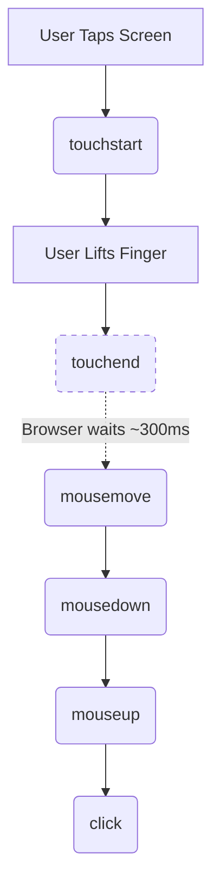

How we interact with the web has evolved significantly. The days of a single mouse pointer on a desktop monitor are long gone. Today, users expect seamless interactions across a wide range of devices: touchscreens, styluses, trackpads, and even emerging input methods like voice and gesture control. To handle this range of inputs, developers had to write complex, separate event listeners for `MouseEvent` and `TouchEvent` interfaces. This led to bloated codebases, fragile abstractions, and complex edge cases.

The Pointer Events API, initially championed by Microsoft in Internet Explorer 10 and eventually standardized by the W3C, solves this fragmentation. It provides a single, unified interface for handling hardware-agnostic pointer input, dramatically simplifying how we build interactive web applications.

This post will explore the history of pointer events, the problems they solve, and how to implement them in modern web development.

## The Problem: Mouse vs. Touch Events and the "Ghost Click"

Before pointer events, supporting multi-device interactions was a frustrating experience. It required binding multiple event listeners to the same element. If you wanted to create a draggable UI slider, you had to explicitly account for both mousedown (for desktop users) and touchstart (for mobile users).

### The 300ms Delay and Ghost Clicks

The legacy approach also suffered from the infamous "ghost click" problem. Because early mobile browsers had to ensure legacy websites still functioned, they implemented a compatibility layer. When a user tapped a screen, the browser would fire touch events, wait roughly 300 milliseconds to see if the user was going to double-tap to zoom, and only then fire a synthetic mouse event.

The sequence looked like this:



If developers bound both touch and mouse events to a button to make it feel responsive, the application would often register the action twice. Developers often used `event.preventDefault()` inside touch handlers, or relied on heavy polyfills like FastClick.js, to reduce the follow-up mouse events that some browsers would synthesize milliseconds later. Pointer events bypass this entirely by offering a single event stream.

Now let's see the unified model that replaces all of this.

## What Are Pointer Events?

Pointer events represent a unified, standardized model for user input on the web. A "pointer" is defined as any hardware-agnostic graphical target that can point to a specific coordinate on a screen. This abstraction means a single API now natively handles input from:

* A traditional computer mouse or trackpad.
* One or more fingers on a touchscreen (for example, an iPad, iPhone, or other mobile device).
* A stylus or active pen (like an Apple Pencil, Surface Pen, or Wacom tablet).

The necessity of this API becomes obvious when considering modern "hybrid" or "2-in-1" devices. A user on an iPad Pro with a Magic Keyboard might click a button with their trackpad, scroll the resulting page with their finger, and then sign a document with their Apple Pencil—all within the same session.

The API defines the `PointerEvent` interface, which inherits all properties from the traditional `MouseEvent` interface. This ensures backward compatibility and familiarity while adding powerful new properties to account for the unique capabilities of touch and pen devices (such as pressure, contact geometry, multi-touch tracking, and tilt).

## How Pointer Events Work

Pointer events simplify the interaction model by mapping directly to the legacy mouse event names, replacing the mouse prefix with pointer.

Here is how the core events map in the DOM event lifecycle:

* `pointerdown`: Fires when a pointer becomes active. For a mouse, this is when a button is pressed. For touch/pen, this is the exact moment physical contact is made with the screen.
* `pointermove`: Fires continuously when a pointer changes coordinates.
* `pointerup`: Fires when a pointer is no longer active (mouse button released, or finger/pen lifted off the screen).
* `pointercancel`: Fires when the browser interrupts the pointer interaction. For example, if the user starts dragging an element, but the browser interprets the gesture as a screen pan, or if the device orientation suddenly changes. Handling this is crucial for robust touch interactions.
* `pointerover`, `pointerenter`, `pointerout`, `pointerleave`: These handle hover states, mirroring their mouse equivalents exactly.

### Key Properties of the `PointerEvent` Interface

Because `PointerEvent` inherits from `MouseEvent`, you still have access to foundational properties like `clientX`, `clientY`, `pageX`, `altKey`, and `target`. However, it unlocks several powerful new properties specifically designed for modern hardware:

* `pointerId`: A unique integer identifier for the specific pointer causing the event. This is essential for tracking multi-touch gestures (like pinch-to-zoom or multi-finger rotation). Every time a new finger touches the screen, it is assigned a unique, active `pointerId`.
* `pointerType`: A string indicating the hardware device type. The standard values are "mouse", "pen", or "touch". (If the browser cannot determine the device, it returns an empty string).
* `isPrimary`: A boolean that returns true if this pointer is the "primary" pointer of its type. In a multi-touch scenario, the first finger to touch the screen is primary; subsequent fingers are not. This is useful when you only want to process single-finger interactions and ignore complex gestures.
* `pressure`: A normalized float value between 0.0 and 1.0 representing the physical pressure applied by a stylus or force-touch screen. This is the backbone of web-based drawing applications.
* `tiltX` and `tiltY`: The plane angle (in degrees, between -90 and 90) of a stylus relative to the screen. Digital art apps use this to simulate shading with the side of a pencil.
* `twist`: The clockwise rotation (0 to 359 degrees) of a stylus around its own major axis.
* `width` and `height`: The physical contact geometry of the pointer in CSS pixels, allowing you to determine the size of a finger press (useful for heatmaps or dynamic UI adjustments).

## Replacing Mouse and Touch Events

Migrating to pointer events significantly reduces code size. You replace your existing, duplicated mouse and touch listeners with single pointer listeners.

### The Old Legacy Approach

Previously, implementing a generic interaction required convoluted logic to detect the event type and extract coordinates from arrays of touches:

```ts
const interactiveElement = document.querySelector('.interactive') as HTMLElement;

function handleStart(event: MouseEvent | TouchEvent): void {
  event.preventDefault(); // Stop ghost clicks

  let x, y;
  if ('touches' in event) {
    // Extracting touch coordinates is tedious
    x = event.touches[0].clientX;
    y = event.touches[0].clientY;
    console.log('Started with touch at', x, y);
  } else {
    x = event.clientX;
    y = event.clientY;
    console.log('Started with mouse at', x, y);
  }
}

// Bind both sets of events
interactiveElement.addEventListener('mousedown', handleStart);
interactiveElement.addEventListener('touchstart', handleStart, { passive: false });
```

### The Modern Pointer Events Approach

With pointer events, the implementation is beautifully concise. You get the same coordinates regardless of input method:

```ts
const interactiveElement = document.querySelector('.interactive') as HTMLElement;

function handlePointerStart(event: PointerEvent): void {
  // One event handles mouse, touch, and pen with identical coordinate properties
  console.log(`Started with ${event.pointerType} at X:${event.clientX}, Y:${event.clientY}`);

  if (event.pointerType === 'pen') {
    console.log(`Stylus pressure is currently at ${event.pressure * 100}%`);
  }
}

// Bind a single event
interactiveElement.addEventListener('pointerdown', handlePointerStart);
```

## Accessibility and Pointer Events

Adopting pointer events naturally aligns with modern web accessibility guidelines, specifically the Web Content Accessibility Guidelines (WCAG) 2.1.

WCAG Criterion 2.5.2 ("Pointer Cancellation") requires that user interface components should generally not execute an action on the down event (like `pointerdown`). Instead, actions should be executed on the up event (`pointerup` or `click`).

This allows a user who touches the wrong button on a mobile device to slide their finger away from the target before lifting it, effectively canceling the unintended action. If they release away from the original control, that control should not activate. Other elements may still receive pointer events during the movement, but activation should occur only when a complete interaction is performed on the intended target.

For standard DOM elements like buttons and links, the native click event handles this out-of-the-box (see the Compatibility section below). If you are building custom WebGL or Canvas-based user interfaces where native click events do not apply to your rendered shapes, you must manually implement this cancellation logic by tracking where the `pointerdown` occurred and verifying that the `pointerup` coordinates still intersect with the same logical target area.

### Why Use `click` Instead of `pointerup`?

It might seem counterintuitive that a guide about Pointer Events recommends using the `click` event, which is technically a `MouseEvent`, for accessibility and interface activation. However, `click` is the correct event for standard user interface activation.

While Pointer Events (`pointerdown`, `pointermove`, `pointerup`) excel at tracking physical movements across the screen (like dragging, swiping, or drawing), they are low-level hardware events. If a developer relied solely on `pointerup` to trigger a button, the event would fire the moment the user lifted their finger, even if they had slid it completely off the button to cancel the action.

The native `click` event handles this cancellation logic automatically. Furthermore, `click` serves as a universal, device-independent activation event due to two critical browser behaviors:

1. The browser compatibility layer: To ensure backward compatibility, modern browsers synthesize a `click` event for touch and pen inputs. When a user taps a button, the browser fires `pointerdown`, then `pointerup`. If the release occurs on the same element as the press, the browser automatically fires a standard `click` event.
2. Device independence: If a user navigates a site using a keyboard and presses the Enter or Spacebar key while focused on a button, the browser fires a `click` event. It does not fire a `pointerup` event because no physical pointing device was involved.

Here is an example of what to avoid and how to implement it correctly:

```ts
const submitBtn = document.querySelector('.submit-btn') as HTMLButtonElement;

// BAD: Action executes immediately on press.
submitBtn.addEventListener('pointerdown', (event: PointerEvent) => {
  submitForm();
});

// GOOD: Use the native 'click' event for activation.
submitBtn.addEventListener('click', (event: MouseEvent) => {
  submitForm();
});
```

## Compatibility and Event Emulation

Modern browsers balance compatibility under the hood to ensure that new APIs do not break older websites. Understanding how browsers emulate touch and mouse events is vital for debugging interactions.

### Legacy Mouse Event Emulation

When a user interacts with touch or pen input, browsers fire Pointer Events first. For compatibility with older code, browsers may also dispatch legacy mouse-compatible events (such as mousedown, mouseup, and click), with exact sequencing varying by browser and interaction context.

In practice, a single tap can trigger Pointer Events first, followed by compatibility touch/mouse events (including `click`), depending on browser behavior.

When adopting Pointer Events, you generally want to avoid processing these synthesized legacy events to prevent double-firing logic. Using the CSS touch-action property correctly often disables the generation of these compatibility mouse events, ensuring a clean event stream.

### Feature Detection and Fallbacks

While all modern browsers fully support Pointer Events, you may occasionally need to support highly antiquated or embedded browsers. You can safely implement a fallback pattern using straightforward feature detection:

```ts
const element = document.querySelector('.interactive') as HTMLElement;

if (window.PointerEvent) {
  // Safe to use modern pointer events
  element.addEventListener('pointerdown', handlePointerStart);
} else {
  // Fallback to the legacy, multi-event approach
  element.addEventListener('mousedown', handleStart);
  element.addEventListener('touchstart', handleStart);
}
```

## Advanced Features: Touch Action and Pointer Capture

When building complex, app-like interactions such as drag-and-drop kanban boards, custom range sliders, or WebGL drawing canvases, you must manage two specific browser behaviors: default touch actions and pointer capture.

### Managing Browser Defaults with `touch-action`

> **Advanced topic**: Understanding the `touch-action` property is necessary when building applications like games or custom drawing interfaces. In these scenarios, native browser gestures (like scrolling or zooming) can interfere with your custom interactions. If you are building standard web forms or simple buttons, you can safely skip this section.

By default, mobile browsers actively listen to touch events to perform native actions like panning (scrolling), zooming, and text selection. If you build a custom drawing canvas, the browser will likely attempt to scroll the page when the user drags their finger to draw a line.

To prevent the browser from hijacking your interactions, use the CSS `touch-action` property. This property acts as a declarative instruction, telling the browser which native touch gestures it is allowed to handle. Your JavaScript can safely process whatever is left over.

```css
/* Disable ALL browser panning, zooming, and double-tap-to-zoom on the canvas.
   Essential for games and drawing apps. */
.drawing-canvas {
  touch-action: none;
}

/* Allow native vertical scrolling, but reserve horizontal swipes for JavaScript
   (perfect for an image carousel or a swipe-to-delete list item). */
.image-carousel {
  touch-action: pan-y;
}

/* Allow panning, but disable native pinch-to-zoom */
.custom-map-component {
  touch-action: pan-x pan-y;
}
```

### The Magic of Pointer Capture

> **Advanced topic**: Pointer capture is essential for building robust drag-and-drop interfaces or custom sliders. It prevents interactions from breaking when a user's rapid movement accidentally pulls the pointer outside the element's physical boundaries. If your application does not require complex drag interactions, you can safely skip this section.

A common bug in custom web UI occurs when a user clicks and drags a slider rapidly. Their finger or mouse often moves faster than the DOM can update, slipping outside the physical bounding box of the slider handle. Normally, when the pointer leaves the element, pointermove and pointerup events stop firing on that specific element, breaking the drag interaction and leaving the slider stuck to the user's cursor.

Historically, developers fixed this by attaching `mousemove` and `mouseup` events globally to the document or window upon initial click, which was inefficient and messy to clean up.

Pointer capture solves this elegantly. It allows you to retarget all subsequent pointer events to a specific element, regardless of where the pointer moves on the screen.

```ts
const sliderHandle = document.querySelector('.slider-handle') as HTMLElement;

function onPointerDown(event: PointerEvent): void {
  const element = event.currentTarget as HTMLElement;

  // Exclusively lock the pointer to this element.
  // Pointer capture keeps move/up events routed here, even outside element bounds.
  element.setPointerCapture(event.pointerId);

  // It is best practice to attach move/up listeners ONLY when dragging starts
  element.addEventListener('pointermove', onPointerMove);
  element.addEventListener('pointerup', onPointerUp);
  element.addEventListener('pointercancel', onPointerUp); // Don't forget cancel!
}

function onPointerMove(event: PointerEvent): void {
  // This fires seamlessly even if the cursor is miles outside the slider
  updateSliderPosition(event.clientX);
}

function onPointerUp(event: PointerEvent): void {
  const element = event.currentTarget as HTMLElement;

  // Release the capture to return event routing to normal
  element.releasePointerCapture(event.pointerId);

  // Clean up memory
  element.removeEventListener('pointermove', onPointerMove);
  element.removeEventListener('pointerup', onPointerUp);
  element.removeEventListener('pointercancel', onPointerUp);
}

sliderHandle.addEventListener('pointerdown', onPointerDown);
```

## Conclusion

Pointer events provide a robust, resilient, and future-proof API for web interactions. By abstracting away the specifics of the hardware layer, they allow developers to write significantly less code while supporting a broader range of modern devices and input contexts. When building interactive components today, you should default to using pointer events coupled with the CSS touch-action property. This modern approach ensures a seamless, native-feeling experience across desktops, tablets, and mobile devices without the technical debt of legacy event handling.

As a default recipe, start with this:

1. Use `pointerdown`, `pointermove`, and `pointerup` for gesture tracking (dragging, drawing, swiping).
2. Use `click` for activation on standard controls so cancellation and keyboard input work correctly.
3. Add `touch-action` and pointer capture when building custom drag or canvas-style interactions.
