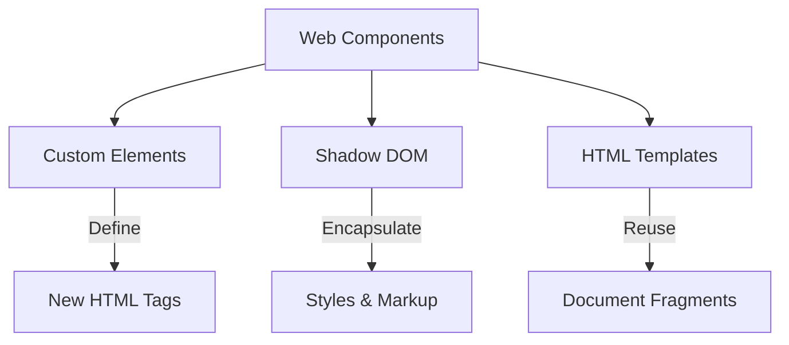
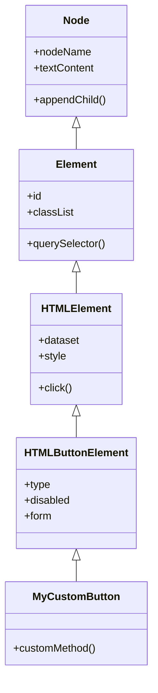
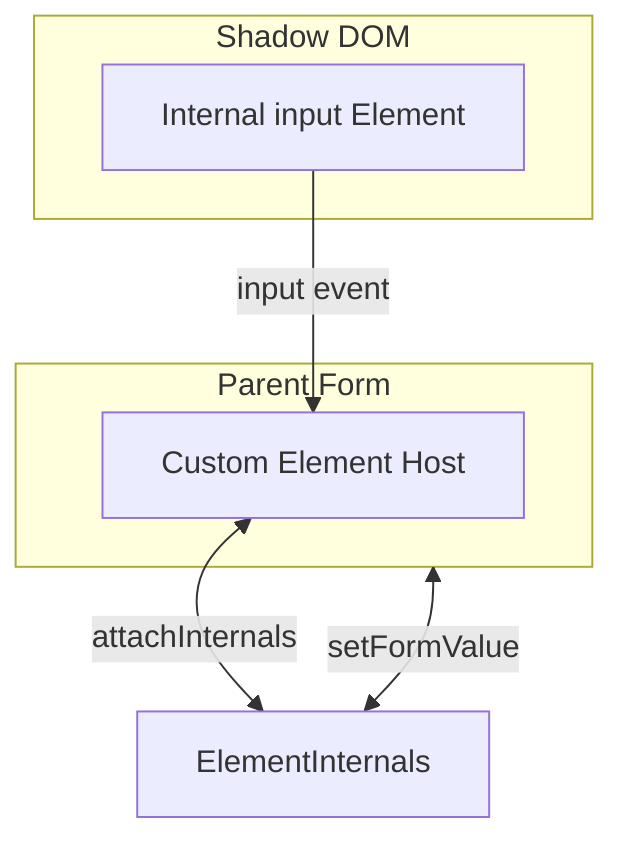

Web Components comprise a suite of technologies for creating reusable custom elements. By encapsulating functionality from the rest of the application code, Web Components provide a standards-based approach to building widgets native to the browser. Unlike components in frameworks like React or Vue, Web Components rely on W3C-standardized APIs to define new HTML tags, encapsulate styles, and manage lifecycle events without external dependencies.

## The Web Components Umbrella

The term "Web Components" refers to three main technologies used in tandem:



* **Custom Elements**: A set of JavaScript APIs that allow you to define custom elements and their behavior.
* **Shadow DOM**: A set of JavaScript APIs for attaching an encapsulated "shadow" DOM tree to an element. This tree renders separately from the main document DOM, ensuring that component styles do not leak out and global styles do not leak in.
* **HTML Templates**: The `<template>` and `<slot>` elements allow you to write markup templates that the browser does not render on the main page.

## Getting Started: The Basics

If you are new to Web Components, think of them as a way to create your own HTML tags (like `<my-button></my-button>` or `<user-card></user-card>`) that work in any browser without needing a framework.

To get started, you only need two things:

* **A JavaScript Class**: This defines how your component looks and behaves.
* **A Custom Elements Registry Call**: This tells the browser, "Every time you see `<my-tag>`, use this class."

```ts
class MyComponent extends HTMLElement {
  constructor() {
    super();
    this.innerHTML = "<h1>Hello World</h1>";
  }
}

customElements.define('my-component', MyComponent);
```

Security: Avoid using `innerHTML` with untrusted content—prefer `textContent`, templates, DOM APIs, or sanitized HTML to prevent XSS.

Once you define the component, you can use `<my-component></my-component>` anywhere in your HTML. Note that custom elements cannot be self-closing; you must always include an explicit closing tag, even if the element has no children.

### Quick Decision Checklist

* **Shadow vs Light DOM:** Use Shadow DOM for visual/style encapsulation and predictable CSS; use Light DOM when you need framework-integration or CSS cascade access. (High-level tradeoff: encapsulation vs integration.)
* **Element naming rule / Autonomous vs Customized-built-in:** Custom element names must include a hyphen (for example `my-widget`) and avoid reserved or generic names. Prefer autonomous custom elements (`<my-element>`) for broadest compatibility; use customized built-ins (`extends HTMLButtonElement`) only when you need native semantics and are targeting browsers that support it.
* **Form participation:** If your element participates in forms, use `ElementInternals` with `static formAssociated = true` and `internals.setFormValue()`.
* **Security:** Avoid `innerHTML` with untrusted content — prefer `textContent`, templates, or DOM APIs and sanitize any HTML before insertion.

## Core Concepts — Patterns

### Basic Custom Elements

Define a class that extends `HTMLElement` and register it with the custom elements registry. Keep the class focused on lifecycle and behavior; use templates for markup when possible.

```ts
class MyGreeting extends HTMLElement {
  constructor() {
    super();
    this.attachShadow({ mode: 'open' });
    this.shadowRoot!.innerHTML = `<span>Hello, Web Components!</span>`;
  }
}

customElements.define('my-greeting', MyGreeting);
```

### HTML Templates & Slots

Templates and slots belong early in the learning path because they are commonly used inside shadow roots. Define templates once (module scope) and reuse them across instances to avoid re-parsing.

```ts
const cardTemplate = document.createElement('template');
cardTemplate.innerHTML = `
  <style>
    .card { border: 1px solid #ccc; padding: 1rem; border-radius: 8px; font-family: sans-serif; }
    ::slotted(h2) { margin-top: 0; color: navy; }
  </style>
  <div class="card">
    <header><slot name="title">Default Title</slot></header>
    <hr>
    <main><slot></slot></main>
  </div>
`;

class InfoCard extends HTMLElement {
  constructor() {
    super();
    this.attachShadow({ mode: 'open' });
    this.shadowRoot?.appendChild(cardTemplate.content.cloneNode(true));
  }
}

customElements.define('info-card', InfoCard);
```

#### Usage Example

```html
<info-card>
  <h2 slot="title">Web Component News</h2>
  <p>Custom elements allow you to create reusable widgets.</p>
  <p>Slots make those widgets highly flexible.</p>
</info-card>
```

!!! note **Tip: Template Scoping**
Defining the template in the module scope (outside the class) ensures the browser parses the HTML string exactly once. If defined inside the constructor, every new instance would re-parse the template, wasting resources.
!!!

### Shadow DOM

Attach a Shadow Root to encapsulate styles and markup. The Shadow DOM ensures component styles don't leak out and global styles don't leak in.

```ts
const greetingTemplate = document.createElement('template');
greetingTemplate.innerHTML = `
  <style>
    span { color: var(--greeting-color, #333); font-weight: bold; }
  </style>
  <span>Hello, Web Components!</span>
`;

class Greeting extends HTMLElement {
  constructor() {
    super();
    const shadow = this.attachShadow({ mode: 'open' });
    shadow.appendChild(greetingTemplate.content.cloneNode(true));
  }
}

customElements.define('x-greeting', Greeting);
```

### Components Without Shadow DOM (Light DOM)

You are not required to use Shadow DOM. If you omit `attachShadow`, your component renders into the Light DOM.

**CSS Behavior**: Elements inside a Light DOM component behave like normal HTML. They inherit global styles and respond to any CSS selector.

**Accessibility**: ID references (like `aria-labelledby`) work normally because all elements exist in the same document scope.

**When to use**: Use Light DOM when your component needs to integrate deeply with a global design system or framework (like Tailwind or Bootstrap).

### The Component Lifecycle

Understanding the component lifecycle prevents errors related to timing and document context. The most critical distinction is between the `constructor` and the `connectedCallback`.

The `constructor` runs when the browser creates the JavaScript object in memory. The `connectedCallback` runs only when the browser actually inserts the element into the Document Object Model (DOM).

| Feature | constructor | connectedCallback |
| --- | --- | --- |
| Execution Time | Object instantiation (in memory). | Element insertion (in the DOM). |
| Execution Frequency | Exactly once per instance. | Every time the element adds to the DOM. |
| Role | Attach Shadow DOM, define internal structure. | Fetch data, read attributes, attach global events. |
| Attribute Access | No (throws errors or returns null). | Yes. |

### Lifecycle Example

This example demonstrates the correct placement of setup logic, data fetching, and cleanup.

```ts
class LifecycleElement extends HTMLElement {
  private abortController: AbortController | null = null;

  constructor() {
    super();
    // Safe: Attaching the shadow DOM and initial structural HTML
    const shadow = this.attachShadow({ mode: 'open' });
    shadow.innerHTML = `<p>Loading...</p>`;

    // UNSAFE: this.getAttribute('data-id') would return null here.
  }

  connectedCallback(): void {
    // Safe: Reading attributes now that the element exists in the DOM
    const dataId = this.getAttribute('data-id') || 'default';

    // Safe: Starting network requests
    this.fetchData(dataId);
  }

  disconnectedCallback(): void {
    // Always clean up processes started in connectedCallback
    if (this.abortController) {
      this.abortController.abort();
    }
  }

  private async fetchData(id: string): Promise<void> {
    this.abortController = new AbortController();
    try {
      const response = await fetch(`https://api.example.com/data/${id}`, {
        signal: this.abortController.signal
      });
      const data = await response.json();
      this.shadowRoot!.innerHTML = `<p>Data: ${data.name}</p>`;
    } catch (error) {
      if (error instanceof Error && error.name === 'AbortError') {
        console.log('Fetch aborted');
      } else {
        console.error('Fetch failed', error);
      }
    }
  }
}

customElements.define('lifecycle-element', LifecycleElement);
```

## Tier 2: Advanced Patterns (Professional)

### Customized Built-in Elements

These allow you to extend existing HTML elements (like `<button>`) rather than starting from a generic HTMLElement. This inherits native behaviors like form submission and keyboard support.

#### The Inheritance Hierarchy

Extending a specialized class allows your component to inherit a vast array of built-in properties and methods.



#### Common HTMLElement Subclasses

| HTML Tag | JavaScript Class | Common Use Case |
| :---: | --- | --- |
| `<a>` | HTMLAnchorElement | Custom tracking or confirmation on links. |
| `<button>` | HTMLButtonElement | Loading states or specialized click behaviors. |
| `<input>` | HTMLInputElement | Custom masking, validation, or formatting. |
| `<video>` | HTMLVideoElement | Custom overlays or playback controls. |

!!! warning  **Warning: Visual Overrides**
Attaching a Shadow Root to a built-in element like `<video>` overrides the native "User Agent Shadow DOM" (the browser's default UI). To keep native controls, avoid attachShadow and interact with the host directly.
!!!

### ElementInternals: The Bridge

ElementInternals acts as a bridge between the host element and its internal Shadow DOM implementation. It is the modern way to handle form participation and ARIA without cluttering the light DOM.



```ts
class CustomInput extends HTMLElement {
  static formAssociated = true;
  private internals: ElementInternals;
  private inputElement!: HTMLInputElement;

  constructor() {
    super();
    this.internals = this.attachInternals();
    const shadow = this.attachShadow({ mode: 'open' });
    shadow.innerHTML = `<input type="text">`;
    this.inputElement = shadow.querySelector('input')!;

    this.inputElement.addEventListener('input', () => {
      // Reports the internal value to the parent <form>
      this.internals.setFormValue(this.inputElement.value);
    });
  }

  // Ensures clicking a <label> focuses the inner input
  click(): void {
    this.inputElement.focus();
  }
}

customElements.define('custom-input', CustomInput);
```

To make the custom element expose a clear accessible name to assistive technologies, mirror or compute the accessible name on the host and keep form participation via `setFormValue`. For example:

```ts
this.inputElement.addEventListener('input', () => {
  this.internals.setFormValue(this.inputElement.value);
  // Keep the host's accessible name in sync so screen readers announce the value
  this.setAttribute('aria-label', `Name: ${this.inputElement.value}`);
});
```

This pattern keeps the element form-associated while surfacing a readable name on the host for assistive technologies. Use `setFormValue()` to participate in forms and `aria-*` on the host to expose names/roles to assistive tech.


## Tier 3: Production Concerns

### Managing Shared Styles

When building a library, you must decide how to share styles without bloat.

**Avoid @import**: Using @import inside a Shadow DOM creates redundant network requests and memory bloat because the browser parses the CSS for every instance.

**Use Constructable Stylesheets**: Define a stylesheet once as a JavaScript object and share a single reference.

```ts
const sharedSheet = new CSSStyleSheet();
sharedSheet.replaceSync(`
  :host { font-family: system-ui; }
  .btn { background: var(--brand-color, blue); }
`);

class BrandedButton extends HTMLElement {
  constructor() {
    super();
    const shadow = this.attachShadow({ mode: 'open' });
    shadow.adoptedStyleSheets = [sharedSheet];
    shadow.innerHTML = `<button class="btn"><slot></slot></button>`;
  }
}
```

### Accessibility Barriers

While ElementInternals helps, architectural barriers remain:

* **Cross-Root ARIA**: ID-based references (like aria-labelledby) cannot cross the shadow boundary.
* **Focus delegation**: Use `attachShadow({ mode: 'open', delegatesFocus: true })` to forward focus to the first focusable element inside the shadow. Example:

```ts
const shadow = this.attachShadow({ mode: 'open', delegatesFocus: true });
```

Caveat: `delegatesFocus` behavior varies by platform and host element; you may still need to manage `tabindex` on the host or internal elements and verify behavior with keyboard navigation and assistive tech.

**Accessibility testing suggestions**

* **VoiceOver (macOS):** Test keyboard and rotor navigation, verify announcements for host `aria-*` attributes.
* **NVDA (Windows):** Validate label/role announcement and keyboard focus behavior in common browsers.
* **Keyboard-only:** Tab order, focus ring visibility, and activation with Enter/Space.
* **Automated tools:** Run Axe or Lighthouse for quick checks, then follow up with manual AT testing.

## Browser Compatibility

| Feature | Chrome / Edge | Firefox | Safari |
| --- | --- | --- | --- |
| Custom Elements | Full | Full | Full |
| Built-in Elements | Full | Full | No |
| Shadow DOM | Full | Full | Full |
| Declarative Shadow DOM | Full (v90+) | Full (v123+) | Full (v16.4+) |
| ElementInternals (Forms) | Full | Full (v93+) | Full (v16.4+) |
| ElementInternals (ARIA) | Full | Full (v126+) | Full (v17.4+) |

Note: Safari does not support customized built-in elements (the `is=` / extends-built-in pattern). If your library relies on extending native elements, provide an autonomous-element fallback or feature-detect and polyfill where necessary.

## Conclusion

Web Components give you a standards-based way to build reusable, framework-agnostic UI primitives. Start small: define a class, register it, and gradually add templates, slots, and a shadow root when you need encapsulation. For production libraries, invest in shared styles (constructable stylesheets), runtime accessibility patterns (ElementInternals), and clear documentation of light-vs-shadow tradeoffs. The platform has matured — pick the right balance of encapsulation and integration for your project and iterate.
