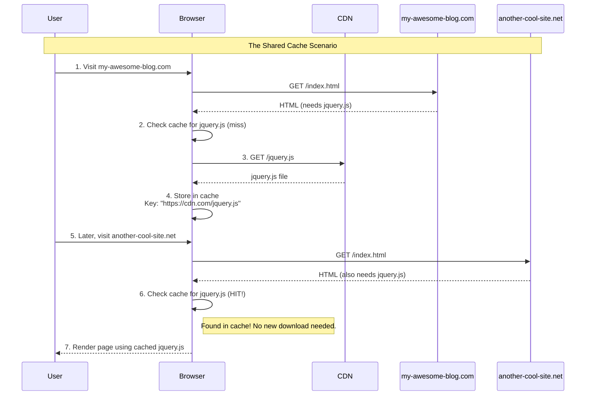
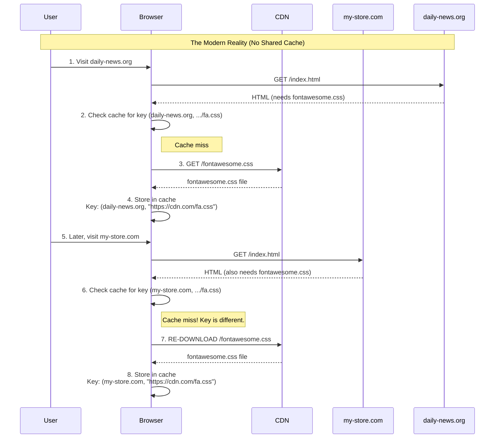

The way we've done content caching using CDNs is changing, and it's not always intuitive. As a developer, you might have relied on the idea that using a popular CDN for libraries like jQuery would speed up your site because users already had the file cached. As we'll see, this is no longer the case.

This post explain the old and new strategies for working with CDNs, how browser caching has changed, and what you should do to optimize your site in 2025 and beyond.

## Original CDN Caching

In the old days browser caching was simple. The browser used a file's  URL as the key to the cache. The diagram below shows how a shared cache would speed up the second site visit.

This was the dream of the CDN-first approach: a shared, global cache for the entire web.

## Double-Key Caching

All major browsers have switched to Double-Key Caching for privacy and security reasons. Browsers now use a two-part key to store a file: the Top-Level Site and the Resource URL. This isolates the caches so there's no sharing between different sites, as illustrated below.

The shared cache benefit is gone. Each site gets its own separate copy.

## Why Did This Change Happen?

The primary reason for this change was to protect user privacy and security. The old caching method could be exploited. Malicious websites could check if you had a specific file from a specific CDN in your cache. This could be used to:

* **Track users across the web**: By embedding resources from many different sites, a malicious actor could build a profile of the sites you've visited
* **De-anonymize users**: In some cases, knowing which combination of files a user has cached could help identify them.

By isolating caches for each website, double-keyed caching effectively closes this privacy loophole.

## What Should You Do Now?

So, if the old tricks are obsolete, what's the modern approach?

* **Host Your Own Static Assets on a CDN**: You should still use a CDN, but for your own assets. This distributes your files across the globe, so they are physically closer to your users, which reduces latency. You get the speed benefits without relying on a broken shared cache strategy
* **Rethink Your Bundling Strategy**: The old advice was to bundle all your CSS and JS into single files to reduce HTTP requests. This leads to a common question: what about bundling? The old advice to bundle everything into a single file is also outdated.

### Isn't Bundling Bad? What About HTTP/2?

This is where modern web development gets more nuanced; we have to deal with bundling, HTTP/2 and code splitting.

* **HTTP/2 and Multiplexing**: Modern servers use HTTP/2 (and now HTTP/3), which can handle many requests and responses in parallel over a single connection. This makes having many small files much less of a performance problem than it was with HTTP/1.1
* **The Problem with Giant Bundles**: If you bundle all your site's JavaScript into one app.js file, a user on your homepage might be forced to download all the code for your complex, interactive "Dashboard" page, even if they never visit it. This is wasteful and can slow down the initial page load.

### The Modern Solution: Code Splitting

The best practice today is not "all or nothing." It's code splitting.

Modern build tools (like Vite, Webpack, Parcel) allow you to break your code into smaller, logical "chunks" that can be loaded on demand. A common strategy is to create:

* **A "Vendor" Chunk**: Contains third-party libraries (like React or D3.js) that change infrequently
* **A "Common" Chunk**: Contains your own shared code used across many pages (like your site header, footer, and utility functions)
* **Route-Based Chunks**: The specific code for each page or major feature is put into its own file. The code for the profile page is only loaded when the user actually goes to that page

This approach strikes a balance: it avoids a single, monolithic bundle, so users don't download code they don't need. And thanks to HTTP/2, the browser can efficiently handle the smaller 'chunk' requests in parallel.
