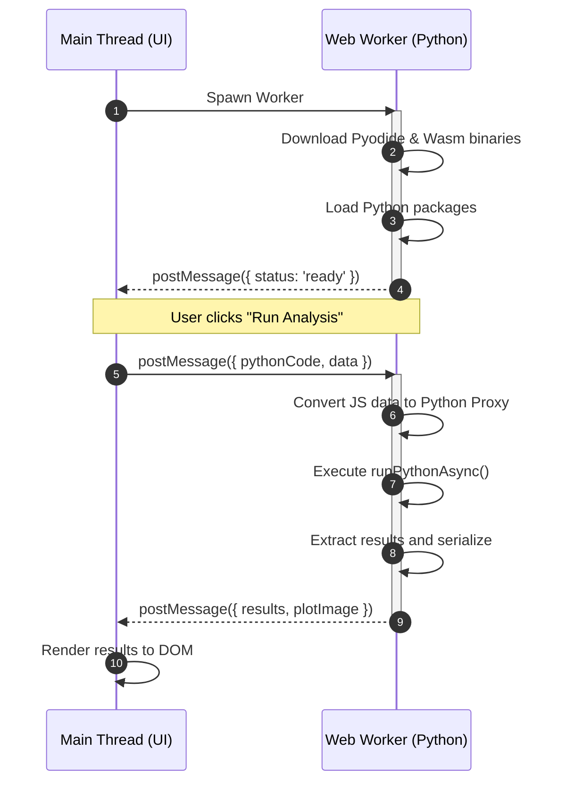

Python has always been the lingua franca of data science. Its rich ecosystem of libraries: [NumPy](https://numpy.org/) for numerical computing, [Pandas](https://pandas.pydata.org/) for data manipulation, [Matplotlib](https://matplotlib.org/) for visualization, and [Scikit-learn](https://scikit-learn.org/) for machine learning—has made it the go-to language for analysts and researchers worldwide. Traditionally, these libraries run on a server or local machine, with users interacting through [Jupyter notebooks](https://jupyter.org/) or command-line interfaces.

Recent advancements in WebAssembly (WASM) have opened the door to a new paradigm: running Python directly in the browser. [Pyodide](https://pyodide.org/), a project initiated by Mozilla, has ported the CPython interpreter to WebAssembly, allowing you to execute Python code and leverage its data science libraries without leaving the browser environment.

This post will cover the process of architecting a Pyodide-based data science dashboard, including performance considerations, the Web Worker pattern for non-blocking execution, and advanced features like file system access and memory management.

## What is Pyodide?

Pyodide ports CPython to WebAssembly (Wasm). It enables you to run a full Python data science stack—including NumPy, Pandas, Matplotlib, and Scikit-learn—entirely inside the browser.

This architecture shifts the web development paradigm. Instead of sending data to a Python backend for processing, you bring the Python runtime to the data. This approach provides several key benefits:

* **Local Data Privacy**: Sensitive datasets (such as healthcare or finance data) never leave the user's device.
* **Zero-Latency Interactivity**: After the browser loads the runtime, calculations happen instantly without network round-trips.
* **Reduced Server Costs**: The client's CPU handles heavy computational lifting.

### The numpy-ts Alternative

You might consider libraries like [numpy-ts](https://numpyts.dev/) to perform mathematical operations in the browser. However, when you use Pyodide, incorporating these libraries wastes resources and creates redundancy:

* **Redundant Runtimes**: Pyodide loads the entire CPython runtime and the official Python numpy package via WebAssembly. Libraries like numpy-ts provide their own mathematical engines. Using both simultaneously loads redundant code and wastes the browser's limited memory.
* **Different Execution Models**: Pyodide requires you to write and execute actual Python code (using pyodide.runPythonAsync) to manipulate your data. You pass raw arrays into the Python environment, let Python process them, and extract the results. Conversely, numpy-ts dictates writing mathematical operations natively in TypeScript.
* **Native TypeScript Interoperability**: To interact with Pyodide's NumPy from TypeScript, you do not need an intermediate wrapper library. You use native JavaScript TypedArray objects (such as Float64Array). Pyodide reads and writes these native browser arrays directly using pyodide.toPy() or zero-copy transfers with a SharedArrayBuffer.

## Performance and Library Compatibility

Before you implement this architecture, you must understand the performance profile of running these libraries in WebAssembly. The primary bottleneck is the initial download size, while execution speed remains generally near-native for numerical operations.

### Library Impact Analysis

| Library | Approx. Download Size | Execution Speed | Usage Context |
| --- | --- | --- | --- |
| NumPy | ~7 MB | Near-Native (1x-2x) | The essential foundation. Pyodide compiles LAPACK/BLAS to heavily optimize vectorized operations. |
| Pandas | ~20 MB | Fast | Performs well for datasets under 50MB. Object wrapping consumes more memory than native Python. |
| Matplotlib | ~10 MB | Moderate | Renders static plots (PNG/SVG) quickly. Interactive resizing can lag because every frame requires a Python-to-JavaScript bridge call. |
| Scikit-learn | ~15 MB | Good | Delivers instant inference (prediction). Training remains viable for small-to-medium datasets (e.g., <10k rows). |
| SciPy | ~160 MB | Slower Load | The Heavyweight. Contains extensive Fortran code. Expect 10-20s load times on slow connections. Use only if strictly necessary. |

### Cold Start vs. Warm Start

**Cold Start**: During the first visit, the browser downloads the Pyodide runtime (~10MB) and all requested packages. This process takes 5 to 30 seconds, depending on network speed.

**Warm Start**: On subsequent visits, the browser caches the compiled .wasm binaries. Initialization time drops to 2 to 4 seconds, restricted only by disk speed and CPU compilation.

### The 32-bit Architecture and Memory Limit

Pyodide currently targets the wasm32 architecture (32-bit WebAssembly). This design imposes critical constraints for data-intensive applications:

* **4GB Hard Memory Limit**: The Python runtime cannot address more than 4GB of memory (2^32 bytes). If you load a dataset larger than this limit (or if processing expands memory usage beyond it), the browser tab crashes with an "Out of Memory" error.
* **Pointer Size**: All C/C++ pointers in the underlying libraries (NumPy, Pandas) compile as 32-bit integers.
* **Package Compatibility**: You must compile binary wheels specifically for emscripten-32. Standard 64-bit Linux wheels from PyPI do not work.

Note: Although developers are actively building wasm64 (Memory64), the stable Pyodide runtime does not yet support it.

### The "Deep Learning" Limitation

Pyodide does not officially support or recommend TensorFlow and PyTorch.

* **Reason**: These libraries rely on complex C++ build chains, custom threading models, and GPU acceleration (CUDA) that do not translate well to the current WebAssembly standard.
* **Alternative**: Use TensorFlow.js or ONNX Runtime Web for deep learning.
* **Workflow**: Clean and preprocess data with Pyodide and Pandas &rightarrow; Convert to Float32Array &rightarrow; Pass the array to TensorFlow.js for GPU-accelerated inference.


## Architecture: The Web Worker Pattern

Running Python on the browser's main thread represents a critical anti-pattern. Because JavaScript runs on a single thread, heavy Python computation blocks the Event Loop, freezing the UI completely (buttons stop working, animations halt).

To prevent this, you must run Pyodide within a Web Worker.

Main Thread (UI)
: Handles user interaction, renders components, and maintains application state. It communicates with Python exclusively via asynchronous messages.

Worker Thread (Python)
: 1. Downloads the Pyodide runtime.
: 2. Installs packages via micropip or loadPackage.
: 3. Executes Python code in an isolated scope.
: 4. Returns results as serializable JSON or binary buffers.



## Implementation

### Step 1: Installation

Install the Pyodide package to acquire the runtime and type definitions.

```bash
npm install pyodide
```

### Step 2: The Web Worker (`pyodide.worker.ts`)

This background script initializes the environment, handles incoming analysis requests, and translates plots to images.

```ts
import { loadPyodide, type PyodideInterface } from "pyodide";

let pyodide: PyodideInterface | null = null;

// Initialize Pyodide and load necessary packages
async function startPyodide() {
  self.postMessage({ status: 'loading', message: 'Downloading runtime...' });

  pyodide = await loadPyodide({
    indexURL: "[https://cdn.jsdelivr.net/pyodide/v0.25.0/full/](https://cdn.jsdelivr.net/pyodide/v0.25.0/full/)"
  });

  self.postMessage({ status: 'loading', message: 'Loading data science stack...' });

  // Load the standard data science stack
  await pyodide.loadPackage(["numpy", "pandas", "matplotlib"]);

  // Set up a Python helper function to handle plotting
  await pyodide.runPythonAsync(`
    import matplotlib
    matplotlib.use("Agg") # Use non-interactive backend to prevent GUI errors
    import matplotlib.pyplot as plt
    import base64
    from io import BytesIO

    def get_plot_base64():
        buf = BytesIO()
        plt.savefig(buf, format='png', bbox_inches='tight')
        buf.seek(0)
        img_str = base64.b64encode(buf.read()).decode('utf-8')
        plt.clf()
        plt.close()
        return img_str
  `);

  self.postMessage({ status: 'ready' });
}

self.onmessage = async (event: MessageEvent) => {
  const { pythonCode, data } = event.data;

  if (!pyodide) {
    await startPyodide();
  }

  try {
    // Inject data into the Python global scope
    if (data) {
      const pyData = pyodide!.toPy(data);
      pyodide!.globals.set("input_data", pyData);
    }

    // Run the analysis script
    await pyodide!.runPythonAsync(pythonCode);

    // Extract results
    const results = pyodide!.globals.get("result")?.toJs();
    const plotImage = pyodide!.globals.get("get_plot_base64")();

    // Send output back to the Main Thread
    self.postMessage({ status: 'complete', results, plotImage });

  } catch (error) {
    self.postMessage({ status: 'error', error: (error as Error).message });
  }
};
```

### Step 3: The Main Application (`App.tsx`)

The React component manages the worker lifecycle. It handles the asynchronous nature of the worker and provides feedback during the initial load phase.

```tsx
import React, { useEffect, useState } from 'react';

const worker = new Worker(new URL('./pyodide.worker.ts', import.meta.url));

export default function DataAnalysisApp() {
  const [status, setStatus] = useState("Initializing...");
  const [output, setOutput] = useState<string | null>(null);
  const [plot, setPlot] = useState<string | null>(null);
  const [isLoading, setIsLoading] = useState(false);

  useEffect(() => {
    worker.onmessage = (event: MessageEvent) => {
      const { status, message, results, plotImage, error } = event.data;

      if (status === 'loading') {
        setStatus(message);
      } else if (status === 'ready') {
        setStatus("Ready");
      } else if (status === 'error') {
        setStatus(`Error: ${error}`);
        setIsLoading(false);
      } else if (status === 'complete') {
        setIsLoading(false);
        if (results) setOutput(JSON.stringify(results, null, 2));
        if (plotImage) setPlot(`data:image/png;base64,${plotImage}`);
      }
    };

    return () => worker.terminate();
  }, []);

  const runAnalysis = () => {
    setIsLoading(true);
    setPlot(null);

    const script = `
      import pandas as pd
      import matplotlib.pyplot as plt

      # 'input_data' injects from JavaScript
      df = pd.DataFrame(input_data)

      # Perform analysis
      summary = df.describe()
      result = summary.to_dict()

      # Generate plot
      plt.figure(figsize=(5, 3))
      plt.plot(df['value'], label='Trend', color='purple')
      plt.title('Data Trend Analysis')
      plt.grid(True, alpha=0.3)
      plt.legend()
    `;

    const dummyData = {
      id: [1, 2, 3, 4, 5],
      value: [10, 25, 15, 30, 45],
      category: ['A', 'B', 'A', 'B', 'C']
    };

    worker.postMessage({
      pythonCode: script,
      data: dummyData
    });
  };

  return (
    <div className="p-6 max-w-4xl mx-auto">
      <h1 className="text-2xl font-bold mb-4">Pyodide Data Science Dashboard</h1>
      <div className="mb-4 flex items-center gap-4">
        <span className={`px-3 py-1 rounded-full text-sm ${
          status === 'Ready' ? 'bg-green-100 text-green-800' : 'bg-yellow-100 text-yellow-800'
        }`}>
          System: {status}
        </span>
        <button
          onClick={runAnalysis}
          disabled={status !== 'Ready' || isLoading}
          className="bg-blue-600 text-white px-6 py-2 rounded hover:bg-blue-700 disabled:opacity-50 transition-colors"
        >
          {isLoading ? 'Processing...' : 'Run Pandas Analysis'}
        </button>
      </div>
      <div className="flex gap-6 mt-6">
        <div className="w-1/2">
          <h3 className="font-semibold mb-2">Analysis Results</h3>
          <pre className="bg-gray-900 text-gray-100 p-4 rounded text-xs h-80 overflow-auto font-mono">
            {output || "No results generated yet."}
          </pre>
        </div>
        <div className="w-1/2">
          <h3 className="font-semibold mb-2">Visualization</h3>
          {plot ? (
            
          ) : (
            <div className="h-80 bg-gray-50 border-2 border-dashed border-gray-200 rounded flex items-center justify-center text-gray-400">
              Plot will appear here
            </div>
          )}
        </div>
      </div>
    </div>
  );
}
```

## Advanced Features and Optimization

### The Virtual File System (VFS)

Pyodide runs within a sandboxed environment containing a virtual file system (VFS). By default, Pyodide creates files in memory (MEMFS). These files vanish when the page refreshes.

Modern Web APIs enable you to bridge the gap between the browser sandbox and the user's actual device.

#### The File System Access API (Mount Local Folders)

This API lets users grant your app access to a specific local directory. It works perfectly for data science applications where users "Open Project Folder" to analyze local CSV files.

* **Capability**: Read and write access to a physical folder on the user's disk.
* **Permissions**: Requires an explicit user gesture (button click) and permission prompt.
* **Pyodide Support**: Mounts natively via `pyodide.mountNativeFS`.


```tsx
// In your React Component (Main Thread)
const handleOpenFolder = async () => {
  // 1. Prompt the user to select a directory
  const dirHandle = await window.showDirectoryPicker();

  // 2. Send the handle to the worker
  worker.postMessage({ type: 'MOUNT_DIR', handle: dirHandle });
};

// In your Pyodide Worker
self.onmessage = async (event: MessageEvent) => {
  if (event.data.type === 'MOUNT_DIR') {
    const dirHandle = event.data.handle;

    // 3. Mount the native directory to a Python path
    await pyodide.mountNativeFS("/mnt/local_data", dirHandle);

    // Python can now read files directly from the user's disk
    await pyodide.runPythonAsync(`
      import os
      print(os.listdir('/mnt/local_data'))
    `);
  }
};
```

#### The Origin Private File System (OPFS)

The OPFS provisions a special file system local to your origin (domain), which standard file explorers cannot see. Browsers optimize it for high performance and random access.

* **Best For**: Databases (SQLite), temporary scratch space, or caching large datasets invisibly.
* **Performance**: Much faster than IDBFS or standard LocalStorage.
* **Implementation**: Access the root via `navigator.storage.getDirectory()` and mount it exactly like a local folder.

```ts
// In your Pyodide Worker
async function mountPrivateStorage() {
  // Retrieve the root of the private file system
  const opfsRoot = await navigator.storage.getDirectory();

  // Mount it to '/mnt/private'
  await pyodide.mountNativeFS("/mnt/private", opfsRoot);

  console.log("OPFS mounted at /mnt/private");
}
```

#### IDBFS (Legacy Persistence)

For older browsers or simple use cases, Pyodide supports the IndexedDB File System (IDBFS). It syncs the in-memory file system to IndexedDB.

* **Pros**: Offers wide browser support.
* **Cons**: Requires explicit syncfs calls to save or load data; slower than OPFS.
* **Implementation**: Handle mounting in TypeScript to ensure the environment is ready before Python executes.

```ts
// In your Pyodide Worker
async function mountIDBFS() {
  // 1. Create the mount point in the virtual filesystem
  pyodide.FS.mkdir('/mnt/persistence');

  // 2. Mount IDBFS
  pyodide.FS.mount(pyodide.FS.filesystems.IDBFS, {}, '/mnt/persistence');

  // 3. Sync from IndexedDB to Memory (Populate)
  await new Promise<void>((resolve, reject) => {
    pyodide.FS.syncfs(true, (err: any) => {
      if (err) reject(err);
      else resolve();
    });
  });

  console.log("IDBFS ready at /mnt/persistence");
}

// To save data later (e.g., after analysis), you must sync back:
async function saveToIDBFS() {
  await new Promise<void>((resolve, reject) => {
    // false = populate from Memory to DB
    pyodide.FS.syncfs(false, (err: any) => {
      if (err) reject(err);
      else resolve();
    });
  });
}
```

## Optimization Strategies

### Zero-Copy Data Transfer with `SharedArrayBuffer`

For massive datasets (e.g., 100MB+ CSVs), standard postMessage creates a deep copy of the data. This process doubles memory usage and introduces significant latency. A `SharedArrayBuffer` allows JavaScript and Python to read and write to the same memory block without copying.

Requirement: Your server must send the following headers to enable `SharedArrayBuffer` (preventing Spectre/Meltdown attacks):

```http
Cross-Origin-Opener-Policy: same-origin

Cross-Origin-Embedder-Policy: require-corp
```

Example: Shared Memory Implementation

```ts
// 1. Main Thread: Create the buffer
// Allocate 8MB (1 million float64s)
const length = 1_000_000;
const sharedBuffer = new SharedArrayBuffer(length * 8);
const sharedArray = new Float64Array(sharedBuffer);

// Populate the buffer with data
for (let i = 0; i < length; i++) {
  sharedArray[i] = Math.random();
}

// Send reference to the worker (no copy involves)
worker.postMessage({ buffer: sharedBuffer });

// ---------------------------------------------------------

// 2. Worker Thread: Receive and process
self.onmessage = async (event: MessageEvent) => {
  const sharedArray = new Float64Array(event.data.buffer);

  // Mount the array into Python's global scope
  pyodide.globals.set("shared_data", sharedArray);

  await pyodide.runPythonAsync(`
    import numpy as np

    # Create a NumPy array backed by the same memory
    # 'copy=False' is crucial here
    np_arr = np.array(shared_data, copy=False)

    # Modifications here instantly reflect in JavaScript
    np_arr *= 2
  `);

  console.log(sharedArray[0]); // The value doubled!
};
```

## Manage Dependencies with Micropip

The [micropip](https://micropip.pyodide.org/en/stable/) tool installs packages from PyPI directly within the browser. However, it enforces strict limitations regarding binary compatibility.

* **Pure Python Wheels**: micropip flawlessly handles packages containing only Python code (e.g., faker, requests, tqdm).
* **Binary Extensions (C/C++/Rust)**: If a package relies on compiled code (such as lxml or pydantic), standard PyPI wheels will fail. You must compile these packages specifically for the emscripten-32 architecture.

### Correct Usage Example

```ts
import micropip from "micropip";

await pyodide.loadPackage("micropip");
const micropip = pyodide.pyimport("micropip");

try {
  // Install a pure Python package
  await micropip.install("faker");
  console.log("Faker installed successfully");

  // Installing a non-Wasm binary library will trigger an error:
  // await micropip.install("some-binary-lib");
} catch (e) {
  console.error("Installation failed:", e);
}
```

## Manual Memory Management (destroy)

The JavaScript engine does not automatically garbage-collect Python objects that your code creates in WebAssembly. A PyProxy (the JavaScript object pointing to a Python object) keeps the Python object alive in memory indefinitely until you explicitly release it. In long-running Single Page Applications (SPAs), failing to destroy proxies introduces memory leaks.

### Best Practice: The finally Pattern

```ts
async function processHeavyData(pyodide: PyodideInterface) {
  await pyodide.runPythonAsync(`
    class HeavyData:
        def __init__(self):
            # Allocate 50MB of data
            self.payload = [i for i in range(10000000)]
        def analyze(self):
            return sum(self.payload)
    heavy_instance = HeavyData()
  `);

  // Create a JS Proxy to the Python object
  const heavyProxy = pyodide.globals.get("heavy_instance");

  try {
    const sum = heavyProxy.analyze();
    console.log("Sum:", sum);
  } catch (err) {
    console.error("Analysis failed:", err);
  } finally {
    // CRITICAL: Explicitly destroy the proxy
    if (heavyProxy) {
      heavyProxy.destroy();
    }
  }
}
```

## Caching Strategies: Service Workers vs. HTTP Cache

A common misconception implies that a Service Worker speeds up the initial load of Pyodide.

* **First Visit**: Service Workers do not improve download speeds. The browser still needs to download approximately 30MB of Wasm binaries. Installing the worker may actually delay the "Time to Interactive" slightly.
* **Wasm Compilation Caching**: Modern browsers automatically cache the compiled machine code of .wasm files if the server provides the correct HTTP headers. If you serve .wasm files from a Service Worker's CacheStorage without careful handling, you might break this optimization and force a complete re-compilation during every visit.

### Recommendation

Rely on standard HTTP caching first. Configure your server to send immutable headers for your artifacts:

```http
Cache-Control: public, max-age=31536000, immutable
```

Use a Service Worker only if:

* You require a full Offline Mode.
* You need robust resilience against CDN failures.
