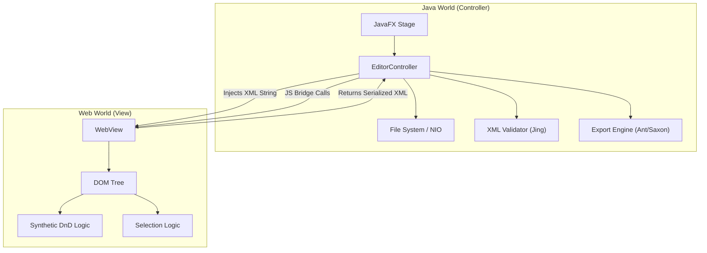
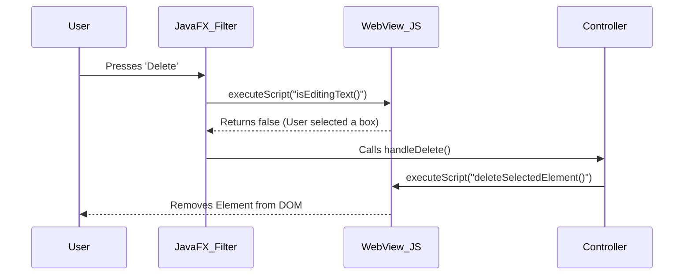

Java has always been a complicated language choice for me. It's a good language but, over time, the ecosystem has fragmented into many paradigms (Spring, Jakarta EE, Android, JavaFX, etc). Each has its own conventions, libraries, and deployment strategies and, to me, this is too reminiscent of the fragmentation I've seen in the web ecosystem.

When I started the TEI Visual Editor, the only real choice was Java, whether I wanted it or not. Most, if not all, of the XML processing stack I need (Saxon, Jing, Apache FOP, Apache Ant) are Java-based. See section 6 below for more details on why a browser-only solution was not feasible.

This post outlines the architectural decisions, technical constraints, and implementation strategies used to build the TEI Visual Editor v1.0.

## Core Architecture: The Hybrid Model

The application uses a Hybrid Architecture combining JavaFX for the desktop shell and standard Web Technologies (HTML/CSS/JS) for the visual editing surface.

### Why this approach?

* **JavaFX**: Provides robust native desktop integration (File System access, Menus, Windows, Shortcuts) and powerful libraries for XML processing (Saxon, Jing).
* **WebView (HTML/JS)**: Browsers have solved the hardest problems of text editing: word wrapping, nested block rendering, and DOM manipulation. Reimplementing this in pure JavaFX Canvas would have been prohibitively complex.

High-Level Component Diagram



## Synchronization Strategy (Two-Way Binding)

A core requirement was real-time synchronization between the Raw XML view and the Visual view.

### The Challenge

Naive listeners create infinite loops:

1. User types in Code -> Updates Visual.
2. Visual updates -> Triggers "Change" event -> Updates Code.
3. Code updates -> Triggers "Change" event -> Updates Visual... (Loop)

### The Solution: Semaphore Locking

We implemented boolean flags (isUpdatingFromCode, isUpdatingFromVisual) to lock the listener of the target view while the source view is updating.

Pseudocode Logic:

```java
// Java Controller
codeEditor.textProperty().addListener((obs, old, newVal) -> {
    if (isUpdatingFromVisual) return; // STOP if visual triggered this

    isUpdatingFromCode = true; // Lock
    syncCodeToVisual(newVal);
    isUpdatingFromCode = false; // Unlock
});
```

## Visual Interaction: Overcoming WebView Limitations

Embedded browsers (like the WebKit inside JavaFX) often lack full support for modern desktop interactions. We had to engineer custom solutions for two specific problems.

### The "Delete Key" Problem

**Problem**: When a user selects a visual element and presses Delete or Backspace, the event is often swallowed by the native windowing system or applied to the browser history (Navigate Back) instead of the DOM element.

**Solution**: The Java Event Filter
Instead of relying on JavaScript to catch the key, we intercept it at the JavaFX level before it reaches the WebView. We then ask JavaScript "Is the user typing text?" to decide what to do.



### The Drag-and-Drop Problem

**Problem**: The native HTML5 Drag and Drop API (dragstart, drop) is notoriously flaky in embedded JavaFX WebViews, often failing to transfer data or calculate drop targets correctly.

**Solution**: Synthetic Dragging
We bypassed the browser's D&D API entirely and wrote a custom physics engine using Mouse Events.

**mousedown**: Clone the DOM node to create a "Ghost" element position: fixed under the mouse.
**mousemove**: Manually calculate geometry. If mouseY < targetHeight * 0.25, draw a line above. If > 0.75, draw a line below. Else, highlight center (nesting).
**mouseup**: Manually manipulate the DOM to move the real element to the calculated position.

## Export Architecture

We support two categories of export formats, requiring two different pipelines.

**Category A**: Single-File Formats (HTML, PDF, Markdown)

These are handled by Saxon-HE (XSLT 3.0 Processor).

* HTML/Markdown: Direct 1:1 transformation.
* PDF: A two-step pipeline. XML -> XSL-FO -> Apache FOP -> PDF.

**Category B**: Archive Formats (DOCX, EPUB)

**Problem**: These are actually ZIP files containing multiple internal XML files. A simple XSLT cannot generate them.

**Solution**: We embedded Apache Ant.

The TEI Consortium provides build.xml files for these formats.

We programmatically instantiate an Ant Project within Java, passing it the paths to our temp files, and execute the build script to generate the final ZIP.

## Deployment Strategy

### The "JavaFX Launcher" Workaround

Java 9+ Modules introduced strict checks on application entry points. If the main class extends javafx.application.Application, the JVM refuses to start unless JavaFX modules are on the module path.

To allow our app to run as a standard "Fat Jar" (on the classpath), we used the Launcher Pattern:

* **App.java**: The actual JavaFX application class, renamed from Main.java.
* **Launcher.java**: A plain Java class with public static void main that simply calls `App.main()`.

By pointing the JAR Manifest to Launcher, we trick the JVM into starting up without the strict module checks, allowing it to load the JavaFX libraries from the classpath a millisecond later.

### Dependency Management (Stylesheets)

We chose a Lazy Loading strategy for the 50MB TEI Stylesheets dependency.

**Why**: Bundling them would triple the installer size.

**How**: The app checks for `~/.tei-editor/stylesheets` on launch. If missing, it offers to download the specific GitHub Release ZIP and extract it. This keeps the core application lightweight (~40MB).

## Notes On The Visual Editor

The visual editor is built using standard HTML5, CSS, and JavaScript running inside a JavaFX WebView. Because it is a visual tool, you can't type new elements or attributes directly into the DOM. Instead we provide a set of UI controls to insert, move or delete elements.

This assumes some familiarity with TEI structure but keeps the complexity of the DOM manipulation manageable. If you need to go deeper, you can always switch to the Raw XML view.

## Alternatives Considered

### WebAssembly (Wasm) Port (Browser-Only)

We considered transpiling the Java code to Wasm (using TeaVM or CheerpJ) to run entirely in the browser.

* **Pros**: Zero installation, works on any OS immediately.
* **Cons (The Dealbreaker)**:
  * Apache FOP (PDF) Relies heavily on AWT/Java2D for font rendering and page layout. Wasm environments typically lack a full AWT implementation, making PDF generation impossible without rewriting the rendering engine.
  * Apache Ant (Builds): Ant assumes a standard Operating System file system with full IO permissions (creating temp dirs, copying files, executing tasks). Emulating a mutable POSIX file system inside a browser sandbox for Ant scripts is extremely complex and brittle.
  * Performance: XSLT transformations on large TEI documents are CPU-intensive. Running Saxon-HE in Wasm is significantly slower than running it on the JVM.

**Verdict**: The Desktop (Hybrid) model was chosen because the Export dependencies (FOP/Ant) require a full Java environment to function correctly.

## Future Features

The TEI Visual Editor v1.0 is just the beginning. Planned future features include:

Add the ability to visually view and edit attributes
: This is currently only possible in Raw XML view but it would present a more intuitive editing experience.

Add more export formats from those supported by the TEI Stylesheets
: For the 1.0 release we focused on common formats (HTML, PDF, DOCX, EPUB); the stylesheets support additional formats and publication types that could be added later based on user demand.

Evaluate collaborative editing features
: This is a two step process
: - First, we need to implement a server-side component to manage document state and user sessions.
: - The second step explores real-time synchronization protocols (like Operational Transforms or CRDTs) to allow multiple users to edit the same TEI document simultaneously.

Use GitHub Actions To Automate Releases
: Automate the build, test, and release process using GitHub Actions to ensure consistent and reliable delivery of new versions.
: This includes generating platform-specific installers (DMG for macOS, EXE for Windows) and publishing them to the GitHub Releases page.
