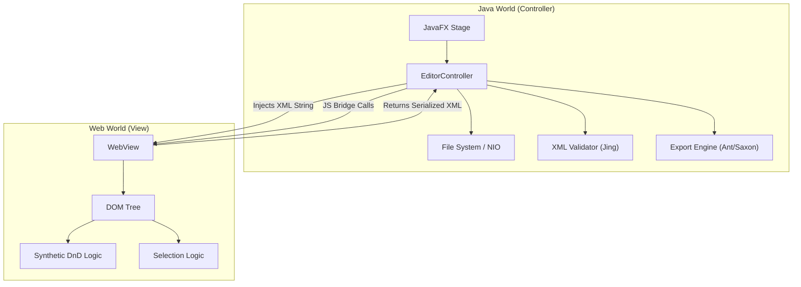
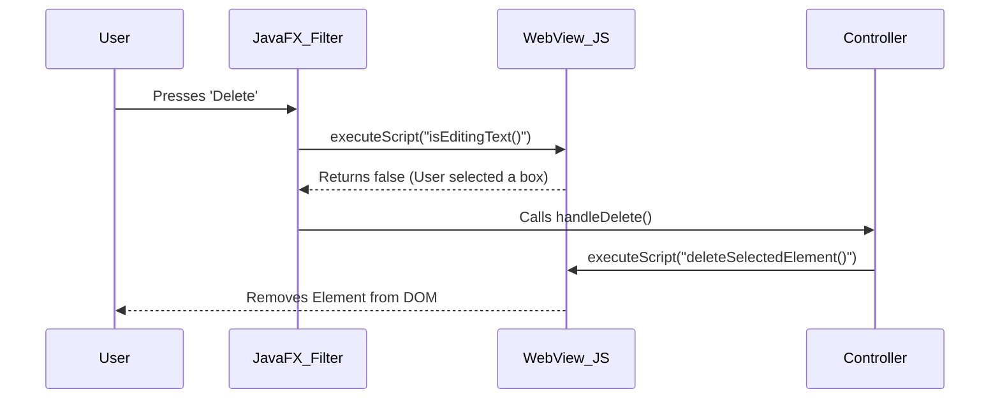

Java has always been a complicated choice for me. While the language is robust, the ecosystem has fragmented into disparate paradigms—Spring, Jakarta EE, Android, JavaFX—each with its own conventions and deployment strategies. This often mirrors the fragmentation found in the JavaScript web ecosystem.

However, when I began architecting the TEI Visual Editor, Java was the only viable choice. The XML processing stack required for this project (Saxon, Jing, Apache FOP, Apache Ant) is deeply rooted in the Java ecosystem. A browser-only solution was ruled out due to specific technical constraints.

This post outlines the architectural decisions, technical constraints, and implementation strategies used to build TEI Visual Editor v1.0.

## Core Architecture: The Hybrid Model

The application utilizes a Hybrid Architecture, combining JavaFX for the desktop shell and Standard Web Technologies (HTML/CSS/JS) for the visual editing surface.

### Why this approach?

We leverage the specific strengths of both platforms:

* **JavaFX (The Shell)**: Provides robust native desktop integration (file system access, native menus, window management, keyboard shortcuts) and hosts the powerful XML libraries (Saxon, Jing).

* **WebView (The View)**: Browsers have already solved the hardest problems of text editing: word wrapping, nested block rendering, and DOM manipulation. Re-implementing a text layout engine in a pure JavaFX Canvas would have been prohibitively complex.

High-Level Component Diagram



## Synchronization Strategy (Two-Way Binding)

A core requirement was real-time synchronization between the Raw XML View and the Visual View. Changes in one view must immediately reflect in the other. This is non-trivial due to the fundamentally different representations (String/Text vs. DOM Tree).

### The Challenge: Infinite Loops

A naive implementation of listeners on both sides results in a loop:

User types in Code → Updates Visual.

Visual updates → Triggers "Change" event → Updates Code.

Code updates → Triggers "Change" event → Updates Visual... (Loop)

### The Solution: Semaphore Locking

We implemented a semaphore locking strategy using boolean flags (`isUpdatingFromCode`, `isUpdatingFromVisual`). We lock the target view's listener while the source view is updating.

Pseudocode Logic:

```java
// Java Controller
codeEditor.textProperty().addListener((obs, old, newVal) -> {
  // STOP if the visual editor triggered this change
  if (isUpdatingFromVisual) return;

  isUpdatingFromCode = true; // Lock
  syncCodeToVisual(newVal);
  isUpdatingFromCode = false; // Unlock
});
```

## Visual Interaction: Overcoming WebView Limitations

The WebKit engine embedded inside JavaFX lacks full support for modern desktop-class interactions. We engineered custom solutions for two specific interaction problems.

### The "Delete Key" Problem

**Problem**: When a user selects a visual element (e.g., a `<div>`) and presses Delete or Backspace, the native windowing system often swallows the event or triggers a browser history navigation (Back) instead of modifying the DOM.

**Solution**: The Java Event Filter We intercept the keystroke at the JavaFX level before it reaches the WebView. We then query the JavaScript context to determine intent.



### The Drag-and-Drop Problem

**Problem**: The native HTML5 Drag and Drop API (dragstart, drop) is notoriously unreliable in embedded JavaFX WebViews, often failing to transfer data or correctly calculate drop targets.

**Solution**: Synthetic Physics Engine We bypassed the browser's native API entirely and implemented a custom physics engine using Mouse Events.

* **Mousedown**: We clone the DOM node to create a "Ghost" element fixed under the mouse cursor.
* **Mousemove**: We manually calculate geometry relative to the target element:
  * If mouseY < targetHeight * 0.25: Draw line above (Insert Before).
  * If mouseY > targetHeight * 0.75: Draw line below (Insert After).
  * Else: Highlight center (Nest Inside).
* **Mouseup**: We manually manipulate the DOM to move the real element to the calculated position.

## Export Architecture

The editor supports two categories of export formats, requiring distinct pipelines.

### Category A: Single-File Formats (HTML, PDF, Markdown)

These are handled by Saxon-HE (XSLT 3.0 Processor) and the standard TEI XSLT stylesheets.

* **HTML/Markdown**: Direct 1:1 transformation.
* **PDF**: A two-step pipeline: XML → XSL-FO → Apache FOP → PDF.

### Category B: Archive Formats (DOCX, EPUB)

DOCX and EPUB documents are actually ZIP archives containing multiple internal XML files and manifests. A simple XSLT transformation cannot generate them.

**Solution**: Embedded Apache Ant. The TEI Consortium provides build.xml files for these formats. We programmatically instantiate an Ant Project within Java, pass it the paths to our temporary files, and execute the build script to generate the final ZIP archive.

## Deployment Strategy

### The "JavaFX Launcher" Workaround

Java 11+ introduced strict module path enforcement, which creates issues for "Fat Jars":

>The primary class of a runnable JAR cannot extend javafx.application.Application directly, as the default Java launcher expects a standard main method to resolve dependencies before initializing the JavaFX runtime.

To allow the app to run as a standard generic JAR on the classpath, we utilized the Launcher Pattern:

* **App.java**: The actual JavaFX application class (formerly Main.java).
* **Launcher.java**: A plain Java class with public static void main that simply calls App.main().

By pointing the JAR Manifest to Launcher, we trick the JVM into starting up without strict module checks, allowing it to load JavaFX libraries from the classpath.

### Dependency Management (Stylesheets)

We opted for a Lazy Loading strategy for the 50MB TEI Stylesheets dependency. Bundling them would triple the installer size. Instead, the app checks for **~/.tei-editor/stylesheets** on launch; if missing, it offers to download and extract the specific GitHub Release ZIP.

## Alternatives Considered: Why Not WebAssembly?

We strongly considered transpiling the Java code to Wasm (using TeaVM or CheerpJ) to run entirely in the browser.

* **Pros**: Zero installation; cross-platform compatibility.
* **Cons (The Dealbreaker)**:
  * Apache FOP (PDF) relies heavily on AWT/Java2D for font rendering. Wasm environments typically lack a full AWT implementation, making PDF generation impossible without rewriting the rendering engine.
  * Apache Ant (Builds) assumes a mutable POSIX file system (creating temp dirs, copying files, executing tasks). Emulating this inside a browser sandbox is brittle and complex.
  * Performance: XSLT transformations on large TEI documents are CPU-intensive. Running Saxon-HE in Wasm is significantly slower than on the JVM.

Verdict: The Desktop (Hybrid) model was chosen because the Export dependencies (FOP/Ant) require a full Java environment to function correctly.

## Future Features

Version 1.0 establishes the foundation. Planned future features include:

* **Visual Attribute Editing**: Currently, attributes must be edited in the Raw XML view. We plan to add UI controls to edit attributes directly in the visual surface.
* **Expanded Export Formats**: We focused on HTML, PDF, DOCX, and EPUB for launch. The TEI stylesheets support additional publication types that can be enabled based on user demand.
* **Collaborative Editing**: A two-phase goal:
  * Implement a server-side component for document state and session management.
  * Explore real-time synchronization protocols (like Operational Transforms or CRDTs) for simultaneous multi-user editing.
