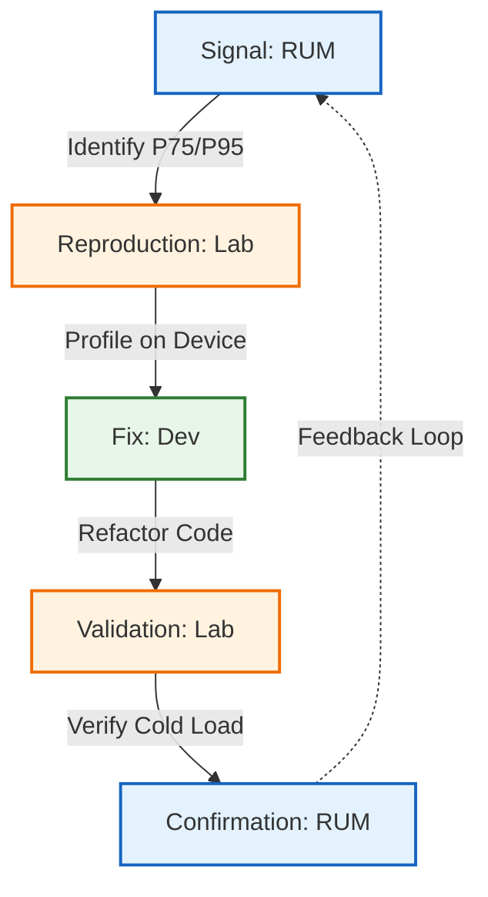

In the modern web development landscape, performance is a business requirement. To measure success, developers often rely on tools like Google Lighthouse or PageSpeed Insights. While these tools are valuable for catching regressions and spotting unoptimized images, they often create a "green score" placebo effect.

These tools measure Lab Data—a sterile, controlled simulation—rather than Field Data, which represents the chaotic, hostile reality of your actual users. Relying solely on synthetic scores is akin to testing a car's fuel efficiency on a treadmill in a climate-controlled room and expecting the same results during a rush-hour commute in a blizzard.

This post explores the differences between synthetic testing and real user monitoring (RUM) in web performance optimization. It highlights the limitations of synthetic testing and emphasizes the importance of RUM for capturing authentic user experiences.

## The "Slow Ferrari" Fallacy

When you simulate a mobile device in Chrome DevTools on a powerful workstation, you typically select "CPU Throttling" (e.g., 4x or 6x slowdown). The premise is simple: reducing a 3GHz processor to 500MHz mimics a mobile chip. This is architecturally incorrect.

### The Flaw: Clock Speed vs. Architecture

Slowing a high-end Intel i9 or Apple M-series chip by 6x does not turn it into a low-end ARM chip. It turns it into a slow high-end chip. The fundamental capability of the silicon remains superior in ways simple throttling cannot hide:

* **Cache Hierarchy & Memory Latency**: Desktop CPUs possess massive L2 and L3 caches (often 12MB to 30MB+). This memory is physically close to the processor cores.
  * **The Simulation Gap**: If your JavaScript requests data, the desktop CPU likely finds it in this massive cache (a "cache hit"), costing only a few cycles.
  * **The Reality**: A budget mobile CPU (like a Cortex-A53) has tiny caches. It suffers frequent "cache misses," forcing it to fetch data from the main system RAM. This operation is orders of magnitude slower. Throttling the clock speed does not simulate the excruciating latency of a main memory fetch on a cheap memory bus.
* **Speculative Execution & Branch Prediction**: Modern desktop CPUs use advanced "Out-of-Order Execution" to look ahead at code and guess which branches will be taken.
  * **The Simulation Gap**: Even when throttled, these advanced branch predictors keep the instruction pipeline full.
  * **The Reality**: Budget mobile cores are often "In-Order" processors. They process instructions linearly. If one instruction stalls (e.g., waiting for that slow memory fetch), the entire processing pipe stops.

**The Analogy**: You are simulating a Ferrari driving in first gear. It still has the suspension, torque, and aerodynamic handling of a Ferrari. A budget phone is a utility vehicle towing a boat uphill; it lacks the mechanical capacity (torque/cache) to handle the load, regardless of how fast you try to drive it.

## The Myth of the "Perfect" Network

Synthetic network throttling mimics low bandwidth and high latency by adding a clean, mathematical delay to every request. This creates a "smoothly slow" experience that is fundamentally different from a "broken" one.

### The Reality: Jitter, Packet Loss, and Protocol Panic

Real mobile networks are volatile. They suffer from Packet Loss and Jitter (variance in latency).

* **TCP Congestion Control**: If you lose a packet during the transmission of a large JavaScript bundle on a real network, TCP assumes network congestion. It reacts by cutting the transmission window size and entering a "Slow Start" recovery phase. This doesn't just delay the file; it throttles throughput to a trickle, causing download times to spike exponentially.
* **The SSL/TLS Handshake**: Handshakes are "chatty," requiring multiple round-trips. If a packet drops during the critical ClientHello or KeyExchange steps, the connection hangs. The browser sits in limbo until a timeout triggers a retransmission. This results in the "White Screen of Death," where the user sees nothing for 5-10 seconds—a scenario a 4x slowdown simulation rarely shows.

## The Radio Wake-Up Tax

Cellular radios are high-drain components. To save power, the mobile OS aggressively puts the radio into an IDLE state when no data is actively flowing.

### The Radio Resource Control (RRC) State Machine

When a user clicks a link after reading for 10 seconds, the radio must switch to a CONNECTED state.

* **The Negotiation Cost**: This switch involves a negotiation with the cell tower known as the RRC State Transition.
* **The Latency Penalty**: This transition can take anywhere from 20ms to 2 seconds depending on the carrier and signal strength.
* **The "Control Plane" Saturation**: In crowded areas, the "control plane" of the tower might be congested even if the "data plane" is open. Your request is queued just to ask for permission to use the internet.

Synthetic tests assume the connection is already active. They completely miss the massive latency penalty users pay for the first byte of data, leading to optimistic **First Contentful Paint (FCP)** metrics.

## The Missing Variables: Thermal and Memory Pressure

Synthetic tests occur in a vacuum. Your desktop browser has near-infinite RAM, stable power from a wall outlet, and active cooling fans. A real phone operates in a hostile environment of thermal constraints and resource starvation.

* **Thermal Throttling (The Heat Wall)**: Desktops use fans and massive heatsinks; phones rely on passive dissipation through the screen and body.
  * **The Scenario**: If a user has been scrolling media-heavy apps or using GPS before visiting your site, their phone is already hot.
  * **The Consequence**: The OS kernel will aggressively throttle the CPU speed—sometimes by 50% or more—to prevent the device from physically burning the user's hand. Your simulation never gets "hot," so it never tests this worst-case performance cliff.
* **Resource Contention**: Your site does not run alone. On a real device, background processes fight for attention. Social media, email, and push notification services constantly wake up the CPU to sync data. Your main thread is fighting for time slices against the OS and other high-priority apps.
* **Memory Pressure & The OOM Killer**: Mobile browsers have strict memory limits. If your site consumes too much RAM (e.g., large unoptimized images or massive DOM trees), the OS will not swap to disk like a desktop; it will kill the tab or force a hard reload. Desktops with 32GB of RAM rarely trigger these edge cases, masking memory leaks that crash budget devices instantly.

## Proxy Browsers: The "Split-Browser" Architecture

Proxy browsers (such as Opera Mini, UC Browser, or Puffin) represent a massive blind spot in synthetic testing. These browsers fundamentally alter the web architecture to prioritize data saving over standard behavior.

### How They Work: The Split-Browser Model

In this model, the browser on the phone acts as a "thin client." The execution follows a specific lifecycle:

1. **Request**: The user enters a URL. The request is routed to the browser manufacturer's Proxy Server Farm.
2. **Execution**: The proxy server (a high-performance cluster) downloads your HTML, CSS, and JavaScript. It executes the code, builds the DOM, and runs the initial scripts.
3. **Optimization**: The server compresses images and simplifies the page into a proprietary, highly compressed snapshot format (e.g., OBML).
4. **Delivery**: This tiny, pre-rendered snapshot is sent to the user's phone.

### The Interactivity Trade-off

These browsers enable the web on low-end hardware by circumventing the standard web model.

* **The Gain (Visuals)**: Aggressive compression (up to 90%) allows heavy sites to load on $30 devices over 2G networks.
* **The Cost (Latency)**: JavaScript events (like click or scroll) often require a round-trip to the proxy server to process and render the new state. This creates massive Input Latency. A simple menu click can take seconds to respond—a frustration that local synthetic tests never capture because they assume all logic is running on the device.

### The Testing Reality

Because of these architectural differences, you cannot treat this segment like standard traffic.

* **Synthetic Testing is Invalid**: If 20% of your users are on Opera Mini, your Lighthouse score is effectively a hallucination for that 20%. It cannot measure server-side processing or round-trip input latency.
* **Device Lab is Essential**: You cannot rely on Chrome alone. You must install the specific proxy browsers to verify basic functionality.
* **New Success Metrics**: For this segment, you must shift focus from "Time to Interactive" to "Service Availability" (does the core feature work without client-side JS?).

### The Performance Paradox

While proxy browsers make the web accessible on $30 hardware, they introduce unique performance hurdles:

* **The Interactivity Round-Trip**: In a standard browser, an "Add to Cart" button executes instantly on-device. In a proxy browser's "Extreme" mode, the phone doesn't know how to execute that JavaScript. Every click event must be sent back to the proxy server. The server re-renders the page and sends a new snapshot back. This creates 1–3 seconds of Input Latency for every interaction.
* **The Transcoding Delay**: If your site has a massive JavaScript payload or complex hydration, the proxy server might time out or "clip" the execution. Users may see a visual version of your site that is completely non-functional.
* **The Blind Spot**: Your Lighthouse test assumes the device is parsing your 5MB bundle. In reality, the proxy server might strip that bundle entirely. Your Lab Data will show a slow CPU struggle, while Field Data might show a fast paint but completely broken interactivity.

## Creating a Testing Lab: The 2026 Baseline

As the [Performance Inequality Gap](https://infrequently.org/2025/11/performance-inequality-gap-2026/) widens, your testing lab must reflect the hardware of the global median user, not the flagship user. Based on current market data, the following targets define the 2026 baseline for a representative performance lab.

What Devices Do We Need?

To test across the "performance spectrum," you should maintain a lab with at least three device tiers.

* **The Global Median (Primary Target)**
  * **Device**: Samsung Galaxy A15 (or equivalent $150–$200 device).
  * **SoC**: MediaTek Helio G99 or Dimensity 6100+.
  * **Why**: This chip represents the median CPU/GPU capability for billions of users. If your site performs poorly here, it is failing the majority of the global market.
* **The Aging Premium (iOS)**
  * **Device**: iPhone 11 or iPhone 12.
  * **Why**: While iOS has a higher performance floor, older models suffer from battery-induced thermal throttling and lower RAM (4GB). This captures the experience of a significant segment of the high-value user base on hardware that is 4–6 years old.
* **The Emerging Market Baseline**
  * **Device**: Nokia C-series or Android Go devices (sub-$100).
  * **Why**: Essential for apps targeting the "next billion users." These devices trigger aggressive OOM (Out of Memory) kills and lack hardware acceleration for complex CSS.

### What Performance Budgets Should We Target?

A performance budget is not a suggestion; it is a constraint that determines whether your feature is viable for the general public. Target these metrics on the **Galaxy A15** over a **Slow 4G** connection (400ms RTT, 1.6Mbps down).

Reliable Interaction (TTI): &lt; 5 seconds.
: On a baseline device, the "Main Thread" must be free to respond to user input within 5 seconds of the initial request. If hydration or third-party scripts take longer, your site is effectively "frozen."

Responsiveness (INP): &lt; 200ms.
: Every tap, click, or keyboard event must result in a visual frame within 200ms. On budget hardware, long-running JavaScript tasks are the primary cause of INP failure.

JavaScript Payload: ~150KB–200KB (Compressed).
: This equates to roughly 500KB–800KB of uncompressed JavaScript. Any more than this will reliably push the Galaxy A15's CPU into a "long task" state during parsing and execution, blowing your 5-second TTI budget.

## The Solution: A RUM-to-Lab Workflow

To build a performance culture that reflects reality, you cannot rely on Lab Data alone. You must connect your Field Data (Real User Monitoring - RUM) to your physical Device Lab in a closed feedback loop.

Phase 1: Signal & Segmentation (RUM)
: Don't look at your global average Core Web Vitals score; averages hide the outliers. Use RUM data (Datadog, Sentry, Cloudflare) to find where users are failing.

: Identify the "Cohort of Concern": Isolate the segment dragging your score down.
: * Device: Is it budget Androids? Older iPhones?
: * Metric: Focus on Interaction to Next Paint (INP). This measures responsiveness and is heavily impacted by main-thread blocking that synthetic tests miss.

Phase 2: Physical Reproduction (Device Lab)
: Now, recreate the pain on actual hardware.
: * Select Matching Hardware: If RUM says the issue is on budget Androids, pick up a Baseline Device (e.g., a Samsung Galaxy A15).
: * Match the Network: Disable Wi-Fi. Force the device onto cellular data (4G/LTE). If your device loads in 2s but RUM says 5s, your lab network is still too good. Throttle it until it matches the RUM data.

Phase 3: Profiling & Fixing (Development)
: Connect the device to your computer via USB for Remote Debugging (using `chrome://inspect` for Android or Safari's "Develop" menu for iOS).
: * Profile on Hardware: Run the Performance profiler on the device. Look for Long Tasks (red blocks > 50ms). A hydration function that takes 10ms on your M3 Macbook might take 150ms on a Galaxy A15.

Phase 4: Validation & Confirmation
: Verify the fix on the physical device to ensure it moves the needle. Ensure you test a "cold load" (first-time visitor) to account for the lack of cached assets. Finally, deploy the fix and monitor your RUM dashboard for 48 hours to confirm the P75 metric shift.

## Summary Checklist

| Stage | Action | Tool |
| :---: | ---- | ---- |
| Signal | Filter RUM data for P75/P95 scores on specific cohorts. | RUM Dashboard |
| Setup | Use a budget device (Galaxy A15). Turn off Wi-Fi. | Physical Lab |
| Debug | Connect via USB. Profile main-thread "Long Tasks." | Remote Inspector |
| Fix | Refactor, code-split, or defer non-critical assets. | IDE |
| Validate | Confirm "Cold Load" improvement on physical hardware. | Physical Lab |
| Confirm | Verify P75 improvement in RUM after deployment. | RUM Dashboard |

## Conclusion

The gap between synthetic testing and user reality is an empathy gap. When we rely solely on high-end developer machines and clean network simulations, we optimize for the "happy path" while ignoring the friction experienced by the majority of the world's users.

Stop simulating the struggle; experience it, fix it, and build a faster web for everyone.
