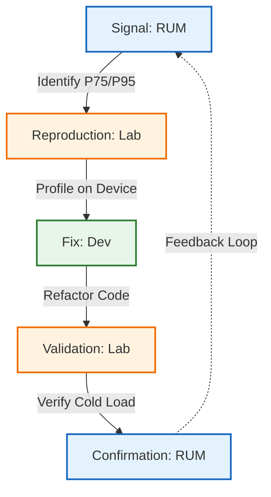

In the modern web development landscape, performance is no longer a luxury; it is a business requirement. To measure this, developers often rely on tools like Google Lighthouse (running inside Chrome DevTools) or PageSpeed Insights to grade their work. While these tools are valuable for catching regressions, identifying unoptimized images, and spotting low-hanging fruit, they often create a "green score" placebo effect.

They measure Lab Data—a controlled, sterile simulation—rather than Field Data, which represents the chaotic, hostile reality of your users. Relying solely on synthetic scores is akin to testing a car's fuel efficiency on a treadmill in a climate-controlled room and expecting the same results during a rush-hour commute in a blizzard.

## The "Slow Ferrari" Problem

When you simulate a mobile device in Chrome DevTools on a powerful developer workstation, you typically select "CPU Throttling" (e.g., 4x or 6x slowdown). The premise is simple: if we make a 3GHz processor run effectively at 500MHz, it mimics a mobile chip. This is architecturally incorrect and leads to the "Slow Ferrari" fallacy.

### The Flaw: Clock Speed &ne; Architecture

Slowing down a high-end Intel i9, AMD Ryzen, or Apple M-series chip by 6x does not turn it into a low-end ARM chip. It turns it into a slow high-end chip. The fundamental capability of the silicon remains superior in ways simple throttling cannot hide.

* **Cache Hierarchy & Memory Latency**: Desktop CPUs possess massive L2 and L3 caches (often 12MB to 30MB+). This memory is incredibly fast, located physically close to the processor cores.
  * **The Simulation Gap**: If your JavaScript code requests data, the desktop CPU likely finds it in this massive cache (a "cache hit"), costing only a few CPU cycles.
  * **The Reality**: A budget mobile CPU (like a Cortex-A53 found in many sub-$200 phones) has tiny caches. It suffers frequent "cache misses," forcing it to fetch data from the main system RAM. This operation is orders of magnitude slower. Throttling the clock speed does not simulate the excruciating latency of a main memory fetch on a cheap memory bus.
* **Speculative Execution & Branch Prediction**: Modern desktop CPUs are beasts of prediction. They use advanced "Out-of-Order Execution" to look ahead at the code, guess which branches (if/else statements) will be taken, and process instructions before the code strictly asks for them.
  * **The Simulation Gap**: Even when throttled, these advanced branch predictors are active. They keep the instruction pipeline full.
  * **The Reality**: Budget mobile cores are often "In-Order" processors. They process instructions linearly, one after another. If one instruction stalls (e.g., waiting for that slow memory fetch), the entire processing pipe stops.

**The Analogy**: You are simulating a Ferrari driving in first gear. It still has the suspension, torque, and aerodynamic handling of a Ferrari. A budget phone is a Honda Civic towing a boat uphill; it lacks the mechanical capacity (torque/cache) to handle the load, regardless of how fast you try to drive it.

## The "Perfect" Network

Synthetic network throttling in browser tools mimics low bandwidth (e.g., "Fast 3G" at 1.6Mbps) and high latency (e.g., 150ms RTT). However, it usually does so by adding a clean, mathematical delay to every request. This creates a "smoothly slow" experience that is fundamentally different from a "broken" one.

### The Reality: Jitter, Packet Loss, and Protocol Panic

Real mobile networks are volatile. They suffer from Packet Loss (data that never arrives) and Jitter (variance in latency, where one packet takes 50ms and the next takes 500ms).

* **TCP Congestion Control (The Death Spiral)**: The internet relies on the TCP protocol to ensure data delivery.
  * **In the Lab**: A synthetic test delays the file transfer. The browser sees a steady, albeit slow, stream of bytes.
  * **In the Field**: If you lose a packet during the transmission of a large JavaScript bundle on a real network, TCP assumes network congestion. It reacts aggressively by cutting the transmission window size (often halving it) and entering a "Slow Start" recovery phase. This doesn't just delay the file; it throttles the throughput to a trickle, causing the download time to spike exponentially, not linearly.
* **The SSL/TLS Handshake**: Handshakes are "chatty," requiring multiple round-trips between the client and server to establish security keys.
  * **In the Lab**: Latency is applied evenly.
  * **In the Field**: If a packet drops during the critical ClientHello or KeyExchange steps, the connection hangs entirely. The browser sits in limbo until a timeout (often seconds long) triggers a retransmission. This results in the "White Screen of Death," where the user sees nothing for 5-10 seconds—a scenario a 4x slowdown simulation will almost never show you.

## The Radio Wake-Up Tax

Developers often assume mobile data is "always on," like a fiber optic cable connected to the phone. In reality, cellular radios are battery vampires. To save power, the mobile OS aggressively puts the radio into a low-power IDLE state when no data is actively flowing.

### The Radio Resource Control (RRC) State Machine

When a user clicks a link on your site after reading a paragraph for 10 seconds, the radio is likely IDLE. It must switch to a CONNECTED state to fetch the new page.

* **The Negotiation Cost**: This switch involves a negotiation with the cell tower known as the Radio Resource Control (RRC) State Transition.
* **The Latency Penalty**: This transition can take anywhere from 20ms to 2 seconds depending on the carrier, signal strength, and network generation (5G vs 4G vs 3G).
* **The "Control Plane" Saturation**: In crowded areas (stadiums, concerts), the "control plane" of the tower might be congested even if the "data plane" is open. Your request is queued just to ask for permission to use the internet.

**Synthetic Failure**: Synthetic tests assume the connection is already active and piping hot. They completely miss the massive latency penalty users pay for the first byte of data, leading to optimistic First Contentful Paint (FCP) metrics.

## The Missing Variables: The Environment

Synthetic tests occur in a vacuum. Your desktop browser has near-infinite RAM, stable power from a wall outlet, and active cooling fans. A real phone operates in a hostile environment of thermal constraints and resource starvation.

* **Thermal Throttling (The Heat Wall)**: Processors generate heat. Desktops have fans and massive heatsinks. Phones rely on passive dissipation through the glass screen and metal body.
  * **The Scenario**: If a user has been scrolling Instagram or playing a game for 10 minutes before visiting your site, their phone is already hot.
  * **The Consequence**: The OS kernel will aggressively throttle the CPU speed (sometimes reducing it by 50% or more) to prevent the device from physically burning the user's hand. Your simulation never gets "hot," so it never tests this worst-case performance cliff.
* **Resource Contention**: Your site does not run alone. On a real device, background processes fight for attention. Facebook, WhatsApp, Email, and push notification services constantly wake up the CPU to sync data. Your main thread is fighting for time slices against the OS and other apps.
* **Memory Pressure & The Out of Memory (OOM) Killer**: Mobile browsers have strict memory limits. If your site consumes too much RAM (e.g., large unoptimized images or massive DOM trees), the OS will not swap to disk like a desktop; it will kill the tab or force a hard reload. Desktops with 32GB of RAM will rarely trigger these edge cases, masking memory leaks that crash budget devices instantly.

## Proxy Browser Considerations

Proxy browsers (such as Opera Mini, UC Browser, or Puffin) represent a massive blind spot in synthetic testing, particularly if your user base includes emerging markets. These browsers fundamentally alter the web architecture to prioritize data saving over standard behavior.

### The "Black Box" Effect

Synthetic tools like Lighthouse run in a standard local browser (Chrome/Blink) with a direct network connection. They cannot simulate proxy browsers because the execution model is completely different.

* **Server-Side Rendering (SSR) by Proxy**: In "Extreme" data-saving modes, requests do not go to the website directly. They go to a proxy server (e.g., in Norway or Singapore), which downloads your page, executes the JavaScript, compresses images, and sends a static snapshot (often in a proprietary format like OBML) to the user's device.
* **The Blind Spot**: Your Lighthouse test assumes the device is parsing your 5MB JavaScript bundle. In reality, the proxy server might strip that bundle entirely or execute it on a powerful server cluster. Your "Lab Data" will show a slow CPU struggle, while "Field Data" might show a fast paint but completely broken interactivity.

### The Interactivity Trade-off

These browsers enable the web on low-end hardware by cheating the standard web model.

* **The Gain (Visuals)**: Aggressive compression (up to 90%) allows heavy sites to load on $30 devices over 2G networks.
* **The Cost (Latency)**: JavaScript events (like click or scroll) often require a round-trip to the proxy server to process and render the new state. This creates massive Input Latency. A simple menu click can take seconds to respond—a frustration that local synthetic tests never capture because they assume all logic is running on the device.

### The Testing Reality

Because of these architectural differences, you cannot treat this segment like standard traffic.

* **Synthetic Testing is Invalid**: If 20% of your users are on Opera Mini, your Lighthouse score is effectively a hallucination for that 20%. It cannot measure server-side processing or round-trip input latency.
* **Device Lab is Essential**: You cannot rely on Chrome alone. You must install the specific proxy browsers to verify basic functionality.
* **New Success Metrics**: For this segment, you must shift focus from "Time to Interactive" (which may not exist) to "Service Availability" (does the core feature work without client-side JS?).

## The Solution: A RUM-to-Lab Workflow

To build a performance culture that reflects reality, you cannot rely on Lab Data alone. You must connect your Field Data (Real User Monitoring - RUM) to your Lab Data (Device Lab) in a closed feedback loop.

This workflow operates on a cycle: Signal (RUM) &rarr; Reproduction (Lab) &rarr; Fix (Dev) &rarr; Validation (Lab) &rarr; Confirmation (RUM) and also show in the following diagram.

### Phase 1: Signal & Segmentation (RUM)

Don't look at your global average Core Web Vitals score; averages hide the outliers where the problems live. You need to use RUM data to find the specific conditions where users are failing.

* **Know Your Real Audience (The Analytics Audit):** Before you filter for errors, you must validate your assumptions. Developers often default to testing on the devices they own (typically high-end iOS or flagship Android), assuming this represents the user base.
  * **The Data Truth**: Consult your general analytics (Google Analytics 4, Adobe, etc.) to find the "Device Model" and "Operating System" breakdown.
  * **The Impact**: You might discover that while your dev team uses iPhones, 40% of your traffic comes from Samsung A-series devices in Brazil. Testing on a Pixel 8 is useless if your actual audience is on a Galaxy A12. Analytics prevents you from optimizing for a ghost demographic.
* **Filter for "The Struggle"**: Open your RUM dashboard (Datadog, Sentry, SpeedCurve, Cloudflare, etc.) and filter metrics by the 75th percentile (P75) or 95th percentile (P95). This highlights the experience of your frustrated users, not the happy ones on fast Wi-Fi.
* **Identify the "Cohort of Concern"**: Isolate the segment dragging your score down.
  * *Device*: Is it low-end Androids? Older iPhones (e.g., iPhone XR)?
  * *Connection*: Is it 4G/LTE users? Regional users (e.g., rural areas)?
  * *Metric*: Focus on **Interaction to Next Paint (INP)**. This metric measures responsiveness and is heavily impacted by the main-thread blocking issues that synthetic tests often miss.
  * **Goal**: Create a "Wanted Poster" for the bug. Example: "INP is 400ms (Poor) for Android users on 4G networks accessing the Checkout Page."

### Phase 2: The Physical Reproduction (Device Lab)

Now, take that "Wanted Poster" to your physical device lab. Your goal is to recreate the pain you saw in Phase 1.

* **Select the Matching Hardware**: If RUM says the issue is on budget Androids, do not pick up your test Pixel 8 or Galaxy S24. Pick up the **Baseline Device** (e.g., a Samsung Galaxy A15 or Moto G).
  * **Browser Selection**: If your analytics show high usage of Opera Mini or UC Browser, install them. Do not assume Chrome behavior applies to these environments.
* **Match the Network (The "Faraday" Step)**:
  * *The "Wild" Test*: Disable Wi-Fi on the device. Force it onto cellular data (4G/LTE). Walk to a spot in your office with fewer bars if necessary to induce signal noise.
  * *The "Controlled" Test*: If you need consistency for debugging, connect the device to a Wi-Fi proxy (like Charles Proxy on your desktop) and use throttling settings that introduce packet loss (try 2-5%) and jitter, not just simple latency.
  * *Establish the Baseline*: Load the problematic page on this device. Visually confirm the slowness. Record the load time manually or using the browser's profiler.
  * *Crucial Check*: Does it feel as slow as the RUM data says? If RUM says 4.5s but your device loads in 2s, your lab network is still too good. Throttle it harder until it matches the RUM data.

### Phase 3: Profiling & Fixing (Development)

You have now successfully reproduced the user's reality. Now you can fix it.

* **Remote Debugging**: Connect the device to your computer via USB.
  * **Android**: Use chrome://inspect on your desktop Chrome to inspect the mobile browser.
  * **iOS**: Use Safari's "Develop" menu on a Mac to inspect the attached iPhone.
* **Profile on Hardware**: Run the "Performance" tab profiler on the device via the remote inspector.
  * *Look for*: Main Thread Blocking. A hydration function that takes 10ms on your M3 Macbook might take 150ms on a Galaxy A15. This is often where hydration costs, heavy third-party scripts, or complex CSS selectors reveal themselves.
  * *Analyze*: Look for "Long Tasks" (red blocks > 50ms). These are the culprits killing your INP score.
* **Apply the Fix**: Refactor the code. This might mean code-splitting a large bundle, deferring third-party tags, or virtualizing a long list.

### Phase 4: Validation (The "Lab" Check)

Before you merge the Pull Request, you must verify the fix on the physical device to ensure it actually moves the needle.

* **The "Side-by-Side" Test**: Load the current production version on one phone and your local dev version on the test device (accessing your local server via local IP).
* **Clear Caches**: Ensure you are testing a "cold load" (first-time visitor experience), as this is often where performance hits hardest due to the lack of cached assets.
* **Quantify the Win**: If your fix reduces the load time on the physical device from 4.5s to 3.0s, you have a high-confidence win that is ready for production.
* **The Proxy Check**: If testing on a proxy browser is required:
  * **Verify "No-JS" Fallback**: Does the Critical Path (e.g., "Add to Cart") work if client-side hydration fails?
  * **Test Input Latency**: Does clicking a menu item trigger a reasonably fast server response, or does it feel broken?
  * **Check Visual Integrity**: Does the proxy server's rendering engine support your layout (e.g., Grid/Flexbox), or does the site collapse?

### Phase 5: Deployment & Confirmation

Deploy the fix. Wait 24–48 hours for new RUM data to populate.

* **Check the Cohort**: Go back to your "Cohort of Concern" (Android + 4G).
* **Verify the Shift**: Did the P75 LCP or INP drop? If yes, the loop is closed.

## Summary Checklist

| Stage | Action | Tool |
| --- | --- | --- |
| Signal | Filter RUM data for P75/P95 scores on "Android" + "Cellular". Focus on INP/LCP. | Datadog/Sentry/RUM |
| Setup | Pick up the Galaxy A15. Turn off Wi-Fi. Enable LTE. | Physical Lab |
| Debug | Connect via USB. Use chrome://inspect. Profile main thread performance. | Chrome DevTools |
| Fix | Optimize JS execution, reduce payload, defer non-criticals, virtualize lists. | IDE |
| Validate | Confirm "Cold Load" speed improvement on the physical Galaxy A15. | Physical Lab |
| Confirm | Verify P75 improvement in RUM dashboard after deploy. | Datadog/Sentry/RUM |

## The Hardware: What to Buy (2025 Edition)

You do not need a massive lab with 50 phones. You need representative devices that cover the spectrum of CPU power and OS constraints.

* **The "Global Median" (Android)**
  * **Target**: A $150–$200 device. This represents the average phone for billions of users globally.
  * **Models**: Samsung Galaxy A15 / A16 or Moto G Power.
  * **Why**: These use mid-range chips (like the MediaTek Helio or Dimensity 6000 series) with slower flash storage and less RAM (4GB). If your site feels fast here, it is fast everywhere.
* **The "Aging Premium" (iOS)**
  * **Target**: An iPhone that is 4–5 years old but still supports the latest iOS version.
  * **Models**: iPhone 11 or iPhone 12.
  * **Why**: iOS users generally have faster hardware, but battery degradation on older models triggers OS-level throttling. Furthermore, older iPhones have less RAM, making them prone to aggressive tab discarding. This tests how your site handles constrained CPU on a "fast" architecture.
* **The "Ultra-Low" Baseline (Optional)**
  * **Target**: A sub-$100 device.
  * **Models**: Nokia C-series or Android Go devices.
  * **Why**: Essential if you target emerging markets. These devices have aggressive memory management that will kill your background tabs instantly. They often lack hardware acceleration for certain CSS properties, revealing rendering bugs hidden on higher-end devices.

## Conclusion

The gap between synthetic testing and user reality is not just a statistical error; it is an empathy gap. When we rely solely on high-end developer machines and clean network simulations, we optimize for the "happy path" while ignoring the friction experienced by the majority of the world's users.

A 4x CPU throttle cannot mimic the architectural constraints of a budget ARM processor, just as a consistent latency delay cannot simulate the chaos of packet loss and radio wake-up times. To bridge this gap, developers must move beyond the "green score" of Lighthouse and embrace a culture of physical validation.

By establishing a modest device lab and implementing a rigorous RUM-to-Lab feedback loop, you transform performance from a theoretical exercise into a tangible user benefit. Ultimately, the only performance metric that matters is the one your user feels in their hand, waiting for your page to load on a crowded train. Stop simulating the struggle; experience it, fix it, and build a faster web for everyone.
