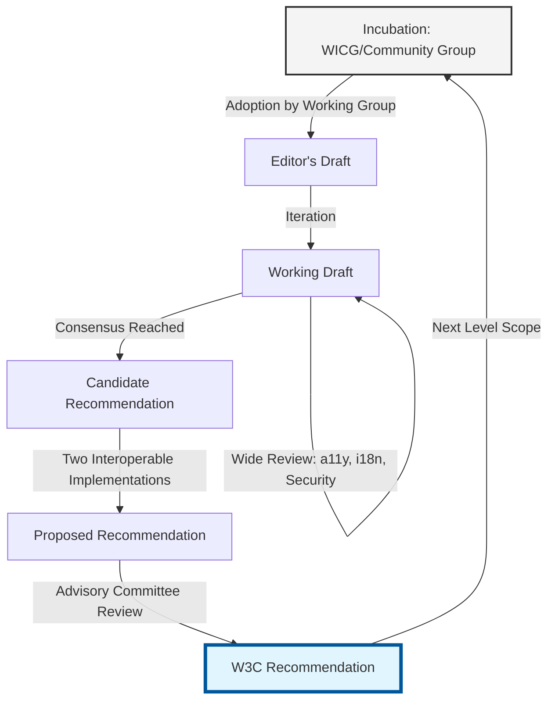

The W3C Recommendation process is the lifecycle of a web technology proposal. This process involves multiple stages of review, feedback, and implementation to ensure new features are robust, interoperable, and beneficial to the web ecosystem.

This post breaks down each stage of the process, explains the implications for developers, and provides guidance on navigating the evolving landscape of web standards.

## Why the Process Matters

Understanding this process helps you decide when to adopt new web technologies. Early adoption carries the risk of building on unstable APIs that might change or be abandoned. Conversely, waiting for final recommendations might result in missing powerful new capabilities.

For a specification to reach the Recommendation stage, it must have at least two independent, interoperable implementations. This requirement ensures the feature works consistently across different browsers and platforms.

The Specification Lifecycle

The following diagram illustrates the journey from an initial idea in incubation to a globally recognized web standard.



## Key Transition Points

* **Incubation to Editor's Draft**: This marks the shift from a community-led experiment to an official W3C Working Group project.
* **Working Draft to Candidate Recommendation**: This indicates "feature completeness." At this point, the API is stable enough for browser vendors to begin official implementations.
* **Candidate Recommendation to Recommendation**: The final hurdle is proving interoperability. The W3C requires evidence that the feature works identically in at least two different browser engines (e.g., Blink and WebKit).

## The Standard Stages

### 1. Incubation (Community Groups)

* **Status**: Experimental
* **Stability**: Very Low
* **Developer Action**: Share use cases; do not use in production.

Before entering the official standards track, ideas "incubate" in Community Groups, such as the Web Incubator Community Group (WICG). This phase allows browser engineers and developers to brainstorm without formal administrative overhead.

### 2. Editor’s Draft (ED)

* **Status**: Internal Sketchpad
* **Stability**: Volatile
* **Developer Action**: Use only for technical contribution or research.

Once a Working Group adopts an idea, editors create this version to track active discussions. It reflects the current thinking of the editors but does not represent a consensus of the wider group.

### 3. Working Draft (WD)

* **Status**: Public Review
* **Stability**: Low
* Developer Action: Experiment with caution; provide feedback on API ergonomics.

The W3C publishes this version to solicit review from the community. During this stage, the specification undergoes Horizontal Reviews for accessibility (a11y), internationalization (i18n), privacy, and security.

* **TAG Review**: The Technical Architecture Group (TAG) ensures the API remains consistent with broader web architecture.
* **First Public Working Draft (FPWD)**: This milestone triggers the W3C Patent Policy, where member companies disclose patents to ensure the standard remains royalty-free.

### 4. Candidate Recommendation (CR)

* **Status**: Call for Implementation
* **Stability**: Feature Complete
* **Developer Action**: Start testing, writing polyfills, and planning migrations.

The Working Group signals that the text is complete and invites browser vendors to implement it. To move forward, the W3C usually requires two independent implementations (e.g., Chromium and Gecko) to pass the Web Platform Tests (WPT).

### 5. Proposed Recommendation (PR)

* **Status**: Final Endorsement
* **Stability**: Stable
* **Developer Action**: Treat as a production-ready standard.

The specification moves to the W3C Advisory Committee for final ratification. This stage is a procedural formality to ensure all requirements are met.

### 6. W3C Recommendation (REC)

* **Status**: Official Web Standard
* **Stability**: Frozen
* **Developer Action**: Safe for production.

The W3C officially endorses the specification. If the community requires new features, a new "Level" begins (e.g., Flexbox Level 2), restarting the process.

Testing Experimental Features: Origin Trials

While a feature is in the Incubation or Working Draft stages, browsers—primarily Chromium—often offer Origin Trials. These allow you to test experimental APIs on live sites for a limited time using a cryptographic token.

Implementation Example

The following code demonstrates how to programmatically check for an experimental feature during an Origin Trial.

TypeScript

export enum FeatureStatus {
  Available = 'AVAILABLE',
  MissingToken = 'MISSING_TOKEN',
  IncompatibleBrowser = 'INCOMPATIBLE_BROWSER',
  ContextRestricted = 'CONTEXT_RESTRICTED'
}

export async function registerAndCheckFeature(
  token: string,
  apiPath: string
): Promise<FeatureStatus> {
  // 1. Inject the Origin Trial token
  const otMeta = document.createElement('meta');
  otMeta.httpEquiv = 'origin-trial';
  otMeta.content = token;
  document.head.append(otMeta);

  // 2. Allow the browser to process the meta tag
  await new Promise(resolve => setTimeout(resolve, 0));

  // 3. Verify Chromium environment
  const isChromium = !!(window as any).chrome;
  if (!isChromium) return FeatureStatus.IncompatibleBrowser;

  // 4. Verify Secure Context (HTTPS)
  if (!window.isSecureContext) return FeatureStatus.ContextRestricted;

## Post-Recommendation: Errata and Versions

A W3C Recommendation is considered a "frozen" document, but the web is a living environment. To maintain the accuracy of these standards, the W3C uses two primary mechanisms:

### Errata and Edited Recommendations

When the community discovers technical errors or ambiguities in a Recommendation, the Working Group tracks them in an Errata list.

* **Edited Recommendation**: If the errata significantly impact the readability or accuracy of the spec, the W3C may release an updated version (e.g., XML 1.0 Second Edition). These editions correct errors without adding new features.
* **Rescinded Recommendation**: In rare cases, if a standard is found to be fundamentally flawed or poses a security risk, the W3C may rescind its endorsement.

### Levels and Snapshots

For modern, rapidly evolving technologies (like CSS), the W3C uses a "Level" system. Instead of waiting years for a massive update, features are grouped into manageable Levels (Level 1, Level 2, etc.). This allows stable features to reach Recommendation status while new capabilities continue through the draft stages.

### W3C vs. WHATWG: Two Philosophies

Developers often notice that some standards (like HTML and DOM) seem to be maintained by both the W3C and the WHATWG (Web Hypertext Application Technology Working Group). While they collaborate closely, they follow different philosophies:

| Feature | W3C (World Wide Web Consortium) | WHATWG |
| --- | --- | --- |
| Philosophy | Snapshot-based: Favors discrete versions (e.g., HTML 4.01, HTML5) for legal and institutional stability. | Living Standard: Favors a single, continuously updated document that reflects current browser reality. |
| Governance | Formal Working Groups, consensus-building, and a clear patent policy. | Small group of "Steering Group" members, primarily browser vendors (Apple, Google, Mozilla, Microsoft). |
| Primary Goal | Formal standardization and interoperability for all stakeholders. | Rapid iteration to match implementation in browser engines. |

In 2019, the W3C and WHATWG signed a Memorandum of Understanding. Today, the WHATWG maintains the Living Standard for HTML and DOM, and the W3C publishes periodic "snapshots" of these standards for the formal Recommendation track.

## Testing Experimental Features: Origin Trials

While a feature is in the Incubation or Working Draft stages, browsers &mdash; primarily Chromium &mdash; often offer Origin Trials. These allow you to test experimental APIs on live sites for a limited time using a cryptographic token.

Implementation Example

The following code demonstrates how to programmatically check for an experimental feature during an Origin Trial.

```ts
export enum FeatureStatus {
  Available = 'AVAILABLE',
  MissingToken = 'MISSING_TOKEN',
  IncompatibleBrowser = 'INCOMPATIBLE_BROWSER',
  ContextRestricted = 'CONTEXT_RESTRICTED'
}

export async function registerAndCheckFeature(
  token: string,
  apiPath: string
): Promise<FeatureStatus> {
  // 1. Inject the Origin Trial token
  const otMeta = document.createElement('meta');
  otMeta.httpEquiv = 'origin-trial';
  otMeta.content = token;
  document.head.append(otMeta);

  // 2. Allow the browser to process the meta tag
  await new Promise(resolve => setTimeout(resolve, 0));

  // 3. Verify Chromium environment
  const isChromium = !!(window as any).chrome;
  if (!isChromium) return FeatureStatus.IncompatibleBrowser;

  // 4. Verify Secure Context (HTTPS)
  if (!window.isSecureContext) return FeatureStatus.ContextRestricted;

  // 5. Resolve the API path
  const parts = apiPath.split('.');
  let current: any = window;

  for (const part of parts) {
    if (!(part in current)) return FeatureStatus.MissingToken;
    current = current[part];
  }

  return FeatureStatus.Available;
}
```

## Sources

* [W3C Process Document](https://www.w3.org/policies/process/)
* [W3C Patent Policy](https://www.w3.org/policies/patent-policy/)
* [W3C Community Groups](https://www.w3.org/community/)
* [Web Incubator Community Group](https://wicg.io/)
* [W3C Technical Architecture Group](https://w3ctag.org/)
* [W3C Guide - Wide Review](https://www.w3.org/Guide/documentreview/)
* [Web Platform Tests](https://web-platform-tests.org/)
