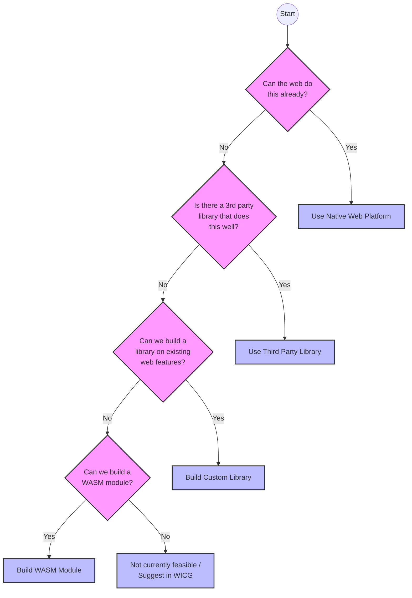

Designing APIs is difficult; designing good APIs is even harder. While web developers often focus on the implementation details of applications, the design of the APIs they create profoundly impacts usability, maintainability, and overall success.

Developers design APIs regardless of the application type. The principles of good API design apply whether building a RESTful API for a web service, a GraphQL API for a mobile app, a web component, or a simple function meant for broader codebase consumption.

This post explores principles of good API design and how to implement them in projects, drawing inspiration from Lea Verou's post [Bluesky Likes](https://lea.verou.me/blog/2025/bluesky-likes/), the W3C's [Web Platform Design Principles](https://www.w3.org/TR/design-principles/), the IETF's [RFC 8890](https://www.rfc-editor.org/rfc/rfc8890.html), Yehuda Katz's [Extend the Web Forward](https://yehudakatz.com/2025/06/01/extend-the-web-forward/) (which expands on the Extensible Web Manifesto), and Alex Russell's [Bedrock](https://infrequently.org/2012/04/bedrock/).

## The basic premise

> Simple things should be simple, complex things should be possible.
>
> — Alan Kay

In practice, this means:

* **For users**: Common actions (like sending an email or browsing) should be intuitive, while advanced features (like complex formulas or coding) remain accessible for those who need them.
* **For developers**: Tools should provide sensible defaults that make common tasks effortless, ensuring a low barrier to entry for the majority of use cases. Simultaneously, the architecture must expose deeper layers of control, allowing advanced users to customize behavior or optimize performance without hitting artificial barriers.

This concept aligns with the priority of constituencies, initially articulated in the [HTML Design Principles](https://www.w3.org/TR/html-design-principles/#priority-of-constituencies/):

> In case of conflict, consider users over authors over implementors over specifiers over theoretical purity. In other words costs or difficulties to the user should be given more weight than costs to authors; which in turn should be given more weight than costs to implementors; which should be given more weight than costs to authors of the spec itself, which should be given more weight than those proposing changes for theoretical reasons alone. Of course, it is preferred to make things better for multiple constituencies at once.

### Things that we take for granted

<lite-youtube videoId="g92XUzc1OHY"></lite-youtube>

In her dotJS 2024 talk, "API design is UI design," Lea Verou emphasizes that Developer Experience (DX) is fundamentally User Experience (UX) tailored for developers. She expands on Alan Kay's maxim, arguing that good APIs reveal complexity progressively to avoid "usability cliffs" where tasks suddenly become exponentially harder. Verou highlights that API creators should absorb internal implementation complexity to keep the external, developer-facing interface intuitive. Ultimately, she advocates for applying standard UX practices, such as user testing and empathy, directly to the API development process.

## Evaluating the need for a custom API

When designing an API, the first consideration should always be to ask if a new one is necessary at all. Frequently, the web platform or existing libraries already provide the required functionality.

* **Can the web do this already?** The native web platform frequently provides the required functionality natively, eliminating the need to wait for new platform features or build custom abstractions.
* **If not, is there a third-party library that does this well?** When facing a problem, check if the open-source community has already solved it. The web platform boasts a massive ecosystem of libraries available on registries like [npm](https://www.npmjs.com/), [GitHub](https://github.com/), or [cdnjs](https://cdnjs.com/).
* **If not, can we build this as a library on top of existing web platform primitives?** If no existing solution fits, engineering teams can build higher-level abstractions on top of standard web primitives to create the desired functionality.
* **If not, can we leverage other languages to build a WebAssembly (Wasm) module?** If the web platform lacks the necessary features, WebAssembly might allow developers to implement the functionality in a performant way using languages like Rust, C++, or Go.
* **If none of the above are feasible, should this be proposed to the WICG?** [The Web Incubator Community Group (WICG)](https://wicg.github.io/) is the starting point for new web platform features developed outside formal standards bodies. If a feature is not currently feasible, suggesting it to the WICG for future consideration is the correct path forward.

The following flowchart summarizes this decision-making process:



### Design principles to consider

* **Prefer simple solutions (the KISS principle):** Avoid unnecessary complexity. Whether adding a new feature or refactoring an existing one, consistently consider if a simpler approach achieves the same goal.
* **Optimize for the 80% case:** Apply the Pareto principle (the 80/20 rule). Focus on the most common use cases and ensure they are effortless to implement. Developers can build advanced features on top of a solid foundation that serves the majority of users well.
* **Layer complexity:** Provide a "high-level" API for beginners and a "low-level" API for power users. The low-level API exposes more control and flexibility at the cost of increased complexity for users who require it.
* **Consider tradeoffs between high-level and low-level APIs:** Carefully choose what to expose in the high-level API versus what remains in the low-level API. Omitting a critical feature from the high-level API forces users to drop down to the low-level API more often than necessary.
* **Do not hide the metal:** Do not actively prevent advanced users from accessing internal methods or properties. However, do not make it overly prominent either; the design should gently encourage users toward the high-level API by default.
* **Apply the single responsibility principle:** Each module, class, or function should have exactly one reason to change. It should do one thing and do it well.
* **Build complex types by composing simpler types:** Avoid creating monolithic types that attempt to handle everything. Instead, author focused, granular types that developers can combine to achieve complex behaviors.
* **Name things thoughtfully:** Use consistent naming conventions throughout the API to reduce cognitive load. Predictable naming significantly improves usability and helps users learn the interface quickly.

## Examples of API design

The following examples demonstrate both the design principles and the decision-making processes required to create effective APIs.

### React button component

This React button component provides a "high ceiling" by extending native button attributes, allowing advanced users to access all standard HTML button features without reimplementation. It simultaneously provides a "low floor" by offering sensible defaults for common use cases, making it approachable for beginners.

By capturing all other props in ...rest and passing them down to the underlying element, the API allows developers to leverage advanced features (like aria- attributes) natively.

**TypeScript (Button.tsx)**

```tsx
import React from 'react';

// Provides access to all native button attributes
interface ButtonProps extends React.ButtonHTMLAttributes<HTMLButtonElement> {
  // Add custom props here
  variant?: 'primary' | 'secondary' | 'danger';
  isLoading?: boolean;
}

export const Button = ({
  children,
  // If the user passes nothing, it behaves as a standard primary button.
  variant = 'primary',
  isLoading = false,
  className = '',
  type = 'button', // Defaulting to 'button' prevents accidental form submissions
  // Capture all other props in `...rest` and pass them down.
  ...rest
}: ButtonProps) => {

  // Logic to determine styles based on the simple 'variant' prop
  const baseStyles = "px-4 py-2 rounded font-medium transition-colors";
  const variants = {
    primary: "bg-blue-600 text-white hover:bg-blue-700",
    secondary: "bg-gray-200 text-gray-800 hover:bg-gray-300",
    danger: "bg-red-600 text-white hover:bg-red-700",
  };

  return (
    <button
      type={type}
      className={`${baseStyles} ${variants[variant]} ${className}`}
      disabled={isLoading || rest.disabled}
      // Spreading the rest of the props allows the developer
      // to use advanced features (like aria-attributes) natively.
      {...rest}
    >
      {isLoading ? 'Loading...' : children}
    </button>
  );
};
```

JavaScript (Button.jsx)

```jsx
import React from 'react';

export const Button = ({
  children,
  // If the user passes nothing, it behaves as a standard primary button.
  variant = 'primary',
  isLoading = false,
  className = '',
  type = 'button', // Defaulting to 'button' prevents accidental form submissions
  // Capture all other props in `...rest` and pass them down.
  ...rest
}) => {

  // Logic to determine styles based on the simple 'variant' prop
  const baseStyles = "px-4 py-2 rounded font-medium transition-colors";
  const variants = {
    primary: "bg-blue-600 text-white hover:bg-blue-700",
    secondary: "bg-gray-200 text-gray-800 hover:bg-gray-300",
    danger: "bg-red-600 text-white hover:bg-red-700",
  };

  return (
    <button
      type={type}
      className={`${baseStyles} ${variants[variant]} ${className}`}
      disabled={isLoading || rest.disabled}
      // Spreading the rest of the props allows the developer
      // to use advanced features (like aria-attributes) natively.
      {...rest}
    >
      {isLoading ? 'Loading...' : children}
    </button>
  );
};
```

This code makes simple things simple. For standard behavior, a developer can implement the button like this:

TypeScript / JavaScript

```tsx
<Button>Save</Button>
```

Complex things are also possible. If a developer needs additional features, they can pass advanced props like aria-label, data-* attributes, or custom event handlers directly through the component:

TypeScript / JavaScript

```tsx
<Button
  variant="danger"
  onClick={(e) => console.log(e)}
  aria-label="Delete Account"
  data-testid="delete-btn"
  onMouseEnter={() => prefetchData()}
>
  Delete
</Button>
```

Because the component accepts all native HTML attributes, adapting it for form submission requires minimal effort. By default, the component sets type="button" to prevent accidental form submissions. To enable submission behavior, developers simply override that default by passing type="submit".

#### TypeScript (UserForm.tsx)

```tsx
export default function UserForm() {
  const handleSubmit = (e: React.FormEvent<HTMLFormElement>) => {
    e.preventDefault();
    console.log("Form submitted!");
  };

  return (
    <form onSubmit={handleSubmit} className="flex flex-col gap-4">
      <input
        type="text"
        name="username"
        placeholder="Enter username"
        className="border p-2 rounded"
      />

      {/* Overriding the default type="button" */}
      <Button type="submit" variant="primary">
        Submit
      </Button>
    </form>
  );
}
```

**JavaScript (UserForm.jsx)**

```jsx
export default function UserForm() {
  const handleSubmit = (e) => {
    e.preventDefault();
    console.log("Form submitted!");
  };

  return (
    <form onSubmit={handleSubmit} className="flex flex-col gap-4">
      <input
        type="text"
        name="username"
        placeholder="Enter username"
        className="border p-2 rounded"
      />

      {/* Overriding the default type="button" */}
      <Button type="submit" variant="primary">
        Submit
      </Button>
    </form>
  );
}
```

### Fetch wrapper

Here is a simple fetch wrapper demonstrating the same layering principles.

Simple things remain simple: executing a basic GET request requires no extra configuration and returns the expected data promise.

**TypeScript / JavaScript**

```ts
const data = await http('/api/users');
```

The code provides sensible defaults for common use cases (like setting the Content-Type header to application/json), while allowing advanced users to override these defaults via the config object—an escape hatch for edge cases requiring low-level control.

**TypeScript**

```ts
const newUsers = await http<User[]>('/api/users', {
  method: 'POST',
  body: JSON.stringify({ name: 'Alice' }),
  headers: {
    'Authorization': 'Bearer token_123'
  }
});

// 1. The "High Ceiling"
export async function http<T = unknown>(
  url: string,
  config: RequestInit = {}
): Promise<T> {
  // 2. The "Low Floor" (Sensible Defaults)
  const headers = {
    'Content-Type': 'application/json',
    ...config.headers, // User can override or add headers
  };

  const response = await fetch(url, {
    // 3. The Escape Hatch: User options (like method: 'POST') override defaults
    ...config,
    headers,
  });

  if (!response.ok) {
    throw new Error(`HTTP Error: ${response.status}`);
  }

  // Assumes JSON response by default.
  // In a more complex version, response parsing could be configurable here.
  return response.json() as Promise<T>;
}
```

**JavaScript**

```js
const newUsers = await http('/api/users', {
  method: 'POST',
  body: JSON.stringify({ name: 'Alice' }),
  headers: {
    'Authorization': 'Bearer token_123'
  }
});

// 1. The "High Ceiling"
export async function http(url, config = {}) {
  // 2. The "Low Floor" (Sensible Defaults)
  const headers = {
    'Content-Type': 'application/json',
    ...config.headers, // User can override or add headers
  };

  const response = await fetch(url, {
    // 3. The Escape Hatch: User options (like method: 'POST') override defaults
    ...config,
    headers,
  });

  if (!response.ok) {
    throw new Error(`HTTP Error: ${response.status}`);
  }

  // Assumes JSON response by default.
  // In a more complex version, response parsing could be configurable here.
  return response.json();
}
```

## Conclusion

When building an API, it is tempting to solve only the immediate problem and nothing else. While this approach may not seem problematic initially, as requirements grow and other developers adopt the API, the lack of foundational design principles often leads to significant technical debt. Investing time in evaluating the API's floor and ceiling early on pays dividends in long-term maintainability.

## Reading List

* [Bluesky Likes](https://lea.verou.me/blog/2025/bluesky-likes/) &mdash; Lea Verou
* [Web Platform Design Principles](https://www.w3.org/TR/design-principles/) &mdash; W3C
* [RFC 8890](https://www.rfc-editor.org/rfc/rfc8890) &mdash; IETF
* [Alan Kay’s Approach to Accessible Complexity](https://medium.com/@mdelhaous/alan-kays-approach-to-accessible-complexity-4e3b6610cf60)
* [Extend the Web Forward](https://yehudakatz.com/2013/05/21/extend-the-web-forward/) &mdash; Yehuda Katz
* [Bedrock](https://infrequently.org/2012/04/bedrock/) &mdash; Alex Russell
