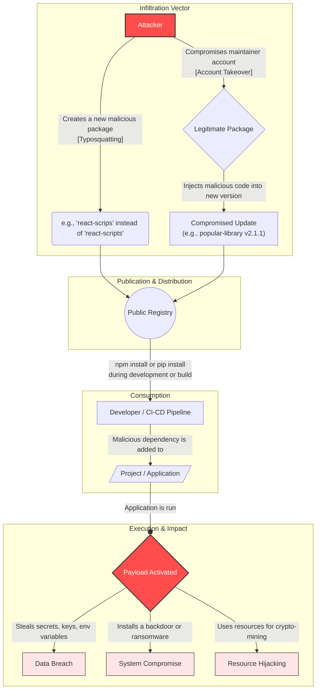

Supply chain attacks are a growing threat in the software development world, particularly with the rise of open-source package managers like NPM. These attacks exploit the trust developers place in third-party libraries and dependencies, leading to potentially devastating consequences.

This post will break down the lifecycle of a software supply chain attack, explain how it works, and provide strategies to mitigate the risks.

## What is a Supply Chain Attack?

A software supply chain attack occurs when a malicious actor infiltrates the software development process to inject malicious code into a legitimate application. With package managers like NPM, this often involves publishing a compromised package that developers then unknowingly install, triggering a chain reaction that can lead to severe security breaches.

Understanding the lifecycle of this attack is key to building an effective defense.

### The Attack Process

The following diagram illustrates the four common phases of a software supply chain attack, from the attacker's initial move to the final impact.

## Breakdown of the Phases & Mitigation Strategies

### Phase 1: Infiltration Vector

This is the entry point. Attackers use several techniques to get their malicious code into the ecosystem. Each vector requires a specific set of defenses.

* **Typosquatting**: The attacker publishes a package with a name that is a common misspelling of a popular one (e.g., expresss instead of express, or react-scrips vs. react-scripts). Developers can easily make a typo during npm install and inadvertently install the malicious version.
  * ➡️ **Mitigation**:
    * **Code & Peer Review**: Carefully check package names in `package.json` during code reviews.
    * **Use Scoped Packages**: When possible, use and create scoped packages (e.g., @babel/core). It is much harder to typosquat a package that includes an organization's name.
    * **Private Registry Allowlisting**: A private registry can be configured to only allow installation of explicitly approved packages, making it impossible to download a typosquatted package that isn't on the list.
* **Account Takeover**: An attacker gains access to a legitimate package maintainer's NPM or GitHub account, often through phishing, credential stuffing, or leaked credentials. They then have the authority to publish a new, malicious version of that trusted package, which can then be automatically pulled into thousands of projects.
  * ➡️ **Mitigation**:
    * **Enforce MFA**: This is the single most effective defense. All maintainers must enable multi-factor authentication (MFA) on their NPM and GitHub accounts.
    * **Use Granular Access Tokens**: CI/CD pipelines should use publish tokens with limited permissions and short expiration dates, reducing the window of opportunity if a token is compromised.
* **Dependency Confusion**: This attack targets organizations that use a mix of private and public packages. An attacker discovers the name of a private, internal package (e.g., internal-company-logger) and publishes a malicious package with the exact same name to the public NPM registry, often with a higher version number. When a developer runs npm install, their build tool may "confuse" the two and pull the higher-versioned public package instead of the intended private one.
  * ➡️ **Mitigation**:
    * **Use Scopes for Internal Packages**: The best defense is to use a private NPM scope for all internal packages (`@my-company/internal-logger`). The public NPM registry prevents others from publishing packages under your registered scope.
    * **Configure Registry Precedence**: Explicitly configure your package manager (.npmrc file) to always resolve your private scope from your private registry, leaving no ambiguity for the build tool.

### Phase 2: Publication & Distribution

The malicious package is uploaded to a public registry like NPM, where it sits, waiting to be downloaded. It looks like any other package, making it difficult to spot without careful inspection.

➡️ **Mitigation**: This is where a private registry (using tools like [Verdaccio](https://verdaccio.org/) or [JFrog Artifactory](https://jfrog.com/artifactory/)) is most effective. By creating a curated, allowlisted repository of approved packages, you create a "walled garden." Developers pull from your trusted registry, which prevents them from downloading unvetted packages directly from the public ecosystem.

### Phase 3: Consumption

A developer or a CI/CD pipeline runs npm install. If the project's package.json has a loose version range (`^1.2.3`), it might pull in a newly published malicious patch version. This is where the malicious code is downloaded and installed into the project's `node_modules` directory.

➡️ **Mitigation**:

* **Use and commit lockfiles**: Always commit your package-lock.json or yarn.lock file. This ensures that everyone on the team and in the build pipeline installs the exact same version of every dependency, preventing unexpected updates.
* **Vet new packages**: Before adding a dependency, check its download stats, GitHub activity, and author reputation.
* **Audit and Patch Dependencies**:
  * **Audit**: Regularly run npm audit or use tools like [Snyk](https://snyk.io/) or [Dependabot](https://github.com/dependabot) to scan for known vulnerabilities in your project.
  * **Use Overrides**: If an audit reveals a vulnerability in a transitive dependency (a dependency of your dependency), you can't fix it directly. Use the overrides feature in your package.json to force a specific, patched version of the nested dependency. This is a powerful tool to fix vulnerabilities without waiting for the direct maintainer to update their package.

### Phase 4: Execution & Impact

The attack is dormant until the application is executed. Once it runs, the malicious code (the payload) activates. The impact can range from:

* **Data Breach**: Stealing API keys, environment variables, or user data.
* **System Compromise**: Installing a backdoor for future access or deploying ransomware.
* **Resource Hijacking**: Using the server's CPU for cryptocurrency mining.

## Are Other Registries Susceptible?

Yes, absolutely. This is not an NPM-specific problem. Any open-source package management system is a target.

* **PyPI (Python)**: Has seen widespread typosquatting and dependency confusion attacks.
* **RubyGems (Ruby)**: Has dealt with hijacked gems and malicious code injections.
* **Docker Hub (Containers)**: Malicious container images containing malware are a known threat.

The fundamental challenge is the same across all ecosystems: modern software is built on a foundation of third-party code, and every dependency is a potential vector for an attack. A multi-layered defense is the only effective strategy.
