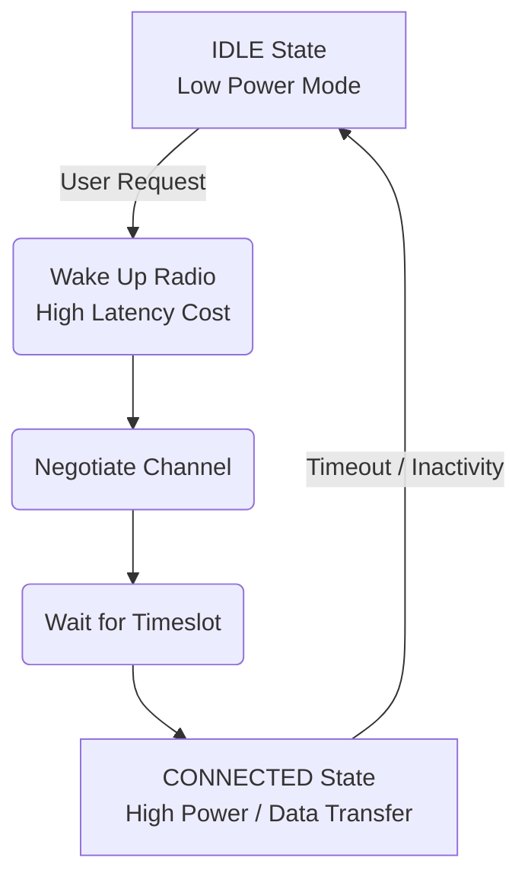
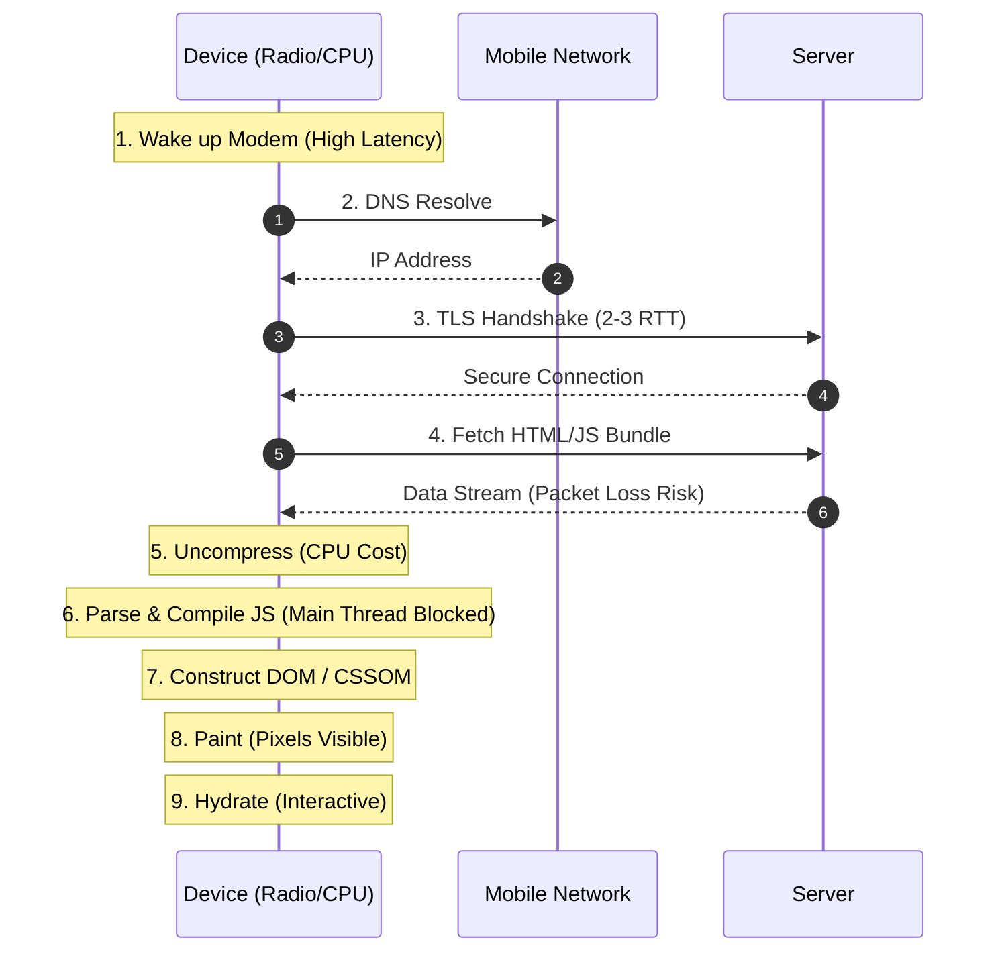

I answered this question in Quora: ***Why is my WordPress site fast on a desktop but slow on a mobile?*** but I thought it deserved a deeper dive here along with some updated references since this is not strictly a WordPress issue but more of a developer education issue.

**The answer**: Because desktop and mobile are completely different beasts.

It is a common, often maddening frustration for developers: you build a beautiful WordPress site, test it on your high-end MacBook Pro connected to a stable office fiber connection, and it flies. The animations are smooth, the pages load instantly, and the interactions feel snappy. Then, you hand it to a client or test it yourself on a mid-range Android phone over a 4G connection, and the experience falls apart. It crawls. It stutters. It feels broken.

Why the discrepancy? It isn't just about screen size or responsive CSS. It comes down to fundamental differences in architecture and physics. Desktop machines generally run on symmetric multi-processor architectures, enjoy consistent power sources (the wall), and rely on stable, high-speed wired or robust Wi-Fi internet connectivity.

Mobile devices operate in a hostile environment. They are governed by strict thermal limits, aggressive battery management, and volatile network conditions that fundamentally change how they process code. Here is why your mobile users experience a completely different web than you do, and why "working on my machine" is a dangerous metric.

These issues haven't changed. If anything, they have worsened as web pages have become heavier and more complex over the years.

First time I saw Alex Rusell explain these performance issues was in a talk at the Chrome Dev Summit 2016, Progressive Performance:

<lite-youtube videoid="4bZvq3nodf4"></lite-youtube>

in 2025's JSNation conference, Alex presents a more recent and evolved talk about performance: "Frontend’s Lost Decade and the Performance Inequality Gap":

<lite-youtube videoid="7ge8iwaNNAw"></lite-youtube>

## The Network Penalty

Mobile devices do not always rely on Wi-Fi. While users spend a lot of time in stable Wi-Fi environments (homes, coffee shops, offices), they also access sites via cellular networks while commuting, walking, or sitting in areas with poor or no Wi-Fi.

Cellular networks are slower and more volatile by nature, but the issue goes deeper than just bandwidth (Megabits per second). The real killer of mobile performance is latency and the mechanics of radio states.

## Latency vs. Bandwidth

On a fiber connection, the "Round Trip Time" (RTT)—the time it takes a request to travel to the server and back—is negligible, often under 10ms. On a mobile network, RTT can spike to hundreds of milliseconds. High bandwidth (4G/5G) doesn't solve high latency. Loading a web page involves dozens of small requests (HTML, CSS, JS, images). If every request creates a new connection with high latency, the delays stack up linearly, resulting in a blank white screen for seconds.

## The Radio State Machine

Before a mobile device even connects to your website, it performs a complex physical dance. To save battery, the cellular modem in a phone sits in a low-power "IDLE" state. When the user requests your URL:

1. The phone must wake up the cellular radio (transitioning from IDLE to CONNECTED).
2. It negotiates a channel with the cell tower.
3. It waits for a timeslot to transmit data.

This "radio wake-up" process costs significant battery and, crucially, adds a high-latency penalty (sometimes 1-2 seconds) before the first byte of data even begins to travel. This is a hardware-level tax that desktop computers simply do not pay.

## The Hardware Gap: The "Privilege Bubble"

Not all mobile devices are iPhones. In fact, if you develop on a high-end device (like an iPhone Pro or a Galaxy S series) and a large monitor, you are living in what Alex Russell calls a "Privilege Bubble."

In his report, [The Performance Inequality Gap, 2026](https://infrequently.org/2025/11/performance-inequality-gap-2026/), Russell highlights a stark reality: Most phones—and indeed, most computers—are 24+ month old Androids. If you spend the majority of your time looking at a screen larger than 10 inches, you are an outlier.

### Asymmetric Cores (Big.LITTLE)

Desktop CPUs are beasts designed for throughput. They usually have powerful, symmetric cores that run at high frequencies (3GHz+) constantly.

Mobile CPUs use asymmetric architectures (often called Big.LITTLE). They combine a few "performance" cores with several low-power "efficiency" cores.

**The Problem**: To save battery, mobile Operating Systems are aggressive about task scheduling. They prefer to offload your website's heavy Javascript execution to the slow, efficiency cores.

**The Stagnation**: While flagship phones get faster every year, the low-end has stagnated. Budget devices often rely on older manufacturing processes (22nm or 14nm) that haven't seen significant architectural improvements in years. "ARM chips are still real bad" at the low end.

**The Result**: A script that takes 100ms to parse on your desktop might take 800ms on a mobile phone's efficiency core. You cannot force the browser to use the fast cores; the OS decides based on battery life and thermal headroom.

### The Refresh Rate Illusion

A dangerous development in recent years is the widespread adoption of 90Hz and 120Hz screens on budget phones.

**The Mask**: Because scrolling and basic animations are handled by the GPU, the interface feels incredibly smooth to the user.

**The Trap**: The CPU handling your website's logic has not kept pace. This creates a jarring "Uncanny Valley" effect where a site scrolls beautifully (masking the hardware limitations), but buttons and interactive elements remain unresponsive for seconds because the main thread is blocked. The smoothness of the scroll hides the struggle of the processor.

### Thermal Throttling

Desktops have active cooling systems—fans and massive heat sinks—that allow them to dissipate 60+ watts of heat continuously. They can run at 100% capacity for hours without slowing down.

Phones are sealed glass and metal sandwiches with no airflow. They rely on passive radiation to cool down. Because power equals heat, phones cannot sustain peak performance for long.

**The Sprint vs. The Marathon**: A phone CPU can sprint (run fast) for a few seconds. But if your website requires a marathon of processing (heavy animation, long loading scripts), the CPU generates too much heat. The OS detects this and "throttles" the CPU—slashing the clock speed to cool it down. Suddenly, your animation frame rate drops from 60fps to 15fps.

### Storage Speed

Storage I/O is the hidden bottleneck. Desktop SSDs (NVMe) read data at incredible speeds (often 3GB/s+).

Mobile storage (especially eMMC on budget and entry-level devices) acts more like a spinning hard drive from 2008. While mid-range phones have largely graduated to faster UFS storage, millions of budget devices still rely on this older technology. Reading files from the disk &mdash; which the browser must do to read the cache or load resources &mdash; takes significantly longer. This makes disk-heavy operations, like reading from the browser cache, surprisingly slow on cheap phones.

## The Javascript Bottleneck (2026 Update)

Javascript remains the most expensive resource on the web, and the situation has deteriorated significantly over the last decade.

According to The Performance Inequality Gap, 2026, mobile Javascript payloads have doubled since 2015. The median mobile page is now larger than a copy of the original DOOM game (approx. 2.4MB), and the 75th percentile site is larger than two copies of DOOM.

**Compression Illusion**: When the browser downloads this, it must unzip it to process it. That "DOOM-sized" bundle often expands to 6 MB - 10 MB of actual textual code.

**The Triple Cost**: Javascript costs you three times:

1. **Network cost**: To download the bytes.
2. **Parse & Compile cost**: The CPU must read the text and turn it into machine code.
3. **Execution cost**: Running the code to modify the page.

On a desktop, a powerful CPU tears through this script easily. On a mobile device, this heavy lifting hits the CPU hard. If the task runs on an efficiency core, parsing, compiling, and executing that code takes significantly longer.

**The Main Thread Block**: Browsers are single-threaded. This means the same "thread" that handles your Javascript also handles user clicks and scrolling. If your site (WordPress or not) loads a massive bundle, the main thread is blocked for seconds while it crunches that data. During this time, if a user taps a "Menu" button, nothing happens. The phone isn't broken; the browser is just too busy thinking to notice the tap.

## The "Worst Case" Sequence

To visualize the delay, consider the granular sequence a mobile device must complete before the user sees content. Every step here costs more on mobile than on desktop:

1. Wake up the cellular modem: (High latency cost; transitioning radio states)
2. Resolve DNS: (Find the server's IP address; requires a network round trip)
3. Perform TLS Handshake: (Secure the connection; requires 2-3 round trips over a high-latency network)
4. Fetch the data: (Download HTML over the unstable network; subject to packet loss)
5. Uncompress the data: (CPU cost begins; unzipping GZIP/Brotli content)
6. Parse & Compile Javascript: (The biggest bottleneck: turning text into instructions. This pauses rendering.)
7. Construct DOM & CSSOM: (Building the internal tree structure of the page)
8. Paint the Page: (Pixels finally appear on the screen)
9. Hydrate / Execute Handlers: (The page becomes interactive. Until this step finishes, the page might look ready, but buttons won't work.)

## WordPress Specifics

WordPress powers the web, but its ecosystem often exacerbates these mobile constraints through "death by a thousand cuts."

**Theme & Plugins (The "Enqueue" Problem)**: Many themes are "desktop-first," loading huge CSS files and high-resolution images by default. Worse is the plugin ecosystem.

A typical WordPress site might have 20 plugins. If poorly coded, every single plugin injects its own CSS and Javascript file on every page load, regardless of whether the plugin is used on that specific page.

Example: A "Contact Form" plugin might load its validation scripts on the Homepage, where there is no form. A "Slider" plugin might load heavy animation libraries on a static blog post.

This leads to "Plugin Soup," bloating the bundle size discussed and clogging the mobile network pipe.

**Third-Party Scripts**: WordPress sites are often heavy with third-party integrations: Google Analytics, Facebook Pixels, Chat Widgets, and Ad networks. These are external resources that force the phone to open new connections (DNS/TLS) to new servers, compounding the latency issues mentioned in Section 1.

**The "React" Factor**: The WordPress backend (Gutenberg) is built on React, but standard themes usually serve static HTML (Server-Side Rendering), which is excellent for performance because the server does the work, not the phone.

However, the trend toward "Headless WordPress" or complex interactive blocks is changing this. If you ship a heavy React/Vue/Angular application to the frontend, you shift the workload from the server to the client. You are essentially forcing a low-power, $200 Android phone to build your webpage from scratch using Javascript, rather than simply displaying the HTML the server already built.

## The Trap of Synthetic Testing vs. Reality

Developers often rely on tools like Google Lighthouse (running inside Chrome DevTools) or PageSpeed Insights to grade their performance. While valuable, these tools can create a false sense of security.

### The "Slow Ferrari" Problem

When you simulate a mobile device in Chrome DevTools on a powerful desktop, you are typically using "CPU Throttling" (e.g., 4x or 6x slowdown).

**The Flaw**: Slowing down a high-end Intel or Apple M-series chip by 6x does not turn it into a low-end ARM chip. It turns it into a slow high-end chip.

**Architecture Matters**: Desktops have massive L2/L3 caches and advanced branch prediction that budget mobile chips lack. Even when throttled, your desktop CPU processes code more efficiently than a Cortex-A53 core found in budget phones. You are simulating a Ferrari driving in first gear, not a Honda Civic struggling up a hill.

### The "Perfect" Network

Synthetic network throttling mimics low bandwidth and high latency, but it does so cleanly.

**The Reality**: Real mobile networks have packet loss and jitter. If you lose a packet during the SSL handshake on a real 4G connection, the connection hangs until the packet is re-transmitted. Synthetic tests rarely simulate this chaotic variance or the "Radio State" wake-up costs mentioned earlier.

### The Missing Variables

Synthetic tests occur in a vacuum. They do not account for:

* Thermal throttling: Your simulation doesn't get slower as the test runs longer.
* Background processes: Real phones have Facebook, WhatsApp, and Email services constantly pinging the network and waking up the CPU in the background.
* Battery Saver Modes: Real users often have "Low Power Mode" enabled, which aggressively restricts the resources your browser can use.

**The Fix**: Use synthetic tools for spotting trends, but never trust them as absolute truth. The only way to truly understand your site's performance is to buy a $200 Android device and test on it physically.

## Conclusion

The gap between a developer's desktop and a user's mobile device is not just about screen size; it is about computing power, thermal limits, storage speed, and network physics. The web is increasingly exclusionary because we are building for devices that our users simply do not own.

To fix this, developers must actively defend the main thread, reduce payload sizes, and respect the constraints of the hardware. The most effective way to understand this is to stop testing on your laptop and start testing on a real, low-end device—the device your users actually use.
